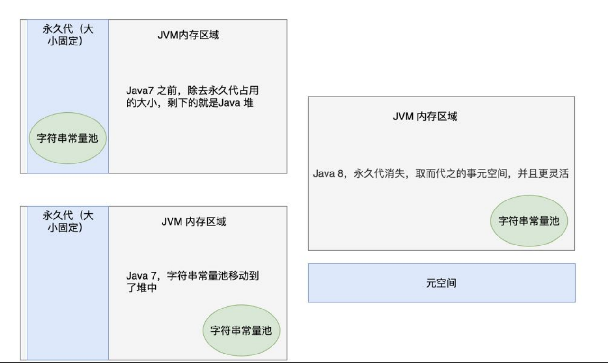

# Java基础

## 前置知识

### Java程序运行过程

源代码文件：Main.java

编译器将**源代码文件编译为字节码文件**：Main.class，然后使用命令：`java Main`（文件：Main.class）运行程序，虚拟机启动将字节码文件转换成平台能理解的形式运行：运行 `main` 方法。

`java ClassName`：从指定类中的 `main` 方法开始执行。

Java程序由**一组**类组成，其中有**一个**类有 `main` 方法（用于启动）。

### 注释

**单行**： //

**多行**：/* */

**多行文档**：/**   */

### 命名规范

名称必须以**字母、下划线、`$`** 符号开头。


## 数据类型

**8种基本类型**（primitive）：4种整型、2种浮点型、1种字符类型 `char `和 1种表示真值的 `boolean`。分别是：boolean、char、byte、short、int、long、float 和 double。

**引用数据类型**：除了基本数据类型以外的类型，都是所谓的引用类型。常见的有数组、class，以及接口。

**对象引用**：即引用到对象的变量（类似于指针），保存的是**存取对象的方法**。（对象只存在堆上，通过引用来进行操作，变量存的不是对象，是引用！！！）对于同一个Java虚拟机，所有的对象引用大小都一样。

### 整型


16进制：加前缀 `0x`，如 `0xABCD`。

8进制：加前缀 `0`，如 `010`，表示 `8`。

2进制：加前缀 `0b`，如 `0b1001`，表示

**四种整型**：

- byte

    一个字节可以表示 2^8 = 256 个不同的值。由于 byte 是有符号的，它的值可以是负数或正数，其取值范围 是 -128 到 127（包括 -128 和 127）。 在网络传输、大文件读写时，为了节省空间，常用字节来作为数据的传输方式。代码示例：

    ```java
    byte a;
    a = 100;
    byte b = -100;
    ```

- short

    `short` 的范围：-32768~32767.

- int

    -2,147,483,648 ~ 2,147,483,647（-2^31 ~ 2^31 -1）

- long

    -9,223,372,036,854,775,808 ~ 9,223,372,036,854,775,807( -2^63 ~ 2^63 - 1 )

    声明时在数字后面加上“L”：`long num = 1000L;`。

### 浮点类型


`float`是单精度浮点型（32位），`double`是双精度浮点型（64位）。

`float`：3.14F、2.14f，无 `F` 或者 有 `D` 则为 `double` 型。

在进行金融计算或需要精确小数计算的场景中，可以使用 `BigDecimal` 类来避免浮点数舍入误差。

### 字符类型char

表示单个字符。**占 2 个字节**。

```java
char c = 'c';
```

**英文字符和数字**占**一个**字节。

### boolean类型

只有两个值：`false`，`true`，用来判断，**不能与整型值进行转换**。


### 枚举类型

```java
enum Name {apple, orange, banana};
Name name = Name.apple;
```


### 常量`final`

**常量只能赋值一次，且不能再改变**（名字一般用全部大写字母）。可以用来修饰实例变量、局部变量、方法参数。`final`修饰的变量代表不能改变它的值；`final`修饰的方法代表不能被覆盖；`final`修饰的类代表不能继承。

**类常量**

一个常量在一个类中的多个方法使用：

```java
static final int NAME = 1;
```

一般定义在 `main` 方法外部。

### 字符串类型`String`

**注意**：字符串**不是基本类型**，是Java库中**预定于的一个类**。`final`修饰（不可改变，不可继承）。

```java
// 源码
implements java.io.Serializable, Comparable<String>, CharSequence {
    /** The value is used for character storage. */
//    private final char value[];
    private final byte[] value;

    
// 创建对象
String str = "";
```

Java 9 以前，String 是用 `char` 型数组实现的，之后改成了 `byte` 型数组实现，并增加了 `coder` 来表示编码方式。

String支持两个编码： Latin-1和UTF-16，如果字符串只包含英文字符数字等，则使用 Latin-1 编码方案，如果字符串中有汉字等超出Latin-1表示范围的字符，这个时候会使用UTF-16编码。不同的编码方式用 `coder` 表示。

**Latin-1** 编码一个字符占一个字节（即此时的`byte`占一个字节）；**UTF-16** 编码一个字符占两个字节（即此时的`byte`占两个字节）。

#### hashCode

字符串的哈希值。

```java
 public int hashCode() {
        int h = hash;
        if (h == 0 && !hashIsZero) {
            h = isLatin1() ? StringLatin1.hashCode(value)
                           : StringUTF16.hashCode(value);
            if (h == 0) {
                hashIsZero = true;
            } else {
                hash = h;
            }
        }
        return h;
    }
```

先检查是否已有哈希值，有则直接返回；根据字符串的编码格式选择对应的哈希值计算方法进行计算，然后保存哈希值并返回。

#### **常用函数**

```java
String str.substring(left, right); // 区间左闭右开
String str.substring(left); // 从left开始到结尾，实际执行 str.substring(left, length())
boolean str.equals(s); // 判断字符串相等
	"name".equals("sdasd");
boolean str.equalsIgnoreCase(""); // 忽略大小写
int str.length() //长度
char charAt(int index); // 给定位置得代码单元（字符）
String toLowerCase();  // 大写转小写
String toUpperCase();  // 小写转大写
String trim();  // 去除头尾的空格
int codePointAt(int index); //给定位置的开始或者结束的代码点
int offsetByCodePoints(int index, int codePointOffset)  // 从index开始，位移codePointOffset后的代码点索引法首
int compareTo(String str)  //比较方法，在str之前返回负数，之后返回正数，相等返回 0
boolean	endsWith(String suffix)  // 以suffix结尾返回true
boolean	startsWith(String suffix)  //以suffix开头返回true
int indexOf(int ch)  
int indexOf(int ch, int fromIndex)  
int indexOf(String str) 
int indexOf(String str, int fromIndex)  
// 返回与字符串str或代码点cp匹配的第一个子串的开始位置。这个位置从索引0或fromlIndex开始计算。如果在原始串中不存在 str，返回 -1。
String[] split() //  根据指定的字符参数（分隔符）来将字符串超分成多个部分
getBytes(StandardCharsets.UTF_8) // 根据指定编码方式返回字符串的字节数组
```

String类定义的是一个字符串对象，**值是不可变的**，常用的 `+` 加操作实际上新建一个字符串然后重新赋值。

#### **空串和`null`**

空串是 `""`，长度为 `0`；比较方式：str.equals("") 或者 str.length() == 0

**`null`**：判断变量是否为空，常在调用变量前使用，因为 `null` 无法调用方法，用其检查后调用变量可以不出错。

#### **代码点和代码单元**

[Unicode](http://t.csdnimg.cn/u5QnE) 一种字符串编码方式，将不同语言里的每个字符都用一个数字映射，这个数字就是**代码点**；**代码单元**是指一个已编码的文本中具有**最短的比特组合的单元**（字符串的最小单位：一个字符）。对于UTF-8来说，代码单元是8比特长；对于UTF-16来说，代码单元是16比特长。换一种说法就是UTF-8的是以一个字节为最小单位的，UTF-16是以两个字节为最小单位的。

#### 字符串构造

**常规**

1. String str = "hello"
只会开辟一块堆内存空间，保存在字符串常量池中，然后str共享常量池中的String对象
2. String str = new String("hello")
会开辟两块堆内存空间，字符串"hello"保存在字符串常量池中，然后用常量池中的String对象给新开辟的String对象赋值。
3. String str = new String(new char[]{'1', '2'})

  ```java
  String s = new String(new char[] {'1', '2'});
  s.intern();
  String str = "12";
  // 此时 s == str
  // 如果不添加intern，则不相等
  因为s指向的是堆 然后intern在常量池中也会保存该字符串在堆中的引用，所以 str指向常量池等价于指向堆，二者相等
  String s1 = new String("xxxx");
  String s2 = s1.intern();
  // s1 != s2
  
  因为s1在常量池、堆上创建并引用指向堆，intern判断常量池中是否有，没有则创建，s2指向常量池，二者不等
      
  String s = new String("111");  // 在堆中、常量池中创建，返回堆引用
  s.intern(); // 已经在常量池中创建，这句要不要都行
  String s2 = "111";  // 返回常量池引用
  System.out.println(s == s2);    // 一个堆引用、一个常量池  所以不等
  ```

  `new char[]{'1', '2'}` 先构造一个字符数组，然后作为参数传递给构造函数，此时JVM**通过构造函数在堆上创建对象**，但是不会保存在常量池中，如果需要保存，则需要手动调用`intern()`方法。

  **intern()**

  **JDK 6 版本**中执行intern()方法时，首先会判断字符串常量池中是否存在该字符串字面量，如果不存在则**拷贝一份字符串字面量存放到常量池中**，最后返回该字符串字面量的唯一引用。如果发现字符串常量池中已经存在，则直接返回该字符串字面量的唯一引用。**JDK 7 以后**执行intern()方法时，如果发现字符串常量池中不存在该字符串字面量，则**不会再拷贝一份字面量**，而是**拷贝**字面量对应堆中的**一个地址引用**，然后返回这个引用。

**StringBuilder** 

无线程安全。

核心就是 **append**，不管是创建还是字符串相加，都是往当前字符串后面**追加**。

```java
StringBuilder builder = new StringBuilder(); // 空的字符串构造器 可以不断添加字符或者字符串
bulider.append(c);
bulider.append(str);

// 转换为字符串
String s = builder.toString();

//api
int length(); // 返回构建器或缓冲器中的代码单元数量(长度)
void setCharAt(int i ,char c)  // 将第 i 个代码单元设置为 C 。
StringBuilder insert(int offset, String str) // 在offset位置插入一个字符串并返回this。
StringBuilder insert(int offset,Char c)  //在offset位置插入一个代码单元并返回 this。
StringBuilder delete(int startIndex, int endIndex) // 删除偏移量从startIndex到一endIndex-1的代码单元并返回 左开右闭
String toString() // 返回对应的字符串 {
    return new String(value, 0, count);
}
```

初始创建时根据传递的参数往字符串后进行追加（`append`），无参数时默认长度16，每次以原始长度2倍+2进行扩充。默认最大长度：`int MAX_ARRAY_SIZE = Integer.MAX_VALUE - 8`;

```java
public AbstractStringBuilder append(String str) {
    if (str == null)
        return appendNull();  
    int len = str.length();
    ensureCapacityInternal(count + len);
    str.getChars(0, len, value, count);
    count += len;
    return this;
}
// 扩容
private int newCapacity(int minCapacity) {
    // overflow-conscious code
    int newCapacity = (value.length << 1) + 2;
    if (newCapacity - minCapacity < 0) {
        newCapacity = minCapacity;
    }
    return (newCapacity <= 0 || MAX_ARRAY_SIZE - newCapacity < 0)
        ? hugeCapacity(minCapacity)
        : newCapacity;
}
private int hugeCapacity(int minCapacity) {
    if (Integer.MAX_VALUE - minCapacity < 0) { // overflow
        throw new OutOfMemoryError();
    }
    return (minCapacity > MAX_ARRAY_SIZE)
        ? minCapacity : MAX_ARRAY_SIZE;
}
```

**StringBuffer**

加了 `synchronized`，线程安全。其他与StringBuilder 类似。

```

```

#### 字符串常量池

`String s = new String("xxxxx");`

使用 `new` 关键字创建一个字符串对象时，JVM会**先在字符串常量池中查找**有没有该字符串对象，如果**有**，就**不**会在字符串常量池中重新创建对象，直接在堆中创建一个字符串对象，然后**将堆中创建的对象地址返回赋值给变量**；如果常量池中没有，则**先在常量池中创建**一个对象，然后**再在堆中创建**，**将堆中创建的对象的地址返回**。

**原因**

提升性能，减少内存消耗。

`String s = "str";`

创建对象时如果采用这种方式，JVM会从常量池里寻找匹配的字符串，如果有，则直接返回地址，没有则在**常量池中创建对应对象并返回**，这样就可以重复利用常量池中的字符串，不需要 `new` 对象，减少开销。

**存储位置**

**JDK1.7之前**运行时常量池包含字符串常量池存放在方法区（永久代，Permanent Generation，PG）, 此时hotspot虚拟机对方法区的实现为永久代，是**堆的一部分**，用于存储类信息、方法信息、常量池信息等静态数据。

永久代和堆的大小相互影响，二者都使用了 JVM 堆内存，因此它们的大小都受到 JVM 堆大小的限制。可能会因为程序大量使用导致空间不足。

**JDK1.7** 时字符串常量池被从方法区（永久代）拿到了堆中, 注意这里是字符串常量池被**单独拿到堆**,**运行时常量池剩下的东西**还在方法区, 也就是hotspot中的永久代。

**JDK1.8** **移除了永久代用元空间(Metaspace)取而代之**, 这时候字符串常量池还在堆, 运行时常量池还在方法区, 只不过方法区的实现从永久代变成了元空间(Metaspace)。

元空间是一块**本机内存**区域，和 JVM 内存区域分开。作用依然和之前的永久代一样，用于存储类信息、方法信息、常量池信息等静态数据。大小可以动态调整。



#### 字符串比较

`a != null && a.equals(b);` 使用前需先判断是否是空指针。

```java
// JAVA 21
public boolean contentEquals(CharSequence cs) {
    // Argument is a StringBuffer, StringBuilder
    if (cs instanceof AbstractStringBuilder) {
        if (cs instanceof StringBuffer) {
            synchronized(cs) {
               return nonSyncContentEquals((AbstractStringBuilder)cs);
            }
        } else {
            return nonSyncContentEquals((AbstractStringBuilder)cs);
        }
    }
    // Argument is a String
    if (cs instanceof String) {
        return equals(cs);
    }
    // Argument is a generic CharSequence
    int n = cs.length();
    if (n != length()) {
        return false;
    }
    byte[] val = this.value;
    if (isLatin1()) {
        for (int i = 0; i < n; i++) {
            if ((val[i] & 0xff) != cs.charAt(i)) {
                return false;
            }
        }
    } else {
        if (!StringUTF16.contentEquals(val, cs, n)) {
            return false;
        }
    }
    return true;
}

```

**1.8版本**先判断字符串对象是否相同，相同说明肯定是同一字符串，直接返回。接着判断是否是`String`对象，然后判断长度是否相等，最后比较每个字符。

**之后的**版本:判断对象，判断是否是`String`类，判断编码格式是否相同，再判断长度，最后逐个字符判断。


`Objects.equals(a, b)` 判断

```java
public static boolean equals(Object a, Object b) {
    return (a == b) || (a != null && a.equals(b));
}   
```


`s.contentEquals(builder)`判断

将字符串与其他类型比较（字符串String、StringBuffer、StringBuilder、Char Sequence）

```java
// java 21

```

#### 字符串拼接

##### **运算符 “+”**

```java
String str1 = "Hello";
String str2 = "World!";
String result = str1 + " " + str2;
System.out.println(result); 
```

**java1.8**

反编译字节码得到如下编译过程：

“+” 运算符执行的过程中，`Code` 处的 `6` 行通过 `new` 创建`StringBuilder`对象，然后执行`append`方法将第一个字符串加到后面，接着继续执行`append`将第二个字符串加到后面，最后通过`toString`输出字符串。

显然，使用“+”操作会产生大量`StringBuilder`对象，造成浪费。

```java
Compiled from "StringResearch.java"
public class StringResearch {
  public StringResearch();
    Code:
       0: aload_0
       1: invokespecial #1                  // Method java/lang/Object."<init>":()V
       4: return

  public static void main(java.lang.String[]);
    Code:
       0: ldc           #7                  // String 1111
       2: astore_1
       3: ldc           #7                  // String 1111
       5: astore_2
       6: new           #9                  // class java/lang/StringBuilder
       9: dup
      10: invokespecial #11                 // Method java/lang/StringBuilder."<init>":()V
      13: aload_1
      14: invokevirtual #12                 // Method java/lang/StringBuilder.append:(Ljava/lang/String;)Ljava/lang/StringBuilder;
      17: aload_2
      18: invokevirtual #12                 // Method java/lang/StringBuilder.append:(Ljava/lang/String;)Ljava/lang/StringBuilder;
      21: invokevirtual #16                 // Method java/lang/StringBuilder.toString:()Ljava/lang/String;
      24: astore_3
      25: getstatic     #20                 // Field java/lang/System.out:Ljava/io/PrintStream;
      28: aload_3
      29: invokevirtual #26                 // Method java/io/PrintStream.println:(Ljava/lang/String;)V
      32: return
}
```

**Java1.8之后**

通过动态调用：`InvokeDynamic #0:makeConcatWithConstants;` 来进行字符串拼接，采用的拼接方式未知。

```java
PS F:\java\base\out\production\base> javap -c StringResearch.class
Compiled from "StringResearch.java"
public class StringResearch {
  public StringResearch();
    Code:
       0: aload_0
       1: invokespecial #1                  // Method java/lang/Object."<init>":()V
       4: return

  public static void main(java.lang.String[]);
    Code:
       0: ldc           #7                  // String 1111
       2: astore_1
       3: ldc           #7                  // String 1111
       5: astore_2
       6: aload_1
       7: aload_2
       8: invokedynamic #9,  0              // InvokeDynamic #0:makeConcatWithConstants:(Ljava/lang/String;Ljava/lang/String;)Ljava/lang/String;
      13: astore_3
      14: getstatic     #13                 // Field java/lang/System.out:Ljava/io/PrintStream;
      17: aload_3
      18: invokevirtual #19                 // Method java/io/PrintStream.println:(Ljava/lang/String;)V
      21: return
}
```

##### StringBuilder、StringBuffer 

`append()`方法用于拼接字符串。

```java
StringBuilder sb = new StringBuilder();
sb.append("Hello");
sb.append("Daniel!");
String result = sb.toString();
System.out.println(result);
// 要不要toString 都可以 只不过toString是重新重建对象返回
public String toString() {
    // Create a copy, don't share the array
    return new String(this);
}
//StringBuffer 操作相同
```

##### StringJoiner

**特点**：将多个字符串拼接成一个**以某个特定字符分隔**，**可指定前后缀的字符串**。

**构造方法**：`StringJoiner(CharSequence delimiter)`：指定分隔符；`StringJoiner(CharSequence delimiter, CharSequence prefix, CharSequence suffix)`：指定分隔符和前后缀。

```java
StringJoiner stringJoiner = new StringJoiner(", ");
//        StringJoiner stringJoiner = new StringJoiner(", ", "[", "]");
stringJoiner.add("apple");
stringJoiner.add("banana");
stringJoiner.add("orange");
System.out.println(stringJoiner.toString());

// apple, banana, orange
// [apple, banana, orange]
```

##### String类join、contact方法

`join`指定分隔符将字符串数组拼接。

```java
String[] str = new String[]{"apple", "banana"};
System.out.println(String.join(", ", str));
```

`contact`拼接形成新字符串

**java1.8**

```java
public String concat(String str) {
    int otherLen = str.length();
    if (otherLen == 0) {
        return this;
    }
    int len = value.length;
    char buf[] = Arrays.copyOf(value, len + otherLen);
    str.getChars(buf, len);
    return new String(buf, true);
}

public static char[] copyOf(char[] original, int newLength) {
    char[] copy = new char[newLength];
    System.arraycopy(original, 0, copy, 0,
                     Math.min(original.length, newLength));
    return copy;
}
```

先进行非空判断，然后重新创建**新长度**的`char`数组，用Arrays.copyOf将原本字符串拷贝过来，再通过`getChars`方法将拼接字符串拼接到源字符串中，最后返回新串。

##### format

```java
String str = String.format("Hello %s", "World");
```

##### 字符串分割

`split(String regex)`：方法的**参数是正则表达式**。

`split(String regex, int limit)`：**参数1是正则表达式**，**参数2是要分割成几个字符串**。

执行`split(String regex)`实际执行的是`split(regex, 0)`；

```java
String s = "aaaaa\\bbbbb\\ccccc"; // \\ 表示 \
String[] str = s.split("\\\\"); //分割的时候传\\\\
String[] str = s.split("\\\\", 2); 
```


### 大数值

分为**大整数**和**大浮点数**。`import java.math.BigDecimal\BigInteger;`

**转换方式**

* `BigDecimal bigDecimal = BigDecimal.valueOf(11);`
* `BigInteger bigInteger = BigInteger.valueOf(12);`
* `public static BigDecimal\ BigInteger valueOf(x);` 静态方法

**计算**

大整数、大浮点数不能再用+、-、*、÷这些直接进行运算，需要使用对应的方法。

```java
// BigInteger
BigInteger add(BigInteger other);  // 加
BigInteger subtract(BigInteger other);  // 减
BigInteger multiply(BigInteger other);  // 乘 
BigInteger divide(BigInteger other);  // 除
BigInteger mod(BigInteger other);  // 取模
int compareTo(BigInteger other); // 相等放回 0，大于 other 返回整数，否则返回负数

// BigDecimal
BigDecimal add(BigDecimal other);  // 加
BigDecimal subtract(BigDecimal other);  // 减
BigDecimal multiply(BigDecimal other);  // 乘 
BigDecimal divide(BigDecimal other);  // 除 采取四舍五入
int compareTo(BigDecimal other); // 相等放回 0，大于 other 返回整数，否则返回负数
```


### 类型转换


**实箭头**：无精度损失；**虚线箭头**：有精度损失；

**强制转换**

```java
double x = 0.1;
int a = (int)x;
```

**四舍五入 `round`**

```java
double x = 0.9;
double x = 0.4;
int a = (int)round(x);
// 转换结果分别为 1 和 0

源码
    public static long round(double a) {
        long longBits = Double.doubleToRawLongBits(a);
        long biasedExp = (longBits & DoubleConsts.EXP_BIT_MASK)
                >> (DoubleConsts.SIGNIFICAND_WIDTH - 1);
        long shift = (DoubleConsts.SIGNIFICAND_WIDTH - 2
                + DoubleConsts.EXP_BIAS) - biasedExp;
        if ((shift & -64) == 0) { // shift >= 0 && shift < 64
            // a is a finite number such that pow(2,-64) <= ulp(a) < 1
            long r = ((longBits & DoubleConsts.SIGNIF_BIT_MASK)
                    | (DoubleConsts.SIGNIF_BIT_MASK + 1));
            if (longBits < 0) {
                r = -r;
            }
            // the corresponding mathematical expression:
            // (r) evaluates to a / ulp(a)
            // (r >> shift) evaluates to floor(a * 2)
            // ((r >> shift) + 1) evaluates to floor((a + 1/2) * 2)
            // (((r >> shift) + 1) >> 1) evaluates to floor(a + 1/2)
            return ((r >> shift) + 1) >> 1;
        } else {
            // a is either
            // - a finite number with abs(a) < exp(2,DoubleConsts.SIGNIFICAND_WIDTH-64) < 1/2
            // - a finite number with ulp(a) >= 1 and hence a is a mathematical integer
            // - an infinity or NaN
            return (long) a;
        }
    }
```

返回 `long` 型，一个最接近参数的正数。


## 包装类

### 基本定义

**包装类**就是**基本数据类型对应的引用类型**。

| 基本数据类型 | 包装类        |
| ------------ | ------------- |
| int          | **Integer**   |
| byte         | Byte          |
| long         | Long          |
| short        | Short         |
| float        | Float         |
| double       | Double        |
| boolean      | Boolean       |
| char         | **Character** |

### 装箱和拆箱

**装箱**：把基本数据类型转换成应用类型（包装类）

```java
int i;
Integer integer = new Integer(i);
```

**拆箱**：将应用数据类型转换成基本数据类型

```java
int k = integer.intValue();
```

**自动装拆箱 **(首选)

```java
Integer m = 10;//自动装箱 int--->Integer
int n = m;//自动拆箱 Integer--->int
```


在传参数、函数返回值、boolean表达式、数值运算（加减乘除）、赋值等各种场景都可以传入基本数据类型或者包装类，Java虚拟机会自动装拆箱。

### 字符串数值转换

**数值转字符串**

可以将基本数据类型的变量转换成字符串String。

```java
double a = 12.2;
String str = a + ""; // + 是Java中唯一被重载的运算符
String str = Double.toString(a);
```

**字符串转数字**

调用包状态对应的静态方法，将字符串转换成对应数字。

```java
String str = "12123";
int x = Integet.parseInt(str);
double d = Double.parseDouble("3123.2");

// Boolean 没有对应的转换方法 Boolean 可以在构造的时候传入字符串
boolean b = new Boolean("false").booleanValue();
```

**检查字符是否是数字**

```java
char c = '1';
if (Character.isDigit(c))
    //
```

### 基本数据类型缓存池

Java基本数据类型缓存池是一种**用于存储基本数据类型数据的缓存池**。Java为了提高性能、减少内存消耗而引入的一种优化手段。

它主要针对基本数据类型的包装类，其中最常用的是Integer类。在缓存池中，会**预先创建**并缓存一定范围的实例，这样在**调用包装类的valueOf()**方法时，如果该值在缓存范围内，**将直接返回缓存的实例，而不是新建一个新对象**。（以便在后续查询中快速获取，避免了重复计算和创建对象的开销。）

**示例**：

```java
Integer a = Integer.valueOf(100);
Integer b = Integer.valueOf(100);
```

创建的对象a、b是相等的，因为JVM会使用缓存池中的对象，多次调用只会取同一个对象的引用。

**数据范围**

- Byte：-128 ~ 127；
- Short、Long、Integer：-128 ~ 127；
- Character：\u0000 - \u007F；
- Boolean：true 和 false；


## 运算

### 位运算

&、|、^、~

&、| 运算符在计算两个操作数的时候，一定会计算两个操作数的值，而不会因为某个值是真或假而直接返回结果。

`>>>` 运算符用 `0` 填充高位；`>>` 用符号位填充高位。


### Math类

### 常用函数

```java
import static java.lang.Math.*;
sqrt(x);
pow(x, a);
exp();  // 指数函数
log();  // 自然对数 e为底
log10();  // 以 10 为底
PI;  // 圆周率
E;  // e
round() // 四舍五入;
abs(a); // 参数类型 int long float double
max(a, b); // 参数类型 int long float double 返回类型与传入类型相同
min(a, b); // 参数类型 int long float double 返回类型与传入类型相同
random(); // 返回0.0~1.0之间的双精度浮点数
    
    
```

## 输入输出

### 普通字符

#### 输入

```java
import java.util.Scanner;

Scanner scanner = new Scanner(System.in);
String input = scanner.nextLine(); // 读取一整行（可含空格）
String name = scanner.next(); // 读取字符串  不能包含空格
int num = scanner.nextInt(); // 读取整数
double d = scanner.nextDouble(); // 读取浮点数
boolean hasNext(); // 检测输入中是否还有单词
boolean hasNextInt();  // 检测输入中是否还有下一个整数
boolean hasNextDouble(); // 检测输入中是否还有下一个浮点数
```

**从给定字符串读**

```java
Scanner scanner = new Scanner("12 1212 1212 1212");
与控制台类似，将控制台输入变成了预定义的字符串
```


#### 格式化输出

```java
// 直接输出
System.out.print(12);
System.out.println(12);
// 格式化输出 与C++类似
System.out.printf("%d", num);
System.out.printf("%8.2f", a);
System.out.printf("%d, %s, %c");
System.out.printf("%,.3f", a); // 12,120.222
```

**构建输出字符串**

```java
public static String format(String format, Object... args) 
String output = String.format("%s is %d years old", "daniel", 12);
```

### 文件输入输出

把数据读取、写入文件。

**文件路径采用双反斜杠**。

#### 文件路径

**根目录**：”.” 代表项目所在的根目录，比如项目名`Demo`，则"." 代表"Demo/"。

**分隔符**：”/“ 或者 ”\\\\“。即斜杠或者双反斜杠。

#### `FILE`

`File`这个类**代表磁盘上的文件路径**（不包含文件内容）。

`File`提供一种比使用字符串文件名来表示文件更安全的方式。在构造函数中**使用的字符串文件名的类**也可以**用File对象来代替该参数**，以便检查路径是否合法等，然后再把对象传给`FileWriter`或`FilelnputStream`。

```java
// 指定路径
File file = new File("./file/text.txt");
FileWriter  fileWriter = new FileWriter(file);

//创建指定路径的文件夹
File file = new File("./fle");
file.mkdir();

file.isFile(); // 判断指定路径是否是文件
file.isDirectory(); // 判断指定路径是否是文件夹
String[] d = file.list(); // 获取指定路径下的所有文件名，返回字符串数组
file.getAbsoluteFile(); // 获取文件或目录的绝对路径
file.delete() //删除指定文件或目录

```


#### 读取和输出

先用 `File` 对象构建一个Scanner 对象，然后文件读取和控制台读取类似。

```java
// 读取
Scanner in = new Scanner(Paths.get(".\\file\\information.txt"));
/**
* static Path get(String) 根据路径构造Path
*/
while (in.hasNext()) {
    int a = in.nextInt();
    System.out.println(a);
}

// 输出到文件
PrintWriter out = new PrintWriter(".\\file\\infotion.txt"); // 打开文件 没有则创建
out.print(12);
out.close(); // 必须关闭才会最终执行输出到文件 
```

**抛出异常**

包含文件输入输出的函数必须**处理异常**：

```java
public static void main(String[] args) throws IOException {
}
```

#### 读取文本

从文本文件读取字符串。

```java
try {
    File file = new File("./file/text.txt");
    FileReader fileReader = new FileReader(file); // file 是字符的连接到文件的串流
    BufferedReader reader = new BufferedReader(fileReader);  //将filereader链接到BufferedReader以提升效率（因为它只会在缓冲区读空的时候才回去磁盘读取）
    String line = null;
    while ( (line = reader.readLine()) != null) {
        System.out.println(line);
    }
    reader.close();
}catch (Exception e) {
    e.printStackTrace();
}
```

#### 输出文本

将字符串、字符输出到文本文件。

```java
public class StringToFile {
    public static void main(String[] args) {
        try {
            FileWriter  fileWriter = new FileWriter("./file/text.txt");
            fileWriter.write("zzzz"); // 输出对应字符串
            fileWriter.write(68);  // 将整型值转换为对应的ascll码
            fileWriter.close();
        }catch (Exception e) {
            e.printStackTrace();
        }
    }
}
```

**文本文件的输入输出搭配`BufferedReader`、`BufferedWriter`（链接到`FileReader`和`FileWriter`）**。

## 作用域

以 **块 **为基础，用 `{}` 表示范围。与C++区别：**嵌套的块内不能定义同名变量**。不嵌套的块可以，比如不同的循环里定义相同变量。

### switch分支

switch 的参数类型：**char, byte, short, int** 以及对应的包装类型：Character, Byte, Short, Integer 和 String、enum。**没有boolean**。

