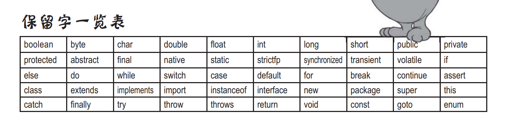
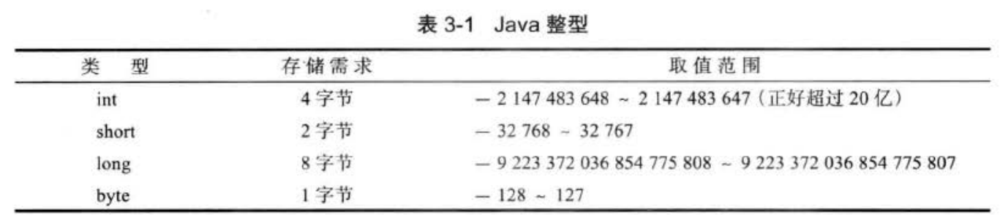
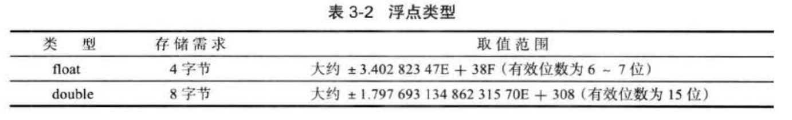
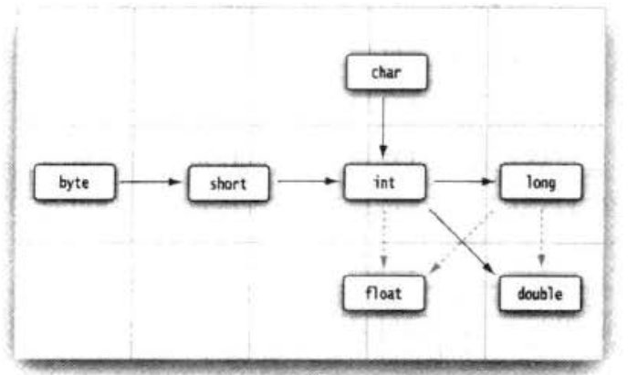
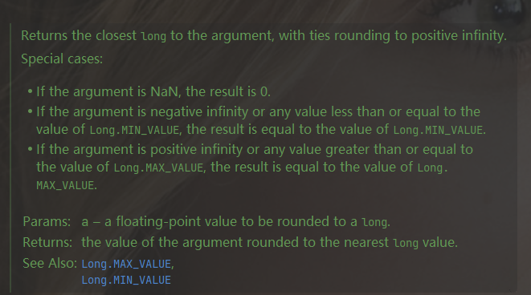

# Java基础

## 前置知识

### Java程序运行过程

源代码文件：Main.java

编译器将**源代码文件编译为字节码文件**：Main.class，然后使用命令：`java Main`（文件：Main.class）运行程序，虚拟机启动将字节码文件转换成平台能理解的形式运行：运行 `main` 方法。

`java ClassName`：从指定类中的 `main` 方法开始执行。

Java程序由**一组**类组成，其中有**一个**类有 `main` 方法（用于启动）。

### 注释

**单行**： //

**多行**：/* */

**多行文档**：/**   */

### 命名规范

名称必须以**字母、下划线、`$`** 符号开头。



## 数据类型

8种基本类型（primitive）：4种整型、2种浮点型、1种字符类型 `char `和 1种表示真值的 `boolean`

+

**对象引用**：即引用到对象的变量（类似于指针），保存的是**存取对象的方法**。（对象只存在堆上，通过引用来进行操作，变量存的不是对象，是引用！！！）对于同一个Java虚拟机，所有的对象引用大小都一样。

### 整型



16进制：加前缀 `0x`，如 `0xABCD`。

8进制：加前缀 `0`，如 `010`，表示 `8`。

2进制：加前缀 `0b`，如 `0b1001`，表示


### 浮点类型



`float`：3.14F，无 `F` 或者 有 `D` 则为 `double` 型。


### 字符类型char

表示单个字符。占 **2** 个字节。

**英文字符和数字**占**一个**字节。

### boolean类型

只有两个值：`false`，`true`，用来判断，**不能与整型值进行转换**。


### 枚举类型

```java
enum Name {apple, orange, banana};
Name name = Name.apple;
```


### 常量`final`

**常量只能赋值一次，且不能再改变**（名字一般用全部大写字母）。可以用来修饰实例变量、局部变量、方法参数。`final`修饰的变量代表不能改变它的值；`final`修饰的方法代表不能被覆盖；`final`修饰的类代表不能继承。

**类常量**

一个常量在一个类中的多个方法使用：

```java
static final int NAME = 1;
```

一般定义在 `main` 方法外部。

### 字符串类型`String`

**注意**：字符串**不是基本类型**，是Java库中**预定于的一个类**。

String str = "";

#### **常用函数**

```java
String str.substring(left, right); // 区间左闭右开
String str.substring(left); // 从left开始到结尾，实际执行 str.substring(left, length())
boolean str.equals(s); // 判断字符串相等
	"name".equals("sdasd");
boolean str.equalsIgnoreCase(""); // 忽略大小写
int str.length() //长度
char charAt(int index); // 给定位置得代码单元（字符）
String toLowerCase();  // 大写转小写
String toUpperCase();  // 小写转大写
String trim();  // 去除头尾的空格
int codePointAt(int index); //给定位置的开始或者结束的代码点
int offsetByCodePoints(int index, int codePointOffset)  // 从index开始，位移codePointOffset后的代码点索引
int compareTo(String str)  //比较方法，在str之前返回负数，之后返回正数，相等返回 0
boolean	endsWith(String suffix)  // 以suffix结尾返回true
boolean	startsWith(String suffix)  //以suffix开头返回true
int indexOf(int ch)  
int indexOf(int ch, int fromIndex)  
int indexOf(String str) 
int indexOf(String str, int fromIndex)  
// 返回与字符串str或代码点cp匹配的第一个子串的开始位置。这个位置从索引0或fromlIndex开始计算。如果在原始串中不存在 str，返回 -1。
String[] split() //  根据指定的字符参数（分隔符）来将字符串超分成多个部分
```

String类定义的是一个字符串对象，**值是不可变的**，常用的 `+` 加操作实际上新建一个字符串然后重新赋值。

#### **空串和`null`**

空串是 `""`，长度为 `0`；比较方式：str.equals("") 或者 str.length() == 0

**`null`**：判断变量是否为空，常在调用变量前使用，因为 `null` 无法调用方法，用其检查后调用变量可以不出错。

#### **代码点和代码单元**

[Unicode](http://t.csdnimg.cn/u5QnE) 一种字符串编码方式，将不同语言里的每个字符都用一个数字映射，这个数字就是**代码点**；**代码单元**是指一个已编码的文本中具有**最短的比特组合的单元**（字符串的最小单位：一个字符）。对于UTF-8来说，代码单元是8比特长；对于UTF-16来说，代码单元是16比特长。换一种说法就是UTF-8的是以一个字节为最小单位的，UTF-16是以两个字节为最小单位的。

#### 字符串构造

**StringBuilder** 

```java
StringBuilder builder = new StringBuilder(); // 空的字符串构造器 可以不断添加字符或者字符串
bulider.append(c);
bulider.append(str);

// 转换为字符串
String s = builder.toString();

//api
int length(); // 返回构建器或缓冲器中的代码单元数量(长度)
void setCharAt(int i ,char c)  // 将第 i 个代码单元设置为 C 。
StringBuilder insert(int offset, String str) // 在offset位置插入一个字符串并返回this。
StringBuilder insert(int offset,Char c)  //在offset位置插入一个代码单元并返回 this。
StringBuilder delete(int startIndex, int endIndex) // 删除偏移量从startIndex到一endIndex-1的代码单元并返回 左开右闭
String toString(); // 返回对应的字符串
```

**StringBuffer**

```

```


### 大数值

分为**大整数**和**大浮点数**。`import java.math.BigDecimal\BigInteger;`

**转换方式**

* `BigDecimal bigDecimal = BigDecimal.valueOf(11);`
* `BigInteger bigInteger = BigInteger.valueOf(12);`
* `public static BigDecimal\ BigInteger valueOf(x);` 静态方法

**计算**

大整数、大浮点数不能再用+、-、*、÷这些直接进行运算，需要使用对应的方法。

```java
// BigInteger
BigInteger add(BigInteger other);  // 加
BigInteger subtract(BigInteger other);  // 减
BigInteger multiply(BigInteger other);  // 乘 
BigInteger divide(BigInteger other);  // 除
BigInteger mod(BigInteger other);  // 取模
int compareTo(BigInteger other); // 相等放回 0，大于 other 返回整数，否则返回负数

// BigDecimal
BigDecimal add(BigDecimal other);  // 加
BigDecimal subtract(BigDecimal other);  // 减
BigDecimal multiply(BigDecimal other);  // 乘 
BigDecimal divide(BigDecimal other);  // 除 采取四舍五入
int compareTo(BigDecimal other); // 相等放回 0，大于 other 返回整数，否则返回负数
```


### 类型转换



**实箭头**：无精度损失；**虚线箭头**：有精度损失；

**强制转换**

```java
double x = 0.1;
int a = (int)x;
```

**四舍五入 `round`**

```java
double x = 0.9;
double x = 0.4;
int a = (int)round(x);
// 转换结果分别为 1 和 0

源码
    public static long round(double a) {
        long longBits = Double.doubleToRawLongBits(a);
        long biasedExp = (longBits & DoubleConsts.EXP_BIT_MASK)
                >> (DoubleConsts.SIGNIFICAND_WIDTH - 1);
        long shift = (DoubleConsts.SIGNIFICAND_WIDTH - 2
                + DoubleConsts.EXP_BIAS) - biasedExp;
        if ((shift & -64) == 0) { // shift >= 0 && shift < 64
            // a is a finite number such that pow(2,-64) <= ulp(a) < 1
            long r = ((longBits & DoubleConsts.SIGNIF_BIT_MASK)
                    | (DoubleConsts.SIGNIF_BIT_MASK + 1));
            if (longBits < 0) {
                r = -r;
            }
            // the corresponding mathematical expression:
            // (r) evaluates to a / ulp(a)
            // (r >> shift) evaluates to floor(a * 2)
            // ((r >> shift) + 1) evaluates to floor((a + 1/2) * 2)
            // (((r >> shift) + 1) >> 1) evaluates to floor(a + 1/2)
            return ((r >> shift) + 1) >> 1;
        } else {
            // a is either
            // - a finite number with abs(a) < exp(2,DoubleConsts.SIGNIFICAND_WIDTH-64) < 1/2
            // - a finite number with ulp(a) >= 1 and hence a is a mathematical integer
            // - an infinity or NaN
            return (long) a;
        }
    }
```

返回 `long` 型，一个最接近参数的正数。



## 包装类

### 基本定义

**包装类**就是**基本数据类型对应的引用类型**。

| 基本数据类型 | 包装类        |
| ------------ | ------------- |
| int          | **Integer**   |
| byte         | Byte          |
| long         | Long          |
| short        | Short         |
| float        | Float         |
| double       | Double        |
| boolean      | Boolean       |
| char         | **Character** |

### 装箱和拆箱

**装箱**：把基本数据类型转换成应用类型（包装类）

```java
int i;
Integer integer = new Integer(i);
```

**拆箱**：将应用数据类型转换成基本数据类型

```java
int k = integer.intValue();
```

**自动装拆箱 **(首选)

```java
Integer m = 10;//自动装箱 int--->Integer
int n = m;//自动拆箱 Integer--->int
```


在传参数、函数返回值、boolean表达式、数值运算（加减乘除）、赋值等各种场景都可以传入基本数据类型或者包装类，Java虚拟机会自动装拆箱。

### 字符串数值转换

**数值转字符串**

可以将基本数据类型的变量转换成字符串String。

```java
double a = 12.2;
String str = a + ""; // + 是Java中唯一被重载的运算符
String str = Double.toString(a);
```

**字符串转数字**

调用包状态对应的静态方法，将字符串转换成对应数字。

```java
String str = "12123";
int x = Integet.parseInt(str);
double d = Double.parseDouble("3123.2");

// Boolean 没有对应的转换方法 Boolean 可以在构造的时候传入字符串
boolean b = new Boolean("false").booleanValue();
```


## 运算

### 位运算

&、|、^、~

&、| 运算符在计算两个操作数的时候，一定会计算两个操作数的值，而不会因为某个值是真或假而直接返回结果。

`>>>` 运算符用 `0` 填充高位；`>>` 用符号位填充高位。


### Math类

### 常用函数

```java
import static java.lang.Math.*;
sqrt(x);
pow(x, a);
exp();  // 指数函数
log();  // 自然对数 e为底
log10();  // 以 10 为底
PI;  // 圆周率
E;  // e
round() // 四舍五入;
abs(a); // 参数类型 int long float double
max(a, b); // 参数类型 int long float double 返回类型与传入类型相同
min(a, b); // 参数类型 int long float double 返回类型与传入类型相同
random(); // 返回0.0~1.0之间的双精度浮点数
    
    
```

## 输入输出

### 普通字符

#### 输入

```java
import java.util.Scanner;

Scanner scanner = new Scanner(System.in);
String input = scanner.nextLine(); // 读取一整行（可含空格）
String name = scanner.next(); // 读取字符串  不能包含空格
int num = scanner.nextInt(); // 读取整数
double d = scanner.nextDouble(); // 读取浮点数
boolean hasNext(); // 检测输入中是否还有单词
boolean hasNextInt();  // 检测输入中是否还有下一个整数
boolean hasNextDouble(); // 检测输入中是否还有下一个浮点数
```

**从给定字符串读**

```java
Scanner scanner = new Scanner("12 1212 1212 1212");
与控制台类似，将控制台输入变成了预定义的字符串
```


#### 格式化输出

```java
// 直接输出
System.out.print(12);
System.out.println(12);
// 格式化输出 与C++类似
System.out.printf("%d", num);
System.out.printf("%8.2f", a);
System.out.printf("%d, %s, %c");
System.out.printf("%,.3f", a); // 12,120.222
```

**构建输出字符串**

```java
public static String format(String format, Object... args) 
String output = String.format("%s is %d years old", "daniel", 12);
```

### 文件输入输出

把数据读取、写入文件。

**文件路径采用双反斜杠**。

#### 文件路径

**根目录**：”.” 代表项目所在的根目录，比如项目名`Demo`，则"." 代表"Demo/"。

**分隔符**：”/“ 或者 ”\\\\“。即斜杠或者双反斜杠。

#### `FILE`

`File`这个类**代表磁盘上的文件路径**（不包含文件内容）。

`File`提供一种比使用字符串文件名来表示文件更安全的方式。在构造函数中**使用的字符串文件名的类**也可以**用File对象来代替该参数**，以便检查路径是否合法等，然后再把对象传给`FileWriter`或`FilelnputStream`。

```java
// 指定路径
File file = new File("./file/text.txt");
FileWriter  fileWriter = new FileWriter(file);

//创建指定路径的文件夹
File file = new File("./fle");
file.mkdir();

file.isFile(); // 判断指定路径是否是文件
file.isDirectory(); // 判断指定路径是否是文件夹
String[] d = file.list(); // 获取指定路径下的所有文件名，返回字符串数组
file.getAbsoluteFile(); // 获取文件或目录的绝对路径
file.delete() //删除指定文件或目录

```


#### 读取和输出

先用 `File` 对象构建一个Scanner 对象，然后文件读取和控制台读取类似。

```java
// 读取
Scanner in = new Scanner(Paths.get(".\\file\\information.txt"));
/**
* static Path get(String) 根据路径构造Path
*/
while (in.hasNext()) {
    int a = in.nextInt();
    System.out.println(a);
}

// 输出到文件
PrintWriter out = new PrintWriter(".\\file\\infotion.txt"); // 打开文件 没有则创建
out.print(12);
out.close(); // 必须关闭才会最终执行输出到文件 
```

**抛出异常**

包含文件输入输出的函数必须**处理异常**：

```java
public static void main(String[] args) throws IOException {
}
```

#### 读取文本

从文本文件读取字符串。

```java
try {
    File file = new File("./file/text.txt");
    FileReader fileReader = new FileReader(file); // file 是字符的连接到文件的串流
    BufferedReader reader = new BufferedReader(fileReader);  //将filereader链接到BufferedReader以提升效率（因为它只会在缓冲区读空的时候才回去磁盘读取）
    String line = null;
    while ( (line = reader.readLine()) != null) {
        System.out.println(line);
    }
    reader.close();
}catch (Exception e) {
    e.printStackTrace();
}
```

#### 输出文本

将字符串、字符输出到文本文件。

```java
public class StringToFile {
    public static void main(String[] args) {
        try {
            FileWriter  fileWriter = new FileWriter("./file/text.txt");
            fileWriter.write("zzzz"); // 输出对应字符串
            fileWriter.write(68);  // 将整型值转换为对应的ascll码
            fileWriter.close();
        }catch (Exception e) {
            e.printStackTrace();
        }
    }
}
```

**文本文件的输入输出搭配`BufferedReader`、`BufferedWriter`（链接到`FileReader`和`FileWriter`）**。

## 作用域

以 **块 **为基础，用 `{}` 表示范围。与C++区别：**嵌套的块内不能定义同名变量**。不嵌套的块可以，比如不同的循环里定义相同变量。

### switch分支

switch 的参数类型：char, byte, short, int, Character, Byte, Short, Integer, String, or an enum。**没有boolean**。

