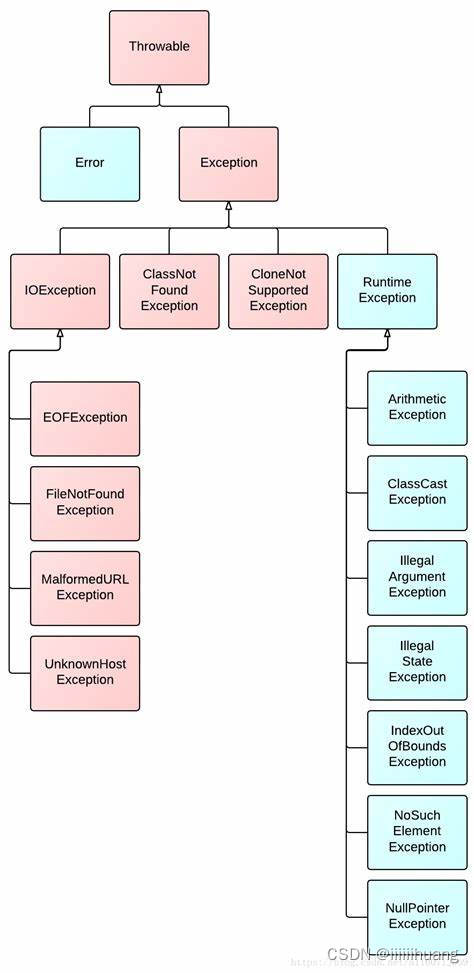
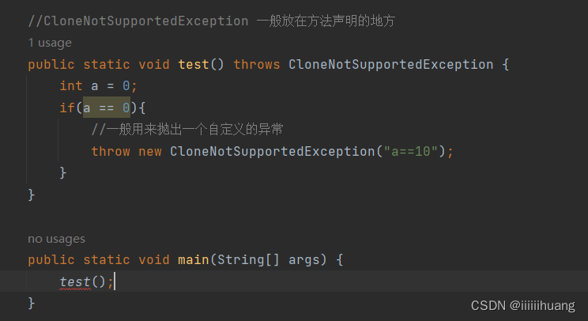

# 异常

程序运行时可能会出现错误，需要进行处理。

**Java内部的异常体系结构**：



所有异常都是派生于 `Throwable` 类的一个实例。可以分成两类：`Error` 和 `Exception`。

**异常分类**

- **未检查异常（运行时异常、unchecked Exception）**：`RuntimeException`以及其子类对应的异常，都称为运行时异常，比如**数组越界，空指针，算数异常等等**。基于 `Error` 类或者 `RuntimeException` 类的所有异常为**未检查异常**（unchecked）；其他异常为 **已检查** 异常（checked）。**蓝色部分**。

- **已检查异常（编译时异常、checked Exception）**：编译时会提示的异常，只要不处理就报错。**粉色部分**。

**异常处理的思想**：

`LBYL: Look Before You Leap`. 在操作之前就做充分的检查。 即：**事前防御型**。

`EAFP: It's Easier to Ask Forgiveness than Permission`，事后获取原谅比事前获取许可更容易". 也就是先操作, 遇到问题再处理. 即：**事后认错型**。(**处理异常的核心思想**)

**处理方式**：

程序中如果有**运行时异常，可以不管。**如果是**编译时异常**，必须进行处理，处理方式：

- 用 `try catch` 处理，即**将异常交给方法本身处理**（内部处理）；
- 抛出异常，**将异常交给方法的调用者处理**：
    - **主动抛出**，用 `throw` 主动抛出一个异常对象：`throw new 异常类`；
    - **自动抛出**，当程序遇到异常时，会自动抛出异常，这时就要在方法参数后用 `throws` **声明的**方式声明可能抛出的异常类型；

## `Error` 类

**`Error`**：指的是**Java虚拟机无法解决的严重问题**，比如：**JVM的内部错误、资源耗尽**等，典型代表：`StackOverflowError（栈溢出）和OutOfMemoryError（堆溢出）`。这种错误无法抛出（因为程序没法继续运行了），只能告知用户，使程序安全终止。

## `Exception` 类

**`Exception`**：**异常产生后程序员可以通过代码进行处理，使程序继续执行**。我们平时所说的异常就是Exception。

`Exception` 异常可以分成两类：**`IOException`** 和 **`RuntimeException`**。

### `RuntimeException`异常

未检查异常、运行时异常。由**程序错误**导致的异常属于`RuntimeException`，主要包含以下情况：

- 错误的类型转换；
- 数组访问越界；
- 访问空指针；

### **`IOException` 异常**

已检查异常、编译时异常。主要是 I/O 错误问题导致的异常，包括：

- 试图在文件尾部后面读取数据；
- 试图打开一个不存在的文件；
- 试图根据给定的字符串查找 `Class` 对象，而这个字符串表示的类并不存在；

## 异常处理

**编译时异常**用户必须处理，**要么是**在**方法体内部**通过 `try-catch` 捕捉异常并进行处理，**要么**将异常**抛出**。

### 抛出

！！！抛出不是解决异常的方法，只是将锅甩给上层的调用者，直到虚拟机终止程序或者有方法处理异常。

#### 主动抛出

在Java中，可以**借助 `throw` 关键字**，**主动抛出**一个指定的异常对象，将**错误信息**告知**调用者**。具体语法如下：

```java
throw new XXXException("异常产生的原因");
```

**注意**：对于使用 `throw` 抛出异常的方法，还需要**在方法的声明处声明抛出的异常的类型**！！！！

一般用来抛出一个自定义的异常：

- `throw` 必须**写在方法体内部**；

- 抛出的对象必须是 `Exception` 或者 `Exception` 的子类对象；
- 如果抛出的是 `RuntimeException` 或者 `RuntimeException` 的子类，则可以不用处理，     直接交给JVM来处理；
- 如果抛出的是**编译时异常，用户必须处理，否则无法通过编译**；
- 异常一旦抛出，**其后的代码**就不会执行；

**异常屏蔽**：程序只能抛出一个异常，当执行多次抛出异常的时候，只会抛出最后一个，前面的异常会被屏蔽掉，即”**被屏蔽的异常**“。

在`try`或`catch`或`finally`中抛出异常：当 `try` 块中遇到异常时，我们抛出异常然后被 `catch` 捕捉到，然后又在 `catch` 中遇到异常然后排除，这时 `try` 块中的异常会被屏蔽，然后抛出 `catch` 中的异常，同理，如果我们在 `finally` 中也遇到了异常并且抛出，这时 `catch` 中异常也会被屏蔽，只会抛出 `finally` 中的异常。

**示例**：



`test()` 方法里只是**抛出**了异常，而没有处理这个异常，而 `main` 方法是 `test()` 方法的**调用者**，他**要处理** `test()` 方法抛出的这个异常，没处理就报错，如果**在 `main()` 方法后再加一个 `throws`，**不报错了，但是 `main()` 方法依旧没处理，只是把这个异常**又抛了出去**，那交给谁处理了呢？JVM，因为JVM调用 `main()` 方法。

#### 自动抛出

对于方法中不想处理的异常，除了可以利用 `throw` 关键字进行抛出之外，还可以在该方法的头部，利用`throws`关键字来**声明这个不想处理的异常，把异常传递给方法的调用者进行处理**。

##### 声明

异常的声明关键字 `throws` **放在方法参数列表之后**，当方法中抛出**编译时异常**，用户**不想处理**该异常，此时就可以借助 `throws` 将异常**抛给方法的调用者来处理**。即**当前方法不处理异常，提醒方法的调用者处理异常。**

抛出多个异常时，异常类之间用逗号隔开：

```java
public Image loadImage(String s) throws FileNotFoundException, EOFException { }
```

**不需要声明的情况**（不需要抛出）：

从 `Error` 继承的错误和从 `RuntimeException` 继承的未检查异常。

其他情况需要抛出（即已检查异常的情况）。

**子类和超类同一个方法**：如果在子类中覆盖了超类的一个方法，**子类方法**中声明的已检查异常**不能比超类方法**中声明的异常**更通用**(也就是说，**子类**方法中**可以抛出更特定的异常**，或者**根本不抛出**任何异常)。特别需要说明的是，如果**超类方法没有抛出**任何已检查异常，**子类也不能抛出**任何已检查异常。**一般直接声明超类即可**。

**`throws`声明抛出异常的执行逻辑**

1. 如果**当前方法不知道如何处理**某些异常，该异常可以**交由更上一级的调用者**来处理，比如 `main()` 方法；
2. 如果 `main()` 方法**不知道该如何处理**该异常，**也可以使用throws关键字继续声明抛出**，该异常将交给**JVM**去处理；
3. 最终JVM会**打印出异常的跟踪栈信息**，并**中止程序运行**，这也是程序在遇到异常后自动结束的原因。

**`throws` 注意事项**

- **只能在方法的定义签名处声明**可能抛出的异常类型，否则编译器会报错；
- 如果**一个方法声明了抛出异常**，但却**没有在上层的方法体**中对抛出的异常进行**处理或继续抛出**该异常，编译器会报错；
- `throws`关键字只是声明方法**可能抛出**的异常类型，它**并不一定真的会**抛出异常；
- 如果一个方法中可能会有多个异常抛出，可以使用逗号将它们分隔；
- **子类方法拋出**的异常范围**不能超过父类定义**的范围。

#### throw和throws的区别

`throw` 是在**方法体**里使用，`throws` 是在**方法参数后**使用。

`throws` **声明**这个方法**可能抛出**什么异常，`throw` 是**抛出具体异常对象**。

**区别**

- **`throw`关键字用来抛出一个特定的异常对象，可以使用`throw`关键字手动抛出异常，执行`throw`一定会抛出某种异常对象；**
- `throws`关键字用于声明一个方法**可能抛出的所有异常**信息，表示出现异常的一种可能性，但并**不一定会发生**这些异常；
- **`throw`需要用户自己捕获相关的异常，再对其进行相关包装，最后将包装后的异常信息抛出；`throw`一旦执行一定会抛出异常**；
- **`throws`通常不必显示地捕获异常，可以由系统自动将所有捕获的异常信息抛给上层方法；**
- **我们通常在方法或类定义时，通过`throws`关键字声明该方法或类可能拋出的异常信息，而在方法或类的内部通过`throw`关键字声明一个具体的异常信息。**

### 异常处理——捕获

在**方法体内部处理异常**，通过 `try-catch` 结构。

**代码模板**

```java
try {
    // 执行可能出现异常的代码
}
catch(ExceptionType e){
    // 处理异常
}
catch(IOException e) {
    // 处理
}
finally {
    // 释放资源
}
// 其他代码
// 当异常被捕获到时，异常就被处理了，才会执行后面代码
```

**`try-catch` 规则**

- `catch` 和 `finally` 不能没有 `try`；
- `try` 一定要有 `catch` 或者 `finally`；
- 只带有 `finally` 的 `try` 必须要声明异常（因为没有`catch`处理异常，所以需要声明异常将其抛出）；

**执行过程**：

1. `try` 代码块抛出了在 `catch` 子句中说明的异常类；
2. **跳过** `try` 语句块的**其余代码**；
3. 执行 `catch` 子句中的异常处理代码；
4. 如果 `try` 块没有异常，则程序跳过 `catch` 块；
5. `try` 抛出的异常**没有在 `catch` 中声明**，程序直接**终止**。

**只有** `try` 块的代码抛出了异常，**才会**执行 `catch` 块；**`finally` 块无论如何都会执行**（即使 `try、catch` 里面有 `return`）。`catch` 捕获的是括号里**对应的异常**，否则还是会交给JVM处理（终止程序）。不建议在 `finally` 里 `return`。

**程序只会同时抛出一个异常，先发现谁，就抛出谁，不会抛出多个异常**。

**catch 块顺序**

如果**异常之间具有父子关系**，一定是**子类**异常**在前** `catch`，**父类**异常**在后** `catch`，即异常的”辈分”越往下越高。

## 异常的多态

异常也是对象，所以也能以多态的方式来引用。

**以异常的父型来声明会抛出的异常**

```java
public void doCheck() throws DemoException {
    // 声明成DemoException 可以抛出任何DemoException的子类
}
```

**以所抛出的异常父型来 `catch` 异常**

```java
try {
    // 
}catch(DemoException e) {
    
}
```

## 自定义异常

自定义异常通常会继承自 `Exception` 或者 `RuntimeException`。
继承自 `Exception` 的异常**默认是受查异常**。
继承自 `RuntimeException` 的异常**默认是非受查异常**。

