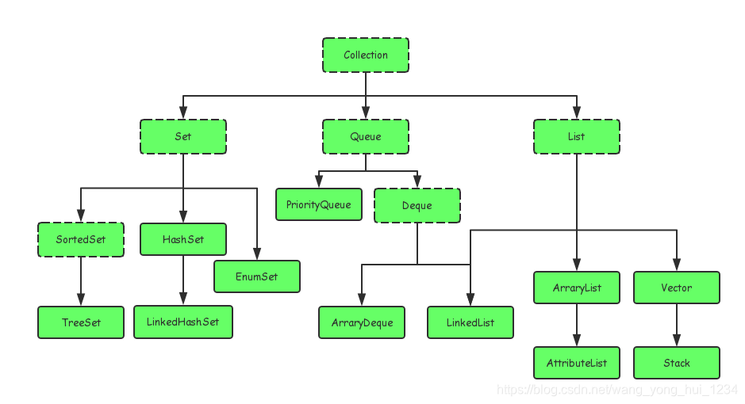
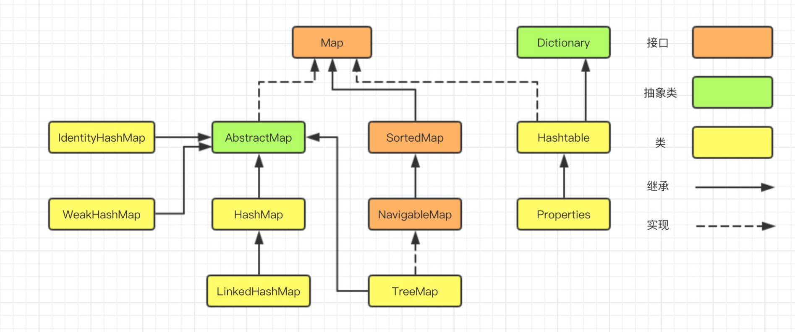
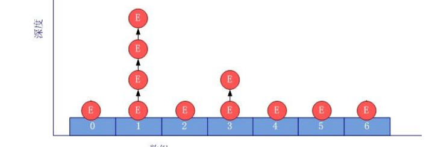
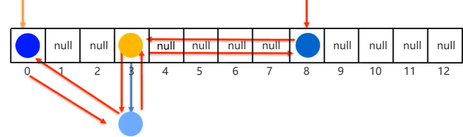
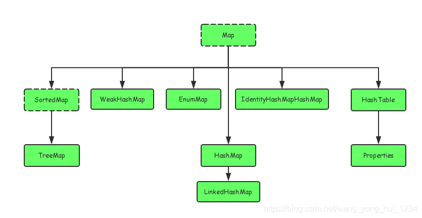

数据结构都是对象（Java自带的数据结构实现类以及常用类）

## 数组

**数组也是对象**，数组元素是基本数据类型或者类。

### 定义

**定义**：`int[] a; 	int a[];`

**初始化**：数值型数组默认初始化元素为 `0`；boolean默认为 `false`；对象数组默认为 `null`。

**长度**：nums.length。

### 创建

```java
int[] a = new int[100];  // 声明长度
int[] a = new int[0]; // 长度为 0
int b[] = new int[] {1,2,3};//声明并创建空间且赋值
int[] c = {1,2,3};  //声明并创建内存空间，直接赋值
```

### for each遍历

```java
for (int num: nums)
```

打印数组所有值：`System.out.println(Arrays.toString(nums));`

### 数组拷贝

**引用**

`int[] num1 = num2;` 则 `num1`、`num2` 指向同一个数组，对一个数组改变也会引起另一个的改变。

**拷贝**

`int[] nums = Arrays.copyOf(a, a.length);` // 第二个参数是长度，一般用来扩充数组，如果长度变短则只拷贝前面一部分。

**排序**

`Arrays.sort(nums);`

**常用API**

```java
static String toString(type[] a)  // 返回包含a中数据元素的字符串, 格式：[1,2,3]
static type copyOf(type[] a，int length)  // 复制整个数组
static type copyOf(type[] a, int start，int end)  //参数：a类型为int、long、short、char、byte、boolean、float或 double 的数组 复制区间左闭右开  默认用 0 填充
static void sort(type[] a) // 排序
static int binarySearch(type[] a, type v)
static int binarySearch(type[] a, int start,int end, type v)
 // 二分查找 查找成功，则返回相应的下标值;否则，返回一个负数值r, -r - 1 为目标值插入位置
static void fill(type[] a,type v)  // 将数组的所有数据元素值设置v
static boolean equals(type[] a，type[] b) // 数组相同，返回true。
```

**注意**：这些API只能用于**数组元素是 8 个基本数据类型**的情况。

### 多维数组

`int[][] nums = {{}，{}，{}}` 。

**输出字符串**：`System.out.println(Arrays.deepToString(num));`

### 打印数组

常规方法：`for`循环、超级for（`for(int i: nums)`）、`Arrays.toString`。

```java
int[] a = new int[10]; 
System.out.println(Arrays.toString(a)); // 一维二维都一样
```


## 日期Calendar

`Calendar` 抽象类，通过该类来操作日期。

抽象类无法创建对象，所以一般使用 `Calendar` 的子类来处理时间，使用 `Calendar` 的静态方法创建子类对象：`Calendar calendar = Calendar.getInstance();`

**常用API**

```java
add(int field, int amount);  //加减时间值
get(int field);  // 取出指定字段的值
getInstance();  // 返回Calendar，可指定地区
getTimelnMillis();  // 以毫秒返回时间 从1970.1.1开始有多少毫秒
roll(int field, boolean up);  // 加减时间值，不进位
set(int field, int value);  // 设定指定字段的值
set(year, month, day, hour, minute); // 设定完整的时间
setTimelnMillis(long millis);  // 以毫秒指定时间
```

**关键字段**

```java
MONTH  // 月份
YEAR  // 年份
DATE // 几号
WEEK_OF_YEAR // 一年中的第几周
WEEK_OF_MONTH  // 一月中的第几周
DAY_OF_YEAR  //  一年中的第几天
DAY_OF_MONTH  
DAY_OF_WEEK  
HOUR / HOUR_OF_DAY  // 小时
MILLISECOND  // 毫秒
MINUTE  // 分钟
SECOND  // 秒
ZONE_OFFSET  // 时区位移    
```


## 集合体系结构

在`java`中，集合（`Collection`）指的是一组数据容器，它可以存储多种对象，并且允许用户通过一些方法来访问与操作这些对象。

集合（`Collection`）主要包括两大类：


**`Collection`** 接口和 **`Map`** 接口。

`Collection`接口存储**单列**数据，定义了存取一组对象的方法的集合，`Map`存储**双列**数据，保存具有映射关系`key-value`对集合。

集合框架是一个用来代表和操纵集合的统一架构。所有的集合框架都包含如下内容：

- **接口：**是代表集合的抽象数据类型。例如 `List、Set、Map` 等。之所以定义多个接口，是为了以不同的方式操作集合对象。
- **实现（类）：**是集合接口的**具体实现**。从本质上讲，它们是可重复使用的数据结构，例如 `ArrayList、LinkedList、HashSet、HashMap`。
- **算法：**是实现集合接口的对象里的方法执行的一些有用的计算，例如：搜索和排序，这些算法实现了多态，那是因为相同的方法可以在相似的接口上有着不同的实现。

`Collection` 接口有 `3` 种子类型，`List`、`Set` 和 `Queue`。`List`代表有序、可重复；`Set`代表无序、不可重复；`Queue`代表队列。

**`Collection`主要结构树**：



**`Map`结构树**：



## List集合

**常用的有**：**ArrayList**、**LinkedList**、**Vector**（不常用）。

### 公共常用方法

```java
boolean add(Object elem); // 添加元素
boolean addAll(Collection coll); // 添加所有元素到另一个集合
int size()  // 获取集合的大小(元素个数)
boolean remove(Object o)   //直接删除元素值，删除成功返回true,删除失败返回false  只会默认删除第一次出现的元素值，后面的不删除(针对元素出现重复的情况)
boolean removeAll(Collection coll);  // 取当前集合的差集
indexOf(Object o);  // 返回索引或者-1
boolean isEmpty();
boolean contains(Object o); // 包含返回true（通过元素的equals方法来判断是否是同一个对象）
boolean containsAll(Collection coll); // 是否指定集合所有元素
void clear();  // 清空集合
T get(int index); // 获取元素
T set（int index, T element); 元素替换，返回该位置原本元素

```

### 迭代

四种遍历方式

- **普通for循环**

    ```java
    List<Integer> list = new ArrayList<>();
    for (int i = 0; i < list.size(); i ++)
        System.out.println(list.get(i));
    ```

- **迭代器**

    Java迭代器（`Iterator`）是 Java 集合框架中的一种机制，是一种**用于遍历集合**（如列表、集合和映射等）的**接口**。

    它提供了一种统一的方式来访问集合中的元素，而不需要了解底层集合的具体实现细节。

    `Iterator`（迭代器）不是一个集合，它是一种用于访问集合的方法，可用于迭代 [ArrayList](https://www.runoob.com/java/java-arraylist.html) 和 [HashSet](https://www.runoob.com/java/java-hashset.html) 等集合。

    **不能直接创建`Iterator`对象（通过new），该对象是以内部类的形式存在于每个集合类的内部。**

    **获取方式**：`Collection`接口中定义了获取集合类迭代器的方法 `iterator()`，返回对应集合的迭代器对象。（所有`Collection`接口的容器类都有一个`iterator`方法）

    ```java
    1.boolean hasNext(); // 判断集合中是否有元素，如果有元素则可以迭代就返回true
    2.E next();  // 返回迭代的下一个元素 注意：如果没有下一个元素时，调用next元素会抛出NoSuchElementException异常
    
    List<Integer> list = new ArrayList<>();
    Iterator<Integer> it = list.iterator();
    while (it.hasNext()) {
        System.out.println(it.next());
    }
    ```

- **增强for**

    ```java
    for (Integer i: list)
        System.out.println(i);
    ```

- **Lambda表达式**

    ```java
    list.forEach(i->System.out.println(i)); 
    ```

### ArrayList

适用于**频繁获取元素值**的情况。

`ArrayList`是一个“变长”数组。初始创建长度为 `0` 的数组，当添加第一个元素时再创建一个始容量为`10`的数组。长度根据需求以 `1.5` 倍递增（即在原有基础上扩大一半）。

#### 特点

由**数组实现**，支持随机存取，可以用下标直接存取（`get`方法，$O(1)$时间）。

使用`get`方法时是直接用下标读取对应值，源码：

```java
public E get(int index) {
    Objects.checkIndex(index, size); // 检测范围 超出则抛异常
    return elementData(index);
}
E elementData(int index) {
    return (E) elementData[index]; // 直接下标读取
}
```

#### 常用API

```java
ArrayList<String> list = new ArrayList<String>();
// ArrayList<String> list = new ArrayList<String>(111); 指定大小
list.add("插入1"); // 增
list.add("插入2"); // 增
list.remove(0); // 删
list.set(0, "修改"); // 改
System.out.println(list.get(0)); // 查
```

#### 源码

##### 插入add

```java
public boolean add(E e) {
    ++this.modCount;// 记录改变list长度的操作次数
    this.add(e, this.elementData, this.size); // size存储元素实际个数
    return true;
}
private void add(E e, Object[] elementData, int s) {
    if (s == elementData.length) { // 判断当前插入位置是否等于数组长度 等于则说明装满了 需要扩容
        elementData = this.grow();
    }
    elementData[s] = e;
    this.size = s + 1;
}

// 扩容
private Object[] grow() {
    return this.grow(this.size + 1); // 原本长度为size，添加一个元素，所以容量至少增加一个，即minCapacity = size + 1
}

private Object[] grow(int minCapacity) {
    return this.elementData = Arrays.copyOf(this.elementData, this.newCapacity(minCapacity));
}

// 三种长度：实际长度oldCapacity，实际长度+1：最小长度、实际长度的1.5倍：理想长度
private int newCapacity(int minCapacity) {
    int oldCapacity = this.elementData.length;
    int newCapacity = oldCapacity + (oldCapacity >> 1); //根据当前长度计算新长度：1.5倍
    if (newCapacity - minCapacity <= 0) { //理论上的新容量小于等于实际需要的最小容量
        if (this.elementData == DEFAULTCAPACITY_EMPTY_ELEMENTDATA) { // 数组默认空数组，此时理论容量0*10还是0，所以返回10和实际需要的最小容量中的较大值            
            return Math.max(10, minCapacity);
        } else if (minCapacity < 0) { // 实际需要的最小容量小于 0， 抛溢出异常（超出数据范围，长度变成了负数）
            throw new OutOfMemoryError();
        } else { // 理论新容量等于实际所需最小容量 或者 实际长度约为2*10^9,此时扩大1.5倍会超int，但是所需最小长度并不会超，返回最小长度即可
            return minCapacity; 
        }
    } else { // 理论上的新容量和2147483639比较，小于或等于则返回新容量，大于则返回实际需要的最小容量（要与int最大值比较，返回二者中较小的值）
        return newCapacity - 2147483639 <= 0 ? newCapacity : hugeCapacity(minCapacity);
    }
}
// 最大容量是int最大值减去 8
private static int hugeCapacity(int minCapacity) {
    if (minCapacity < 0) { // 所需最小容量超出范围
        throw new OutOfMemoryError();
    } else { // 所需最小容量>2147483639 直接扩容至最大，否则扩容之最大值-8
        return minCapacity > 2147483639 ? Integer.MAX_VALUE : 2147483639;
    }
}
```

##### 指定位置插入

```java
public void add(int index, E element) {
    this.rangeCheckForAdd(index);
    ++this.modCount; // // 记录改变list长度的操作次数
    int s;
    Object[] elementData;
    if ((s = this.size) == (elementData = this.elementData).length) {
        elementData = this.grow();
    }
    System.arraycopy(elementData, index, elementData, index + 1, s - index);
    elementData[index] = element;
    this.size = s + 1;
}
private void rangeCheckForAdd(int index) {
    if (index > this.size || index < 0) {
        throw new IndexOutOfBoundsException(this.outOfBoundsMsg(index));
    }
}
public static native void arraycopy(Object var0, int var1, Object var2, int var3, int var4);

```

过程：

- 先判断索引是否合法：小于0或者超范围；
- 判断是否需要扩容：当前元素个数是否和数组长度相等；
- 调用`arraycopy`将索引位置及其后面元素右移一位；
- 更新索引位置元素，元素个数 + 1；

`arraycopy`是`native`方法，由C/C++实现，用Java调用。

##### 更新元素

```java
public E set(int index, E element) {
    Objects.checkIndex(index, this.size);
    E oldValue = this.elementData(index);
    this.elementData[index] = element;
    return oldValue;
}
```

过程：先检查索引是否越界：大于等于0，小于元素个数，然后替换旧值并返回旧值。

##### 删除元素

删除有两种：按照**索引**和按照**元素值**。	

```java
// 按照索引删除
public E remove(int index) {
    Objects.checkIndex(index, this.size); 
    Object[] es = this.elementData;
    E oldValue = es[index];
    this.fastRemove(es, index);
    return oldValue;  
}
private void fastRemove(Object[] es, int i) {
    ++this.modCount;
    int newSize;
    if ((newSize = this.size - 1) > i) {
        System.arraycopy(es, i + 1, es, i, newSize - i);
    }
    es[this.size = newSize] = null;
}


// 按照值删除
public boolean remove(Object o) {
    Iterator<E> it = this.iterator();
    if (o == null) {
        while(it.hasNext()) {
            if (it.next() == null) {
                it.remove();
                return true;
            }
        }
    } else {
        while(it.hasNext()) {
            if (o.equals(it.next())) {
                it.remove();
                return true;
            }
        }
    }
    return false;
}

```

按照索引：

- 检查边界；
- `fastRemove`方法删除：判断需不需要移动元素（索引是不是指向最后一个元素）；需要则调用`arraycopy`移动元素
- 将最后一个元素位置置空；

按照值：用迭代器遍历数组。

- 如果要删除的是`null`元素，则用`if`比较是否相等；
- 要删除的是其他对象，用`equals`比较是否相等；
- 如果相等，再用`fastRemove`删除元素

注意：按照值删除时只删除一个。

##### 查找

```java
public boolean contains(Object o) {
    return this.indexOf(o) >= 0;
}
public int indexOf(Object o) {
    return this.indexOfRange(o, 0, this.size);
}
int indexOfRange(Object o, int start, int end) {
    Object[] es = this.elementData;
    int i;
    if (o == null) {
        for(i = start; i < end; ++i) {
            if (es[i] == null) {
                return i;
            }
        }
    } else {
        for(i = start; i < end; ++i) {
            if (o.equals(es[i])) {
                return i;
            }
        }
    }
    return -1;
}
public int lastIndexOf(Object o) {

```

过程：

遍历数组，一个一元素比较：

- 查找的是的`null`元素，用`= =`比较；
- 查找的是对象，用`equals`比较；
- 没找到则返回`-1`；

`contains` 根据返回值是否大于等于`0`返回boolean。

#### 时间复杂度

- **查找**：$O(1)$，基于数组实现，所以可以直接返回索引位置元素；
- **插入**：末尾插入是$O(1)$，插在其他位置，元素需后移，$O(n)$；
- **删除**：与插入类似；
- **修改**：$O(1)$，直接根据索引位置元素值即可；

### LinkedList

适用于需要**频繁的插入或删除元素**操作的情况。

`LinkedList`**实质**是一个**链表**。底层通过**双向链表**实现，双向链表的每个节点用内部类`Node`表示。`LinkedList`通过`first`和`last`引用分别指向链表的第一个和最后一个元素。当链表为空的时候二者指向`null`。

**不支持随机存取**，只能从一端开始遍历，直到找到需要的元素后，`get` 方法实现也是用遍历实现，源码：

```java
public E get(int index) {
    checkElementIndex(index); // 检测范围 超出则抛异常
    return node(index).item;
}    

Node<E> node(int index) { // 获取某个元素 源码  也是for循环实现 正向或者反向遍历
        // assert isElementIndex(index);
        if (index < (size >> 1)) {
            Node<E> x = first;
            for (int i = 0; i < index; i++)
                x = x.next;
            return x;
        } else {
            Node<E> x = last;
            for (int i = size - 1; i > index; i--)
                x = x.prev;
            return x;
        }
    }
```

#### 常用API

```java
LinkedList<String> list = new LinkedList<String>();
list.add("插入1"); // 增
list.add("插入2"); // 增
list.remove(0); // 删
list.set(0, "修改"); // 改
System.out.println(list.get(0)); // 查
void addFirst（Object obj);
void addLast(Object obj);
Object getFirst();  // 获取第一个元素，没有则抛出异常
Object getLast();  // 获取最后一个元素，没有则抛出异常
Object removeFirst();
Object removeLast();
```

#### 源码

**结构**

```java
public class LinkedList<E>
    extends AbstractSequentialList<E>
    implements List<E>, Deque<E>, Cloneable, java.io.Serializable
{
    transient int size = 0;
    transient Node<E> first;
    transient Node<E> last;
}
private static class Node<E> {
    E item;
    Node<E> next;
    Node<E> prev;
    Node(Node<E> prev, E element, Node<E> next) {
        this.item = element;
        this.next = next;
        this.prev = prev;
    }
}
```

`LinkedList`为链表，`first`为头节点，`last`为尾节点。

链表每个节点为`Node`，元素`item`，前后节点`next`、`prev`。

`size`记录节点个数。

注意不是循环链表，所以**头节点和尾节点不相连**。

##### 插入

调用`Node`构造方法新建元素，新元素的`prev`指向`last`指向的节点（即最后一个节点，组成双向链表）；**尾节点`last`更新为新建元素**：

- 如果链表为**空**，则**头节点也要更新**为新建元素；
- 链表**不空**，则将原本的尾节点的`next`更新为新建元素；

```java
    public boolean add(E e) {
        linkLast(e);
        return true;
    }    
	void linkLast(E e) {
        final Node<E> l = last;
        final Node<E> newNode = new Node<>(l, e, null);
        last = newNode;
        if (l == null)
            first = newNode;
        else
            l.next = newNode;
        size++;
        modCount++;
    }
```

##### 删除

按照**索引**、按照**值**、删除**头节点**、删除**尾节点**。

按照**索引**：

- 检查索引是否合法；
- `node(int index)`找到索引对应对象；
- `unlink(Node<E> x)` 删除对象：根据要删除节点是不是头、尾、中间节点来进行删除；

```java
    public E remove(int index) {
        checkElementIndex(index);
        return unlink(node(index));
    }
    Node<E> node(int index) {
        // assert isElementIndex(index);

        if (index < (size >> 1)) { // 根据索引是在前半段还是后半段选择遍历顺序：从前往后，从后往前
            Node<E> x = first;
            for (int i = 0; i < index; i++)
                x = x.next;
            return x;
        } else {
            Node<E> x = last;
            for (int i = size - 1; i > index; i--)
                x = x.prev;
            return x;
        }
    }
    E unlink(Node<E> x) {
        // assert x != null;
        final E element = x.item;
        final Node<E> next = x.next;
        final Node<E> prev = x.prev;

        if (prev == null) { // 删除头节点
            first = next; // 更新头节点为下一个节点
        } else { 
            prev.next = next;  // 将要删除节点的上一个节点指向要删除节点的下一个节点
            x.prev = null; // 将要删除节点的上一个节点置空
        }

        if (next == null) { // 删除的是尾节点
            last = prev; // 尾节点指向前一个节点
        } else {
            next.prev = prev; // 将要删除节点的下一个节点指向要删除节点的上一个节点
            x.next = null; //  将要删除节点的下一个节点置空
        }

        x.item = null; // 要删除节点元素置空
        size--; // 更新节点个数
        modCount++;
        return element;
    }
```

按照**值**

使用的还是`unlink`方法，只不过需要根据元素值是否为`null`选择`= = ` 或者`equals`。

```java
public boolean remove(Object o) {
        if (o == null) {
            for (Node<E> x = first; x != null; x = x.next) {
                if (x.item == null) {
                    unlink(x);
                    return true;
                }
            }
        } else {
            for (Node<E> x = first; x != null; x = x.next) {
                if (o.equals(x.item)) {
                    unlink(x);
                    return true;
                }
            }
        }
        return false;
    }
```

删除**头节点**

如果链表为空，则抛异常；链表不空，则根据链表是否只有一个节点来选择删除方法。

```java
    public E removeFirst() {
        final Node<E> f = first;
        if (f == null)
            throw new NoSuchElementException();
        return unlinkFirst(f);
    }
    private E unlinkFirst(Node<E> f) {
        // assert f == first && f != null;
        final E element = f.item;
        final Node<E> next = f.next;
        f.item = null;
        f.next = null; // help GC
        first = next; // 头指针指向头节点下一个节点
        if (next == null) // 只有一个节点，则尾指针也置空
            last = null;
        else
            next.prev = null; // 多个节点，则头节点的下一个节点的prev置空
        size--;
        modCount++;
        return element;
    }
```

删除**尾节点**

与删除头节点类似，先判断链表空不空，然后根据链表是否只有一个元素来选择删除方式。

```java
    public E removeLast() {
        final Node<E> l = last;
        if (l == null)
            throw new NoSuchElementException();
        return unlinkLast(l);
    }
    private E unlinkLast(Node<E> l) {
        // assert l == last && l != null;
        final E element = l.item;
        final Node<E> prev = l.prev;
        l.item = null;
        l.prev = null; // help GC
        last = prev; // last尾指针指向尾节点的上一个节点
        if (prev == null) 
            first = null;
        else
            prev.next = null;
        size--;
        modCount++;
        return element;
    }
```

##### 修改

先检查索引，然后用`node(int index)`返回索引处对象，替换对象的元素值，返回旧值。

```java
    public E set(int index, E element) {
        checkElementIndex(index);
        Node<E> x = node(index);
        E oldVal = x.item;
        x.item = element;
        return oldVal;
    }
    Node<E> node(int index) {
        // assert isElementIndex(index);

        if (index < (size >> 1)) {
            Node<E> x = first;
            for (int i = 0; i < index; i++)
                x = x.next;
            return x;
        } else {
            Node<E> x = last;
            for (int i = size - 1; i > index; i--)
                x = x.prev;
            return x;
        }
    }

```

##### 查

用`indexOf`方法从头到尾遍历链表，找到则返回下标，否则返回`-1`，根据返回的下标返回`boolean`。

**注意**：元素值为`null`时用 `= =` 来比较，否则用 `equals` 比较。

```java
    public boolean contains(Object o) {
        return indexOf(o) != -1;
    }

    public int indexOf(Object o) {
        int index = 0;
        if (o == null) {
            for (Node<E> x = first; x != null; x = x.next) {
                if (x.item == null)
                    return index;
                index++;
            }
        } else {
            for (Node<E> x = first; x != null; x = x.next) {
                if (o.equals(x.item))
                    return index;
                index++;
            }
        }
        return -1;
    }
```


### Vector

（不常用）

Vector 类实现了一个动态数组。和 ArrayList 很相似，但是**两者是不同**的：

- Vector 是**同步访问**的。
- Vector 包含了许多传统的方法，这些方法不属于集合框架。
- Vector扩张时长度会**扩大一倍**。

线程安全。加了`synchronized`同步。

Vector 类支持 4 种构造方法：

```java
// 第一种构造方法创建一个默认的向量，默认大小为 10：
Vector()

// 第二种构造方法创建指定大小的向量。
Vector(int size)

// 第三种构造方法创建指定大小的向量，并且增量用 incr 指定。增量表示向量每次增加的元素数目。
Vector(int size,int incr)

// 第四种构造方法创建一个包含集合 c 元素的向量：
Vector(Collection c)
```

**常用方法**

```java
void add(int index, Object element); // 在此向量的指定位置插入指定的元素。
boolean addAll(int index, Collection c)  // 在指定位置将指定 Collection 中的所有元素插入到此向量中。
void addElement(Object obj); // 将指定的组件添加到此向量的末尾，将其大小增加 1。
int capacity(); //返回此向量的当前容量。
void clear(); // 从此向量中移除所有元素。
Object clone(); // 返回向量的一个副本。
boolean contains(Object elem); //如果此向量包含指定的元素，则返回 true。
boolean containsAll(Collection c); // 如果此向量包含指定 Collection 中的所有元素，则返回 true。
void copyInto(Object[] anArray); // 将此向量的组件复制到指定的数组中。
Object elementAt(int index); // 返回指定索引处的组件
```

**尽量使用ArrayList替代Vector。不推荐使用Vector。**

### Stack

`Vector` 的一个子类，也是**基于动态数组**实现的，实现了**后进先出**功能。同样被`synchronized`修饰，效率低，被`ArrayDeque`取代。**不推荐使用**。

## Set集合

主要包含`HashSet`、`LinkedHashSet`、`TreeSet`。

`Set`集合底层都是由`Map`实现。

### HashSet

无序、不重、无索引。因为元素没有顺序，所以无法通过索引来访问元素。

`HashSet`底层实现是一个哈希表（由 `HashMap` 实现），按`Hash`算法来存储集合中的元素，不是线程安全的，集合元素可以是`null`。

**HashSet集合判断两个元素相等的标准**：两个对象通过`hashCode`()方法比较相等，并且两个对象的`equals`()方法返回值也相同。所以使用时，对应的类一定要重写`equals`()和`hashCode`方法，以实现对象想等原则。

**插入元素过程**

1. HashSet会调用该对象的`hashCode`方法来得到该对象的`hashCode`值，然后根据`hashCode`值，通过某种散列函数决定该对象在`HashSet`底层数组中的存储位置。
2. 如果两个元素的`hashCode`值相等，会在调用`equals`方法，如果`equals`方法结果为`true`，添加失败；如果为`false`，保存该元素，因为该数组的位置已经有元素，所以**通过链表**的方式继续存储。
3. 如果两个元素的`equals`方法返回为true，但他们的`hashCode`返回值不相等，hashSet将会把它们存储在不同的位置。



**适用场合**：元素不需要排序，想快速判断一个元素是否存在于集合中。

#### 常用方法

```java
HashSet<String> hashSet = new HashSet<>();
hashSet.add("apple"); // 增
hashSet.remove("apple"); // 删
hashSet.add("apple");
System.out.println(hashSet.contains("apple")); // 查
System.out.println(hashSet.size()); // 元素个数
System.out.println(hashSet); // 格式：[a, b]
hashSet.clear(); // 清空
hashSet.isEmpty(); // 是否空
```

#### 遍历

```java
// 增强for循环遍历
for (String item: hashSet) {
    System.out.println(item);
}

// forEach循环遍历
hashSet.forEach(item-> System.out.println(item));

// 迭代器循环遍历
Iterator<String> it = hashSet.iterator();
while (it.hasNext()) {
    System.out.println(it.next());
}
```

### LinkedHashSet

**有序**（存储和取出顺序一致）、不重复、无索引。

底层数据结构**依然继承自** `HashSet`，只是每个元素又额外多了一个**双链表的机制**记录存储的**顺序**。



**无参构造**

调用父类构造方法，即`HashSet`()，然后父类`HashSet`又调用`LinkedHashMap`构造。

```java
public LinkedHashSet() {
    super(16, .75f, true); // 调用父类构造方法，即HashSet()，如下
}

HashSet(int initialCapacity, float loadFactor, boolean dummy) {
    map = new LinkedHashMap<>(initialCapacity, loadFactor);
}
```

#### 常用方法

```java
LinkedHashSet<String> linkedHashSet = new LinkedHashSet<>();
linkedHashSet.add("apple"); // 增
linkedHashSet.add("banana");
linkedHashSet.size(); // 元素个数
linkedHashSet.remove("apple"); // 删
linkedHashSet.contains("banana"); // 查
System.out.println(linkedHashSet); // 输出
```

一般最好使用`HashSet`（效率较高），如果要求**存取有序**，使用`LinkedHashSet`（效率较低）。

### TreeSet

不重、无索引、可排序（实现了 `SortedSet` 接口，可以排序）。

`TreeSet`集合底层是基于**红黑树**的数据结构实现排序的，增删改查性能较好。

默认排序规则：

- 对于**数值类型**：Integer，Double，默认按照**从小到大**的顺序进行排序；
- 对于字符、字符串类型：按照字符**在ASCII码表中的数字升序**进行排序；

自定义排序规则：

- 默认排序/自然排序：实现`Comparable`接口指定比较规则；
- **比较器排序**：创建TreeSet对象的时候，传递比较器`Comparator`指定规则；

`TreeSet`是由`TreeMap`实现的，无参构造方法如下：

```java
public TreeSet() {
    this(new TreeMap<>()); // 调用TreeMap的构造方法
}
```

**常用方法**

```java
 TreeSet<String> treeSet = new TreeSet<>();
 treeSet.add("apple"); // 增
 treeSet.add("banana");
 treeSet.remove("apple"); // 删
 treeSet.clear(); // 清空
 treeSet.contains("apple"); // 查
 System.out.println(treeSet.isEmpty());
 System.out.println(treeSet);
```

**注意**：`TreeSet` 不允许插入 `null` 元素。

## Queue集合

`Queue`接口（先进先出）：

```java
public interface Queue<E> extends Collection<E> {
    boolean add(E e); // 尾插 
    boolean offer(E e); // 尾插
    
    E remove(); // 删除并返回队头，为空则抛出异常
    E poll(); // 删除并返回队头，为空则返回null
    
    E element(); // 返回队头，为空则抛出异常
    E peek(); // 返回队头，为空则返回null
}
```

`Deque`接口（双端队列，队首队尾都可以出队、入队）：

含义基本同上

```java
public interface Deque<E> extends Queue<E> {
    void addFirst(E e);
    void addLast(E e);

    boolean offerFirst(E e);
    boolean offerLast(E e);

    E removeFirst(); 
    E removeLast();

    E pollFirst();
    E pollLast();

    E getFirst();
    E getLast();

    E peekFirst();
    E peekLast();

    boolean removeFirstOccurrence(Object o);
    boolean removeLastOccurrence(Object o);
}
```

### `ArrayDeque`

基于**数组实现**的**双端**队列，队首队尾都可以出队、入队。

**常用方法**

```java
ArrayDeque<String> arrayDeque = new ArrayDeque<>();
boolean contains(E e); // 是否包含
int size(); // 数量
E pop(); // 删除并返回头，源码实现用的是removeFirst
void clear(); // 清空
isEmpty();
```

**与`LinkedList`对比**

- 实现方式不同：`ArrayDeque`基于数组，`LinkedList`基于链表；
- 访问效率不同，基于数组的`ArrayDeque`访问、迭代效率都较高；
- 内存占用不同，`LinkedList`额外存储链表节点；

### PriorityQueue

**优先队列**，默认小根堆。**基于数组**实现。

增删改查同`Queue`。

**自定义优先级排序**

元素需要实现 `Comparable` 接口或者 `Comparator` 接口。

## Map接口

用于保存具有**映射关系**的数据:key-value。

Map 中的 **key 用Set来存放，不允许重复**，所以同一个`Map`对象所对应的类，须重写`hashCode`()和`equals`()方法。值可以重复。

常用实现类：**HashMap**、**TreeMap**、**LinkedHashMap**和 **Properties**。



### 常用方法

```java
Object put(Object key,Object value);  // 将key-value添加到(或修改)当前map对象中
void putAll(Map m);将m中的所有key-value对存放到当前map中
Object remove(Object key);移除指定key的key-value对，并返回value
void clear();清空当前map中的所有数据

Object get(Object key);获取指定key对应的value
boolean containsKey(Object key);是否包含指定的key
boolean containsValue(Object value);是否包含指定的value
int size(); 返回map中key-value对的个数
boolean isEmpty(); 判断当前map是否为空  boolean equals(Object obj)：判断当前map和参数对象obj是否相等

Set keySet(); 返回所有key构成的Set集合
Collection values(); 返回所有value构成的Collection集合
Set entrySet(); 返回所有key-value对构成的Set集合
```

### HashMap

即哈希表。

**无序、不重**。允许**使用null键和null值**。**不支持线程同步**。

`HashMap` 默认的初始容量是 16，负载因子是 0.75。

初始容量是指哈希表的初始大小，负载因子是指哈希表在扩容之前可以存储的键值对数量与哈希表大小的比率。

遍历哈希表可以使用迭代器或者 forEach 方法。

**常用方法**

```java
public V put(K key, V value); // 插入
public V get(Object key); // 获取 key 对应的 value
public V remove(Object key); // 删除键值对
public void clear(); // 清空
public int size(); // 元素个数
```

**遍历**

```java
// 增强for循环
for (String it: hashMap.keySet()) {
    System.out.println(hashMap.get(it));
}
for (Integer value: hashMap.values()) {
    System.out.println(value);
}
// 迭代器
Iterator<String> it = hashMap.keySet().iterator();
while (it.hasNext()) {
    System.out.println(hashMap.get(it.next())); 
}
```


### LinkedHashMap

**有序**。

与哈希表`HashMap`类似，在继承`HashMap`的基础上，使用了**双向链表**来记录添加元素的顺序（添加了头尾指针）。线程不安全。

**特点**

- 允许`key`或者`value`为`null`;
- 以数组+**双向链表**+红黑树实现；
- 初始容量为16，负载因子为0.75，当容量达到 容量*负载因子 的时候会扩容，一次扩容增加一倍；

**常用方法**

```java
public V put(K key, V value); // 插入
public V get(Object key); // 获取键值
public int size(); // 元素个数
public boolean isEmpty(); // 是否空
public void clear(); // 清空，源码是直接将头尾指针置空
public V putFirst(K k, V v); // 头插
public V putLast(K k, V v); // 尾插
public boolean containsValue(Object value); // 是否有等于value的值
// 底层实现是用for循环遍历每个键值对，因为基于链表实现，无法直接获取下标
```

**迭代**

```java
// 迭代 键
for (Integer key : hashMap.keySet()) {
    System.out.println(key);
    System.out.println(hashMap.get(key));
}

// 以 键值对 迭代
LinkedHashMap<Integer, Integer> hashMap = new LinkedHashMap<>();
Set<Map.Entry<Integer, Integer>> set = hashMap.entrySet();
Iterator<Map.Entry<Integer, Integer>> iterator = set.iterator();
while(iterator.hasNext()) {
    Map.Entry entry = iterator.next();
    Integer key = (Integer) entry.getKey();
    Integer value = (Integer) entry.getValue();
    System.out.println("key:" + key + ",value:" + value);
}
```

### TreeMap

**有序**。

根据 key-value 对进行排序。 底层**使用红黑树结构**存储数据。

**排序方式**：

- > **自然排序**：按照 **键key** 排序。TreeMap 的所有的 Key 必须实现 Comparable 接口，而且所有的 Key 应该是同一个类的对象，否则将会抛出 ClasssCastException；

- > **自定义排序**：创建 TreeMap 时，传入一个 Comparator 对象，该对象负责对 TreeMap 中的所有 key 进行排序。

### Hashtable

与HashSet类似，但是Hashatable是线程安全的，不允许使用 null 作为 key 和 value 。

### Properties

`Properties` 类是 `Hashtable` 的子类，该对象**用于处理属性文件**。由于属性文件里的 key、value 都是字符串类型，所以 Properties 里的 key 和 value 都是字符串类型。

存取数据时，建议使用setProperty(String key,String value)方法和 getProperty(String key)方法。

## Collections

```java
public static void copy(List destination, List source);
public static List emptyList();
public static void fill(List listToFill, Object objToFilltWith);
public static int frequency(Collection c, Object o);
public static void reverse(List list);
public static void rotate(List list, int distance);
public static void shuffle(List list);
public static void sort(List list);
public static (AllL ist list,Object oldVal, Object newVal
```

如果想用`sort`对自定义的类的对象组成的数组进行排序，自定义的类需要继承接口`Comparable`：

```java

```

