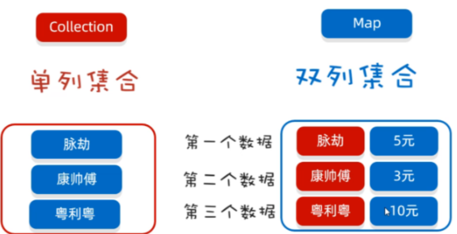

数据结构都是对象（Java自带的数据结构实现类以及常用类）

## 数组

**数组也是对象**，数组元素是基本数据类型或者类。

### 定义

**定义**：`int[] a; 	int a[];`

**初始化**：数值型数组默认初始化元素为 `0`；boolean默认为 `false`；对象数组默认为 `null`。

**长度**：nums.length。

### 创建

```java
int[] a = new int[100];  // 声明长度
int[] a = new int[0]; // 长度为 0
int b[] = new int[] {1,2,3};//声明并创建空间且赋值
int[] c = {1,2,3};  //声明并创建内存空间，直接赋值
```

### for each遍历

```java
for (int num: nums)
```

打印数组所有值：`System.out.println(Arrays.toString(nums));`

### 数组拷贝

**引用**

`int[] num1 = num2;` 则 `num1`、`num2` 指向同一个数组，对一个数组改变也会引起另一个的改变。

**拷贝**

`int[] nums = Arrays.copyOf(a, a.length);` // 第二个参数是长度，一般用来扩充数组，如果长度变短则只拷贝前面一部分。

**排序**

`Arrays.sort(nums);`

**常用API**

```java
static String toString(type[] a)  // 返回包含a中数据元素的字符串, 格式：[1,2,3]
static type copyOf(type[] a，int length)  // 复制整个数组
static type copyOf(type[] a, int start，int end)  //参数：a类型为int、long、short、char、byte、boolean、float或 double 的数组 复制区间左闭右开  默认用 0 填充
static void sort(type[] a) // 排序
static int binarySearch(type[] a, type v)
static int binarySearch(type[] a, int start,int end, type v)
 // 二分查找 查找成功，则返回相应的下标值;否则，返回一个负数值r, -r - 1 为目标值插入位置
static void fill(type[] a,type v)  // 将数组的所有数据元素值设置v
static boolean equals(type[] a，type[] b) // 数组相同，返回true。
```

**注意**：这些API只能用于**数组元素是 8 个基本数据类型**的情况。

### 多维数组

`int[][] nums = {{}，{}，{}}` 。

**输出字符串**：`System.out.println(Arrays.deepToString(num));`

### 打印数组

常规方法：`for`循环、超级for（`for(int i: nums)`）、`Arrays.toString`。

```java
int[] a = new int[10]; 
System.out.println(Arrays.toString(a)); // 一维二维都一样
```


## 日期Calendar

`Calendar` 抽象类，通过该类来操作日期。

抽象类无法创建对象，所以一般使用 `Calendar` 的子类来处理时间，使用 `Calendar` 的静态方法创建子类对象：`Calendar calendar = Calendar.getInstance();`

**常用API**

```java
add(int field, int amount);  //加减时间值
get(int field);  // 取出指定字段的值
getInstance();  // 返回Calendar，可指定地区
getTimelnMillis();  // 以毫秒返回时间 从1970.1.1开始有多少毫秒
roll(int field, boolean up);  // 加减时间值，不进位
set(int field, int value);  // 设定指定字段的值
set(year, month, day, hour, minute); // 设定完整的时间
setTimelnMillis(long millis);  // 以毫秒指定时间
```

**关键字段**

```java
MONTH  // 月份
YEAR  // 年份
DATE // 几号
WEEK_OF_YEAR // 一年中的第几周
WEEK_OF_MONTH  // 一月中的第几周
DAY_OF_YEAR  //  一年中的第几天
DAY_OF_MONTH  
DAY_OF_WEEK  
HOUR / HOUR_OF_DAY  // 小时
MILLISECOND  // 毫秒
MINUTE  // 分钟
SECOND  // 秒
ZONE_OFFSET  // 时区位移    
```


## 集合体系结构

在`java`中，集合（`Collection`）指的是一组数据容器，它可以存储多种对象，并且允许用户通过一些方法来访问与操作这些对象。

集合（`Collection`）主要包括两大类：



**`Collection`** 接口和 **`Map`** 接口。

`Collection`接口存储**单列**数据，定义了存取一组对象的方法的集合，`Map`存储**双列**数据，保存具有映射关系`key-value`对集合。

集合框架是一个用来代表和操纵集合的统一架构。所有的集合框架都包含如下内容：

- **接口：**是代表集合的抽象数据类型。例如 `List、Set、Map` 等。之所以定义多个接口，是为了以不同的方式操作集合对象。
- **实现（类）：**是集合接口的**具体实现**。从本质上讲，它们是可重复使用的数据结构，例如 `ArrayList、LinkedList、HashSet、HashMap`。
- **算法：**是实现集合接口的对象里的方法执行的一些有用的计算，例如：搜索和排序，这些算法实现了多态，那是因为相同的方法可以在相似的接口上有着不同的实现。

`Collection` 接口有 `3` 种子类型，`List`、`Set` 和 `Queue`。`List`代表有序、可重复；`Set`代表无序、不可重复；`Queue`代表队列。

**`Collection`主要结构树**：


**`Map`结构树**：


## List集合

**常用的有**：**ArrayList**、**LinkedList**、**Vector**（不常用）。

### 公共常用方法

```java
boolean add(Object elem); // 添加元素
boolean addAll(Collection coll); // 添加所有元素到另一个集合
int size()  // 获取集合的大小(元素个数)
boolean remove(Object o)   //直接删除元素值，删除成功返回true,删除失败返回false  只会默认删除第一次出现的元素值，后面的不删除(针对元素出现重复的情况)
boolean removeAll(Collection coll);  // 取当前集合的差集
indexOf(Object o);  // 返回索引或者-1
boolean isEmpty();
boolean contains(Object o); // 包含返回true（通过元素的equals方法来判断是否是同一个对象）
boolean containsAll(Collection coll); // 是否指定集合所有元素
void clear();  // 清空集合
T get(int index); // 获取元素
T set（int index, T element); 元素替换，返回该位置原本元素

```

### 迭代

四种遍历方式

- **普通for循环**

    ```java
    List<Integer> list = new ArrayList<>();
    for (int i = 0; i < list.size(); i ++)
        System.out.println(list.get(i));
    ```

- **迭代器**

    Java迭代器（`Iterator`）是 Java 集合框架中的一种机制，是一种**用于遍历集合**（如列表、集合和映射等）的**接口**。

    它提供了一种统一的方式来访问集合中的元素，而不需要了解底层集合的具体实现细节。

    `Iterator`（迭代器）不是一个集合，它是一种用于访问集合的方法，可用于迭代 [ArrayList](https://www.runoob.com/java/java-arraylist.html) 和 [HashSet](https://www.runoob.com/java/java-hashset.html) 等集合。

    **不能直接创建`Iterator`对象（通过new），该对象是以内部类的形式存在于每个集合类的内部。**

    **获取方式**：`Collection`接口中定义了获取集合类迭代器的方法 `iterator()`，返回对应集合的迭代器对象。（所有`Collection`接口的容器类都有一个`iterator`方法）

    ```java
    1.boolean hasNext(); // 判断集合中是否有元素，如果有元素则可以迭代就返回true
    2.E next();  // 返回迭代的下一个元素 注意：如果没有下一个元素时，调用next元素会抛出NoSuchElementException异常
    
    List<Integer> list = new ArrayList<>();
    Iterator<Integer> it = list.iterator();
    while (it.hasNext()) {
        System.out.println(it.next());
    }
    ```

- **增强for**

    ```java
    for (Integer i: list)
        System.out.println(i);
    ```

- **Lambda表达式**

    ```java
    list.forEach(i->System.out.println(i)); 
    ```

### ArrayList

适用于**频繁获取元素值**的情况。

`ArrayList`是一个“变长”数组。初始创建长度为 `0` 的数组，当添加第一个元素时再创建一个始容量为`10`的数组。长度根据需求以 `1.5` 倍递增。

#### 特点

由**数组实现**，支持随机存取，可以用下标直接存取（`get`方法，$O(1)$时间）。

使用`get`方法时是直接用下标读取对应值，源码：

```java
public E get(int index) {
    Objects.checkIndex(index, size); // 检测范围 超出则抛异常
    return elementData(index);
}
E elementData(int index) {
    return (E) elementData[index]; // 直接下标读取
}
```

#### 常用API

```java
ArrayList<String> list = new ArrayList<String>();
list.add("插入1"); // 增
list.add("插入2"); // 增
list.remove(0); // 删
list.set(0, "修改"); // 改
System.out.println(list.get(0)); // 查
```

### LinkedList

适用于需要**频繁的插入或删除元素**操作的情况。

`LinkedList`**实质**是一个**链表**。底层通过双向链表实现，双向链表的每个节点用内部类`Node`表示。`LinkedList`通过`first`和`last`引用分别指向链表的第一个和最后一个元素。当链表为空的时候二者指向`null`。

**不支持随机存取**，只能从一端开始遍历，直到找到需要的元素后，`get` 方法实现也是用遍历实现，源码：

```java
public E get(int index) {
    checkElementIndex(index); // 检测范围 超出则抛异常
    return node(index).item;
}    

Node<E> node(int index) { // 获取某个元素 源码  也是for循环实现 正向或者反向遍历
        // assert isElementIndex(index);
        if (index < (size >> 1)) {
            Node<E> x = first;
            for (int i = 0; i < index; i++)
                x = x.next;
            return x;
        } else {
            Node<E> x = last;
            for (int i = size - 1; i > index; i--)
                x = x.prev;
            return x;
        }
    }
```


### 常用API

```java
LinkedList<String> list = new LinkedList<String>();
list.add("插入1"); // 增
list.add("插入2"); // 增
list.remove(0); // 删
list.set(0, "修改"); // 改
System.out.println(list.get(0)); // 查
```

**API**

```java
void addFirst（Object obj);
void addLast(Object obj);
Object getFirst();  // 获取第一个元素
Object getLast();  // 获取最后一个元素
Object removeFirst();
Object removeLast();
```


### Vector

（不常用）

Vector 类实现了一个动态数组。和 ArrayList 很相似，但是**两者是不同**的：

- Vector 是**同步访问**的。
- Vector 包含了许多传统的方法，这些方法不属于集合框架。

Vector 主要用在事先不知道数组的大小，或者只是需要一个可以改变大小的数组的情况。

Vector 类支持 4 种构造方法：

```java
// 第一种构造方法创建一个默认的向量，默认大小为 10：
Vector()

// 第二种构造方法创建指定大小的向量。
Vector(int size)

// 第三种构造方法创建指定大小的向量，并且增量用 incr 指定。增量表示向量每次增加的元素数目。
Vector(int size,int incr)

// 第四种构造方法创建一个包含集合 c 元素的向量：
Vector(Collection c)
```

**常用方法**

```java
void add(int index, Object element); // 在此向量的指定位置插入指定的元素。
boolean addAll(int index, Collection c)  // 在指定位置将指定 Collection 中的所有元素插入到此向量中。
void addElement(Object obj); // 将指定的组件添加到此向量的末尾，将其大小增加 1。
int capacity(); //返回此向量的当前容量。
void clear(); // 从此向量中移除所有元素。
Object clone(); // 返回向量的一个副本。
boolean contains(Object elem); //如果此向量包含指定的元素，则返回 true。
boolean containsAll(Collection c); // 如果此向量包含指定 Collection 中的所有元素，则返回 true。
void copyInto(Object[] anArray); // 将此向量的组件复制到指定的数组中。
Object elementAt(int index); // 返回指定索引处的组件
```

## Set集合

### HashSet

无序、不重。

按`Hash`算法来存储集合中的元素，不是线程安全的，集合元素可以是`null`。

**HashSet集合判断两个元素相等的标准**：两个对象通过`hashCode`()方法比较相等，并且两个对象的`equals`()方法返回值也相同。所以使用时，对应的类一定要重写`equals`()和`hashCode`方法，以实现对象想等原则。

**插入元素过程**

1. HashSet会调用该对象的`hashCode`方法来得到该对象的`hashCode`值，然后根据`hashCode`值，通过某种散列函数决定该对象在`HashSet`底层数组中的存储位置。
2. 如果两个元素的`hashCode`值相等，会在调用`equals`方法，如果`equals`方法结果为`true`，添加失败；如果为`false`，保存该元素，因为该数组的位置已经有元素，所以**通过链表**的方式继续存储。
3. 如果两个元素的`equals`方法返回为true，但他们的`hashCode`返回值不相等，hashSet将会把它们存储在不同的位置。


## Map接口

用于保存具有**映射关系**的数据:key-value。

Map 中的 **key 用Set来存放，不允许重复**，所以同一个`Map`对象所对应的类，须重写`hashCode`()和`equals`()方法。

常用实现类：**HashMap**、**TreeMap**、**LinkedHashMap**和 **Properties**。


### 常用方法

```java
Object put(Object key,Object value);  // 将key-value添加到(或修改)当前map对象中
void putAll(Map m);将m中的所有key-value对存放到当前map中
Object remove(Object key);移除指定key的key-value对，并返回value
void clear();清空当前map中的所有数据

Object get(Object key);获取指定key对应的value
boolean containsKey(Object key);是否包含指定的key
boolean containsValue(Object value);是否包含指定的value
int size(); 返回map中key-value对的个数
boolean isEmpty(); 判断当前map是否为空  boolean equals(Object obj)：判断当前map和参数对象obj是否相等

Set keySet(); 返回所有key构成的Set集合
Collection values(); 返回所有value构成的Collection集合
Set entrySet(); 返回所有key-value对构成的Set集合
```

### HashMap

即哈希表。

无序、不重。允许使用null键和null值。

### Hashtable

与HashSet类似，但是Hashatable是线程安全的，不允许使用 null 作为 key 和 value 。

### LinkedHashMap

与哈希表类似，在HashMap存储结构的基础上，使用了**双向链表**来记录添加元素的顺序。

### TreeMap

有序。

根据 key-value 对进行排序。 底层使用红黑树结构存储数据。

**排序方式**：

- > **自然排序**：TreeMap 的所有的 Key 必须实现 Comparable 接口，而且所有的 Key 应该是同一个类的对象，否则将会抛出 ClasssCastException；

- > **自定义排序**：创建 TreeMap 时，传入一个 Comparator 对象，该对象负责对 TreeMap 中的所有 key 进行排序。

### Properties

`Properties` 类是 `Hashtable` 的子类，该对象**用于处理属性文件**。由于属性文件里的 key、value 都是字符串类型，所以 Properties 里的 key 和 value 都是字符串类型。

存取数据时，建议使用setProperty(String key,String value)方法和 getProperty(String key)方法。

## Collections

```java
public static void copy(List destination, List source);
public static List emptyList();
public static void fill(List listToFill, Object objToFilltWith);
public static int frequency(Collection c, Object o);
public static void reverse(List list);
public static void rotate(List list, int distance);
public static void shuffle(List list);
public static void sort(List list);
public static (AllL ist list,Object oldVal, Object newVal
```

如果想用`sort`对自定义的类的对象组成的数组进行排序，自定义的类需要继承接口`Comparable`：

```java

```

