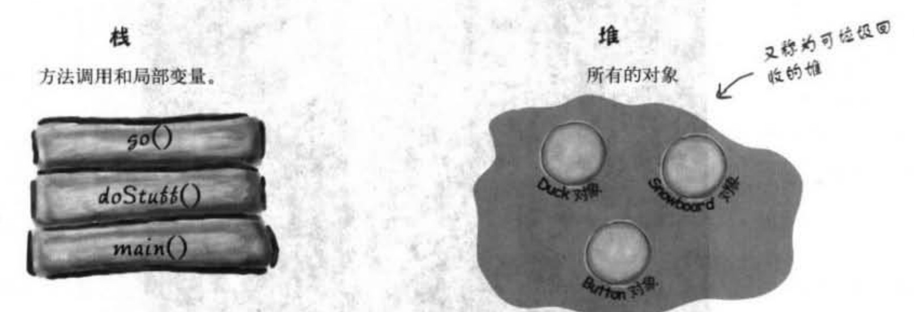

# 类与对象

## 简介

**类**（class）是一个**抽象的概念集合**，表示对事物的描述，是**具备某些共同特征**的实体的集合，它是一种**抽象的数据类型**，是对一类“事物”的属性和行为的描述。（**蓝图**）

**对象**是类的**一个实例**，它是一个**具体**的概念。例如，现在有一个 `Person` 类，它可以有多个实例，比如张三，李四等等，每一个实例都是一个对象。

总结：类就是模版，对象就是用模版创造出来的东西。

**属性（实例变量）**：类内部定义的变量。一般标记为 `private`。注意属性和局部变量不同，局部变量没有默认值，必须初始化。

**方法**：类内部定义的方法。

**变量**：类内部的方法里面定义局部变量。

## 类

类之间的关系：继承(实现)、依赖、关联、聚合、组合。

### 命名规范

**类名**：骆驼命名法，每个单词首字母大写。

| 属性           | 约束                                      | 例                                                           |
| -------------- | ----------------------------------------- | ------------------------------------------------------------ |
| **抽象类**     | Abstract 或者 **Base** 开头               | BaseUserService                                              |
| 枚举类         | Enum 作为后缀                             | GenderEnum                                                   |
| **工具类**     | Utils作为后缀                             | StringUtils                                                  |
| **异常类**     | Exception结尾                             | RuntimeException                                             |
| **接口实现类** | 接口名+ Impl                              | UserServiceImpl                                              |
| 领域模型相关   | /DO/DTO/VO/DAO                            | 正例：UserDAO 反例： UserDo， UserDao                        |
| 设计模式相关类 | Builder，Factory等                        | 当使用到设计模式时，需要使用对应的设计模式作为后缀，如ThreadFactory |
| 处理特定功能的 | Handler，Predicate, Validator             | 表示处理器，校验器，断言，这些类工厂还有配套的方法名如handle，predicate，validate |
| **测试类**     | Test结尾                                  | UserServiceTest， 表示用来测试UserService类的                |
| MVC分层        | Controller，Service，ServiceImpl，DAO后缀 | UserManageController，UserManageDAO                          |

```java
class Demo {
    private int id;
    private String name;
	// 没有构造方法的时候默认初始化为0、false、null等 
    public Demo(int id, String name) {
        this.id = id;
        this.name = name;
    }
    
    public int getId() {
        return id;
    }

    public void setId(int id) {
        this.id = id;
    }

    public String getName() {
        return name;
        // 如果返回得是一个实例对象，应该返回克隆，而不是直接返回引用
    }

    public void setName(String name) {
        this.name = name;
    }
}
```

源代码的**文件名必须与公共类**的名字**相同**：

```java
public class Mian {
    
}
// 对应的文件名为 Main.java
```


### 方法的参数

Java的方法的**参数是基本类型**的时候，是**按值调用**（传值），得到的是参数值的拷贝，方法无法修改参数原地址里的值。

**参数类型**：基本类型、对象引用。

方法的**参数是对象**的时候，传得是**对象引用的拷贝**，**这个拷贝和原始的对象引用指向同一个对象**。所以可以改变对象内部实例的值，但是**与C++的引用不一样**。

举例：


无法交换，因为**交换的是拷贝引用**，而拷贝引用在方法结束后就释放了，原始对象的引用依然不变。

总结：

* 方法不能修改为基本数据类型的类型；
* 方法可以改变对象参数的内部实例；
* 方法不能让对象参数的引用指向新对象，即无法改变对象参数的引用（所以还是传值）；

### 构造函数

构造函数在创建对象的时候被调用，分有参和无参，Java默认提供无参构造函数。**构造函数与类名同名，方法也可以与类名同名，分辨同名构造函数和方法**：**构造函数没有返回类型**，方法有返回类型（`void` 也是返回类型）。

构造参数可以设置为私有、共有、不指定，根据需求选择。

#### 重载

类里面有**多个名字相同、参数不同**的方法，这就是重载。调用时根据传递的参数个数、类型来自动查找合适的方法。（注意：返回值不同不能用来区分不同方法）。

**重载构造参数**

有多个构造参数且参数都不相同。

#### 构造过程


以上面代码为例，分三个步骤：**声明、创建、赋值**。

**声明**：`Duck myDuck`；

**创建**：`new Duck()`；

**赋值**：`=`；

看上去对象的创建过程实在调用 `Duck()` 方法，其实不是，调用的是 `Duck` 的**构造函数**，**构造函数不是方法**！！！

#### **无参构造**

类默认包含一个无参构造函数，当**没有重载构造方法**时，创建类会**调用默认无参构造方法**；如果**重载了一个或多个构造方法**，**没有重载无参构造方法，则不能再调用无参构造方法。**

#### 析构

主要用于对文件、系统资源的回收。

### 生存空间——堆、栈

**对象**的生存空间是**堆**，**方法调用以及局部变量**的生存空间是**栈**。



**实例变量**（属性）：实例变量是被声明在类里面的，代表每个独立对象的字段（即每个对象都可以有自己的值）。实例变量存在于所属类中，类在堆上，所以**实例变量也在堆上**。

- **实例变量都是基本数据类型**，在堆上创建对象时会依据这些数据类型的大小预留空间；
- **实例变量是对象**，即创建的对象内部带有对象的引用，则**会给对象引用预留空间**，不会给引用的对象预留空间，**引用的对象是位于其被创建时在堆上的其他空间**；

**局部变量**：局部变量和方法的参数都声明在方法中，生命周期只在方法调用周期，存在栈上。

**对象局部变量**：即对象的引用，也是局部变量，所以放在栈上，但是对象本身还是放在堆上。除了基本数据类型之外，其他类型的变量都是对象的引用。


**局部变量**的空间在**方法执行完毕后**就会被释放，**实例变量**的空间则是在**对象被使用完毕**（没有引用指向该对象）后被释放。


### 类的导入

Java用包将类组织起来，包是类的集合。

一个类可以使用**所属包中的所有类**，以及**其他包中的公有类**。

导入方式：

* `java.util.Date date = new java.util.Date()`；~~不常用~~
* 使用 `import` 导入；注意只能导入一个包，不能 `import java.*.*`；

### 抽象类

对于某些不希望被初始化的类，可以通过 `abstract` 定义为抽象类。

```java
abstract class AbstractClass {
    String name;
    public void check() {
        System.out.println("zzz");
    }
}
```

**抽象类无法被实例化，必须被继承**，或者是调用其静态成员（`static` 修饰）。

#### **抽象方法**

与抽象类相似，用 `abstract` 来修饰，没有方法体。**只有抽象类能包含抽象方法**。

```java
abstract void check();
```

**所有的抽象方法都必须要在子类中被覆盖（实现）**。（抽象类继承抽象类，不需要实现抽象方法）

#### 二者关系

抽象方法和抽象类的关系：

1. 抽象类中可以没有抽象方法，抽象方法必须位于抽象类中。
2. 当一个**非抽象类**继承了抽象类，那么**非抽象类必须**实现抽象类中的抽象方法。
3. 当**子类是抽象类**，继承了抽象类，那么子类既可以实现抽象方法，也可以不实现。
4. **抽象类可以有构造方法**。


### 特殊的类Object

Java类都有一个共同的祖先类，这就是 `Object` 类，所有的类默认都继承自Object类。换句话说，任何一个没有显式地继承别的父类的类，都会直接继承`Object`，否则就是间接地继承`Object`，并且任何一个类也都会享有`Object`提供的方法。又因为`Object`是所有类的父类，所以**基于多态的特性，该类可以用来代表任何一个类，允许把任何类型的对象赋给 Object类型的变量，也可以作为方法的参数、方法的返回值**。

```java
boolean equals();
Class getClass();
int hashCode();
String toString();
```


https://baijiahao.baidu.com/s?id=1762751055848989694&wfr=spider&for=pc

### 静态`static`

#### 静态方法

关键字：`static`。调用的时候不需要实例的方法标记为静态方法。如：

`public static int max(int a, int b) {};`

调用静态方法是**用类的名称调用**。用引用变量的名（即对象名）调用非静态方法。

**静态方法不能调用非静态变量**：静态方法与对象无关，只与类有关，当静态方法调用非静态变量的时候，编码器无法识别该变量对应的对象，所以静态方法不能调用非静态变量。

同理，**静态方法也不能调用非静态方法**（还是因为没有具体实例对象），哪怕该方法没有用到实例变量。

#### 静态变量

`static` 关键字修饰。

```java
static int a;
```

**静态变量**的值对所有的实例来说都相同，它是**共享**的，即同一个类的**所有实例共享一份静态变量**。

**初始化**：静态变量在**类被加载的时候**初始化。类的加载时间有Java虚拟机决定，一般在初次创建对象之前进行加载，保证：

- **静态变量**会在该类的**任何对象创建之前**就完成初始化（默认情况下会赋值0、false、null等）；
- **静态方法**会在该类的**任何静态方法执行前**就初始化；

#### 静态初始化程序

即 static initializer，是一段**在加载类时会执行的程序**（类的加载时间有Java虚拟机决定，一般在初次创建对象之前进行加载），会在其他程序可以使用该类之前就执行，所以很适合放静态 `final` 变量的起始程序来对其初始化：

```java
class Demo {
    final static int x;
    static {
        x = 12;
    }
}
```

**静态`final`变量初始化**：

- 在**声明的时候直接初始化**：`public static final int NAME = 12`；
- 在**静态初始化程序块**中初始化，如上。


## 接口

**关键字**：`interface`。

**接口的所有方法都是抽象方法**。

**接口定义与实现**

```java
interface Person {
}
class Man implements Person {    
}
```

接口所有的**属性都是公开静态常量**，默认使用 `public static final` 修饰。

接口所有**方法都是公开抽象方法**，默认使用 `public abstract` 修饰。

修饰符都是默认的，可写可不写。

一个类可以**继承多个接口**。


## 封装

| 修饰符    | 类   | 包   | 子类 | 其他包 |
| :-------- | :--- | :--- | :--- | :----- |
| public    | √    | √    | √    | √      |
| protected | √    | √    | √    | ×      |
| default   | √    | √    | ×    | ×      |
| private   | √    | ×    | ×    | ×      |

## 继承 `extends`

被继承的类：**超类**、父类、基类；继承的类（新类）：**子类**、派生类、孩子类。

子类**继承超类的属性和方法**，也可以通过重写覆盖超类的方法。子类调用的时候会首先调用重写的方法，没有重写再调用超类的方法。

**私有的属性和方法**子类无法直接调用，**调用超类的私有属性需要在父类中声明get和set方法**，超类中final类型的私有属性也能被子类继承。

Java中只有单继承，多重继承，没有多继承（一个子类有多个父类的情况不允许存在）

### super

`super` 用来指代当前类的父类，只能出现在构造方法和实例方法中。

**主要作用**

1. **访问超类的构造方法** 

    **调用超类构造方法的代码必须放在子类构造方法的第一行**，用`super`调用属性时不用遵守。当父类没有无参构造方法时，不能直接使用`super()`；需要使用对应的有参构造方法：`super(参数)`；

    **子类的构造方法执行的时候**，会先调用超类的构造方法，若**超类有无参构造方法**，则`super()` 可写可不写；若超类只有有参构造方法，则必须在第一行用 `super(参数)` 调用。

2. **访问超类的属性（非私有）**

    在子类中使用`super.name` 访问超类的非私有属性。

3. **访问超类的方法（非私有）**

    `super.method(...)`。

`super` 是一个**对象级的关键字**，也就是说得有对象才能调用super，所以super不能出现在静态方法中（带有static关键字的方法）
当访问的子类属性与超类继承过来的属性或方法名字不一样时，super关键字可以省略不写。
当访问的子类属性与超类继承过来的属性或方法名字一样时，想要访问超类型的这部分特征时，必须使用super关键字。

有父母才能有孩子，所以子类的构造函数在执行的时候，需要先执行父类的构造函数，如果父类有无参构造函数，则 `super()` 可加可不加，编译器会默认加上，如果父类只有有参构造函数，则必须在子类构造函数的第一行显示的调用 `super(参数)` 先创建父类，才能构造子类。

#### this

`this` 通常用来指代当前类的对象，或者指代当前类子类的对象，需要具体情况具体分析，本质是一个指向当前被调用的方法/属性所属的对象的指针。一句话：**`this` 关键字只能在方法内部使用，表示对调用方法的那个对象的引用。** 分析时候看是哪个对象调用 `this`，指代的就是哪个对象。

##### **调用成员变量**

当方法的形参的名字和实例变量的名字相同，为了区分形参和实例变量，用 `this` 关键字指代实例变量来进行区分：`this.name`。

##### 调用构造函数

创建类的时候可以直接调用构造函数，也可以调用 `this` 关键字：

```java
class DemoClass {
    private String name;
    private int age;
    public DemoClass() {
        this("aaa", 12);
    }

    public DemoClass(String name, int age) {
        this.name = name;
        this.age = age;
    }
}
```

调用方式：通过 `this(参数)` 来从某个构造函数调用同一个类的另一个构造函数。调用 `this` 构造的时候只能在构造函数中，并且在第一行。**`super` 和 `this` 不能同时使用。**

##### 调用普通方法

`this` 表示当前对象，用来调用当前类的普通方法。

##### 返回当前对象

`this` 用来指代当前对象，可以当作返回值进行调用。


### 无法被继承的类

1. 存取控制没有标记为共有的类，只能被同一个包的类继承；

2. 使用 `final` 修饰的类，表示该类是继承树的末端，不能被继承；

    `final` 修饰的类会将类里的所有方法也修饰成 `final`。

3. 类只有 `private` 的构造方法，子类无法调用它的构造方法，所以不能被继承；

    

## 多态

**方法覆盖**

参数、返回类型都得相同，不能降低被覆盖方的存取权限

编译器根据变量的引用类型来判断有哪些方法可以调用，而不是根据变量实际指向的类的类型。

`A a = new B();` A 是超类，B 是子类，对象 a 的引用类型是 A，实际指向的类的类型是 B，这时 a 只能调用 A 类的方法。可以通过强制类型转换：

````java
if (a instanceof B) {
	B b = (B)a;
}
````


## 重载

重载只是两个方法的名字相同，但是参数必须不同（即参数必须有改变，返回类型可变可不变，存取权限可变可不变），与多态无关。

