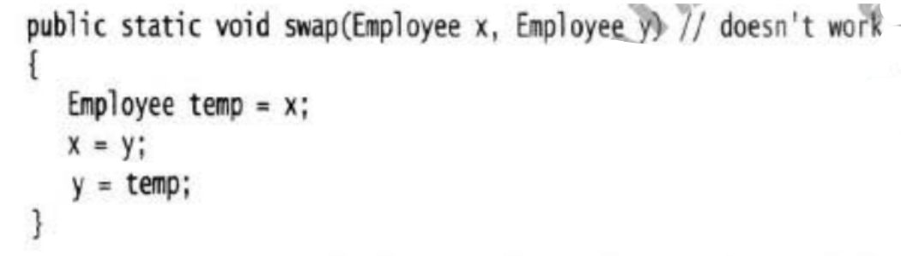
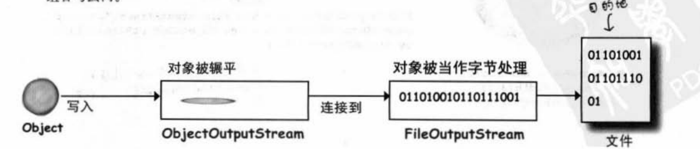

# 类与对象

## 简介

**类**（class）是一个**抽象的概念集合**，表示对事物的描述，是**具备某些共同特征**的实体的集合，它是一种**抽象的数据类型**，是对一类“事物”的属性和行为的描述。（**蓝图**）

**对象**是类的**一个实例**，它是一个**具体**的概念。例如，现在有一个 `Person` 类，它可以有多个实例，比如张三，李四等等，每一个实例都是一个对象。

总结：类就是模版，对象就是用模版创造出来的东西。

**属性（实例变量、成员变量）**：类内部定义的变量。一般标记为 `private`。注意属性和局部变量不同，局部变量没有默认值，必须初始化。

**方法**：类内部定义的方法。

**变量**：类内部的方法里面定义局部变量。

## 类

类之间的关系：继承(实现)、依赖、关联、聚合、组合。

### 命名规范

**类名**：骆驼命名法，每个单词首字母大写。

| 属性           | 约束                                      | 例                                                           |
| -------------- | ----------------------------------------- | ------------------------------------------------------------ |
| **抽象类**     | Abstract 或者 **Base** 开头               | BaseUserService                                              |
| 枚举类         | Enum 作为后缀                             | GenderEnum                                                   |
| **工具类**     | Utils作为后缀                             | StringUtils                                                  |
| **异常类**     | Exception结尾                             | RuntimeException                                             |
| **接口实现类** | 接口名+ Impl                              | UserServiceImpl                                              |
| 领域模型相关   | /DO/DTO/VO/DAO                            | 正例：UserDAO 反例： UserDo， UserDao                        |
| 设计模式相关类 | Builder，Factory等                        | 当使用到设计模式时，需要使用对应的设计模式作为后缀，如ThreadFactory |
| 处理特定功能的 | Handler，Predicate, Validator             | 表示处理器，校验器，断言，这些类工厂还有配套的方法名如handle，predicate，validate |
| **测试类**     | Test结尾                                  | UserServiceTest， 表示用来测试UserService类的                |
| MVC分层        | Controller，Service，ServiceImpl，DAO后缀 | UserManageController，UserManageDAO                          |

```java
class Demo {
    private int id;
    private String name;
	// 没有构造方法的时候默认初始化为0、false、null等 
    public Demo(int id, String name) {
        this.id = id;
        this.name = name;
    }
    
    public int getId() {
        return id;
    }

    public void setId(int id) {
        this.id = id;
    }

    public String getName() {
        return name;
        // 如果返回得是一个实例对象，应该返回克隆，而不是直接返回引用
    }

    public void setName(String name) {
        this.name = name;
    }
}
```

源代码的**文件名必须与公共类**的名字**相同**：

```java
public class Mian {
    
}
// 对应的文件名为 Main.java
```


### 方法的参数

Java的方法的**参数是基本类型**的时候，是**按值调用**（传值），得到的是参数值的拷贝，方法无法修改参数原地址里的值。

#### 参数类型

基本类型、对象引用。

#### 参数传递

方法的**参数是对象**的时候，传得是**对象引用的拷贝**，**这个拷贝和原始的对象引用指向同一个对象**。所以可以改变对象内部实例的值，但是**与C++的引用不一样**。

举例：



无法交换，因为**交换的是拷贝引用**，而拷贝引用在方法结束后就释放了，原始对象的引用依然不变。

总结：

* 方法不能修改基本数据类型的拷贝；
* 方法可以改变对象参数的内部实例；
* 方法不能让对象参数的引用指向新对象，即无法改变对象参数的引用（所以还是传值）；

#### 可变参数

**示例**：

```java
void test(int num, int... nums) {
    System.out.println(num);
    for (int i = 0; i < nums.length; i ++)
        System.out.print(nums[i] + ' ');
}
```

可变参数**最多只能有一个**，并且需要**放到参数列表的最后一个**。

传递可变参数，实际上是先创建了一个数组，数组的大小就是可变参数的个数， 然后将参数放入数组当中，再将数组传递给被调用的方法。

避免重载带有可变参数的方法。

### 构造函数

构造函数在创建对象的时候被调用，分有参和无参，Java**默认提供无参构造函数**。**构造函数与类名同名，方法也可以与类名同名，分辨同名构造函数和方法**：**构造函数没有返回类型**，方法有返回类型（`void` 也是返回类型）。构造方法不能是抽象的（abstract）、静态的（static）、最终的（final）、同步的 （synchronized）。可以用private、protected、public、default修饰。

构造参数可以设置为私有、共有、不指定，根据需求选择。

#### 重载

类里面有**多个名字相同、参数不同**的方法，这就是重载。调用时根据传递的参数个数、类型来自动查找合适的方法。（注意：返回值不同不能用来区分不同方法）。

**重载构造参数**

有多个构造函数且参数都不相同。

#### 构造过程


以上面代码为例，分三个步骤：**声明、创建、赋值**。

**声明**：`Duck myDuck`；

**创建**：`new Duck()`；

**赋值**：`=`；

看上去对象的创建过程实在调用 `Duck()` 方法，其实不是，调用的是 `Duck` 的**构造函数**，**构造函数不是方法**！！！**所有对象**在创建的时候都会**在堆内存中分配空间**。

#### **无参构造**

类默认包含一个无参构造函数，当**没有重载构造方法**时，创建类会**调用默认无参构造方法**；如果**重载了一个或多个构造方法**，**没有重载无参构造方法，则不能再调用无参构造方法。**

#### 析构

主要用于对文件、系统资源的回收。

### 生存空间——堆、栈

**对象**的生存空间是**堆**，**方法调用以及局部变量**的生存空间是**栈**。


**实例变量**（属性）：实例变量是被声明在类里面的，代表**每个独立对象的字段**（即每个对象都可以有自己的值）。实例变量存在于所属类中，类在堆上，所以**实例变量也在堆上**。

- **实例变量都是基本数据类型**，在堆上创建对象时会依据这些数据类型的大小预留空间；
- **实例变量是对象**，即创建的对象内部带有对象的引用，则**会给对象引用预留空间**，不会给引用的对象预留空间，**引用的对象是位于其被创建时在堆上的其他空间**；

**局部变量**：局部变量和方法的参数都声明在方法中，生命周期只在方法调用周期，存在栈上。

**对象局部变量**：即对象的引用，也是局部变量，所以放在栈上，但是对象本身还是放在堆上。除了基本数据类型之外，其他类型的变量都是对象的引用。


**局部变量**的空间在**方法执行完毕后**就会被释放，**实例变量**的空间则是在**对象被使用完毕**（没有引用指向该对象）后被释放。


### 类的导入（包）

Java用包将类组织起来，包是类的集合。包之间用 "." 分隔。

用“**包名.。。。包名.类名**”的方式来解决类名冲突，定位到具体的类。

比如：`java.util.ArrayList`，表示`ArrayList`在包`java.util`下，完整类名就是：`java.util.ArrayList`。

包与包之间没有继承（父子）关系，如`a.b.c` 和 `a.b` 是不同的包，二者不是父子（继承）关系。

一个类可以使用**所属包中的所有类**，以及**其他包中的公有类**。

**包导入方式**：

* `java.util.Date date = new java.util.Date()`；~~不常用~~
* 使用 `import` 导入；注意只能导入一个包，不能 `import java.*.*`；
* `import static java.*;` 导入所有静态字段和静态方法

**包的声明**：

```java
package a.b.c; // 表示类在路径为a.b.c的包下
```

**包的命名**：使用倒置的域名来确保唯一性。子包根据功能自行命名。

### 抽象类

对于某些不希望被初始化的类，可以通过 `abstract` 定义为抽象类。抽象类命名应使用 `Abstract` 或 `Base` 开头。

```java
abstract class AbstractClass {
    String name;
    public void check() {
        System.out.println("zzz");
    }
}
```

**抽象类无法被实例化，必须被继承**，或者是调用其静态成员（`static` 修饰）。

抽象类中既可以定义抽象方法，也可以定义普通方法。

#### **抽象方法**

与抽象类相似，用 `abstract` 来修饰，没有方法体。**只有抽象类**能包含抽象方法。

```java
abstract void check();
```

**所有的抽象方法都必须要在子类中被覆盖（实现）**。（抽象类继承抽象类，不需要实现抽象方法）

#### 二者关系

抽象方法和抽象类的关系：

1. 抽象类中可以没有抽象方法，抽象方法必须位于抽象类中。
2. 当一个**非抽象类**继承了抽象类，那么**非抽象类必须**实现抽象类中的抽象方法。
3. 当**子类是抽象类**，继承了抽象类，那么子类既可以实现抽象方法，也可以不实现。
4. **抽象类可以有构造方法**。


### 特殊的类Object

Java类都有一个共同的祖先类，这就是 `Object` 类，所有的类默认都继承自Object类（java.lang.Object）。换句话说，任何一个没有显式地继承别的父类的类，都会直接继承`Object`，否则就是间接地继承`Object`，并且任何一个类也都会享有`Object`提供的方法。又因为`Object`是所有类的父类，所以**基于多态的特性，该类可以用来代表任何一个类，允许把任何类型的对象赋给 Object类型的变量，也可以作为方法的参数、方法的返回值**。

```java
boolean equals();
Class getClass();
int hashCode();
String toString();
wait()、wait(long)、wait(long,int)、notify()、notifyAll(); // 多线程
clone(); // 克隆

```

#### 克隆`Clone`

Java的克隆分为**深克隆和浅克隆**。

##### 浅克隆

在浅克隆中，**对于基本数据类型**，则**复制一份**给克隆对象；对于**引用类型**，则**将引用对象的地址复制一份**给克隆对象，即源对象和克隆对象的成员变量**指向相同的内存地址**。

浅克隆对于引用类型变量只复制地址，对象本身不克隆。

##### 深克隆

深克隆：无论源对象的成员变量**是值类型还是引用类型**，**都将复制一份给克隆对象**，即深克隆将源对象的所有引用对象也复制一份给克隆对象。


不管是深克隆还是浅克隆，都是通过**实现**`Cloneable`接口，自定义覆盖`Object`类的`clone`()方法实现。

```java
protected native Object clone() throws CloneNotSupportedException;
```

`Cloneable`接口是一个标记接口，实现这个接口后,可以在类中**重写**`Object`中的`clone`方法,然后调用`clone`方法进行克隆,如果不实现Cloneable接口,则会抛出`CloneNotSupportedException`异常。

```java
public interface Cloneable {
}
```

**浅克隆实现**

```java

class Pet {
    private String pet;

    public Pet(String pet) {
        this.pet = pet;
    }

    public void setPet(String pet) {
        this.pet = pet;
    }

    public void say() {
        System.out.println(pet + " is a dog");
    }
}
class DemoClone implements Cloneable{
    private String name;
    private Integer age;
    private Pet pet;

    public DemoClone(String name, Integer age, Pet pet) {
        this.name = name;
        this.age = age;
        this.pet = pet;
    }

    public void output() {
        System.out.println(name + " is " + age);
        pet.say();
    }

    @Override
    protected Object clone() throws CloneNotSupportedException {
        DemoClone demo = (DemoClone) super.clone();
        return demo;
    }
}
class StaticClass {
    public static void main(String[] args) throws CloneNotSupportedException{
        Pet pet = new Pet("pudding");
        DemoClone demo = new DemoClone("apple", 12, pet);
        demo.output();        
        DemoClone clone = (DemoClone)demo.clone();
        pet.setPet("cookie");
        clone.output();
    }
}
// 输出
apple is 12
pudding is a dog
apple is 12
cookie is a dog
```

显然，这种克隆方式**对于引用型变量只是复制了地址**，即浅克隆，改变引用指向的对象值，也会改变克隆的对象的值。

**深克隆实现**

使用**序列化和反序列化**可以实现对象的**深拷贝**，即克隆对象及其所有属性。实现方法如下：

- 将对象序列化为字节流。
- 将字节流反序列化为新的对象。

被克隆的对象及其所有属性都必须是可序列化的，即需要实现`Serializable`接口。此外，序列化和反序列化过程中可能会抛出 `IOException` 和 `ClassNotFoundException` 异常，需要进行处理。

```java
class Pet implements Serializable{
    private String pet;

    public Pet(String pet) {
        this.pet = pet;
    }

    public void setPet(String pet) {
        this.pet = pet;
    }

    public void say() {
        System.out.println(pet + " is a dog");
    }
}
class DemoClone implements Cloneable, Serializable{
    private String name;
    private Integer age;
    private Pet pet;

    public DemoClone(String name, Integer age, Pet pet) {
        this.name = name;
        this.age = age;
        this.pet = pet;
    }

    public void output() {
        System.out.println(name + " is " + age);
        pet.say();
    }

    public Object deepClone() throws IOException, ClassNotFoundException {
        ByteArrayOutputStream bos = new ByteArrayOutputStream();
        ObjectOutputStream oos = new ObjectOutputStream(bos);
        oos.writeObject(this);
        oos.close();
        ByteArrayInputStream bis = new ByteArrayInputStream(bos.toByteArray());
        ObjectInputStream ois = new ObjectInputStream(bis);
        Object newObj = ois.readObject();
        ois.close();
        return newObj;
    }
}
class StaticClass {
    public static void main(String[] args) throws IOException, ClassNotFoundException {
        Pet pet = new Pet("pudding");
        DemoClone demo = new DemoClone("apple", 12, pet);
        demo.output();
        DemoClone clone = (DemoClone)demo.deepClone();
        pet.setPet("cookie");
        clone.output();
    }
}
// 输出
apple is 12
pudding is a dog
apple is 12
pudding is a dog
```

可以看到克隆的时候将对象本身也复制了，克隆完成后对象引用的改变不会对之前的造成影响。

#### hashCode

```java
public native int hashCode();
```

`hashCode`是`Object`类自带的方法，所有的类都会有一个 `hashCode()` 方法，该方法会返回一个 `int` 类型的值（哈希值）。`hashCode()` 方法是一个本地方法，由 `native` 关键字修饰，用 C/C++ 语言实现，在类里面没有给出具体实现。

哈希值是根据地址值换算出来的一个值，并不是实际的地址值，常用于哈希表中，如HashMap、HashTable、HashSet。

### 静态`static`

#### 静态方法

关键字：`static`。调用的时候**不需要实例对象**的方法标记为静态方法。如：

`public static int max(int a, int b) {};`

调用静态方法是**用类的名称调用**。用引用变量的名（即对象名）调用非静态方法。

**静态方法不能调用非静态变量**：静态方法与对象无关，只与类有关，当静态方法调用非静态变量的时候，编码器无法识别该变量对应的对象，所以静态方法不能调用非静态变量。

同理，**静态方法也不能调用非静态方法**（还是因为没有具体实例对象），哪怕该方法没有用到实例变量。

#### 静态变量

`static` 关键字修饰。

```java
static int a;
```

**静态变量**的值对所有的实例来说都相同，它是**共享**的，即同一个类的**所有实例共享一份静态变量**。**存储在静态存储区**。

**初始化**：静态变量在**类被加载的时候**初始化。类的加载时间有Java虚拟机决定，一般在初次创建对象之前进行加载，保证：

- **静态变量**会在该类的**任何对象创建之前**就完成初始化（默认情况下会赋值0、false、null等）；
- **静态方法**会在该类的**任何静态方法执行前**就初始化；

**访问方式**：`类名.静态变量`

#### 静态初始化程序

即 static initializer，是一段**在加载类时会执行的程序**（类的加载时间有Java虚拟机决定，一般在初次创建对象之前进行加载），会在其他程序可以使用该类之前就执行，所以很适合放静态 `final` 变量的起始程序来对其初始化：

```java
class Demo {
    final static int x;
    static {
        x = 12;
    }
}
```

**静态`final`变量初始化**：

- 在**声明的时候直接初始化**：`public static final int NAME = 12`；
- 在**静态初始化程序块**中初始化，如上。

**注意**：静态初始化程序只会执行一次。

#### Java代码初始化

```java
class Block {
    
    
}
// 执行
public Block() {
    {//代码初始化模块
        System.out.println("初始化");
    }
    System.out.println("构造函数");
}
```

**执行过程**：初始化对象的时候会**先调用构造函数**，**构造函数会将代码初始化模块放在构造函数所有代码之前**执行。

## 内部类

定义在**方法里面**或者**类里面**的类称为**内部类**。

内部类的**分类**：

- 静态内部类；

- 成员内部类（非静态内部类）；

- 局部内部类；

- 匿名内部类；

### 静态内部类

**定义**：有`static`修饰，属于外部类本身（与静态变量类似，**不依赖于外部类的具体对象**）。与普通类基本一样。

```java
public class DemoClass {
    static class InnerClass {
        public InnerClass() {
            System.out.println("内部类");
        }
    }
    public static void main(String[] args) {
        InnerClass innerClass = new StaticClass.InnerClass();
    }
}
```

静态内部类**可以直接访问外部类的静态成员**；静态内部类**不可以直接访问外部类的实例成员**。

静态内部类中**可以定义非静态**的属性和方法，**也可以定义静态**的属性和方法。

**创建方式**

```java
内部类 对象名 = new 外部类.内部类(); //如上
```

### 成员内部类（非静态内部类）

定义在类中，未被`static`定义（修饰）的类，就是成员内部类。

```java
public class StaticClass {
    private String name = "apple";
    class InnerClass {
        public InnerClass() {
            System.out.println(name);
        }       
    }
    
}
```

**成员内部类是属于外部类的对象**。

内部类可以**直接地访问外部类**的成员（静态和非静态），但外部类想要访问内部类的成员，必须**先创建一个成员内部类的对象，再通过这个对象来**访问。

访问外部内的同名的属性名/方法名：**外部类名.this.成员名**。

**成员内部类创建对象**的格式：

需要**通过外部类的对象**来创建内部类。

```java
// 外部类中
内部类 对象名 = new 内部类();

// 外部类外或者外部类的静态方法中
外部类名.内部类名  对象名  =  new  外部类构造器().new  内部类构造器();
StaticClass.InnerClass innerClass = new StaticClass().new InnerClass();

```

成员内部类，不能定义一个静态属性、方法，因为成员内部类必须要依赖于外部类具体的对象，若成员内部类有静态方属性，那么没有外部类对象也能被访问了。

对于外部类来说，不能在外部类的静态方法中使用成员内部类。因为静态方法不需要对象，而成员内部类是建立在外部类具体对象的基础上。

### 局部内部类

定义在**一个方法或者一个作用域**里面的类。只在当前方法中有效。

```java
public class StaticClass {
    private String name = "apple";
    public void output() {
        class InnerClass {
            private String name;
            public InnerClass() {
                System.out.println("内部类构造");
                System.out.println(StaticClass.this.name);
            }
        }
        InnerClass innerClass = new InnerClass();
    }

    public static void main(String[] args) {
        StaticClass staticClass = new StaticClass();
        staticClass.output();
    }
}
```

**局部内部类中可以访问外部类的所有成员；不能用权限修饰符修饰**局部内部类。也不能用`static`修饰。

### 匿名内部类

匿名内部类**本质**上是**一个没有名字的局部内部类**。其作用就是方便创建子类对象，最终目的是为了简化代码编写。

匿名内部类其实就是**直接通过 `new` 关键字创建出来的一个对象**。

**特点**：

- **匿名内部类本身就是一个对象；**必须**继承抽象类**或者**实现接口**；

- 匿名类的类体中不可以声明`static`成员。

- 匿名内部类和局部内部类一样，可以访问外部类的所有成员；

- 匿名内部类中**允许使用非静态代码块**对成员进行初始化操作；

- 匿名内部类的**非静态代码块**会在**父类的构造方法之后**被执行。

**实现方式**：

- 继承一个类，重写方法；
- 实现一个或多个接口，并实现其方法。

```java
class FatherClass {
    private String name;
    public void output() {
        System.out.println("father");
    }
}
interface FatherInterface {
    void output();
}
public class StaticClass {
    private String name = "apple";

    public static void main(String[] args) {
        FatherClass fatherClass = new FatherClass() {
            @Override
            public void output() {
                System.out.println("继承父类的匿名内部类，重写父类方法");
            }
        };
        fatherClass.output();
        FatherInterface fatherInterface = new FatherInterface() {
            @Override
            public void output() {
                System.out.println("继承接口的匿名内部类，实现接口方法");
            }
        };
        fatherInterface.output();
    }
}

// 输出
继承父类的匿名内部类，重写父类方法
继承接口的匿名内部类，实现接口方法
```


## 接口

**关键字**：`interface`。

**接口的所有方法都是抽象方法**。

**接口定义与实现**

```java
interface Person {
}
class Man implements Person {    
}
```

接口所有的**属性**都是**公开静态常量**，默认使用 `public static final` 修饰。

接口所有**方法默认**都是**公开抽象方法**，默认使用 `public abstract` 修饰。

修饰符都是默认的，可写可不写。

接口中**允许定义** `default` 方法：

```java
interface Test {
    default void aaaa() {
    };
}
// 默认方法一般用于定义子类中功能相同的方法，这样每个子类就不用都去实现这个方法
```

一个类可以**继承多个接口**。

接口中不能含有静态代码块。


## 封装

### 访问权限修饰符

| 修饰符          | 类   | 包   | 子类 | 其他包 |
| :-------------- | :--- | :--- | :--- | :----- |
| public          | √    | √    | √    | √      |
| protected       | √    | √    | √    | ×      |
| default（默认） | √    | √    | ×    | ×      |
| private         | √    | ×    | ×    | ×      |

#### 修饰类

**类**只可以用**默认访问权限和 public 修饰**：

- 默认访问权限：`class Demo{}`，类只对**同一个包中的其他类**可见；
- `public`：`public class Demo{}`，**所有类**都可见；

#### 修饰方法、变量

- **default**：只能在**同一个包中**的其他类中调用；
- **public**：任何地方的类都可以调用；一个文件里只能有一个`public`类，且必须与文件名相同；
- **private**：只能**在本类**调用；
- **protected**：**同一个包中的其他类**、**子类**；

 当我们需要安全地访问对象时，例如限制给对象赋值的范围（避免数据类型的不同或者数据范围超出预计），我们就需要使用封装技术。

封装就是将类的某些信息隐藏在类内部，不允许外部程序直接访问，而是通过该类提供的方法（getter和setter）来实现对隐藏信息的操作和访问。

## 继承 `extends`

被继承的类：**超类**、**父类**、基类；继承的类（新类）：**子类**、派生类、孩子类。

子类**继承超类的属性和方法**，也可以通过重写覆盖超类的方法。子类调用的时候会**首先调用重写**的方法，**没有重写再调用超类**的方法。

子类**默认拥有父类的非私有**的属性和方法，**私有的属性和方法**子类无法直接调用，**调用超类的私有属性需要在父类中声明get和set方法**，超类中final类型的私有属性也能被子类继承。

Java中只有单继承，多重继承，没有多继承（一个子类有多个父类的情况不允许存在）

### super

`super` 用来指代当前类的父类，只能出现在构造方法和实例方法中。

**主要作用**

1. **访问超类的构造方法** 

    **调用超类构造方法的代码必须放在子类构造方法的第一行**，用`super`调用属性时不用遵守。当父类没有无参构造方法时，不能直接使用`super()`；需要使用对应的有参构造方法：`super(参数)`；

    **子类的构造方法执行的时候**，会先调用超类的构造方法，若**超类有无参构造方法**，则`super()` 可写可不写；若超类只有有参构造方法，则必须在第一行用 `super(参数)` 调用。

2. **访问超类的属性（非私有）**

    在子类中使用`super.name` 访问超类的非私有属性。

3. **访问超类的方法（非私有）**

    `super.method(...)`。

`super` 是一个**对象级的关键字**，也就是说得有对象才能调用super，所以super不能出现在静态方法中（带有static关键字的方法）
当访问的子类属性与超类继承过来的属性或方法名字不一样时，super关键字可以省略不写。
当访问的子类属性与超类继承过来的属性或方法名字一样时，想要访问超类型的这部分特征时，必须使用super关键字。

**有父母才能有孩子**，所以**子类的构造函数在执行的时候，需要先执行父类的构造函数**，如果父类有无参构造函数，则 `super()` 可加可不加，编译器会默认加上，如果父类只有有参构造函数，则必须在子类构造函数的第一行显式地调用 `super(参数)` 先创建父类，才能构造子类。

#### this

`this` 通常用来指代当前类的对象，或者指代当前类子类的对象，需要具体情况具体分析，本质是一个指向当前被调用的方法/属性所属的对象的指针。一句话：**`this` 关键字只能在方法内部使用，表示对调用方法的那个对象的引用。** 分析时候看是哪个对象调用 `this`，指代的就是哪个对象。

##### **调用成员变量**

当方法的形参的名字和实例变量的名字相同，为了区分形参和实例变量，用 `this` 关键字指代实例变量来进行区分：`this.name`。

##### 调用构造函数

创建类的时候可以直接调用构造函数，也可以调用 `this` 关键字：

```java
class DemoClass {
    private String name;
    private int age;
    public DemoClass() {
        this("aaa", 12);
    }

    public DemoClass(String name, int age) {
        this.name = name;
        this.age = age;
    }
}
```

调用方式：通过 `this(参数)` 来从某个构造函数调用同一个类的另一个构造函数。调用 `this` 构造的时候只能在构造函数中，并且在第一行。**`super` 和 `this` 不能同时使用。**

##### 调用普通方法

`this` 表示当前对象，用来调用当前类的普通方法。

##### 返回当前对象

`this` 用来指代当前对象，可以当作返回值进行调用。


### 无法被继承的类

1. 存取控制没有标记为共有的类，只能被同一个包的类继承；

2. 使用 `final` 修饰的类，表示该类是继承树的末端，不能被继承；

    `final` 修饰的类会将类里的所有方法也修饰成 `final`。

3. 类只有 `private` 的构造方法，子类无法调用它的构造方法，所以不能被继承；


**继承的特点**

### 方法重写

子类重写父类中方法：只重写方法体，其他的不变（返回类型、方法名、参数列表）。即“外壳不变，内部方法重写”。

**声明**：`@Override`，子类中的重写方法最好加上该注解声明。

```java
class Father {
    void output() {
        System.out.println("father");
    }
}
class son extends Father {
    @Override
    void output() {
        System.out.println("son");
    }
}
```

子类重写父类的方法时，**不可以降低方法的访问权限**，子类继承父类的访问修饰符作用域不能比父类小。

子类抛出的异常**必须是父类抛出的异常**或**父类抛出异常的子异常**。

## 多态

多态存在的**前提**：

- 有继承关系；
- 子类需重写父类的方法；
- 父类引用指向子类对象；

**方法覆盖**

参数、返回类型都得相同，不能降低被覆盖方的存取权限

编译器根据变量的引用类型来判断有哪些方法可以调用，而不是根据变量实际指向的类的类型。

`A a = new B();` A 是超类，B 是子类，对象 a 的引用类型是 A，实际指向的类的类型是 B，这时 a 只能调用 A 类的方法。可以通过强制类型转换：

````java
if (a instanceof B) {
	B b = (B)a;
}
````


## 重载

重载只是两个方法的名字相同，但是参数必须不同（即参数必须有改变，返回类型可变可不变，存取权限可变可不变），与多态无关。

## 序列化

对象序列化

**读取和写入Java中的对象。**（可以保存对象在被序列化时的状态）

存储Java对象的方法：

- 只有自己写的java程序会用到这些数据，此时我们就可以用序列化，将被序列化的对象写到文件中，需要的时候再进行读取，恢复存储时的状态。
- 如果数据需要被其他程序引用：写入文本文件，用其他程序可以解析的特殊字符写到文件中。

对象序列化机制：一个**对象可以被表示为字节序列**，该字节序列**包括该对象的数据、有关对象的类型的信息和存储在对象中数据的类型**。（类似于python的存储模型）

将序列化对象写入文件之后，可以从文件中读取出来，并且对它进行反序列化，对象的类型信息、对象的数据，还有对象中的数据类型可以用来在内存中新建对象。

对象序列化的整个过程都是 Java 虚拟机（JVM）独立完成的，在一个平台上序列化的对象可以在另一个完全不同的平台上反序列化该对象。

**序列化步骤**

```java
void getInfor() throws IOException { // 要处理异常
    // 创建存取文件的FileOutputStream对象 文件不存在则创建 文件后缀ser
    FileOutputStream fileStream = new FileOutputStream("xxx.ser"); 
    // 序列化对象
    ObjectOutputStream os = new ObjectOutputStream(fileStream);
    // 写入对象 将变量所引用的对象 序列化并写入文件
    os.writeObject(characterOne);
    os.writeObject(characterOne);
    // 关闭输出流
    os.close();
}
```

**过程**



序列化程序会将对象版图上的所有东西存储起来（实例变量以及被对象的实例变量所引用的所有对象都会被序列化）。

序列化针对的是对象，即具体的实例，`static`是属于类的，即每一个对象的共同属性，所有序列化和反序列化的时候对static都不会有影响，不会被改变，只有特意改变`static`变量才会使其变动。

### 实现Serializable接口

如果要**让类能够被序列化**，该类就**需要实现`Serializable`接口**。

`Serializable` 接口又被称为marker或tag类标记用接口，因为**此接口并没有任何方法需要实现**，它的唯一目的就是**声明有实现它的类是可以被序列化的**，即此类型的对象可以通过序列化的机制来存储。如果**某类**是可序列化的，则它的**子类**也是可以序列化的（根据类的继承关系，子类也会继承父类实现的接口）

**序列化完整代码**

```java
public static void main(String[] args) throws Exception {
    DemoSerializable demo = new DemoSerializable("daniel", 12);
    try {
        FileOutputStream fileOutputStream = new FileOutputStream("out.ser");
        ObjectOutputStream os = new ObjectOutputStream(fileOutputStream);
        os.writeObject(demo);
        os.close();
    }catch (Exception e) {
        
    }
}
class DemoSerializable implements Serializable{
    private String name;
    private transient int age;  // transient标记的实例变量不会被实例化

    public DemoSerializable(String name, int age) {
        this.name = name;
        this.age = age;
    }

    @Override
    public String toString() {
        return name + age;
    }
}

```

**`transient`**：如果某类的某实例变量不能或不应该被实例化，可以使用 `transient`关键字对其标记，序列化程序会自动跳过。

### 解序列化

将序列化的文件反序列化，把**对象恢复到存储时的状态**。步骤如下：

```java
//连接文件 文件不存在则抛出异常
FileInputStream fileInputStream = new FileInputStream("out.ser");
// 读取对象
ObjectInputStream os = new ObjectInputStream(fileInputStream);
// 读取对象加上强制类型转换
DemoSerializable demo = (DemoSerializable) os.readObject();       
System.out.println(demo.toString());
os.close(); // 关闭资源

// 输出结果
daniel0
// 序列化时保存了实例变量 name(daniel) int变量 age标记为 transient，所以不保存
```

**解序列化过程**

1. **对象**从`stream`中读出来；
2. JVM通过存储的信息**判断出对象**的`class`**类型；**
3. JVM**尝试寻找和加载对象的类**。如果JVM找不到或无法加载该类，则JVM会抛出异常；
4. 新的对象会被配置在堆上，但**构造函数不会执行**！很明显的，这样会把对象的状态抹去又变成全新的，而这不是我们想要的结果，我们需要对象回到序列化之前的状态；
5. 如果对象在继承树上有个不可序列化的祖先类，则该不可序列化类以及在它之上的类的构造函数（就算是可序列化也一样）就会执行。一旦构造函数连锁启动后就无法停止。也就是说，从第一个不可序列化的父类开始，全部都会重新初始状态；
6. 对象的实例变量会被还原成序列化时的状态值，`transient`变量会初始化为默认值（0、null等）；

### 序列化版本控制

~~暂无~~
