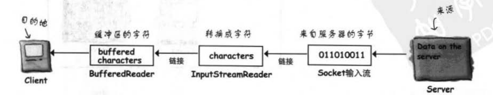
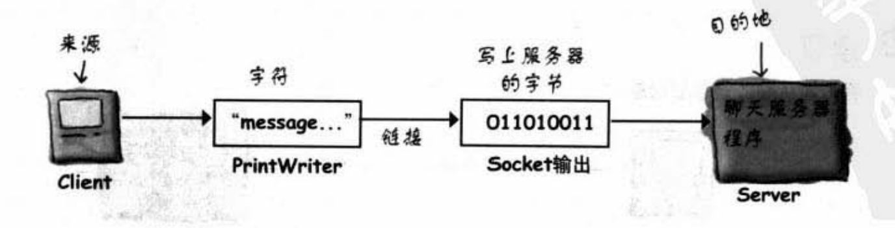

# socket

### 建立连接

```java
Socket scoket = new Socket("111.111.111.111", 8080); // IP地址  端口号
```

`Socket` 代表两台机器之间的网络连接的对象。

如果是已知的服务，比如邮件、网页等，则选择对应的端口号，否则端口号则可以设置在`1024~65535`之间。

### 数据传输

#### 读

从链接到的机器读数据。

用`InputStreamReader`从`Socket`连接中读取输入串流。

`InputStreamReader` 是低层输入串流的对象。

```java
InputStreamReader stream = new InputStreamReader(socket.getInputStream());
```

底层读取的输入串流再通过`BufferedReader`来读取

```java
try {
    Socket socket = new Socket("127.0.0.1", 8080);
    InputStreamReader streamReader = new InputStreamReader(socket.getInputStream());
    BufferedReader bufferedReader = new BufferedReader(streamReader);
    String message = bufferedReader.readLine();
}catch (Exception e) {
    e.printStackTrace();
}
```



#### 写

将数据发送到链接的机器。

```java
try {
    Socket socket = new Socket("127.0.0.1", 8080);
    PrintWriter writer = new PrintWriter(socket.getOutputStream());
    writer.print("message");
}catch (Exception e) {
    e.printStackTrace();
}
```

