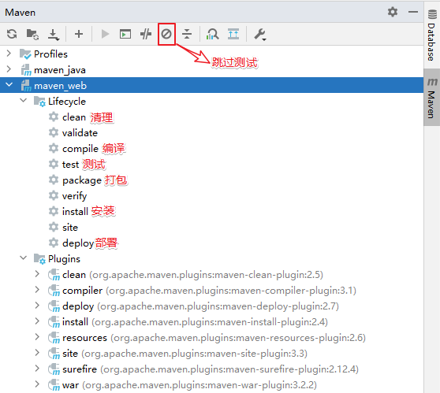
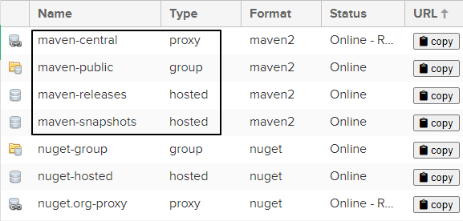
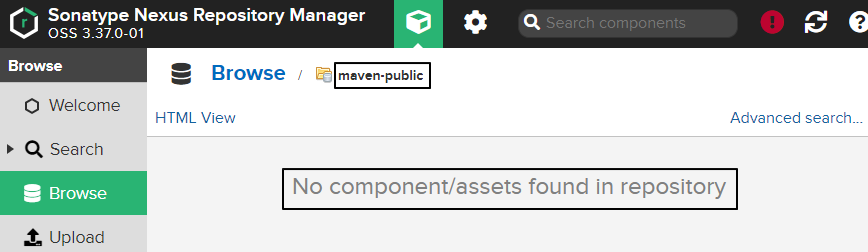
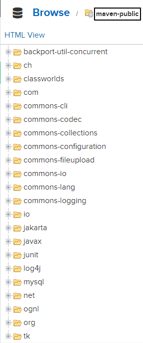
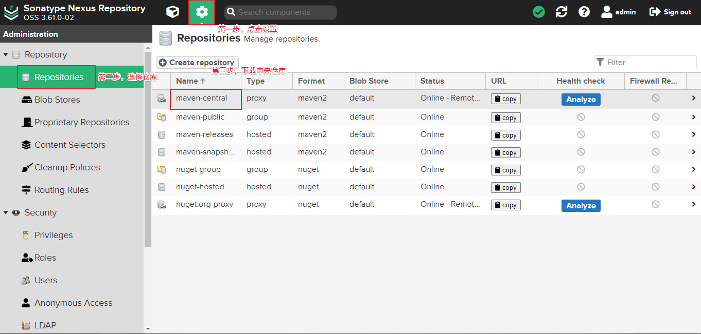
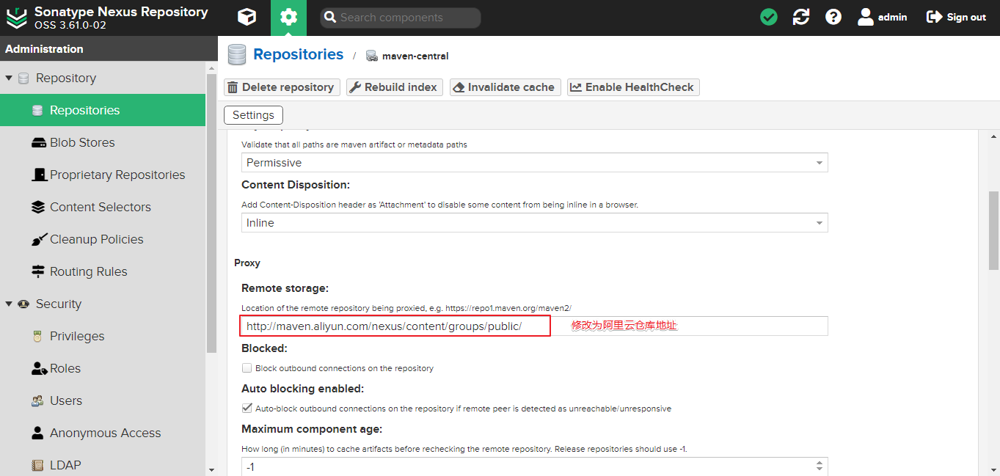

# Maven

## 简介

Maven是一个**依赖管理**工具，可以自动下载依赖对应的jar包并进行管理，方便快捷。

Maven是一个**构建工具**。项目构建是指将源代码、配置文件、资源文件等转化为能够运行或部署的应用程序或库的过程。`Maven` 可以管理项目的编译、测试、打包、部署等构建过程。通过实现标准的构建生命周期，Maven 可以确保每一个构建过程都遵循同样的规则和最佳实践。同时，Maven 的插件机制也使得开发者可以对构建过程进行扩展和定制。主动触发构建，只需要简单的命令操作即可。

## GAVP

`GAVP` 是指 GroupId、ArtifactId、Version、Packaging 等四个属性的缩写，其中前三个是必要的， Packaging 属性为可选项。用于依赖标识。

`GroupID`格式：

- com.{公司/BU }.业务线.\[子业务线]，最多 4 级。
- 示例：com.taobao.tddl 或 com.alibaba.sourcing.multilang；

`ArtifactID`格式：

- 产品线名-模块名。**语义不重复不遗漏**；

- 示例：tc-client / uic-api / tair-tool / bookstore


`Version`版本号格式：主版本号.次版本号.修订号

- 主版本号：当做了**不兼容的 API 修改**，或者**增加了能改变产品方向的新功能**。

- 次版本号：当做了**向下兼容的功能性新增**（新增类、接口等）。
- 修订号：**修复 bug**，没有修改方法签名的功能加强，保持 API 兼容性。

- 示例：1.0.0  修改bug → 1.0.1  功能调整 → 1.1.1等


`Packaging`定义规则：

- 指示将项目打包为什么类型的文件，idea根据packaging值，识别maven项目类型！


​	packaging 属性为 jar（默认值），代表普通的Java工程，打包以后是.jar结尾的文件。

​	packaging 属性为 war，代表Java的web工程，打包以后.war结尾的文件。

​	packaging 属性为 pom，代表不会打包，用来做继承的父工程。

## 创建项目

### 构建Maven JavaSE工程


### 构建Maven Java Web工程

1、先创建一个maven的javase工程。

2、然后修改pom.xml文件打包方式：

```xml
    <groupId>org.example</groupId>
    <artifactId>maven</artifactId>
    <version>1.0-SNAPSHOT</version>
    <packaging>war</packaging>
```

因为**Java**程序的打包方式为`jar`，**web**程序的打包方式为`war`。

3、设置web资源路径和web.xml路径：


创建web.xml文件：


如图：


只有webapp文件夹**出现蓝点**才表示创建成功。

步骤3可以用插件实现：


### Maven工程项目结构

```
|-- pom.xml                               # Maven 项目管理文件 
|-- src
    |-- main                              # 项目主要代码
    |   |-- java                          # Java 源代码目录
    |   |   `-- com/example/myapp         # 开发者代码主目录
    |   |       |-- controller            # 存放 Controller 层代码的目录
    |   |       |-- service               # 存放 Service 层代码的目录
    |   |       |-- dao                   # 存放 DAO 层代码的目录
    |   |       `-- model                 # 存放数据模型的目录
    |   |-- resources                     # 资源目录，存放配置文件、静态资源等
    |   |   |-- log4j.properties          # 日志配置文件
    |   |   |-- spring-mybatis.xml        # Spring Mybatis 配置文件
    |   |   `-- static                    # 存放静态资源的目录
    |   |       |-- css                   # 存放 CSS 文件的目录
    |   |       |-- js                    # 存放 JavaScript 文件的目录
    |   |       `-- images                # 存放图片资源的目录
    |   `-- webapp                        # 存放 WEB 相关配置和资源
    |       |-- WEB-INF                   # 存放 WEB 应用配置文件
    |       |   |-- web.xml               # Web 应用的部署描述文件
    |       |   `-- classes               # 存放编译后的 class 文件
    |       `-- index.html                # Web 应用入口页面
    `-- test                              # 项目测试代码
        |-- java                          # 单元测试目录
        `-- resources                     # 测试资源目录
```

-   pom.xml：Maven 项目管理文件，用于描述项目的依赖和构建配置等信息。
-   src/main/java：存放项目的 Java 源代码。
-   src/main/resources：存放项目的资源文件，如配置文件、静态资源等。
-   src/main/webapp/WEB-INF：存放 Web 应用的配置文件。
-   src/main/webapp/index.jsp：Web 应用的入口页面。
-   src/test/java：存放项目的测试代码。
-   src/test/resources：存放测试相关的资源文件，如测试配置文件等。

## 构建项目

**项目构建**是指将源代码、依赖库和资源文件等转换成可执行或可部署的应用程序的过程，在这个过程中包括编译源代码、链接依赖库、打包和部署等多个步骤。


### 命令方式项目构建

| 命令        | 描述                           |
| ----------- | ------------------------------ |
| mvn compile | 编译项目，**生成target文件**   |
| mvn package | 打包项目，**生成jar或war文件** |
| mvn clean   | **清理**编译或打包后的项目结构 |
| mvn install | 打包后上传到maven本地仓库      |
| mvn deploy  | 只打包，上传到maven私服仓库    |
| mvn site    | 生成站点                       |
| mvn test    | 执行测试源码                   |

war包打包插件和jdk版本不匹配：pom.xml 添加以下代码即可：

```xml
<build>
    <!-- jdk17 和 war包版本插件不匹配 -->
    <plugins>
        <plugin>
            <groupId>org.apache.maven.plugins</groupId>
            <artifactId>maven-war-plugin</artifactId>
            <version>3.2.2</version>
        </plugin>
    </plugins>
</build>
```

也可用一下方式：



**注意**：打包（package）和安装（install）的区别：

- **打包**是将工程打成jar或war文件，保存在target目录下；

- **安装**是将当前工程所生成的jar或war文件，安装到本地仓库，会按照坐标保存到指定位置；

### 声明周期

**构建生命周期**

当执行`package`命令也会自动执行`compile`命令：这种行为就是因为构建生命周期产生的！构建生命周期可以理解成是**一组固定构建命令的有序集合**，触发周期后的命令，会自动触发周期前的命令。

**构建周期作用：会简化构建过程**。

例如：项目打包   mvn clean package即可。对项目编译生成文件进行清理，然后进行打包。

**默认周期**：定义了**真正构件时所需要执行的所有步骤**，它是生命周期中最核心的部分。包含命令：

```
compile -  test - package - install - deploy
```

## 依赖管理

通过定义 **`pom.xml`** 文件，Maven 能够自动解析项目的依赖关系，并通过 Maven **仓库自动**下载和管理依赖，从而避免了手动下载和管理依赖的繁琐工作和可能引发的版本冲突问题。

### pom.xml文件

```xml
<!-- 模型版本 -->
<modelVersion>4.0.0</modelVersion>
<!-- 公司或者组织的唯一标志，并且配置时生成的路径也是由此生成， 如com.companyname.project-group，maven会将该项目打成的jar包放本地路径：/com/companyname/project-group -->
<groupId>com.companyname.project-group</groupId>
<!-- 项目的唯一ID，一个groupId下面可能多个项目，就是靠artifactId来区分的 -->
<artifactId>project</artifactId>
<!-- 版本号 -->
<version>1.0.0</version>

<!--打包方式
    默认：jar
    jar：普通的java项目打包方式！ 项目打成jar包！
    war：web项目打包方式！项目打成war包！
    pom：不会将项目打包！这个项目作为父工程，被其他工程聚合或者继承！
-->
<packaging>jar/pom/war</packaging>
```

### 依赖管理配置

在pom.xml文件中添加依赖：

```xml
<!-- 
   通过编写依赖jar包的 g a v 必要属性，引入第三方依赖！
   scope属性是可选的，可以指定依赖生效范围！索
 -->
<dependencies>
    <!-- 引入具体的依赖包 -->
    <dependency>
        <groupId>log4j</groupId>
        <artifactId>log4j</artifactId>
        <version>1.2.17</version>
        <!-- 依赖范围 -->
        <scope>runtime</scope>
    </dependency>
</dependencies>
```

依赖信息查询方式：

- maven仓库信息官网 https://mvnrepository.com/；
- mavensearch插件搜；

**依赖版本统一提取和维护**

先在`properties`标签中声明，然后在引入依赖时调用：

```xml
<!--声明版本-->
<properties>
  <!--命名随便,内部制定版本号即可！-->
  <junit.version>4.12</junit.version>
  <!-- 也可以通过 maven规定的固定的key，配置maven的参数！如下配置编码格式！-->
  <project.build.sourceEncoding>UTF-8</project.build.sourceEncoding>
  <project.reporting.outputEncoding>UTF-8</project.reporting.outputEncoding>
</properties>

<dependencies>
  <dependency>
    <groupId>junit</groupId>
    <artifactId>junit</artifactId>
    <!--引用properties声明版本 -->
    <version>${junit.version}</version>
  </dependency>
</dependencies>
```

### 依赖范围

设置**坐标的依赖范围(scope)**，可以设置对应jar包的作用范围：编译环境、测试环境、运行环境

| 依赖范围     | 描述                                                         |
| ------------ | ------------------------------------------------------------ |
| **compile**  | 编译依赖范围，scope 元素的缺省值（默认值）。使用此依赖范围的 Maven 依赖，对于**三种环境均有效**，即该 Maven 依赖在上述三种环境 均会被引入。例如，log4j 在编译、测试、运行过程都是必须的。 |
| **test**     | 测试依赖范围。使用此依赖范围的 Maven 依赖，**只对测试**有效。例如，Junit 依赖只有在测试阶段才需要。 |
| **provided** | 已提供依赖范围。使用此依赖范围的 Maven 依赖，只对**编译和测试**有效。例如，servlet-api 依赖对于编译、测试阶段而言是需要的，但是运行阶段，由于外部容器已经提供，故不需要 Maven 重复引入该依赖。 |
| runtime      | 运行时依赖范围。使用此依赖范围的 Maven 依赖，只**对测试、运行有效**。例如，JDBC 驱动实现依赖，其在编译时只需 JDK 提供的 JDBC 接口即可，只有测试、运行阶段才需要实现了 JDBC 接口的驱动。 |
| system       | 系统依赖范围，其效果与 provided 的依赖范围一致。其用于添加非 Maven 仓库的本地依赖，通过依赖元素 dependency 中的 systemPath 元素指定本地依赖的路径。鉴于使用其会导致项目的可移植性降低，一般不推荐使用。 |
| import       | 导入依赖范围，该依赖范围只能与 dependencyManagement 元素配合使用，其功能是将目标 pom.xml 文件中 dependencyManagement 的配置导入合并到当前 pom.xml 的 dependencyManagement 中。 |

## Maven工程Build构建配置

**项目构建**是指将源代码、依赖库和资源文件等转换成可执行或可部署的应用程序的过程，在这个过程中包括编译源代码、链接依赖库、打包和部署等多个步骤。

默认情况下，构建不需要额外配置，都有对应的缺省配置。

**定义打包名称**

```xml
<build>
  <finalName>定义打包名称</finalName>
</build>  
```

默认的打包名称：artifactid+verson.打包方式。

**指定打包文件**

如果在java文件夹中添加**java类**，会**自动打包编译到**classes文件夹下！

但是在java文件夹中添加**xml文件**，默认**不会被打包**！

默认情况下，按照maven工程结构放置的文件会默认被编译和打包！

除此之外，我们可以使用`resources`标签，**指定要打包资源的文件夹要把哪些静态资源打包到 classes根目录下。**

应用场景：mybatis中有时会将用于编写SQL语句的映射文件和mapper接口都写在src/main/java下的某个包中，此时映射文件就不会被打包，如何解决：

```xml
<build>
    <!--设置要打包的资源位置-->
    <resources>
        <resource>
            <!--设置资源所在目录-->
            <directory>src/main/java</directory>
            <includes>
                <!--设置包含的资源类型-->
                <include>**/*.xml</include>
            </includes>
        </resource>
    </resources>
</build>
```

**配置依赖插件**

dependencies标签下引入开发需要的jar包！我们可以在build/plugins/plugin标签引入插件。

常用的插件：修改jdk版本、tomcat插件、mybatis分页插件、mybatis逆向工程插件等等。

```xml
<build>
  <plugins>
      <!-- java编译插件，配jdk的编译版本 -->
      <plugin>
        <groupId>org.apache.maven.plugins</groupId>
        <artifactId>maven-compiler-plugin</artifactId>
        <configuration>
          <source>1.8</source>
          <target>1.8</target>
          <encoding>UTF-8</encoding>
        </configuration>
      </plugin>
      <!-- tomcat插件 -->
      <plugin>
        <groupId>org.apache.tomcat.maven</groupId>
        <artifactId>tomcat7-maven-plugin</artifactId>
         <version>2.2</version>
          <configuration>
          <port>8090</port>
          <path>/</path>
          <uriEncoding>UTF-8</uriEncoding>
          <server>tomcat7</server>
        </configuration>
      </plugin>
    </plugins>
</build>
```

## Maven依赖传递和依赖冲突

### Maven依赖传递特性

**概念**

假如有Maven项目A，项目B依赖A，项目C依赖B。那么我们可以说 C依赖A。也就是说，依赖的关系为：C—>B—>A， 那么我们执行项目C时，会自动把B、A都下载导入到C项目的jar包文件夹中，这就是**依赖的传递性。**

**作用**

-   简化依赖导入过程；
-   确保依赖版本正确；

**传递的原则**

在 A 依赖 B，B 依赖 C 的前提下，C 是否能够传递到 A，取决于 B 依赖 C 时使用的依赖范围以及配置

- B 依赖 C 时使用 **compile** 范围：**可以**传递

- B 依赖 C 时使用 **test 或 provided** 范围：**不能传递**，所以需要这样的 jar 包时，就必须在需要的地方明确配置依赖才可以。

- B 依赖 C 时，若配置了以下标签，则不能传递：

    ```xml
    <dependency>
        <groupId>com.alibaba</groupId>
        <artifactId>druid</artifactId>
        <version>1.2.15</version>
        <optional>true</optional>
    </dependency>
    ```

**依赖传递终止**的情况：

-   **非compile范围**进行依赖传递；
-   **使用optional配置**终止传递；
-   依赖冲突（传递的依赖已经存在）；

### Maven依赖冲突特性

当直接引用或者间接引用出现了相同的jar包，这时一个项目就会出现相同的重复jar包，即产生了冲突。依赖冲突避免出现重复依赖，并且终止依赖传递。


**解决依赖冲突（如何选择重复依赖）方式：**

1. 自动选择原则（maven自动选择）

    - **短路优先原则**（第**一**原则）

        A—>B—>C—>D—>E—>X(version 0.0.1)

        A—>F—>X(version 0.0.2)

        则选择version 0.0.2的A依赖于X(version 0.0.2)。

    - **依赖路径长度相同情况下，则“先声明优先”**（第**二**原则）

        A—>E—>X(version 0.0.1)

        A—>F—>X(version 0.0.2)

        在\<depencies>\</depencies>中，**先声明的，路径相同，会优先选择！**

2. 手动排除

    使用`exclusions`和`exclusion`标签。

    ```xml
    <dependency>
      <groupId>com.atguigu.maven</groupId>
      <artifactId>pro01-maven-java</artifactId>
      <version>1.0-SNAPSHOT</version>
      <scope>compile</scope>
      <!-- 使用excludes标签配置依赖的排除  -->
      <exclusions>
        <!-- 在exclude标签中配置一个具体的排除 -->
        <exclusion>
          <!-- 指定要排除的依赖的坐标（不需要写version） -->
          <groupId>commons-logging</groupId>
          <artifactId>commons-logging</artifactId>
        </exclusion>
      </exclusions>
    </dependency>
    ```

    

## Maven工程继承和聚合关系

### Maven工程继承关系

#### **继承概念**

**Maven 继承**是指在 Maven 的项目中，让**一个项目从另一个项目中继承配置信息的机制**。继承可以让我们在多个项目中共享同一配置信息，简化项目的管理和维护工作。

#### **继承作用**

在**父工程中统一管理**项目中的依赖信息。

#### **继承语法**

- 父工程：

    ```xml
      <groupId>com.atguigu.maven</groupId>
      <artifactId>pro03-maven-parent</artifactId>
      <version>1.0-SNAPSHOT</version>
      <!-- 当前工程作为父工程，它要去管理子工程，所以打包方式必须是 pom -->
      <packaging>pom</packaging>
    ```

- 子工程：

    ```xml
    <!-- 使用parent标签指定当前工程的父工程 -->
    <parent>
      <!-- 父工程的坐标 -->
      <groupId>com.atguigu.maven</groupId>
      <artifactId>pro03-maven-parent</artifactId>
      <version>1.0-SNAPSHOT</version>
    </parent>
    
    <!-- 子工程的坐标 -->
    <!-- 如果子工程坐标中的groupId和version与父工程一致，那么可以省略 -->
    <!-- <groupId>com.atguigu.maven</groupId> -->
    <artifactId>pro04-maven-module</artifactId>
    <!-- <version>1.0-SNAPSHOT</version> -->
    ```

#### 父工程依赖统一管理

在父工程声明版本，子工程中引用版本，无序在指明版本。

父：

```xml
<!-- 使用dependencyManagement标签配置对依赖的管理 -->
<!-- 被管理的依赖并没有真正被引入到工程 -->
<dependencyManagement>
  <dependencies>
    <dependency>
      <groupId>org.springframework</groupId>
      <artifactId>spring-core</artifactId>
      <version>6.0.10</version>
    </dependency>
    <dependency>
      <groupId>org.springframework</groupId>
      <artifactId>spring-beans</artifactId>
      <version>6.0.10</version>
    </dependency>
    <dependency>
      <groupId>org.springframework</groupId>
      <artifactId>spring-context</artifactId>
      <version>6.0.10</version>
    </dependency>
    <dependency>
      <groupId>org.springframework</groupId>
      <artifactId>spring-expression</artifactId>
      <version>6.0.10</version>
    </dependency>
    <dependency>
      <groupId>org.springframework</groupId>
      <artifactId>spring-aop</artifactId>
      <version>6.0.10</version>
    </dependency>
  </dependencies>
</dependencyManagement>
```

子：

```xml
<!-- 子工程引用父工程中的依赖信息时，可以把版本号去掉。  -->
<!-- 把版本号去掉就表示子工程中这个依赖的版本由父工程决定。 -->
<!-- 具体来说是由父工程的dependencyManagement来决定。 -->
<dependencies>
  <dependency>
    <groupId>org.springframework</groupId>
    <artifactId>spring-core</artifactId>
  </dependency>
  <dependency>
    <groupId>org.springframework</groupId>
    <artifactId>spring-beans</artifactId>
  </dependency>
  <dependency>
    <groupId>org.springframework</groupId>
    <artifactId>spring-context</artifactId>
  </dependency>
  <dependency>
    <groupId>org.springframework</groupId>
    <artifactId>spring-expression</artifactId>
  </dependency>
  <dependency>
    <groupId>org.springframework</groupId>
    <artifactId>spring-aop</artifactId>
  </dependency>
</dependencies>
```

### Maven工程聚合关系

**聚合概念**

**Maven 聚合**是指将多个项目组织到一个父级项目中，以便一起构建和管理的机制。聚合可以帮助我们更好地管理一组相关的子项目，同时简化它们的构建和部署过程。

**聚合作用**

1.  管理多个子项目：通过聚合，可以将多个子项目组织在一起，方便管理和维护。
2.  构建和发布一组相关的项目：通过聚合，可以在一个命令中构建和发布多个相关的项目，简化了部署和维护工作。
3.  优化构建顺序：通过聚合，可以对多个项目进行顺序控制，避免出现构建依赖混乱导致构建失败的情况。
4.  统一管理依赖项：通过聚合，可以在父项目中管理公共依赖项和插件，避免重复定义。

**聚合语法**

父项目中包含的子项目列表。

```xml
<project>
  <groupId>com.example</groupId>
  <artifactId>parent-project</artifactId>
  <packaging>pom</packaging>
  <version>1.0.0</version>
  <modules>
    <module>child-project1</module>
    <module>child-project2</module>
  </modules>
</project>
```

**聚合演示**

通过触发父工程构建命令、引发所有子模块构建。

## Maven私服

### 简介

Maven 私服是一种特殊的Maven远程仓库，它是架设在局域网内（公网）的仓库服务，用来代理位于外部的远程仓库（中央仓库、其他远程公共仓库）。

建立了 Maven 私服后，当局域网内的用户需要某个构件时，会按照如下顺序进行请求和下载：

1. `请求本地仓库`，若**本地仓库不存在**所需构件，则跳转到第 2 步；
2. `请求 Maven 私服`，将所需构件下载到本地仓库，若**私服中不存在**所需构件，则跳转到第 3 步。
3. `请求外部的远程仓库`，将所需构件下载并缓存到 Maven 私服，若外部远程仓库不存在所需构件，则 Maven 直接报错。

**Maven私服的优势**

1. 节省外网带宽。
    消除对外部远程仓库的大量重复请求（会消耗很大量的带宽），降低外网带宽压力。

2. 下载速度更快。
    Maven私服位于局域网内，从私服下载构建更快更稳定。

3. 便于部署第三方构件。
    有些构件无法从任何一个远程仓库中获得（如：公司或组织内部的私有构件、Oracle的JDBC驱动等），建立私服之后，就可以将这些构件部署到私服中，供内部Maven项目使用。

4. 提高项目的稳定性，增强对项目的控制。
    如果不建立私服，那么Maven项目的构件就高度依赖外部的远程仓库，若外部网络不稳定，则项目的构建过程也会变得不稳定。建立私服后，即使外部网络状况不佳甚至中断，只要私服中已经缓存了所需的构件，Maven也能够正常运行。私服软件（如：Nexus）提供了很多控制功能（如：权限管理、RELEASE/SNAPSHOT版本控制等），可以对仓库进行一些更加高级的控制。

5. 降低中央仓库得负荷压力。
    由于私服会缓存中央仓库得构件，避免了很多对中央仓库的重复下载，降低了中央仓库的负荷。

**常见的Maven私服产品**

1. Apache的Archiva；
2. JFrog的Artifactory；
3. Sonatype的Nexus（[ˈneksəs]）（当前最流行、使用最广泛）；

### Nexus下载安装

下载地址：https://help.sonatype.com/repomanager3/product-information/download

解压，以管理员身份打开CMD，进入bin目录下，执行./nexus /run命令启动

访问 Nexus 首页：http://localhost:8081/，8081为默认端口号。

### 初始设置


这里参考提示：

- 用户名：admin
- 密码：查看 **E:\Server\nexus-3.61.0-02-win64\sonatype-work\nexus3\admin.password** 文件


继续执行初始化：


匿名登录，启用还是禁用？由于启用匿名登录后，后续操作比较简单，这里我们演示禁用匿名登录的操作：


初始化完毕：


### Nexus上的各种仓库



| 仓库类型 | 说明                                           |
| -------- | ---------------------------------------------- |
| proxy    | 某个远程仓库的代理                             |
| group    | 存放：通过 Nexus 获取的第三方 jar 包           |
| hosted   | 存放：本团队其他开发人员部署到 Nexus 的 jar 包 |

| 仓库名称        | 说明                                                         |
| --------------- | ------------------------------------------------------------ |
| maven-central   | Nexus 对 Maven 中央仓库的代理                                |
| maven-public    | Nexus 默认创建，供开发人员下载使用的组仓库                   |
| maven-releases  | Nexus 默认创建，供开发人员部署自己 jar 包的宿主仓库 要求 releases 版本 |
| maven-snapshots | Nexus 默认创建，供开发人员部署自己 jar 包的宿主仓库 要求 snapshots 版本 |

初始状态下，这几个仓库都没有内容：



### 通过 Nexus 下载 jar 包

修改本地maven的核心配置文件settings.xml，设置新的本地仓库地址

```xml
<!-- 配置一个新的 Maven 本地仓库 -->
<localRepository>D:/maven-repository-new</localRepository>
```

把我们原来配置阿里云仓库地址的 mirror 标签改成下面这样：

```xml
<mirror>
	<id>nexus-mine</id>
	<mirrorOf>central</mirrorOf>
	<name>Nexus mine</name>
	<url>http://localhost:8081/repository/maven-public/</url>
</mirror>
```

这里的 url 标签是这么来的：


把上图中看到的地址复制出来即可。如果我们在前面允许了匿名访问，到这里就够了。但如果我们禁用了匿名访问，那么接下来我们还要继续配置 settings.xml：

```xml
<server>
  <id>nexus-mine</id>
  <username>admin</username>
  <password>atguigu</password>
</server>
```

这里需要**格外注意**：server 标签内的 id 标签值必须和 mirror 标签中的 id 值一样。

找一个用到框架的 Maven 工程，执行命令：

```sh
mvn clean compile
```

下载过程日志：

> Downloading from nexus-mine: http://localhost:8081/repository/maven-public/com/jayway/jsonpath/json-path/2.4.0/json-path-2.4.0.pom
> Downloaded from nexus-mine: http://localhost:8081/repository/maven-public/com/jayway/jsonpath/json-path/2.4.0/json-path-2.4.0.pom (2.6 kB at 110 kB/s)
> Downloading from nexus-mine: http://localhost:8081/repository/maven-public/net/minidev/json-smart/2.3/json-smart-2.3.pom
> Downloaded from nexus-mine: http://localhost:8081/repository/maven-public/net/minidev/json-smart/2.3/json-smart-2.3.pom (9.0 kB at 376 kB/s)
> Downloading from nexus-mine: http://localhost:8081/repository/maven-public/net/minidev/minidev-parent/2.3/minidev-parent-2.3.pom
> Downloaded from nexus-mine: http://localhost:8081/repository/maven-public/net/minidev/minidev-parent/2.3/minidev-parent-2.3.pom (8.5 kB at 404 kB/s)
> Downloading from nexus-mine: http://localhost:8081/repository/maven-public/net/minidev/accessors-smart/1.2/accessors-smart-1.2.pom
> Downloaded from nexus-mine: http://localhost:8081/repository/maven-public/net/minidev/accessors-smart/1.2/accessors-smart-1.2.pom (12 kB at 463 kB/s)

下载后，Nexus 服务器上就有了 jar 包：



若下载速度太慢，可以设置私服中中央仓库的地址为阿里云仓库地址



修改为：http://maven.aliyun.com/nexus/content/groups/public/



### 将 jar 包部署到 Nexus

maven工程中配置：

```xml
<distributionManagement>
    <snapshotRepository>
        <id>nexus-mine</id>
        <name>Nexus Snapshot</name>
        <url>http://localhost:8081/repository/maven-snapshots/</url>
    </snapshotRepository>
</distributionManagement>
```

注意：这里 snapshotRepository 的 id 标签必须和 settings.xml 中指定的 mirror 标签的 id 属性一致。

执行部署命令：

```sh
mvn deploy
```

> Uploading to nexus-mine: http://localhost:8081/repository/maven-snapshots/com/atguigu/demo/demo07-redis-data-provider/1.0-SNAPSHOT/maven-metadata.xml
> Uploaded to nexus-mine: http://localhost:8081/repository/maven-snapshots/com/atguigu/demo/demo07-redis-data-provider/1.0-SNAPSHOT/maven-metadata.xml (786 B at 19 kB/s)
> Uploading to nexus-mine: http://localhost:8081/repository/maven-snapshots/com/atguigu/demo/demo07-redis-data-provider/maven-metadata.xml
> Uploaded to nexus-mine: http://localhost:8081/repository/maven-snapshots/com/atguigu/demo/demo07-redis-data-provider/maven-metadata.xml (300 B at 6.5 kB/s)
> [INFO] ------------------------------------------------------------------------
> [INFO] Reactor Summary:
> [INFO]
> [INFO] demo-imperial-court-ms-show 1.0-SNAPSHOT ........... SUCCESS [ 1.875 s]
> [INFO] demo09-base-entity ................................. SUCCESS [ 21.883 s]
> [INFO] demo10-base-util ................................... SUCCESS [ 0.324 s]
> [INFO] demo08-base-api .................................... SUCCESS [ 1.171 s]
> [INFO] demo01-imperial-court-gateway ...................... SUCCESS [ 0.403 s]
> [INFO] demo02-user-auth-center ............................ SUCCESS [ 2.932 s]
> [INFO] demo03-emp-manager-center .......................... SUCCESS [ 0.312 s]
> [INFO] demo04-memorials-manager-center .................... SUCCESS [ 0.362 s]
> [INFO] demo05-working-manager-center ...................... SUCCESS [ 0.371 s]
> [INFO] demo06-mysql-data-provider ......................... SUCCESS [ 6.779 s]
> [INFO] demo07-redis-data-provider 1.0-SNAPSHOT ............ SUCCESS [ 0.273 s]


### 引用别人部署的 jar 包

maven工程中配置：

```xml
<repositories>
    <repository>
        <id>nexus-mine</id>
        <name>nexus-mine</name>
        <url>http://localhost:8081/repository/maven-snapshots/</url>
        <snapshots>
            <enabled>true</enabled>
        </snapshots>
        <releases>
            <enabled>true</enabled>
        </releases>
    </repository>
</repositories>
```

## Maven综合案例

分模块开发。

父模块设置：

- 管理依赖版本：`dependencyManagement`标签；
- 设置子模块打包插件等：`build`；

```xml
<?xml version="1.0" encoding="UTF-8"?>
<project xmlns="http://maven.apache.org/POM/4.0.0"
         xmlns:xsi="http://www.w3.org/2001/XMLSchema-instance"
         xsi:schemaLocation="http://maven.apache.org/POM/4.0.0 http://maven.apache.org/xsd/maven-4.0.0.xsd">
    <modelVersion>4.0.0</modelVersion>

    <groupId>com.atguigu</groupId>
    <artifactId>micro-shop</artifactId>
    <version>1.0-SNAPSHOT</version>
    <!--知识点：父工程的打包方式为pom-->
    <packaging>pom</packaging>

    <properties>
        <spring.version>6.0.6</spring.version>
        <jackson.version>2.15.0</jackson.version>
        <commons.version>2.11.0</commons.version>
        <junit.version>5.9.2</junit.version>
        <maven.compiler.source>17</maven.compiler.source>
        <maven.compiler.target>17</maven.compiler.target>
        <project.build.sourceEncoding>UTF-8</project.build.sourceEncoding>
    </properties>

    <!-- 依赖管理 -->
    <dependencyManagement>
        <dependencies>
            <!-- spring-context会依赖传递core/beans -->
            <dependency>
                <groupId>org.springframework</groupId>
                <artifactId>spring-context</artifactId>
                <version>${spring.version}</version>
            </dependency>

            <!-- jackson-databind会依赖传递core/annotations -->
            <dependency>
                <groupId>com.fasterxml.jackson.core</groupId>
                <artifactId>jackson-databind</artifactId>
                <version>${jackson.version}</version>
            </dependency>

            <!-- commons-io -->
            <dependency>
                <groupId>commons-io</groupId>
                <artifactId>commons-io</artifactId>
                <version>${commons.version}</version>
            </dependency>

            <!-- https://mvnrepository.com/artifact/org.junit.jupiter/junit-jupiter-api -->
            <dependency>
                <groupId>org.junit.jupiter</groupId>
                <artifactId>junit-jupiter-api</artifactId>
                <version>${junit.version}</version>
                <scope>test</scope>
            </dependency>

        </dependencies>
    </dependencyManagement>

    <!-- 统一更新子工程打包插件-->
    <build>
        <!-- jdk17 和 war包版本插件不匹配 -->
        <plugins>
            <plugin>
                <groupId>org.apache.maven.plugins</groupId>
                <artifactId>maven-war-plugin</artifactId>
                <version>3.2.2</version>
            </plugin>
        </plugins>
    </build>

</project>
```

子模块开发：

- 使用父模块设置的依赖版本；


```xml
<?xml version="1.0" encoding="UTF-8"?>
<project xmlns="http://maven.apache.org/POM/4.0.0"
         xmlns:xsi="http://www.w3.org/2001/XMLSchema-instance"
         xsi:schemaLocation="http://maven.apache.org/POM/4.0.0 http://maven.apache.org/xsd/maven-4.0.0.xsd">
    <parent>
        <artifactId>micro-shop</artifactId>
        <groupId>com.atguigu</groupId>
        <version>1.0-SNAPSHOT</version>
    </parent>
    <modelVersion>4.0.0</modelVersion>

    <artifactId>common-service</artifactId>
    <!--知识点：打包方式默认就是jar，因此可以省略-->
    <packaging>jar</packaging>
<!-- 或者war-->
    <properties>
        <maven.compiler.source>17</maven.compiler.source>
        <maven.compiler.target>17</maven.compiler.target>
        <project.build.sourceEncoding>UTF-8</project.build.sourceEncoding>
    </properties>

    <dependencies>
        <!-- 配置spring-context，继承父工程版本，自动传递 core / beans -->
        <dependency>
            <groupId>org.springframework</groupId>
            <artifactId>spring-context</artifactId>
        </dependency>
        <!-- 配置jackson-databind，继承父工程版本，自动传递 core / annotations -->
        <dependency>
            <groupId>com.fasterxml.jackson.core</groupId>
            <artifactId>jackson-databind</artifactId>
        </dependency>
        <!-- 配置commons-io，继承父工程版本 -->
        <dependency>
            <groupId>commons-io</groupId>
            <artifactId>commons-io</artifactId>
        </dependency>
        <!-- 配置junit，继承父工程版本 -->
        <dependency>
            <groupId>org.junit.jupiter</groupId>
            <artifactId>junit-jupiter-api</artifactId>
            <scope>test</scope>
        </dependency>
    </dependencies>

</project>
```

在父工程中查看是否成功聚合：

```xml
<modules>
    <module>common-service</module>
    <module>user-service</module>
    <module>order-service</module>
</modules>
```

