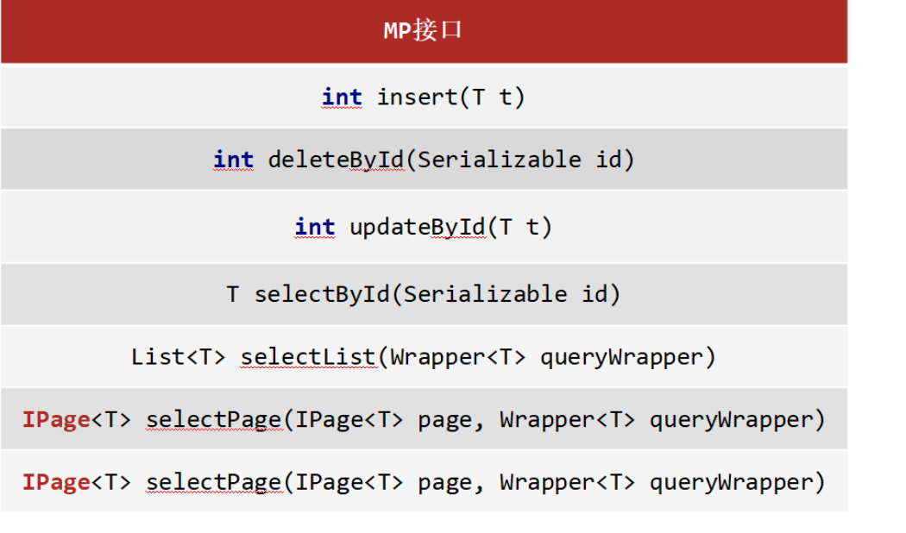
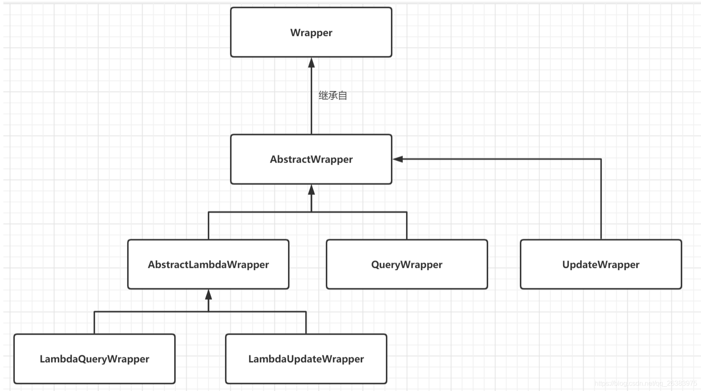

# MybatisPlus

## 简介

MybatisPlus(简称MP)，是基于MyBatis框架基础上开发的增强型工具，旨在简化开发、提供效率。 

### 特性

**无侵入**：只做增强不做改变，引入它不会对现有工程产生影响。

**损耗小**：启动即会自动注入基本CURD，性能基本无损耗，直接面向对象操作。

**强大的CRUD操作**：内置通用Mapper、通用Service，仅仅通过少量配置即可实现单表大部分CRUD操作，更有强大的条件构造器，满足各类使用需求。

**支持**Lambda形式调用：通过 Lambda 表达式，方便的编写各类查询条件，无需再担心字段写
错。

**支持主键自动生成**：支持多达4种主键策略（内含分布式唯一 ID 生成器 - Sequence），可自由配置，完美解决主键问题。

**支持**ActiveRecord模式：支持 ActiveRecord 形式调用，实体类只需继承 Model 类即可进行强大的 CRUD 操作。

**支持自定义全局通用操作**：支持全局通用方法注入（ Write once, use anywhere ）。

**内置代码生成器**：采用代码或者 Maven 插件可快速生成 Mapper 、 Model 、 Service 、 Controller 层代码，支持模板引擎，更有超多自定义配置等您来使用。

**内置分页插件**：基于 MyBatis 物理分页，开发者无需关心具体操作，配置好插件之后，写分页等同于普通 List 查询。

**分页插件支持多种数据库**：支持 MySQL、MariaDB、Oracle、DB2、H2、HSQL、SQLite、
Postgre、SQLServer 等多种数据库。

**内置性能分析插件**：可输出 Sql 语句以及其执行时间，建议开发测试时启用该功能，能快速揪出慢查询。

**内置全局拦截插件**：提供全表 delete 、 update 操作智能分析阻断，也可自定义拦截规则，预防误操作。

### 开发示例

1. 添加依赖

    mybatisplus依赖和druid依赖。

    ```xml
    <dependency>
    	<groupId>com.baomidou</groupId>
        <artifactId>mybatis-plus-boot-starter</artifactId>
        <version>最新版本</version>
    </dependency>
    
     <dependency>
         <groupId>com.alibaba</groupId>
         <artifactId>druid</artifactId>
         <version>1.2.16</version>
    </dependency>
    ```

2. 配置数据库连接信息

    ```properties
    mybatis.mapper-locations=classpath:mapper/*xml
    mybatis.type-aliases-package=com.mybatisplus.mybatis.entity
    
    spring.datasource.type: com.alibaba.druid.pool.DruidDataSource
    spring.datasource.driver-class-name: com.mysql.jdbc.Driver
    spring.datasource.url: jdbc:mysql://localhost:3306/people_information?serverTimezone=UTC
    spring.datasource.username: root
    spring.datasource.password: ******
    ```

    注意：不要用缩进的格式，容易出差。

3. 在 Spring Boot 启动类中添加 `@MapperScan` 注解，扫描 Mapper 文件夹：

    ```java
    @SpringBootApplication
    @MapperScan("com.mybatisplus.dao")
    public class MybatisPlusApplication {
        public static void main(String[] args) {
            SpringApplication.run(MybatisPlusApplication.class);
        }
    }
    
    ```

    **注意**：如果是Spring 项目：

    配置MapperScan

    ```xml
    <bean class="org.mybatis.spring.mapper.MapperScannerConfigurer">
        <property name="basePackage" value="com.baomidou.mybatisplus.samples.quickstart.mapper"/>
    </bean>
    
    ```

    调整 SqlSessionFactory 为 MyBatis-Plus 的 SqlSessionFactory

    ```xml
    <bean id="sqlSessionFactory" class="com.baomidou.mybatisplus.extension.spring.MybatisSqlSessionFactoryBean">
        <property name="dataSource" ref="dataSource"/>
    </bean>
    ```

    

4. 设计实体类：

    根据数据库表的属性设计对应的实体类。

5. 定义Mapper接口：

    ```java
    public interface UserMapper extends BaseMapper<User> {
    }
    ```

6. 测试

    ```java
    @SpringBootTest
    class MybatisPlusApplicationTests {
    
        @Autowired
        private UserMapper userMapper;
    
        @Test
        void contextLoads() {
            System.out.println("Test");
            List<User> list = userMapper.selectList(null);
            list.forEach(System.out::println);
        }
    
    }
    ```


### 注解

#### @TableName

作用：数据库表名的注解，标识实体类对应的数据库表；

使用位置：实体类；

示例：

```java
@TableName("sys_user")
public class User {
    private Long id;
    private String name;
    private Integer age;
    private String email;
}
```

**属性：**

| 属性             | 类型     | 必须指定 | 默认值 | 描述                                                         |
| :--------------- | :------- | :------- | :----- | :----------------------------------------------------------- |
| **value**        | String   | 否       | ""     | 表名                                                         |
| schema           | String   | 否       | ""     | schema                                                       |
| keepGlobalPrefix | boolean  | 否       | false  | 是否保持使用全局的 tablePrefix 的值（当全局 tablePrefix 生效时） |
| resultMap        | String   | 否       | ""     | xml 中 resultMap 的 id（用于满足特定类型的实体类对象绑定）   |
| autoResultMap    | boolean  | 否       | false  | 是否自动构建 resultMap 并使用（如果设置 resultMap 则不会进行 resultMap 的自动构建与注入） |
| excludeProperty  | String[] | 否       | {}     | 需要排除的属性名 @since 3.3.1                                |

#### @TableId

作用：标识**主键**；

使用位置：实体类主键字段；

示例：

```java
@TableName("sys_user")
public class User {
    @TableId(value = "id", type = IdType.AUTO)
    private Long id;
    private String name;
    private Integer age;
    private String email;
}
```

| 属性     | 类型   | 必须指定 | 默认值      | 描述                             |
| :------- | :----- | :------- | :---------- | :------------------------------- |
| value    | String | 否       | ""          | 主键字段名                       |
| **type** | Enum   | 否       | IdType.NONE | 指定主键类型（如下，主要是自增） |

##### IdType

| 值            | 描述                                                         |
| :------------ | :----------------------------------------------------------- |
| **AUTO**      | 数据库 ID 自增                                               |
| **NONE**      | 无状态，该类型为未设置主键类型（注解里等于跟随全局，全局里约等于 INPUT） |
| **INPUT**     | insert 前自行 set 主键值（此时需要关闭数据库的自增）         |
| ASSIGN_ID     | 分配 ID(主键类型为 Number(Long 和 Integer)或 String)(since 3.3.0),使用接口`IdentifierGenerator`的方法`nextId`(默认实现类为`DefaultIdentifierGenerator`雪花算法) |
| ASSIGN_UUID   | 分配 UUID,主键类型为 String(since 3.3.0),使用接口`IdentifierGenerator`的方法`nextUUID`(默认 default 方法) |
| ID_WORKER     | 分布式全局唯一 ID 长整型类型(please use `ASSIGN_ID`)         |
| UUID          | 32 位 UUID 字符串(please use `ASSIGN_UUID`)                  |
| ID_WORKER_STR | 分布式全局唯一 ID 字符串类型(please use `ASSIGN_ID`)         |

##### 全局配置

每一个实体类都要添加自增注解比较麻烦，可以在配置文件中添加全局配置：

```properties
mybatis-plus.global-config.db-config.id-type=AUTO
```

全局配置默认表名前缀：

```properties
mybatis-plus.global-config.db-config.table-prefix=tbl_
```

默认表名就是类名首字母小写对应的表名，设置后变成 `tbl_表名`。

#### @TableField

描述：字段注解（非主键）；

主要用来解决实体类的字段名与数据库中的字段名不匹配的问题。

```java
@TableName("sys_user")
public class User {
    @TableId
    private Long id;
    @TableField("username")
    private String name;
    private Integer age;
    private String email;
}
```

**属性**

| 属性             | 类型                         | 必须指定 | 默认值                   | 描述                                                         |
| :--------------- | :--------------------------- | :------- | :----------------------- | :----------------------------------------------------------- |
| **value**        | String                       | 否       | ""                       | 数据库字段名                                                 |
| **exist**        | boolean                      | 否       | true                     | 数据库表中是否有该字段                                       |
| condition        | String                       | 否       | ""                       | 字段 `where` 实体查询比较条件，有值设置则按设置的值为准，没有则为默认全局的 `%s=#{%s}`，[参考(opens new window)](https://github.com/baomidou/mybatis-plus/blob/3.0/mybatis-plus-annotation/src/main/java/com/baomidou/mybatisplus/annotation/SqlCondition.java) |
| update           | String                       | 否       | ""                       | 字段 `update set` 部分注入，例如：当在version字段上注解`update="%s+1"` 表示更新时会 `set version=version+1` （该属性优先级高于 `el` 属性） |
| insertStrategy   | Enum                         | 否       | FieldStrategy.DEFAULT    | 举例：NOT_NULL `insert into table_a(<if test="columnProperty != null">column</if>) values (<if test="columnProperty != null">#{columnProperty}</if>)` |
| updateStrategy   | Enum                         | 否       | FieldStrategy.DEFAULT    | 举例：IGNORED `update table_a set column=#{columnProperty}`  |
| whereStrategy    | Enum                         | 否       | FieldStrategy.DEFAULT    | 举例：NOT_EMPTY `where <if test="columnProperty != null and columnProperty!=''">column=#{columnProperty}</if>` |
| fill             | Enum                         | 否       | FieldFill.DEFAULT        | 字段自动填充策略                                             |
| **select**       | boolean                      | 否       | true                     | select 查询是否包含这个字段                                  |
| keepGlobalFormat | boolean                      | 否       | false                    | 是否保持使用全局的 format 进行处理                           |
| jdbcType         | JdbcType                     | 否       | JdbcType.UNDEFINED       | JDBC 类型 (该默认值不代表会按照该值生效)                     |
| typeHandler      | Class<? extends TypeHandler> | 否       | UnknownTypeHandler.class | 类型处理器 (该默认值不代表会按照该值生效)                    |
| numericScale     | String                       | 否       | ""                       | 指定小数点后保留的位数                                       |

**注意**：`numericScale`只生效于 update 的 sql。`jdbcType`和`typeHandler`如果不配合`@TableName#autoResultMap = true`一起使用,也只生效于 update 的 sql. 对于`typeHandler`如果你的字段类型和 set 进去的类型为`equals`关系,则只需要让你的`typeHandler`让 Mybatis 加载到即可,不需要使用注解。

##### FieldStrategy

| 值                | 描述                                                        |
| :---------------- | :---------------------------------------------------------- |
| IGNORED（已弃用） | 忽略判断，效果等同于"ALWAYS"                                |
| ALWAYS            | 总是加入SQL，无论字段值是否为NULL                           |
| NOT_NULL          | 非 NULL 判断                                                |
| NOT_EMPTY         | 非空判断(只对字符串类型字段,其他类型字段依然为非 NULL 判断) |
| DEFAULT           | 追随全局配置                                                |
| NEVER             | 不加入SQL                                                   |

##### FieldFill

| 值            | 描述                 |
| :------------ | :------------------- |
| DEFAULT       | 默认不处理           |
| INSERT        | 插入时填充字段       |
| UPDATE        | 更新时填充字段       |
| INSERT_UPDATE | 插入和更新时填充字段 |

#### @Version

描述：乐观锁注解、标记 `@Version` 在字段上

#### @EnumValue

描述：普通枚举类注解(注解在枚举字段上)

#### @TableLogic

描述：表字段逻辑处理注解（逻辑删除）

| 属性   | 类型   | 必须指定 | 默认值 | 描述         |
| :----- | :----- | :------- | :----- | :----------- |
| value  | String | 否       | ""     | 逻辑未删除值 |
| delval | String | 否       | ""     | 逻辑删除值   |

#### @SqlParser

> see [@InterceptorIgnore](https://baomidou.com/pages/223848/#InterceptorIgnore)

#### @KeySequence

- 描述：序列主键策略 `oracle`
- 属性：value、dbType

| 属性   | 类型   | 必须指定 | 默认值       | 描述                                                         |
| :----- | :----- | :------- | :----------- | :----------------------------------------------------------- |
| value  | String | 否       | ""           | 序列名                                                       |
| dbType | Enum   | 否       | DbType.OTHER | 数据库类型，未配置默认使用注入 IKeyGenerator 实现，多个实现必须指定 |

#### @InterceptorIgnore

- `value` 值为 `1` | `yes` | `on` 视为忽略，例如 `@InterceptorIgnore(tenantLine = "1")`
- `value` 值为 `0` | `false` | `off` | `空值不变` 视为正常执行。

> see [插件主体](https://baomidou.com/pages/2976a3/)

#### @OrderBy

描述：内置 SQL 默认指定排序，**优先级低于 wrapper 条件查询**。

| 属性 | 类型    | 必须指定 | 默认值          | 描述           |
| :--- | :------ | :------- | :-------------- | :------------- |
| asc  | boolean | 否       | true            | 是否倒序查询   |
| sort | short   | 否       | Short.MAX_VALUE | 数字越小越靠前 |

## CRUD接口

###  Service CRUD 接口

- 通用 Service CRUD 封装 `IService` 接口，进一步封装 CRUD 采用 `get 查询单行` `remove 删除` `list 查询集合` `page 分页` 前缀命名方式区分 `Mapper` 层避免混淆；
- 泛型 `T` 为任意实体对象；
- 建议如果存在自定义通用 Service 方法的可能，请创建自己的 `IBaseService` 继承 `Mybatis-Plus` 提供的基类；
- 对象 `Wrapper` 为 `条件构造器`；

#### Save——增

```java
// 插入一条记录（选择字段，策略插入）
boolean save(T entity);
// 插入（批量）
boolean saveBatch(Collection<T> entityList);
// 插入（批量）
boolean saveBatch(Collection<T> entityList, int batchSize);
```

**参数说明**

|     类型      |   参数名   |     描述     |
| :-----------: | :--------: | :----------: |
|       T       |   entity   |   实体对象   |
| Collection<T> | entityList | 实体对象集合 |
|      int      | batchSize  | 插入批次数量 |

#### SaveOrUpdate

```java
// TableId 注解存在更新记录，否插入一条记录
boolean saveOrUpdate(T entity);
// 根据updateWrapper尝试更新，否继续执行saveOrUpdate(T)方法
boolean saveOrUpdate(T entity, Wrapper<T> updateWrapper);
// 批量修改插入
boolean saveOrUpdateBatch(Collection<T> entityList);
// 批量修改插入
boolean saveOrUpdateBatch(Collection<T> entityList, int batchSize);
```

**参数说明**

|     类型      |    参数名     |               描述               |
| :-----------: | :-----------: | :------------------------------: |
|       T       |    entity     |             实体对象             |
|  Wrapper<T>   | updateWrapper | 实体对象封装操作类 UpdateWrapper |
| Collection<T> |  entityList   |           实体对象集合           |
|      int      |   batchSize   |           插入批次数量           |

#### Remove

```java
// 根据 queryWrapper 设置的条件，删除记录
boolean remove(Wrapper<T> queryWrapper);
// 根据 ID 删除
boolean removeById(Serializable id);
// 根据 columnMap 条件，删除记录
boolean removeByMap(Map<String, Object> columnMap);
// 删除（根据ID 批量删除）
boolean removeByIds(Collection<? extends Serializable> idList);
```

**参数说明**

|                类型                |    参数名    |          描述           |
| :--------------------------------: | :----------: | :---------------------: |
|             Wrapper<T>             | queryWrapper | 实体包装类 QueryWrapper |
|            Serializable            |      id      |         主键 ID         |
|        Map<String, Object>         |  columnMap   |     表字段 map 对象     |
| Collection<? extends Serializable> |    idList    |      主键 ID 列表       |

#### Update

```java
// 根据 UpdateWrapper 条件，更新记录 需要设置sqlset
boolean update(Wrapper<T> updateWrapper);
// 根据 whereWrapper 条件，更新记录
boolean update(T updateEntity, Wrapper<T> whereWrapper);
// 根据 ID 选择修改
boolean updateById(T entity);
// 根据ID 批量更新
boolean updateBatchById(Collection<T> entityList);
// 根据ID 批量更新
boolean updateBatchById(Collection<T> entityList, int batchSize);
```

**参数说明**

|     类型      |    参数名     |               描述               |
| :-----------: | :-----------: | :------------------------------: |
|  Wrapper<T>   | updateWrapper | 实体对象封装操作类 UpdateWrapper |
|       T       |    entity     |             实体对象             |
| Collection<T> |  entityList   |           实体对象集合           |
|      int      |   batchSize   |           更新批次数量           |

#### Get

```java
// 根据 ID 查询
T getById(Serializable id);
// 根据 Wrapper，查询一条记录。结果集，如果是多个会抛出异常，随机取一条加上限制条件 wrapper.last("LIMIT 1")
T getOne(Wrapper<T> queryWrapper);
// 根据 Wrapper，查询一条记录
T getOne(Wrapper<T> queryWrapper, boolean throwEx);
// 根据 Wrapper，查询一条记录
Map<String, Object> getMap(Wrapper<T> queryWrapper);
// 根据 Wrapper，查询一条记录
<V> V getObj(Wrapper<T> queryWrapper, Function<? super Object, V> mapper);
```

**参数说明**

|            类型             |    参数名    |              描述               |
| :-------------------------: | :----------: | :-----------------------------: |
|        Serializable         |      id      |             主键 ID             |
|         Wrapper<T>          | queryWrapper | 实体对象封装操作类 QueryWrapper |
|           boolean           |   throwEx    |   有多个 result 是否抛出异常    |
|              T              |    entity    |            实体对象             |
| Function<? super Object, V> |    mapper    |            转换函数             |

#### List

```java
// 查询所有
List<T> list();
// 查询列表
List<T> list(Wrapper<T> queryWrapper);
// 查询（根据ID 批量查询）
Collection<T> listByIds(Collection<? extends Serializable> idList);
// 查询（根据 columnMap 条件）
Collection<T> listByMap(Map<String, Object> columnMap);
// 查询所有列表
List<Map<String, Object>> listMaps();
// 查询列表
List<Map<String, Object>> listMaps(Wrapper<T> queryWrapper);
// 查询全部记录
List<Object> listObjs();
// 查询全部记录
<V> List<V> listObjs(Function<? super Object, V> mapper);
// 根据 Wrapper 条件，查询全部记录
List<Object> listObjs(Wrapper<T> queryWrapper);
// 根据 Wrapper 条件，查询全部记录
<V> List<V> listObjs(Wrapper<T> queryWrapper, Function<? super Object, V> mapper);
```

**参数说明**

|                类型                |    参数名    |              描述               |
| :--------------------------------: | :----------: | :-----------------------------: |
|             Wrapper<T>             | queryWrapper | 实体对象封装操作类 QueryWrapper |
| Collection<? extends Serializable> |    idList    |          主键 ID 列表           |
|        Map<String, Object>         |  columnMap   |         表字段 map 对象         |
|    Function<? super Object, V>     |    mapper    |            转换函数             |

#### Page

```java
// 无条件分页查询
IPage<T> page(IPage<T> page);
// 条件分页查询
IPage<T> page(IPage<T> page, Wrapper<T> queryWrapper);
// 无条件分页查询
IPage<Map<String, Object>> pageMaps(IPage<T> page);
// 条件分页查询
IPage<Map<String, Object>> pageMaps(IPage<T> page, Wrapper<T> queryWrapper);
```

**参数说明**

|    类型    |    参数名    |              描述               |
| :--------: | :----------: | :-----------------------------: |
|  IPage<T>  |     page     |            翻页对象             |
| Wrapper<T> | queryWrapper | 实体对象封装操作类 QueryWrapper |

#### Count

```java
// 查询总记录数
int count();
// 根据 Wrapper 条件，查询总记录数
int count(Wrapper<T> queryWrapper);
```

**参数说明**

|    类型    |    参数名    |              描述               |
| :--------: | :----------: | :-----------------------------: |
| Wrapper<T> | queryWrapper | 实体对象封装操作类 QueryWrapper |

#### Chain

**链式**。

##### query

```java
// 链式查询 普通
QueryChainWrapper<T> query();
// 链式查询 lambda 式。注意：不支持 Kotlin
LambdaQueryChainWrapper<T> lambdaQuery();

// 示例：
query().eq("column", value).one();
lambdaQuery().eq(Entity::getId, value).list();
```

##### update

```java
// 链式更改 普通
UpdateChainWrapper<T> update();
// 链式更改 lambda 式。注意：不支持 Kotlin
LambdaUpdateChainWrapper<T> lambdaUpdate();

// 示例：
update().eq("column", value).remove();
lambdaUpdate().eq(Entity::getId, value).update(entity);
```

### Mapper CRUD 接口

- 通用 CRUD 封装 `BaseMapper` 接口，为 `Mybatis-Plus` 启动时自动解析实体表关系映射转换为 `Mybatis` 内部对象注入容器；
- 泛型 `T` 为任意实体对象；
- 参数 `Serializable` 为任意类型主键 `Mybatis-Plus` 不推荐使用复合主键约定每一张表都有自己的唯一 `id` 主键
- 对象 `Wrapper` 为 `条件构造器`；

#### Insert

```java
// 插入一条记录
int insert(T entity);
```

**参数说明**

| 类型 | 参数名 |   描述   |
| :--: | :----: | :------: |
|  T   | entity | 实体对象 |

**返回结果**

数据插入成功返回1，失败返回0。

#### Delete

```java
// 根据 ID 删除
int deleteById(Serializable id);
/**String和Number是Serializable的子类，Number又是Float,Double,Integer等类的父类，能作为主键的数据类型都已经是Serializable的子类，MP使用Serializable作为参数类型，就好比我们可以用Object接收任何数据类型一样
*/

// 根据 entity 条件，删除记录
int delete(@Param(Constants.WRAPPER) Wrapper<T> wrapper);
// 删除（根据ID 批量删除，传入list）
int deleteBatchIds(@Param(Constants.COLLECTION) Collection<? extends Serializable> idList);
// 根据 columnMap 条件，删除记录
int deleteByMap(@Param(Constants.COLUMN_MAP) Map<String, Object> columnMap);
```

**参数说明**

|                类型                |  参数名   |                 描述                 |
| :--------------------------------: | :-------: | :----------------------------------: |
|             Wrapper<T>             |  wrapper  |  实体对象封装操作类（可以为 null）   |
| Collection<? extends Serializable> |  idList   | 主键 ID 列表(不能为 null 以及 empty) |
|            Serializable            |    id     |               主键 ID                |
|        Map<String, Object>         | columnMap |           表字段 map 对象            |

**结果说明**

数据删除成功返回1，未删除数据返回0。

#### Update

```java
// 根据 ID 修改
int updateById(@Param(Constants.ENTITY) T entity);

// 根据 whereWrapper 条件，更新记录
int update(@Param(Constants.ENTITY) T updateEntity, @Param(Constants.WRAPPER) Wrapper<T> whereWrapper);
```

**注意**：在调用`updateById`方法前，需要在`T entity`（对应的实体类）中的主键属性上加上`@TableId`注解。

**返回说明**：修改成功后返回1，未修改数据返回0。

**参数说明**

|    类型    |    参数名     |                             描述                             |
| :--------: | :-----------: | :----------------------------------------------------------: |
|     T      |    entity     |               实体对象 (set 条件值,可为 null)                |
| Wrapper<T> | updateWrapper | 实体对象封装操作类（可以为 null,里面的 entity 用于生成 where 语句） |

#### Select

```java
// 根据 ID 查询
T selectById(Serializable id);
// 根据 entity 条件，查询全部记录
List<T> selectList(@Param(Constants.WRAPPER) Wrapper<T> queryWrapper);

// 根据 entity 条件，查询一条记录
T selectOne(@Param(Constants.WRAPPER) Wrapper<T> queryWrapper);

// 查询（根据ID 批量查询）
List<T> selectBatchIds(@Param(Constants.COLLECTION) Collection<? extends Serializable> idList);
// 查询（根据 columnMap 条件）
List<T> selectByMap(@Param(Constants.COLUMN_MAP) Map<String, Object> columnMap);
// 根据 Wrapper 条件，查询全部记录
List<Map<String, Object>> selectMaps(@Param(Constants.WRAPPER) Wrapper<T> queryWrapper);
// 根据 Wrapper 条件，查询全部记录。注意： 只返回第一个字段的值
List<Object> selectObjs(@Param(Constants.WRAPPER) Wrapper<T> queryWrapper);

// 根据 entity 条件，查询全部记录（并翻页）
IPage<T> selectPage(IPage<T> page, @Param(Constants.WRAPPER) Wrapper<T> queryWrapper);
// 根据 Wrapper 条件，查询全部记录（并翻页）
IPage<Map<String, Object>> selectMapsPage(IPage<T> page, @Param(Constants.WRAPPER) Wrapper<T> queryWrapper);
// 根据 Wrapper 条件，查询总记录数
Integer selectCount(@Param(Constants.WRAPPER) Wrapper<T> queryWrapper);
```

**参数说明**

|                类型                |    参数名    |                   描述                   |
| :--------------------------------: | :----------: | :--------------------------------------: |
|            Serializable            |      id      |                 主键 ID                  |
|             Wrapper<T>             | queryWrapper |    实体对象封装操作类（可以为 null）     |
| Collection<? extends Serializable> |    idList    |   主键 ID 列表(不能为 null 以及 empty)   |
|        Map<String, Object>         |  columnMap   |             表字段 map 对象              |
|              IPage<T>              |     page     | 分页查询条件（可以为 RowBounds.DEFAULT） |

查询条件为 `null` 的时候查询所有。

#### 总结



## Lombok

Lombok，一个Java类库，提供了一组注解，简化POJO实体类开发。

**依赖**

```xml
<dependency>
    <groupId>org.projectlombok</groupId>
    <artifactId>lombok</artifactId>
	<version>1.18.12</version>
</dependency>
```

**注意**：旧版本的 idea 还需要手动安装lombok插件。

### 注解

在实体类上添加注解。

`Lombok`常见的注解有: 

- `@Setter`：为模型类的属性提供setter方法；
- `@Getter`：为模型类的属性提供getter方法；
- `@ToString`：为模型类的属性提供toString方法；
- `@EqualsAndHashCode`：为模型类的属性提供equals和hashcode方法；
- `@Data`：**组合注解**，包含上面的注解的功能；
- `@NoArgsConstructor`：提供一个无参构造函数；
- `@AllArgsConstructor`：提供一个包含所有参数的构造函数；

如果需要使用部分属性的构造函数，可以添加无参或者有参的注解后，再手动添加部分属性的构造函数：

```java
@Data
@AllArgsConstructor
@NoArgsConstructor
public class User {
    private Long id;
    private String name;
    private String password;
    private Integer age;
    private String tel;
    public User(String name, String password) {
        this.name = name;
        this.password = password;
    }
}
```

## 分页

`IPage selectPage(IPage page, Wrapper queryWrapper)`

说明：

- `IPage`：用来构建分页查询条件；
- `Wrapper`：用来构建条件查询的条件，无条件则传递 `null`；
- `IPage`：返回值；

`IPage`是一个**接口**，构建它需要使用它的实现类`Page`。

**实现**

```java
//1 创建IPage分页对象,设置分页参数,1为当前页码，3为每页显示的记录数
IPage<User> page=new Page<>(1,3);
//2 执行分页查询
userDao.selectPage(page,null);
```

**设置分页拦截器**

mybatis-plus实现分页的时候必须设置分页拦截器，因为mybatis-plus要对查询语句进行拦截，然后根据不同的数据库修改查询的sql语句，返回正确的分页结果。

```java
@Configuration
public class MybatisPlusConfig {
    @Bean
    public MybatisPlusInterceptor mybatisPlusInterceptor(){
        //1 创建MybatisPlusInterceptor拦截器对象
        MybatisPlusInterceptor mpInterceptor=new MybatisPlusInterceptor();
        //2 添加分页拦截器
        mpInterceptor.addInnerInterceptor(new PaginationInnerInterceptor());
        return mpInterceptor;
    }
}
```

## 查询

### 条件查询

使用`QueryWrapper`。

`QueryWrapper`是实现查询的对象封装操作类，**可以封装sql对象，包括where条件，order by排序，select哪些字段等等**。



`Wrapper`：条件构造抽象类，最顶端父类；

`AbstractWrapper`：用于查询条件封装，生成sql的where条件；

`AbstractLambdaWrapper`：Lambda语法使用Wrapper统一处理解析lambda获取column。

`LambdaQueryWrapper`：用于lambda语法使用的查询Wrapper；

`LambdaUpdateWrapper`:Lambda更新封装Wrapper;

`QueryWrapper`:Entity对象封装操作类，不是用lambda；

`UpdateWrapper`:Update条件封装，用于Entity对象更新操作。

**示例**

1. 直接使用`QueryWrapper`。

```java
    @Test
    void contextLoads() {
        QueryWrapper queryWrapper = new QueryWrapper();
        queryWrapper.eq("name", "apple");
        List<User> list = userMapper.selectList(queryWrapper);
        list.forEach(System.out::println);
    }
```

**常见匹配条件**

`eq`-->等于；`lt`-->小于；`gt`-->大于；`lte`-->小于等于；`ge`-->大于等于；`between`-->between ？ and ？；

`like()`--> `%s%`； `likeLeft()`--> `%s` `likeRight`-->  `s%`。

2. **QueryWrapper的基础上使用lambda**

```java
void testGetAll() {
    QueryWrapper<User> qw = new QueryWrapper<User>();
    qw.lambda().lt(User::getAge, 10);//添加条件
    List<User> userList = userDao.selectList(qw);
    System.out.println(userList);
}

```

`User::getAget`,为lambda表达式中的，类名::方法名。

3. LambdaQueryWrapper

```java
void testGetAll() {
    LambdaQueryWrapper<User> lqw = new LambdaQueryWrapper<User>();
    lqw.lt(User::getAge, 10);
    List<User> userList = userDao.selectList(lqw);
    System.out.println(userList);
}
```

### 多条件构建

直接根据需求添加多个条件即可。示例：

```java
void testGetAll() {
    LambdaQueryWrapper<User> lqw = new LambdaQueryWrapper<User>();
    lqw.lt(User::getAge, 30);
    lqw.gt(User::getAge, 10);
    List<User> userList = userDao.selectList(lqw);
    System.out.println(userList);
}
```

查到的是年龄在 10 到 30 之间的。

**链式编程**

```java
void testGetAll() {
    LambdaQueryWrapper<User> lqw = new LambdaQueryWrapper<User>();
    lqw.lt(User::getAge, 30).gt(User::getAge, 10);
    List<User> userList = userDao.selectList(lqw);
    System.out.println(userList);
}
```

**或--or()**

相当于sql语句中的 `or` 关键字,不加默认是 `and`。

```java
void testGetAll() {
    LambdaQueryWrapper<User> lqw = new LambdaQueryWrapper<User>();
    lqw.gt(User::getAge, 30).or().lt(User::getAge, 10);
    List<User> userList = userDao.selectList(lqw);
    System.out.println(userList);
}
```

年龄大于 30 或者小于 10。

### null判定

当查询有多个条件的时候，我们**只需要值非空的条件**，所以需要先判断哪些条件的值是`null`。

使用 `LambdaQueryWrapper`。

```java
void testGetAll() {
    LambdaQueryWrapper<User> lqw = new LambdaQueryWrapper<User>();
    string val1, val2;
    lqw.lt(null!=val1, User::getAge, val1);
    lqw.gt(null!=val2, User::getAge, val2);
    List<User> userList = userDao.selectList(lqw);
    System.out.println(userList);
}
```

### 查询投影

只查询指定的列。

使用`LambdaQueryWrapper`：

```java
void testGetAll() {
    LambdaQueryWrapper<User> lqw = new LambdaQueryWrapper<User>();
    lqw.select(User::getId,User::getName,User::getAge);
    List<User> userList = userDao.selectList(lqw);
}

```

手动设置列：

```java
void testGetAll() {
    QueryWrapper<User> lqw = new QueryWrapper<User>();
    lqw.select("id","name","age","tel");
    List<User> userList = userDao.selectList(lqw);
}
```

### 聚合查询

```java
QueryWrapper<User> lqw = new QueryWrapper<User>();

//lqw.select("count(*) as count");
//SELECT count(*) as count FROM user

//lqw.select("max(age) as maxAge");
//SELECT max(age) as maxAge FROM user

//lqw.select("min(age) as minAge");
//SELECT min(age) as minAge FROM user

//lqw.select("sum(age) as sumAge");
//SELECT sum(age) as sumAge FROM user

lqw.select("avg(age) as avgAge");
//SELECT avg(age) as avgAge FROM user
List<Map<String, Object>> userList = userDao.selectMaps(lqw);
```

### 分组查询

`group by`

```java
void testGetAll() {
    QueryWrapper<User> lqw = new QueryWrapper<User>();
    lqw.select("count(*) as count,tel");
    lqw.groupBy("tel");
    List<Map<String, Object>> list = userDao.selectMaps(lqw);
    System.out.println(list);
}
```

等价于：

```sql
SELECT count(*) as count,tel FROM user GROUP BY tel
```

**注意**：聚合与分组查询，无法使用lambda表达式来完成。

### 排序查询

`orderBy`，有三个参数：

- `condition`：当condition为true，进行排序，如果为false，则不排；
- `isAsc`:是否为升序，true为升序，false为降序；
- `columns`：需要操作的列；

```java
void testGetAll(){
    LambdaQueryWrapper<User> lwq = new LambdaQueryWrapper<>();
    lwq.orderBy(true, false, User::getId);
    userDao.selectList(lw
}

```

`orderByAsc/Desc(单个column)`：按照指定字段进行升序/降序；

`orderByAsc/Desc(多个column)`：按照多个字段进行升序/降序；

`orderByAsc/Desc`

- condition:条件，true添加排序，false不添加排序；
- 多个columns：按照多个字段进行排序；

### 映射匹配兼容性

1. **表和实体类属性不一一对应**（名字不一样）

使用 `@TableField` 注解：

```java
@TableField(value="username")
private String name;
```

2. **实体类的属性在表中不存在**

当实体类中多了一个数据库表不存在的字段，就会导致生成的sql语句中在select的时候查询了数据库不存在的字段，程序运行就会报错。

解决办法：使用 `@TableField` 注解将数据库中不存在的列设置为`false`，生成sql语句的时候就不会查询该字段。

```java
@TableField(exist=false)
private String name;
```

3. **只查询指定字段**

默认是查询数据库表中所有字段，通过 `@TableField` 的`select`属性，设置某些字段不查询。

```java
@TableField(select=false)
private String name;
```

4. **表名匹配**

```java
@TableName(value="数据库表名")
```

## 删除

**物理删除**：业务数据从数据库中丢弃，执行的是delete操作；

**逻辑删除**：为数据设置是否可用状态字段，删除时设置状态字段为不可用状态，数据保留在数据库中，执行的是update操作；

有些时候数据不能删，只能标记为废弃（不可用）状态，需要使用逻辑删除。

**实现**：

为数据库添加一个`deleted`列，`0` 代表正常，`1` 代表删除。

用注解 `@TableLogic` 表名该属性是逻辑删除字段。

```java
// value为正常数据的值  delval 为已删除数据的值 
@TableLogic(value="0",delval="1") 
private Integer deleted;
```

这样执行删除操作的时候，就会将删除的数据的 `deleted` 字段标为 `delval` 值。（实际上执行的update操作）

**注意**

设置了逻辑删除后，查询操作查询的就是逻辑上没删除的数据（即`deleted`字段为`value`值的数据），如果想查询所有记录。需要自己重新写sql语句。

**配置全局逻辑属性**

```properties
# 逻辑删除字段名，与数据库和实体类对应
mybatis-plus.global-config.db-config.logic-delete-field=deleted
# 逻辑删除字面值：未删除为0
mybatis-plus.global-config.db-config.logic-not-delete-value=0
# 逻辑删除字面值：删除为1
mybatis-plus.global-config.db-config.logic-delete-value=1
```

## 乐观锁

解决并发问题。

当要更新一条记录的时候，希望这条记录没有被别人更新。

**乐观锁实现方式**：

1. 取出记录时，获取当前 version；
2. 更新时，带上这个 version；
3. 执行更新时， set version = newVersion where version = oldVersion；
4. 如果 version 不对，就更新失败；

**乐观锁配置需要两步**：

1. 添加拦截器；

    xml配置文件：

    ```properties
    <bean class="com.baomidou.mybatisplus.extension.plugins.inner.OptimisticLockerInnerInterceptor" id="optimisticLockerInnerInterceptor"/>
    
    <bean id="mybatisPlusInterceptor" class="com.baomidou.mybatisplus.extension.plugins.MybatisPlusInterceptor">
        <property name="interceptors">
            <list>
                <ref bean="optimisticLockerInnerInterceptor"/>
            </list>
        </property>
    </bean>
    ```

    spring boot注解：

    ```java
    @Bean
    public MybatisPlusInterceptor mybatisPlusInterceptor() {
        MybatisPlusInterceptor interceptor = new MybatisPlusInterceptor();
        interceptor.addInnerInterceptor(new OptimisticLockerInnerInterceptor());
        return interceptor;
    }
    ```

    

2. 属性上加 `@Version` 注解；

    ```java
    @Version
    private Integer version;
    ```

    **注意**：

    **支持的数据类型只有:int,Integer,long,Long,Date,Timestamp,LocalDateTime**；

    整数类型下 `newVersion = oldVersion + 1；`

    ``newVersion` 会回写到 `entity` 中；

    仅支持 `updateById(id)` 与 `update(entity, wrapper)` 方法；

    **在 `update(entity, wrapper)` 方法下, `wrapper` 不能复用!!!**

    

```java
// Spring Boot 方式
@Configuration
@MapperScan("按需修改")
public class MybatisPlusConfig {
    /**
     * 旧版
     */
    @Bean
    public OptimisticLockerInterceptor optimisticLockerInterceptor() {
        return new OptimisticLockerInterceptor();
    }

    /**
     * 新版
     */
    @Bean
    public MybatisPlusInterceptor mybatisPlusInterceptor() {
        MybatisPlusInterceptor mybatisPlusInterceptor = new MybatisPlusInterceptor();
        mybatisPlusInterceptor.addInnerInterceptor(new OptimisticLockerInnerInterceptor());
        return mybatisPlusInterceptor;
    }
}
```

## 

依赖

```xml
<!--用低版本的-->
<dependency>
    <groupId>com.baomidou</groupId>
    <artifactId>mybatis-plus-generator</artifactId>
    <version>3.3.0</version>
</dependency>

<!--velocity模板引擎-->
<dependency>
    <groupId>org.apache.velocity</groupId>
    <artifactId>velocity-engine-core</artifactId>
    <version>2.3</version>
</dependency>
```

代码生成器类

```java
public class CodeGenerator {
    public static void main(String[] args) {
        //1.获取代码生成器的对象
        AutoGenerator autoGenerator = new AutoGenerator();
        //设置数据库相关配置
        DataSourceConfig dataSource = new DataSourceConfig();
        dataSource.setDriverName("com.mysql.jdbc.Driver");
        dataSource.setUrl("jdbc:mysql://localhost:3306/mybatisplus_db?serverTimezone=UTC");
        dataSource.setUsername("root");
        dataSource.setPassword("root");
        autoGenerator.setDataSource(dataSource);
        //设置全局配置
        GlobalConfig globalConfig = new GlobalConfig();
        //设置代码生成位置
globalConfig.setOutputDir(System.getProperty("user.dir")+"/mybatisplus/src/main/java");     
        globalConfig.setOpen(false); //设置生成完毕后是否打开生成代码所在的目录
        globalConfig.setAuthor("apple"); //设置作者
        globalConfig.setFileOverride(true); //设置是否覆盖原始生成的文件
        globalConfig.setMapperName("%sDao"); //设置数据层接口名，%s为占位符，指代模块名称
        globalConfig.setIdType(IdType.AUTO); //设置Id生成策略
        autoGenerator.setGlobalConfig(globalConfig);
        //设置包名相关配置
        PackageConfig packageInfo = new PackageConfig();
        packageInfo.setParent("com.aaa"); //设置生成的包名，与代码所在位置不冲突，二者叠加组成完整路径
        packageInfo.setEntity("domain"); //设置实体类包名
        packageInfo.setMapper("dao"); //设置数据层包名
        autoGenerator.setPackageInfo(packageInfo);
        
        //策略设置
        StrategyConfig strategyConfig = new StrategyConfig();
        strategyConfig.setInclude("tbl_user"); //设置当前参与生成的表名，参数为可变参数
        strategyConfig.setTablePrefix("tbl_"); //设置数据库表的前缀名称，模块名 =数据库表名 - 前缀名 例如： User = tbl_user - tbl_
        strategyConfig.setRestControllerStyle(true); //设置是否启用Rest风格
        strategyConfig.setVersionFieldName("version"); //设置乐观锁字段名
        strategyConfig.setLogicDeleteFieldName("deleted"); //设置逻辑删除字段名
        strategyConfig.setEntityLombokModel(true); //设置是否启用lombok
        autoGenerator.setStrategy(strategyConfig);
        //2.执行生成操作
        autoGenerator.execute();
    }
}
```

