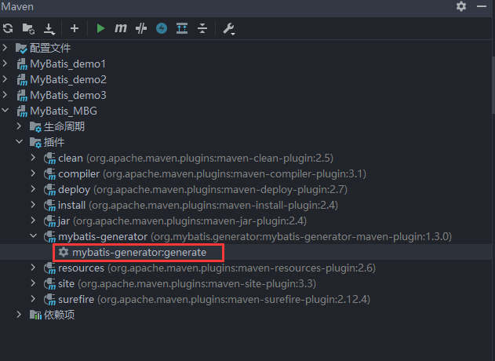

**MyBatis特性**

1. MyBatis 是支持**定制化SQL**、**存储过程以及高级映射**的优秀的持久层框架；
2. MyBatis 避免了几乎所有的 JDBC 代码和手动设置参数以及获取结果集；
3. MyBatis可以使用简单的XML或注解用于配置和原始映射，将接口和Java的POJO（Plain Old Java Objects，普通的Java对象）映射成数据库中的记录；
4. MyBatis 是一个半自动的ORM（Object Relation Mapping）框架；

简单来说，Mybatis 是简单完成程序和数据库交互的工具，也就是一个**数据库工具**，让我们更简单的操作和读取数据库。

mybatis主要做了什么：

- 声明接口 + 实现接口。

- 声明接口：就是接口用来进行方法的声明。

- 实现接口：xml或者注解的方式。

小tip：解决idea右键无法创建xml文件的问题。

依次点击：`File`->`settings`->`Editor`->`File and Code Template`，点击 ➕ 创建xml文件模板：

```xml
<?xml version="1.0" encoding="UTF-8" ?>
<!DOCTYPE mapper
        PUBLIC "-//mybatis.org//DTD Mapper 3.0//EN"
        "http://mybatis.org/dtd/mybatis-3-mapper.dtd">
<mapper namespace="">
    
</mapper>
```

注意：这里创建的是mapper的xml文件，如果是配置xml文件，需要将mapper改为configuration。如下：

```xml
<?xml version="1.0" encoding="UTF-8" ?>
<!DOCTYPE configuration
        PUBLIC "-//mybatis.org//DTD Config 3.0//EN"
        "http://mybatis.org/dtd/mybatis-3-config.dtd">
<configuration>
</configuration>
```

## 搭建MyBatis

### 创建配置文件

创建配置文件mybatis-config.xml，类似于spring的配置类。

说明：主要用于设置连接数据的配置信息。

```xml
<?xml version="1.0" encoding="UTF-8" ?>
<!DOCTYPE configuration
        PUBLIC "-//mybatis.org//DTD Config 3.0//EN"
        "http://mybatis.org/dtd/mybatis-3-config.dtd">
<configuration>
    <environments default="development">
        <environment id="development">
            <transactionManager type="JDBC" />
            <dataSource type="POOLED">
                <property name="driver" value="com.mysql.cj.jdbc.Driver"/>
                <property name="url" value="jdbc:mysql: /localhost:3306/information_people" />
                <property name="username" value="root" />
                <property name="password" value="123456" />
            </dataSource>
        </environment>
    </environments>
</configuration>
```

**注意**：配置文件中的标签必须**按照固定的顺序**(有的可以不写，但顺序一定不能乱)：properties、settings、typeAliases、typeHandlers、objectFactory、objectWrapperFactory、reflectorFactory、plugins、environments、databaseIdProvider、mappers。

```xml
<configuration>
    <properties></properties>
    <settings></settings>
    <typeAliases></typeAliases>
    <typeHandlers></typeHandlers>
    <objectFactory></objectFactory>
    <objectWrapperFactory></objectWrapperFactory>
    <reflectorFactory></reflectorFactory>
    <plugins></plugins>
    <environments></environments>
    <databaseIdProvider></databaseIdProvider>
    <mappers></mappers>
</configuration>
```

**数据库连接相关**

1. **驱动类**：driver-class-name

**MySQL 5**版本使用jdbc5驱动，驱动类使用：`com.mysql.jdbc.Driver`；

**MySQL 8**版本使用jdbc8驱动，驱动类使用：`com.mysql.cj.jdbc.Driver`；

2. **链接地址url**

**MySQL 5**版本的url：`jdbc:mysql://localhost:3306/数据库名`

**MySQL 8**版本的url：`jdbc:mysql://localhost:3306/数据库名?serverTimezone=UTC`

否则运行测试用例报告如下错误：

java.sql.SQLException: The server time zone value ‘xxxx’ is unrecoginized or represents more

如果连接的数据库**没有设置编码的**，需要加上参数characterEncoding=utf-8。

mysql8版本中不需要设置编码的参数，因为mysql8编码中默认支持中文的。需要加入serverTimezone的参数。

### 创建mapper接口

即dao层，只有接口，不需要实现类。具体的实现有映射文件完成。

命名：`实体类名+Mapper.java`。

```java
public interface UserMapper {
    void insertUser(User user);
    void deleteUser(String id);
    void updateUser(User user);
    List<User> getUser();
}
```

### 映射文件

即mapper文件。

ORM（Object Relationship Mapping）对象关系映射：

- 对象：Java的实体类对象；

- 关系：关系型数据库；
- 映射：二者之间的对应关系；

#### **示例**

```xml
<?xml version="1.0" encoding="UTF-8" ?>
<!DOCTYPE mapper
        PUBLIC "-//mybatis.org//DTD Mapper 3.0//EN"
        "http://mybatis.org/dtd/mybatis-3-mapper.dtd">
<mapper namespace="com.slensoft.mapper.IUserMapper" >
    <select id="selectUserById" resultType="com.pojo.User" parameterType="int">
      select * from User where id = #{id}
    </select>
</mapper>
```

#### 映射文件主要标签

- cache：该命名空间的缓存配置。

- cache-ref：引用其它命名空间的缓存配置。

- resultMap：描述如何从数据库结果集中加载对象。

- sql：可被其它语句引用的可重用语句块。示例：

    ```xml
    <sql id="sqlId">sql语句 </sql>
    ```

- insert：映射插入语句。

- update：映射更新语句。

- delete：映射删除语句。

- select：映射查询语句。

##### resultMap

建立实体类属性property与数据库字段column间的映射关系。可以解决Java类的属性名和列名不匹配的问题。

**示例**

```xml
    <resultMap id="userResultMap" type="User">
        <id property="id" column="user_id" />
        <result property="name" column="user_name"/>
        <result property="password" column="user_password"/>
        <result property="age" column="user_age"/>
        <result property="phone" column="user_phone"/>
        <result property="email" column="user_email"/>
    </resultMap>

```

调用resultMap的时候使用对应的id调用。

#### 示例说明

**<?xml>**：XML的声明，其中version属性是必须写的。

**<!DOCTYPE>**：是一种标准通用标记语言的文档类型声明，它的目的是要告诉标准通用标记语言解析器它应该使用什么样的文档类型定义（DTD）来解析文档（配置文件为Config，mapper文件mapper）。

**< mapper>**：其他标签的父标签。namespace属性：映射文件对应的接口**全限定路径**。

**映射文件的命名规则**

所对应的实体类的类名+Mapper.xml。

**存放位置**

src/main/resources/mapper目录下。

**注意**

1. 映射文件有两个地方应和dao层和实体层一致：

- dao层的mapper接口的**全类名**和映射文件的**命名空间** （namespace）保持一致；
- dao层的mapper接口中方法的**方法名**和映射文件中编写SQL语句的标签的**id属性**保持一致；

#### **增删改查**

##### 常规

```xml
<?xml version="1.0" encoding="UTF-8" ?>
<!DOCTYPE mapper
        PUBLIC "-//mybatis.org//DTD Mapper 3.0//EN"
        "http://mybatis.org/dtd/mybatis-3-mapper.dtd">
<mapper namespace="com.slensoft.mapper.IUserMapper" >
    <!--    插入-->
    <insert id="insertUser" parameterType="com.mybatis.entity.User">
        insert into user values ( , '${name}', #{age}, '${sex}')
    </insert>
    <!--    删除-->
    <delete id="deleteUser" parameterType="string">
        delete from user where id = #{id}
    </delete>
    <!--    修改-->
    <update id="updateUser" parameterType="com.mybatis.entity.User">
        update user set name = '${name}', age = ${age}, sex = #{sex}
        where id = #{id}
    </update>
    <!--    查询-->
    <select id="getUser" resultType="com.mybatis.entity.User">
        select * from user
    </select>
    <!--    根据id查询-->
    <select id="getUserById" parameterType="string" resultType="com.mybatis.entity.User">
        select * from user where id = #{id}
    </select>
    
</mapper>
```

1. 标签的常用属性：
    - `id`：接口中的方法名；
    - `parameterType`：传入的参数类型，可不写；
    - `resultType`：返回结果的类全限定名或别名；
    - `resultMap`：对外部 `resultMap` 的命名引用；
2. 查询标签`select`必须设置属性 `resultType` 或 `resultMap`，用于设置实体类和数据库表的映射关系，二者不能同时用。

- `resultType`：自动映射，用于**属性名和表中字段名**一致的情况；
- `resultMap`：自定义映射，用于一对多或多对一或字段名和属性名不一致的情况；

3. 当查询的数据为多条时，不能使用实体类作为返回值，只能使用集合，否则会抛出异常TooManyResultsException；但是若查询的数据**只有一条**，可以**使用实体类或集合Map**作为返回值，也可以在接口的方法上添加`@MapKey`注解；

4. 为实体类设置别名

    ```xml
        <typeAliases>
            <typeAlias alias="User" type="com.pojo.User"/>
        </typeAliases>
    ```

    设置别名后，就可以直接用别名，不需要再导入类全限定名。

##### 模糊查询
```xml
<select id="getUserByLike" resultType="User">	
	select * from t_user where username like "%"# {mohu}"%"
</select>
```

##### 批量删除

批量删除的时候传入多个参数只能使用 `${}`，如果使用`# {}`，则解析后的sql语句为`delete from t_user where id in ('1,2,3')`，这样是将 `1,2,3` 看做是一个整体，只有id为 `1,2,3` 的数据会被删除。正确的语句应该是 `delete from t_user where id in (1,2,3)`，或者`delete from t_user where id in ('1','2','3')`

```xml
    <delete id="deleteId">
        delete from accounts where id in (${ids})
    </delete>
```

传入参数格式为：`"25,26,27"`。

##### 传递表名

数据库的表名不能加单引号，所以只能使用 `$ {}`。

```xml
<!--List<User> getUserByTable(@Param("tableName") String tableName);-->
<select id="getUserByTable" resultType="User">
	select * from ${tableName}
</select>
```


#### 获取参数值的两种方式

MyBatis获取参数值的两种方式：`${ }`和`# { }`。

`${ }` 的本质就是**字符串拼接**，`# {}` 的本质就是**占位符**赋值.

`${}`使用字符串拼接的方式拼接sql，**若为字符串类型或日期类型的字段**进行赋值时，需要**手动**加单引号（因为sql语句中对于字符串或者日期类型需要加引号，数字不用）；

`# {}`使用占位符赋值的方式拼接sql，此时为字符串类型或日期类型的字段进行赋值时，可以**自动**添加单引号。

为了省事，直接用 `# {}`。

#### 传递多个参数

当mapper接口中的方法传递多个参数的时候，此时MyBatis会自动将这些参数放在一个map集合中，有两种格式：

- 以 `arg0, arg1` 为键，以参数为值；
- 以 `param1,param2` 为键，以参数为值；

**示例**

```xml
    <update id="updateUser" parameterType="com.mybatis.entity.User">
        update user set name = ${arg0}, age = ${arg1}, sex = #{arg2}
        where id = #{arg3}
    </update>
```

注意：arg命名从 `0` 开始：arg0、arg1。。。param命令从 `1` 开始：param0、param1、param2。。。

#### map集合类型的参数

- 若mapper接口中的方法需要的参数为多个时，此时可以手动创建map集合，将数据放在map中,只需要通过\${}和#{}访问map集合的键就可以获取相对应的值，注意${}需要手动加单引号；
- 实体类型参数也是，可以通过 `# {}` 或者 `${}`引用属性。

```xml
<select id="checkLoginByMap" resultType="User">
	select * from t_user where username = #{username} and password = #{password}
</select>
```

#### 使用@Param标识参数

在mapper接口的方法中用`@Param`注解指定参数名，然后在xml文件中根据指定的参数名读取对应的值。

```java
void deleteUser(@Param("userId") String id);
```

```xml
<delete id="deleteUser" parameterType="string">
    delete from user where id = # {userId}
</delete>
```

### 建立连接

有了各种文件（xml配置文件、mapper文件、dao层接口）后，就可以和数据库建立连接了。

#### 构建 SqlSessionFactory

每个基于 MyBatis 的应用都是以一个 SqlSessionFactory 的实例为核心的。

`SqlSessionFactory` 的实例可以通过 `SqlSessionFactoryBuilder` 获得。而 `SqlSessionFactoryBuilder` 则可以从 XML 配置文件或一个预先配置的 Configuration 实例来构建出 SqlSessionFactory 实例。

```java
String resource = "mybatis-config.xml";
InputStream inputStream = Resources.getResourceAsStream(resource);
SqlSessionFactory sqlSessionFactory = new SqlSessionFactoryBuilder().build(inputStream);
```

注意：`resource`变量表示xml配置文件的路径，需要具体设置。

#### 获取 SqlSession

构建SqlSessionFactory后，可以从中获得 SqlSession 的实例，SqlSession 提供了在数据库执行 SQL 命令所需的所有方法。可以通过 SqlSession 实例来直接执行已映射的 SQL 语句。

```java
//2.获取SqlSession对象，用它来执行sql
SqlSession sqlSession = sqlSessionFactory.openSession();
UserMapper userMapper = sqlSession.getMapper(UserMapper.class);
//3.执行sql
List<User> users = userMapper.getUser();
System.out.println(users.size());
```

### 作用域（Scope）和生命周期

#### SqlSessionFactoryBuilder

这个类可以被实例化、使用和丢弃，一旦创建了 SqlSessionFactory，就不再需要它了。因此 SqlSessionFactoryBuilder 实例的最佳作用域是方法作用域（也就是局部方法变量）。你可以重用 SqlSessionFactoryBuilder 来创建多个 SqlSessionFactory 实例，但最好还是不要一直保留着它，以保证所有的 XML 解析资源可以被释放给更重要的事情。

#### SqlSessionFactory

SqlSessionFactory 一旦被创建就**应该在应用的运行期间一直存在**，没有任何理由丢弃它或重新创建另一个实例。 使用 SqlSessionFactory 的最佳实践是在应用运行期间不要重复创建多次，多次重建 SqlSessionFactory 被视为一种代码“坏习惯”。因此 SqlSessionFactory 的最佳作用域是应用作用域。 有很多方法可以做到，最简单的就是使用**单例模式**或者**静态单例模式**。

#### SqlSession

每个线程都应该有它自己的 SqlSession 实例。SqlSession 的实例不是线程安全的，因此是不能被共享的，所以它的最佳的作用域是**请求或方法作用域**。 绝对不能将 SqlSession 实例的引用放在一个类的静态域，甚至一个类的实例变量也不行。 也绝不能将 SqlSession 实例的引用放在任何类型的托管作用域中，比如 Servlet 框架中的 HttpSession。 如果你现在正在使用一种 Web 框架，考虑将 SqlSession 放在一个和 HTTP 请求相似的作用域中。 换句话说，每次收到 HTTP 请求，就可以打开一个 SqlSession，返回一个响应后，就关闭它。 这个关闭操作很重要，为了确保每次都能执行关闭操作，你应该把这个关闭操作放到 finally 块中。 

#### 映射器实例

**映射器**是一些**绑定映射语句的接口**。映射器接口的实例是从 SqlSession 中获得的。虽然从技术层面上来讲，任何映射器实例的最大作用域与请求它们的 SqlSession 相同。但**方法作用域才是映射器实例的最合适的作用域。** 也就是说，映射器实例应该在调用它们的方法中被获取，使用完毕之后即可丢弃。 映射器实例并不需要被显式地关闭。

## XML配置文件

配置文档的顶层结构如下：

configuration（配置）

- properties（属性）；
- settings（设置）；
- typeAliases（类型别名）；
- typeHandlers（类型处理器）；
- objectFactory（对象工厂）；
- plugins（插件）；
- environments（环境配置）
    - environment（环境变量）
        - transactionManager（事务管理器）
        - dataSource（数据源）
- databaseIdProvider（数据库厂商标识）；
- mappers（映射器）；

必须按照上面的顺序写。

### 属性（properties）

通过外部属性文件配置属性或者通过`properties`元素配置属性。

**通过外部文件**

```properties
jdbc.username = root
jdbc.password = 123456
```

**通过properties元素**

```xml
<properties resource="application.properties">
    <property name="username" value="apple"></property>
    <property name="password" value="banana"></property>
</properties>

<!-- 引入properties文件 -->
<properties resource="application.properties">    
</properties>
```

**属性读取**

```xml
<dataSource type="POOLED">
  <property name="driver" value="${jdbc.driver}"/>
  <property name="url" value="${jdbc.url}"/>
  <property name="username" value="${jdbc.username}"/>
  <property name="password" value="${jdbc.password}"/>
</dataSource>
```

如果一个属性在不只一个地方进行了配置（即有多个值），MyBatis 将按照下面的顺序来加载：

- 先读取`properties` 元素中的属性值；
- 接着读取`xml`配置文件中的属性值，有相同的就覆盖`properties`元素中的；
- 最后读取方法参数传递的值，有相同的就覆盖`xml`文件中的。

即**优先级**由下往上越来越低，**通过方法参数传递**的属性**具有最高优先级**，**resource/url 属性中指定**的配置文件**次之**，**最低**优先级的则是 **properties 元素中指定的属性**。

**注意**

从 MyBatis 3.4.2 开始，可以为占位符指定一个默认值。例如：

```xml
<dataSource type="POOLED">
  <property name="username" value="${username:ut_user}"/> <!-- 如果属性 'username' 没有被配置，'username' 属性的值将为 'ut_user' -->
</dataSource>
```

这个特性默认是关闭的。要启用这个特性，需要添加一个特定的属性来开启这个特性：

```xml
    <properties resource="application.properties"> 
        <!-- resource是自己创建的属性配置文件地址 -->
        <property name="org.apache.ibatis.parsing.PropertyParser.enable-default-value" value="true"/>
    </properties>
```

如果在属性名中使用了 `":"` 字符（如：`db:username`），或者在 SQL 映射中使用了 OGNL 表达式的三元运算符（如： `${tableName != null ? tableName : 'global_constants'}`），**就需要设置特定的属性来修改分隔属性名和默认值的字符**。例如：

```xml
<properties resource="application.properties">
  <property name="org.apache.ibatis.parsing.PropertyParser.default-value-separator" value="?:"/> <!-- 修改默认值的分隔符 -->
</properties>
<dataSource type="POOLED">
  <property name="username" value="${db:username?:ut_user}"/>
</dataSource>
```

### 设置（settings）

改变 MyBatis 的运行时行为。

**常用配置**

- 数据库的下划线规则转换为驼峰规则；
- 开启延迟加载（延迟加载是指在使用某个对象时，只有在需要访问其关联对象时才进行加载，而不是在一开始就加载所有对象）；

```xml
    <settings>
        <!--将表中字段的下划线自动转换为驼峰-->
        <setting name="mapUnderscoreToCamelCase" value="true"/>
        <!--开启延迟加载-->
        <setting name="lazyLoadingEnabled" value="true"/>
    </settings>
```

### 类型别名（typeAliases）

类型别名可为类设置一个缩写名字。仅用于 XML 配置，降低冗余的全限定类名书写。例如：

```xml
<typeAliases>
  <typeAlias alias="Author" type="domain.blog.Author"/>
</typeAliases>
```

配置后，`Author` 可以用在任何使用 `domain.blog.Author` 的地方。

也可以指定一个包名，MyBatis 会在包名下面搜索需要的 Java Bean，比如

- 设置包下所有的类型都拥有默认的别名；

```xml
<typeAliases>
  <package name="domain.blog"/>
</typeAliases>
```

对于指定包下的 Java Bean，在没有注解的情况下，会使用 Bean 的**首字母小写**的非限定类名来作为它的别名。 比如 `domain.blog.Author` 的别名为 `author`；若有注解，则别名为其注解值。示例：

```java
@Alias("author")
public class Author {
}
```

Java默认的别名：

首字母是小写的变量的别名在前面加 `_`，如 `int->_int`；

首字母大写的变量别名是将首字母小写，如 `String->string`。

### 类型处理器（typeHandlers）

待补充。

### 对象工厂（objectFactory）

每次 MyBatis 创建结果对象的新实例时，它都会使用一个对象工厂（ObjectFactory）实例来完成实例化工作。 默认的对象工厂需要做的仅仅是实例化目标类，要么通过默认无参构造方法，要么通过存在的参数映射来调用带有参数的构造方法。 如果想覆盖对象工厂的默认行为，可以通过创建自己的对象工厂来实现。比如：

```java
// ExampleObjectFactory.java
public class ExampleObjectFactory extends DefaultObjectFactory {
  @Override
  public <T> T create(Class<T> type) {
    return super.create(type);
  }

  @Override
  public <T> T create(Class<T> type, List<Class<?>> constructorArgTypes, List<Object> constructorArgs) {
    return super.create(type, constructorArgTypes, constructorArgs);
  }

  @Override
  public void setProperties(Properties properties) {
    super.setProperties(properties);
  }

  @Override
  public <T> boolean isCollection(Class<T> type) {
    return Collection.class.isAssignableFrom(type);
  }}
<!-- mybatis-config.xml -->
<objectFactory type="org.mybatis.example.ExampleObjectFactory">
  <property name="someProperty" value="100"/>
</objectFactory>
```

ObjectFactory 接口很简单，它包含两个创建实例用的方法，一个是处理默认无参构造方法的，另外一个是处理带参数的构造方法的。 另外，setProperties 方法可以被用来配置 ObjectFactory，在初始化你的 ObjectFactory 实例后， objectFactory 元素体中定义的属性会被传递给 setProperties 方法。

### 插件（plugins）

默认情况下，MyBatis 可以使用插件来拦截方法调用，包括：

- Executor (update, query, flushStatements, commit, rollback, getTransaction, close, isClosed)
- ParameterHandler (getParameterObject, setParameters)
- ResultSetHandler (handleResultSets, handleOutputParameters)
- StatementHandler (prepare, parameterize, batch, update, query)

**实现**：只需实现 Interceptor 接口，并指定想要拦截的方法签名即可。

```java
// ExamplePlugin.java
@Intercepts({@Signature(
  type= Executor.class,
  method = "update",
  args = {MappedStatement.class,Object.class})})
public class ExamplePlugin implements Interceptor {
  private Properties properties = new Properties();

  @Override
  public Object intercept(Invocation invocation) throws Throwable {
    // implement pre processing if need
    Object returnObject = invocation.proceed();
    // implement post processing if need
    return returnObject;
  }

  @Override
  public void setProperties(Properties properties) {
    this.properties = properties;
  }
}
<!-- mybatis-config.xml -->
<plugins>
  <plugin interceptor="org.mybatis.example.ExamplePlugin">
    <property name="someProperty" value="100"/>
  </plugin>
</plugins>
```

上面的插件将会拦截在 Executor 实例中所有的 “update” 方法调用， 这里的 Executor 是负责执行底层映射语句的内部对象。

**提示** **覆盖配置类**

除了用插件来修改 MyBatis 核心行为以外，还可以通过完全覆盖配置类来达到目的。只需继承配置类后覆盖其中的某个方法，再把它传递到 SqlSessionFactoryBuilder.build(myConfig) 方法即可。

### 环境配置（environments）

用于配置和数据库连接的环境。

**注意**：尽管可以配置多个环境，但**每个 SqlSessionFactory 实例只能选择一种环境**。

有多个环境时，可以将环境作为的参数传递给 SqlSessionFactoryBuilder 。可以接受环境配置的两个方法签名是：

```java
SqlSessionFactory factory = new SqlSessionFactoryBuilder().build(reader, environment);
SqlSessionFactory factory = new SqlSessionFactoryBuilder().build(reader, environment, properties);
// reader 表示地址
```

如果忽略了环境参数，那么将会加载默认环境，示例：

```java
SqlSessionFactory factory = new SqlSessionFactoryBuilder().build(reader);
SqlSessionFactory factory = new SqlSessionFactoryBuilder().build(reader, properties);
```

environments 元素配置环境。

```xml
<environments default="development">
  <environment id="development">
    <transactionManager type="JDBC">
      <property name="..." value="..."/>
    </transactionManager>
    <dataSource type="POOLED">
      <property name="driver" value="${driver}"/>
      <property name="url" value="${url}"/>
      <property name="username" value="${username}"/>
      <property name="password" value="${password}"/>
    </dataSource>
  </environment>
</environments>
```

**注意**:

- **默认使用的环境的ID**（比如：`default="development"`）。
- 每个 `environment` 元素定义的环境 ID（比如：`id="development"`）。
- **事务管理器**的配置（比如：type="JDBC"）。
- **数据源**的配置（比如：type="POOLED"）。（连接池pool）

环境可以随意命名，但务必保证默认的环境 ID 要**匹配其中一个环境** ID。

#### **事务管理器（transactionManager）**

在 MyBatis 中有两种类型的事务管理器（也就是 `type="[JDBC|MANAGED]`"）：

- `JDBC` – 这个配置直接使用了 JDBC 的提交和回滚功能，它依赖从数据源获得的连接来管理事务作用域。**默认情况下**，为了与某些驱动程序兼容，它在**关闭连接时启用自动提交**。

    从 3.5.10 版本开始，可以通过将 "skipSetAutoCommitOnClose" 属性设置为 "true" **来跳过**这个步骤。例如：

    ```xml
    <transactionManager type="JDBC">
      <property name="skipSetAutoCommitOnClose" value="true"/>
    </transactionManager>
    ```

- `MANAGED` – 这个配置几乎没做什么。它从不提交或回滚一个连接，而是让容器来管理事务的整个生命周期。默认情况下它会关闭连接。可以将 closeConnection 属性设置为 false 来阻止默认的关闭行为。例如:

    ```xml
    <transactionManager type="MANAGED">
      <property name="closeConnection" value="false"/>
    </transactionManager>
    ```

**注意** 如果**使用 Spring + MyBatis，则没有必要配置事务管理器，**因为 Spring 模块会使用自带的管理器来覆盖前面的配置。

这两种事务管理器类型都不需要设置任何属性。它们其实是类型别名，换句话说，你可以用 TransactionFactory 接口实现类的全限定名或类型别名代替它们。

```java
public interface TransactionFactory {
  default void setProperties(Properties props) { // 从 3.5.2 开始，该方法为默认方法
    // 空实现
  }
  Transaction newTransaction(Connection conn);
  Transaction newTransaction(DataSource dataSource, TransactionIsolationLevel level, boolean autoCommit);
}
```

在事务管理器实例化后，所有在 XML 中配置的属性将会被传递给 setProperties() 方法。你的实现还需要创建一个 Transaction 接口的实现类：

```xml
public interface Transaction {
  Connection getConnection() throws SQLException;
  void commit() throws SQLException;
  void rollback() throws SQLException;
  void close() throws SQLException;
  Integer getTimeout() throws SQLException;
}
```

使用这两个接口来自定义 MyBatis 对事务的处理。

#### **数据源（dataSource）**

dataSource 元素使用标准的 JDBC 数据源接口来配置 JDBC 连接对象的资源。

虽然数据源配置是可选的，但如果要启用延迟加载特性，就必须配置数据源。

有三种内建的数据源类型（也就是 `type="[UNPOOLED|POOLED|JNDI]"`）：

- **UNPOOLED**– 这个数据源的实现会每次请求时打开和关闭连接。UNPOOLED 类型的数据源仅仅需要配置以下 5 种属性：
    - `driver` – 这是 JDBC 驱动的 Java 类全限定名（并不是 JDBC 驱动中可能包含的数据源类）。
    - `url` – 这是数据库的 JDBC URL 地址。
    - `username` – 登录数据库的用户名。
    - `password` – 登录数据库的密码。
    - `defaultTransactionIsolationLevel` – 默认的连接事务隔离级别。
    - `defaultNetworkTimeout` – 等待数据库操作完成的默认网络超时时间（单位：毫秒）。
    - 作为可选项，也可以传递属性给数据库驱动。形式：在属性名加上“driver.”前缀即可，例如：
        - `driver.encoding=UTF8`。将通过 DriverManager.getConnection(url, driverProperties) 方法传递值为 `UTF8` 的 `encoding` 属性给数据库驱动。

- **POOLED**– 这种数据源的实现利用“池”的概念将 JDBC 连接对象组织起来，避免了创建新的连接实例时所必需的初始化和认证时间。
    - 属性与上面一样，除了上述提到 UNPOOLED 下的属性外，还有更多属性用来配置 POOLED 的数据源：
    - `poolMaximumActiveConnections` – 在任意时间可存在的活动（正在使用）连接数量，默认值：10；
    - `poolMaximumIdleConnections` – 任意时间可能存在的空闲连接数。
    - `poolMaximumCheckoutTime` – 在被强制返回之前，池中连接被检出（checked out）时间，默认值：20000 毫秒（即 20 秒）；
    - `poolTimeToWait` – 这是一个底层设置，如果获取连接花费了相当长的时间，连接池会打印状态日志并重新尝试获取一个连接（避免在误配置的情况下一直失败且不打印日志），默认值：20000 毫秒（即 20 秒）。
    - `poolMaximumLocalBadConnectionTolerance` – 这是一个关于坏连接容忍度的底层设置， 作用于每一个尝试从缓存池获取连接的线程。 如果这个线程获取到的是一个坏的连接，那么这个数据源允许这个线程尝试重新获取一个新的连接，但是这个重新尝试的次数不应该超过 `poolMaximumIdleConnections` 与 `poolMaximumLocalBadConnectionTolerance` 之和。 默认值：3（新增于 3.4.5）；
    - `poolPingQuery` – 发送到数据库的侦测查询，用来检验连接是否正常工作并准备接受请求。默认是“NO PING QUERY SET”，这会导致多数数据库驱动出错时返回恰当的错误消息。
    - `poolPingEnabled` – 是否启用侦测查询。若开启，需要设置 `poolPingQuery` 属性为一个可执行的 SQL 语句（最好是一个速度非常快的 SQL 语句），默认值：false。
    - `poolPingConnectionsNotUsedFor` – 配置 poolPingQuery 的频率。可以被设置为和数据库连接超时时间一样，来避免不必要的侦测，默认值：0（即所有连接每一时刻都被侦测 — 当然仅当 poolPingEnabled 为 true 时适用）。

- **JNDI** – 这个数据源实现是为了能在如 EJB 或应用服务器这类容器中使用，容器可以集中或在外部配置数据源，然后放置一个 JNDI 上下文的数据源引用。这种数据源配置只需要两个属性：
    - `initial_context` – 这个属性用来在 InitialContext 中寻找上下文（即，initialContext.lookup(initial_context)）。这是个可选属性，如果忽略，那么将会直接从 InitialContext 中寻找 data_source 属性。
    - `data_source` – 这是引用数据源实例位置的上下文路径。提供了 initial_context 配置时会在其返回的上下文中进行查找，没有提供时则直接在 InitialContext 中查找。
    - 和其他数据源配置类似，可以通过添加前缀“env.”直接把属性传递给 InitialContext。比如：`env.encoding=UTF8`。这就会在 InitialContext 实例化时往它的构造方法传递值为 `UTF8` 的 `encoding` 属性。

也可以通过实现接口 `org.apache.ibatis.datasource.DataSourceFactory` 来使用第三方数据源实现：

```java
public interface DataSourceFactory {
  void setProperties(Properties props);
  DataSource getDataSource();
}
```

`org.apache.ibatis.datasource.unpooled.UnpooledDataSourceFactory` 可被用作父类来构建新的数据源适配器，比如下面这段插入 C3P0 数据源所必需的代码：

```java
import org.apache.ibatis.datasource.unpooled.UnpooledDataSourceFactory;
import com.mchange.v2.c3p0.ComboPooledDataSource;

public class C3P0DataSourceFactory extends UnpooledDataSourceFactory {

  public C3P0DataSourceFactory() {
    this.dataSource = new ComboPooledDataSource();
  }
}
```

为了令其工作，记得在配置文件中为每个希望 MyBatis 调用的 setter 方法增加对应的属性。 下面是一个可以连接至 PostgreSQL 数据库的例子：

```
<dataSource type="org.myproject.C3P0DataSourceFactory">
  <property name="driver" value="org.postgresql.Driver"/>
  <property name="url" value="jdbc:postgresql:mydb"/>
  <property name="username" value="postgres"/>
  <property name="password" value="root"/>
</dataSource>
```

### 数据库厂商标识（databaseIdProvider）

MyBatis 可以根据不同的数据库厂商执行不同的语句，这种多厂商的支持是基于映射语句中的 `databaseId` 属性。 MyBatis 会加载带有匹配当前数据库 `databaseId` 属性和所有不带 `databaseId` 属性的语句。 如果同时找到带有 `databaseId` 和不带 `databaseId` 的相同语句，则后者会被舍弃。 为支持多厂商特性，只要像下面这样在 mybatis-config.xml 文件中加入 `databaseIdProvider` 即可：

```
<databaseIdProvider type="DB_VENDOR" />
```

databaseIdProvider 对应的 DB_VENDOR 实现会将 databaseId 设置为 `DatabaseMetaData#getDatabaseProductName()` 返回的字符串。 由于通常情况下这些字符串都非常长，而且相同产品的不同版本会返回不同的值，可以通过设置属性别名来使其变短：

```xml
<databaseIdProvider type="DB_VENDOR">
  <property name="SQL Server" value="sqlserver"/>
  <property name="DB2" value="db2"/>
  <property name="Oracle" value="oracle" />
</databaseIdProvider>
```

在提供了属性别名时，databaseIdProvider 的 DB_VENDOR 实现会将 databaseId 设置为数据库产品名与属性中的名称第一个相匹配的值，如果没有匹配的属性，将会设置为 “null”。 在这个例子中，如果 `getDatabaseProductName()` 返回“Oracle (DataDirect)”，databaseId 将被设置为“oracle”。

也可以通过实现接口 `org.apache.ibatis.mapping.DatabaseIdProvider` 并在 mybatis-config.xml 中注册来构建自己的 DatabaseIdProvider：

```java
public interface DatabaseIdProvider {
  default void setProperties(Properties p) { // 从 3.5.2 开始，该方法为默认方法
    // 空实现
  }
  String getDatabaseId(DataSource dataSource) throws SQLException;
}
```

### 映射器（mappers）

告诉 MyBatis 到哪里去找到写sql语句的mapper文件。 

路径可以使用相对路径、绝对路径、包名、类名。例如：

```xml
<!-- 使用相对于类路径的资源引用 -->
<mappers>
  <mapper resource="org/mybatis/builder/AuthorMapper.xml"/>
  <mapper resource="org/mybatis/builder/BlogMapper.xml"/>
  <mapper resource="org/mybatis/builder/PostMapper.xml"/>
</mappers>
<!-- 使用完全限定资源定位符（URL） -->
<mappers>
  <mapper url="file:///var/mappers/AuthorMapper.xml"/>
  <mapper url="file:///var/mappers/BlogMapper.xml"/>
  <mapper url="file:///var/mappers/PostMapper.xml"/>
</mappers>
<!-- 使用映射器接口实现类的完全限定类名 -->
<mappers>
  <mapper class="org.mybatis.builder.AuthorMapper"/>
  <mapper class="org.mybatis.builder.BlogMapper"/>
  <mapper class="org.mybatis.builder.PostMapper"/>
</mappers>
<!-- 将包内的映射器接口全部注册为映射器 -->
<mappers>
  <package name="org.mybatis.builder"/>
</mappers>
```

## XML映射器

写sql语句的mapper文件。

**元素**：

- `cache` – 该命名空间的缓存配置。
- `cache-ref` – 引用其它命名空间的缓存配置。
- `resultMap` – 描述如何从数据库结果集中加载对象，是最复杂也是最强大的元素。
- `parameterMap` – 老式风格的参数映射。此元素已被废弃，并可能在将来被移除！请使用行内参数映射。文档中不会介绍此元素。
- `sql` – 可被其它语句引用的可重用语句块。
- `insert` – 映射插入语句。
- `update` – 映射更新语句。
- `delete` – 映射删除语句。
- `select` – 映射查询语句。

### 结果映射

`resultMap` 可以将sql语句的输出结果自动映射为给定的类型。

**自动映射**

```xml
<select id="selectUsers" resultType="com.someapp.model.User">
  select id, username, hashedPassword
  from some_table
  where id = #{id}
</select>

<select id="selectUsers" resultType="User">
  select
    user_id             as "id",
    user_name           as "userName",
    hashed_password     as "hashedPassword"
  from some_table
  where id = #{id}
</select>
```

**显式配置`ResultMap`**

```xml
<resultMap id="userResultMap" type="User">
  <id property="id" column="user_id" />
  <result property="username" column="user_name"/>
  <result property="password" column="hashed_password"/>
</resultMap>
```

用于解决列名不匹配的问题。

然后在引用它的语句中设置 `resultMap` 属性就行了。比如:

```xml
<select id="selectUsers" resultMap="userResultMap">
  select user_id, user_name, hashed_password
  from some_table
  where id = #{id}
</select>
```

注意：此时用的是`resultMap`，不是`resultType`。

### 高级结果映射

待补充。

### 自动映射

当自动映射查询结果时，MyBatis 会获取结果中返回的列名并在 Java 类中查找相同名字的属性（**忽略大小写**）。 这意味着如果发现了 *ID* 列和 *id* 属性，MyBatis 会将列 *ID* 的值赋给 *id* 属性。

通常数据库列使用大写字母组成的单词命名，单词间用下划线分隔；而 Java 属性一般遵循驼峰命名法约定。为了在这两种命名方式之间启用自动映射，需要将 `mapUnderscoreToCamelCase` 设置为 true。

甚至在提供了结果映射后，自动映射也能工作。在这种情况下，对于每一个结果映射，在 ResultSet 出现的列，如果没有设置手动映射，将被自动映射。在自动映射处理完毕后，再处理手动映射。 在下面的例子中，*id* 和 *userName* 列将被自动映射，*hashed_password* 列将根据配置进行映射。

```xml
<select id="selectUsers" resultMap="userResultMap">
  select
    user_id             as "id",
    user_name           as "userName",
    hashed_password
  from some_table
  where id = #{id}
</select>
<resultMap id="userResultMap" type="User">
  <result property="password" column="hashed_password"/>
</resultMap>
```

有三种自动映射等级：

- `NONE` - 禁用自动映射。仅对手动映射的属性进行映射。
- `PARTIAL` - 对除在内部定义了嵌套结果映射（也就是连接的属性）以外的属性进行映射
- `FULL` - 自动映射所有属性。

默认值是 `PARTIAL`，这是有原因的。当对连接查询的结果使用 `FULL` 时，连接查询会在同一行中获取多个不同实体的数据，因此可能导致非预期的映射。 下面的例子将展示这种风险：

```
<select id="selectBlog" resultMap="blogResult">
  select
    B.id,
    B.title,
    A.username,
  from Blog B left outer join Author A on B.author_id = A.id
  where B.id = #{id}
</select>
<resultMap id="blogResult" type="Blog">
  <association property="author" resultMap="authorResult"/>
</resultMap>

<resultMap id="authorResult" type="Author">
  <result property="username" column="author_username"/>
</resultMap>
```

在该结果映射中，*Blog* 和 *Author* 均将被自动映射。但是注意 *Author* 有一个 *id* 属性，在 ResultSet 中也有一个名为 *id* 的列，所以 Author 的 id 将填入 Blog 的 id，这可不是你期望的行为。 所以，要谨慎使用 `FULL`。

无论设置的自动映射等级是哪种，都可以通过在结果映射上设置 `autoMapping` 属性来为指定的结果映射设置启用/禁用自动映射。

```xml
<resultMap id="userResultMap" type="User" autoMapping="false">
  <result property="password" column="hashed_password"/>
</resultMap>
```

## 缓存

### 一级缓存

MyBatis 内置了一个强大的事务性查询缓存机制，它可以非常方便地配置和定制。

**默认**情况下，**只启用了本地的会话缓存**，它仅仅对一个会话中的数据进行缓存。

- **一级缓存是SqlSession级别的**，通过同一个SqlSession查询的数据会被缓存，下次查询相同的数据，就会从缓存中直接获取，不会从数据库重新访问； 
- 使一级缓存失效的四种情况：
    - 不同的SqlSession对应不同的一级缓存；
    2. 同一个SqlSession但是查询条件不同；
    3. 同一个SqlSession两次查询期间执行了任何一次增删改操作；
    4. 同一个SqlSession两次查询期间手动清空了缓存；

### 二级缓存

**要启用全局的二级缓存**，需要在 SQL 映射文件中添加一行：

```xml
<cache/>
```

**二级缓存是SqlSessionFactory级别**，通过同一个SqlSessionFactory创建的SqlSession查询的结果会被缓存；此后若再次执行相同的查询语句，结果就会从缓存中获取  

**二级缓存开启的条件**：

- 在核心配置文件中，设置全局配置属性cacheEnabled="true"，默认为true，不需要设置；
- 在映射文件中设置标签 `<cache / >`；
- **二级缓存必须在SqlSession关闭或提交之后有效**；
- 查询的数据所转换的实体类类型必须实现序列化的接口；

使二级缓存失效的情况：两次查询之间执行了任意的增删改，会使一级和二级缓存同时失效

**提示** 缓存只作用于 cache 标签所在的映射文件中的语句。如果混合使用 Java API 和 XML 映射文件，在共用接口中的语句将不会被默认缓存。需要使用 @CacheNamespaceRef 注解指定缓存作用域。

### cache标签

`cache` 标签的属性。比如：

```xml
<cache
  eviction="FIFO"
  flushInterval="60000"
  size="512"
  readOnly="true"/>
```

这个更高级的配置创建了一个 FIFO 缓存，每隔 60 秒刷新，最多可以存储结果对象或列表的 512 个引用，而且返回的对象被认为是只读的，因此对它们进行修改可能会在不同线程中的调用者产生冲突。

可用的清除策略有：

- `LRU` – 最近最少使用：移除最长时间不被使用的对象。
- `FIFO` – 先进先出：按对象进入缓存的顺序来移除它们。
- `SOFT` – 软引用：基于垃圾回收器状态和软引用规则移除对象。
- `WEAK` – 弱引用：更积极地基于垃圾收集器状态和弱引用规则移除对象。

默认的清除策略是 LRU。

flushInterval（刷新间隔）属性可以被设置为任意的正整数，设置的值应该是一个以毫秒为单位的合理时间量。 默认情况是不设置，也就是没有刷新间隔，缓存仅仅会在调用语句时刷新。

size（引用数目）属性可以被设置为任意正整数，要注意欲缓存对象的大小和运行环境中可用的内存资源。默认值是 1024。

readOnly（只读）属性可以被设置为 true 或 false。只读的缓存会给所有调用者返回缓存对象的相同实例。 因此这些对象不能被修改。这就提供了可观的性能提升。而可读写的缓存会（通过序列化）返回缓存对象的拷贝。 速度上会慢一些，但是更安全，因此默认值是 false。

**提示** 二级缓存是事务性的。这意味着，当 SqlSession 完成并提交时，或是完成并回滚，但没有执行 flushCache=true 的 insert/delete/update 语句时，缓存会获得更新。

### 缓存查询顺序

1. 先查询二级缓存，因为二级缓存中可能会有其他程序已经查出来的数据，可以拿来直接使用；
2. 如果二级缓存没有命中，再查询一级缓存；
3. 如果一级缓存也没有命中，则查询数据库；
4. SqlSession关闭之后，一级缓存中的数据会写入二级缓存；

### 使用自定义缓存

除了上述自定义缓存的方式，也可以通过实现你自己的缓存，或为其他第三方缓存方案创建适配器，来完全覆盖缓存行为。

```xml
<cache type="com.domain.something.MyCustomCache"/>
```

这个示例展示了如何使用一个自定义的缓存实现。type 属性指定的类必须实现 org.apache.ibatis.cache.Cache 接口，且提供一个接受 String 参数作为 id 的构造器。 这个接口是 MyBatis 框架中许多复杂的接口之一，但是行为却非常简单。

```java
public interface Cache {
  String getId();
  int getSize();
  void putObject(Object key, Object value);
  Object getObject(Object key);
  boolean hasKey(Object key);
  Object removeObject(Object key);
  void clear();
}
```

为了对你的缓存进行配置，只需要简单地在你的缓存实现中添加公有的 JavaBean 属性，然后通过 cache 元素传递属性值，例如，下面的例子将在你的缓存实现上调用一个名为 `setCacheFile(String file)` 的方法：

```xml
<cache type="com.domain.something.MyCustomCache">
  <property name="cacheFile" value="/tmp/my-custom-cache.tmp"/>
</cache>
```

你可以使用所有简单类型作为 JavaBean 属性的类型，MyBatis 会进行转换。 你也可以使用占位符（如 `${cache.file}`），以便替换成在 `配置文件属性` 中定义的值。

从版本 3.4.2 开始，MyBatis 已经支持在所有属性设置完毕之后，调用一个初始化方法。 如果想要使用这个特性，请在你的自定义缓存类里实现 `org.apache.ibatis.builder.InitializingObject` 接口。

```java
public interface InitializingObject {
  void initialize() throws Exception;
}
```

**提示** 上一节中对缓存的配置（如清除策略、可读或可读写等），不能应用于自定义缓存。

请注意，缓存的配置和缓存实例会被绑定到 SQL 映射文件的命名空间中。 因此，同一命名空间中的所有语句和缓存将通过命名空间绑定在一起。 每条语句可以自定义与缓存交互的方式，或将它们完全排除于缓存之外，这可以通过在每条语句上使用两个简单属性来达成。 默认情况下，语句会这样来配置：

```xml
<select ... flushCache="false" useCache="true"/>
<insert ... flushCache="true"/>
<update ... flushCache="true"/>
<delete ... flushCache="true"/>
```

鉴于这是默认行为，显然你永远不应该以这样的方式显式配置一条语句。但如果你想改变默认的行为，只需要设置 flushCache 和 useCache 属性。比如，某些情况下你可能希望特定 select 语句的结果排除于缓存之外，或希望一条 select 语句清空缓存。类似地，你可能希望某些 update 语句执行时不要刷新缓存。

### cache-ref

对某一命名空间的语句，只会使用该命名空间的缓存进行缓存或刷新。 当在多个命名空间中共享相同的缓存配置和实例时，可以使用 cache-ref 元素来引用另一个缓存。

```xml
<cache-ref namespace="com.someone.application.data.SomeMapper"/>
```

## MyBatis的逆向工程

**正向工程**：先创建Java实体类，由框架负责根据实体类生成数据库表。Hibernate是支持正向工程的。

**逆向工程**：先创建数据库表，由框架负责根据数据库表，反向生成如下资源：  

 - Java实体类、Mapper接口、Mapper映射文件。

### 创建逆向工程的步骤

1. 添加依赖和插件

```xml
<dependencies>

<!-- 控制Maven在构建过程中相关配置 -->
<build>
	<!-- 构建过程中用到的插件 -->
	<plugins>
		<!-- 具体插件，逆向工程的操作是以构建过程中插件形式出现的 -->
		<plugin>
			<groupId>org.mybatis.generator</groupId>
			<artifactId>mybatis-generator-maven-plugin</artifactId>
			<version>1.3.0</version>
			<!-- 插件的依赖 -->
			<dependencies>
				<!-- 逆向工程的核心依赖 -->
				<dependency>
					<groupId>org.mybatis.generator</groupId>
					<artifactId>mybatis-generator-core</artifactId>
					<version>1.3.2</version>
				</dependency>
				<!-- 数据库连接池 -->
				<dependency>
					<groupId>com.mchange</groupId>
					<artifactId>c3p0</artifactId>
					<version>0.9.2</version>
				</dependency>
				<!-- MySQL驱动 -->
				<dependency>
					<groupId>mysql</groupId>
					<artifactId>mysql-connector-java</artifactId>
					<version>8.0.27</version>
				</dependency>
			</dependencies>
		</plugin>
	</plugins>
</build>
```

2. 创建MyBatis的核心配置文件

```xml
<?xml version="1.0" encoding="UTF-8" ?>
<!DOCTYPE configuration
        PUBLIC "-//mybatis.org//DTD Config 3.0//EN"
        "http://mybatis.org/dtd/mybatis-3-config.dtd">
<configuration>
    <properties resource="jdbc.properties"/>
    <typeAliases>
        <package name=""/>
    </typeAliases>
    <environments default="development">
        <environment id="development">
            <transactionManager type="JDBC"/>
            <dataSource type="POOLED">
                <property name="driver" value="${jdbc.driver}"/>
                <property name="url" value="${jdbc.url}"/>
                <property name="username" value="${jdbc.username}"/>
                <property name="password" value="${jdbc.password}"/>
            </dataSource>
        </environment>
    </environments>
    <mappers>
        <package name=""/>
    </mappers>
</configuration>
```

3. 创建逆向工程的配置文件

文件**名必须是**：`generatorConfig.xml`

```xml
<?xml version="1.0" encoding="UTF-8"?>
<!DOCTYPE generatorConfiguration
        PUBLIC "-//mybatis.org//DTD MyBatis Generator Configuration 1.0//EN"
        "http://mybatis.org/dtd/mybatis-generator-config_1_0.dtd">
<generatorConfiguration>
    <!--
    targetRuntime: 执行生成的逆向工程的版本
    MyBatis3Simple: 生成基本的CRUD（清新简洁版）
    MyBatis3: 生成带条件的CRUD（奢华尊享版）
    -->
    <context id="DB2Tables" targetRuntime="MyBatis3Simple">
        <!-- 数据库的连接信息 -->
        <jdbcConnection driverClass="com.mysql.cj.jdbc.Driver"
                        connectionURL="jdbc:mysql://localhost:3306/mybatis"
                        userId="root"
                        password="123456">
        </jdbcConnection>
        <!-- javaBean的生成策略-->
        <javaModelGenerator targetPackage="com.atguigu.mybatis.pojo" targetProject=".\src\main\java">
            <property name="enableSubPackages" value="true" />
            <property name="trimStrings" value="true" />
        </javaModelGenerator>
        <!-- SQL映射文件的生成策略 -->
        <sqlMapGenerator targetPackage="com.atguigu.mybatis.mapper"
                         targetProject=".\src\main\resources">
            <property name="enableSubPackages" value="true" />
        </sqlMapGenerator>
        <!-- Mapper接口的生成策略 -->
        <javaClientGenerator type="XMLMAPPER"
                             targetPackage="com.atguigu.mybatis.mapper" targetProject=".\src\main\java">
            <property name="enableSubPackages" value="true" />
        </javaClientGenerator>
        <!-- 逆向分析的表 -->
        <!-- tableName设置为*号，可以对应所有表，此时不写domainObjectName -->
        <!-- domainObjectName属性指定生成出来的实体类的类名 -->
        <table tableName="t_emp" domainObjectName="Emp"/>
        <table tableName="t_dept" domainObjectName="Dept"/>
    </context>
</generatorConfiguration>
```

4. 执行MBG插件的generate目标

- 
- 如果出现报错：`Exception getting JDBC Driver`，可能是pom.xml中，数据库驱动配置错误
- 执行结果：自动生成pojo类、mapper接口、sql映射文件；

## 分页插件

用mybatis实现分页功能。

### 添加依赖

```xml
<!-- https://mvnrepository.com/artifact/com.github.pagehelper/pagehelper -->
<dependency>
	<groupId>com.github.pagehelper</groupId>
	<artifactId>pagehelper</artifactId>
	<version>5.2.0</version>
</dependency>
```

### 配置分页插件

在MyBatis的核心配置文件（mybatis-config.xml）中配置插件

```xml
<plugins>
	<!--设置分页插件-->
	<plugin interceptor="com.github.pagehelper.PageInterceptor"></plugin>
</plugins>
```

### 开启分页功能

在查询功能之前使用`PageHelper.startPage(int pageNum, int pageSize)`开启分页功能。

```java
@Test
public void testPageHelper() throws IOException {
	InputStream is = Resources.getResourceAsStream("mybatis-config.xml");
	SqlSessionFactoryBuilder sqlSessionFactoryBuilder = new SqlSessionFactoryBuilder();
	SqlSessionFactory sqlSessionFactory = sqlSessionFactoryBuilder.build(is);
	SqlSession sqlSession = sqlSessionFactory.openSession(true);
	EmpMapper mapper = sqlSession.getMapper(EmpMapper.class);
	//访问第一页，每页四条数据
	PageHelper.startPage(1,4);
	List<Emp> emps = mapper.selectByExample(null);
	emps.forEach(System.out::println);
}
```

### 返回分页数据

#### 直接输出

```java
@Test
public void testPageHelper() throws IOException {
	InputStream is = Resources.getResourceAsStream("mybatis-config.xml");
	SqlSessionFactoryBuilder sqlSessionFactoryBuilder = new SqlSessionFactoryBuilder();
	SqlSessionFactory sqlSessionFactory = sqlSessionFactoryBuilder.build(is);
	SqlSession sqlSession = sqlSessionFactory.openSession(true);
	EmpMapper mapper = sqlSession.getMapper(EmpMapper.class);
	//访问第一页，每页四条数据
	Page<Object> page = PageHelper.startPage(1, 4);
	List<Emp> emps = mapper.selectByExample(null);
	//在查询到List集合后，打印分页数据
	System.out.println(page);
}
```

#### 使用PageInfo

在查询获取list集合之后，使用`PageInfo<T> pageInfo = new PageInfo<>(List<T> list, intnavigatePages)`获取分页相关数据；

```java
@Test
public void testPageHelper() throws IOException {
	InputStream is = Resources.getResourceAsStream("mybatis-config.xml");
	SqlSessionFactoryBuilder sqlSessionFactoryBuilder = new SqlSessionFactoryBuilder();
	SqlSessionFactory sqlSessionFactory = sqlSessionFactoryBuilder.build(is);
	SqlSession sqlSession = sqlSessionFactory.openSession(true);
	EmpMapper mapper = sqlSession.getMapper(EmpMapper.class);
	PageHelper.startPage(1, 4);
	List<Emp> emps = mapper.selectByExample(null);
	PageInfo<Emp> page = new PageInfo<>(emps,5);
	System.out.println(page);
}
```

分页数据格式：

	```
	PageInfo{
	pageNum=1, pageSize=4, size=4, startRow=1, endRow=4, total=8, pages=2, 
	list=Page{count=true, pageNum=1, pageSize=4, startRow=0, endRow=4, total=8, pages=2, reasonable=false, pageSizeZero=false}[Emp{eid=1, empName='admin', age=22, sex='男', email='456@qq.com', did=3}, Emp{eid=2, empName='admin2', age=22, sex='男', email='456@qq.com', did=3}, Emp{eid=3, empName='王五', age=12, sex='女', email='123@qq.com', did=3}, Emp{eid=4, empName='赵六', age=32, sex='男', email='123@qq.com', did=1}], 
	prePage=0, nextPage=2, isFirstPage=true, isLastPage=false, hasPreviousPage=false, hasNextPage=true, navigatePages=5, navigateFirstPage=1, navigateLastPage=2, navigatepageNums=[1, 2]}
	```

