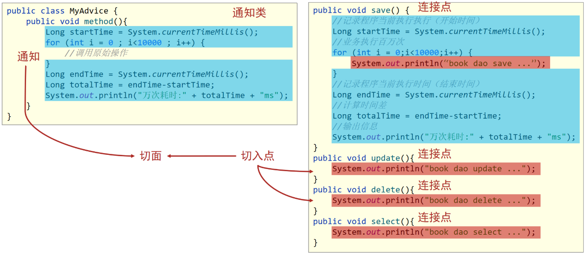
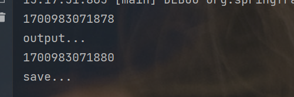
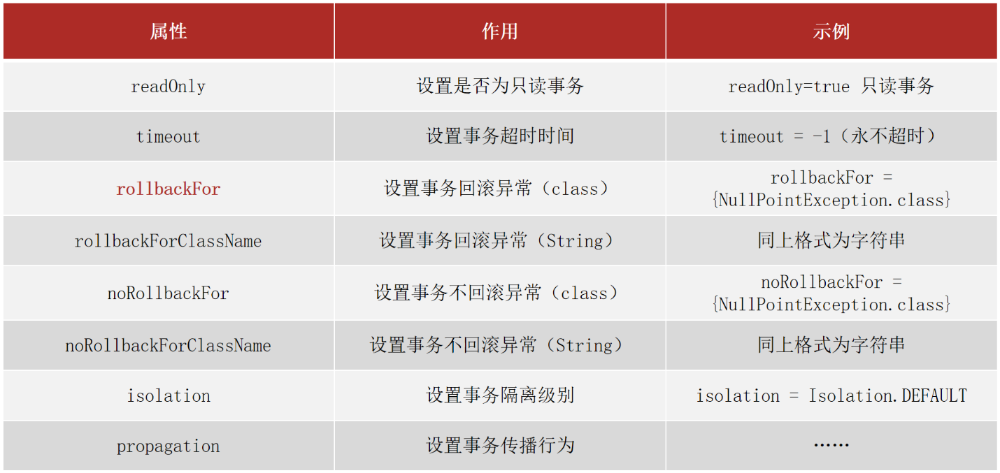
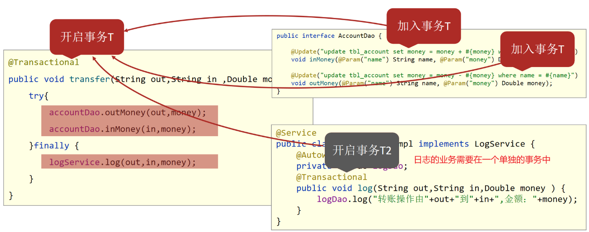
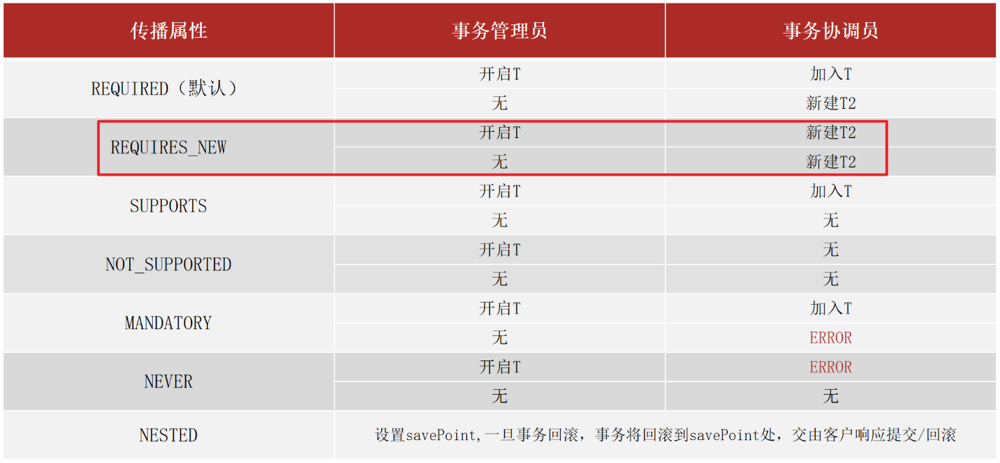

# AOP

AOP是在不改原有代码的前提下对其进行增强。

## AOP简介

AOP(Aspect Oriented Programming)**面向切面编程**，一种编程范式（编程思想），指导开发者如何组织程序结构。

OOP(Object Oriented Programming)面向对象编程。

**AOP作用**：在不惊动原始设计的基础上为其进行功能增强。

## AOP核心概念

🌰：四个方法，**只有save方法中**有输出程序执行时间的代码，其他方法没有。可以用AOP在不改动原有代码的前提下，给其他方法也加上相应功能。



(1)将类中的`save`,`update`,`delete`和`select`方法，称为**连接点**。

(2)对于`需要增强的方法`，称为**切入点**，即需要用AOP为该方法添加功能。

(3)将`要添加的功能`称为**通知**。

(4)通知是要增强的内容，会有多个，切入点是需要被增强的方法，也会有多个，那哪个切入点需要添加哪个通知，就需要提前将它们之间的关系描述清楚，即对于通知和切入点之间的关系描述，称为**切面**。

(5)通知是一个方法，方法不能独立存在,需要被写在一个类中，这个类叫**通知类**。

总结

* **连接点**(JoinPoint)：程序**执行过程中的任意位置**，粒度为执行方法、抛出异常、设置变量等。
    * 在SpringAOP中，理解为方法的执行；
* **切入点**(Pointcut)：匹配连接点的式子，即需要功能增强的方法；
    * 在SpringAOP中，一个切入点可以描述一个具体方法，也可也匹配多个方法
        * 一个具体的方法；
        * 匹配多个方法：所有的get开头的方法，所有以Dao结尾的接口中的任意方法，所有带有一个参数的方法等等；
    * 连接点范围要比切入点范围大，是切入点的方法也一定是连接点，但是是连接点的方法就不一定要被增强，所以可能不是切入点。
* **通知**(Advice)：在切入点处执行的操作，也就是共性功能；
    * 在SpringAOP中，功能最终**以方法的形式**呈现；
* **通知类**：定义通知的类；
* **切面**(Aspect)：描述通知与切入点的对应关系。

## 实现

1、依赖：

添加spring依赖：spring-context；

添加AspectJ依赖：aspectjweaver；

```xml
<dependency>
		<groupId>org.springframework</groupId>
		<artifactId>spring-context</artifactId>
		<version>5.2.10.RELEASE</version>
</dependency>
<dependency>
    <groupId>org.aspectj</groupId>
    <artifactId>aspectjweaver</artifactId>
    <version>1.9.4</version>
</dependency>
```

* 因为`spring-context`中已经导入了`spring-aop`,所以不需要再单独导入`spring-aop`；
* 导入AspectJ的jar包，AspectJ是AOP思想的一个具体实现，Spring有自己的AOP实现，但是相比于AspectJ来说比较麻烦，所以直接采用Spring整合ApsectJ的方式进行AOP开发。

2、创建Spring配置类：

```java
@Configuration
@ComponentScan("com.aop")
// @Import({UserDaoImpl.class, UserDaoImpl2.class})
public class SpringConfig {
}
```

3、定义通知类和通知：

```java
public class MyAdvice {
    public void method() {
        System.out.println(System.currentTimeMillis());
    }
}
```

4、定义切入点：

```java
public class MyAdvice {
    @Pointcut("execution(void com.aop.dao.UserDao.save())")
    private void pt() {}
    public void method() {
        System.out.println(System.currentTimeMillis());
    }
}
```

* 切入点定义依托一个**不具有实际意义**的方法进行，即**无参数、无返回值、方法体无实际逻辑**。

5、制作切面：

切面用来描述通知和切入点之间的关系。

```java
public class MyAdvice {
    @Pointcut("execution(void com.aop.dao.UserDao.save())")
    private void pt() {}

    @Before("pt()")
    public void method() {
        System.out.println(System.currentTimeMillis());
    }
}
```

绑定切入点与通知关系，并指定通知添加到原始连接点的**具体执行位置**。

`@Before`：之前，即通知会在切入点方法执行之前执行。

6、将通知类配给容器并标识其为切面类

```java
@Component
@Aspect
public class MyAdvice {
    @Pointcut("execution(void com.aop.UserDao.save())")
    private void pt(){}
    
    @Before("pt()")
    public void method(){
        System.out.println(System.currentTimeMillis());
    }
}
```

7、开启注解格式AOP功能

```java
@Configuration
@ComponentScan("com.aop")
@EnableAspectJAutoProxy
public class SpringConfig {
}
```

运行结果：

两个方法：save、nowTime。

```java
@Component
public class UserDaoImpl implements UserDao {
    @Override
    public void nowTime() {
        System.out.println(System.currentTimeMillis());
        System.out.println("output...");
    }

    @Override
    public void save() {
        System.out.println("save...");
    }
}
```



即save方法也有了输出当前毫秒时间的功能。

### 注解

`@EnableAspectJAutoProxy`

- 类型：配置类注解；
- 功能：开启注解格式AOP功能；

`@Aspect`

- 类型：类注解；
- 功能：设置当前类为AOP切面类（通知类）；

`@Pointcut`

- 类型：方法注解；
- 功能：设置切入点方法；

- 属性：value（默认）：切入点表达式；

`@Before`

- 类型：方法注解；
- 功能：设置当前通知方法与切入点之间的绑定关系（切面），当前通知方法在原始切入点方法前运行；

## AOP工作流程

### 1.Spring容器启动

* 容器启动会去加载bean：各种用到的类。
* **注意**：此时bean对象还没有创建成功。

### 2.读取所有切面配置中的切入点

```java
@Component
@Aspect
public class MyAdvice {
    @Pointcut("execution(void com.aop.dao.UserDao.nowTime())")
    private void ppt() {}
    
    @Pointcut("execution(void com.aop.dao.UserDao.save())")
    private void pt() {}

    @Before("pt()")
    public void method() {
        System.out.println(System.currentTimeMillis());
    }
}
```

**只读取已经完成切入点绑定的**配置（`@Before("pt()")`），切入点`ppt()`没绑定切面，不读取。

### 3.初始化bean

判定bean对应的类中的方法是否匹配到任意切入点。

* 匹配失败，创建原始对象，即不需要增强；
* 匹配成功，创建**原始对象**的**代理对象**，即需要进行增强；采用的技术是**动态代理**，创建一个代理对象，最终`运行的是代理对象的方法`，在该方法中会对原始方法进行功能增强。

**目标对象**(Target)：原始功能去掉共性功能对应的类产生的对象，即不包含增强功能的对象（原始对象）。

**代理**(Proxy)：目标对象无法直接完成工作，需要对其进行功能回填，通过原始对象的代理对象实现；

### 4.获取bean执行方法

* 是原始对象时，调用方法并执行；
* 是代理对象时，根据代理对象的运行模式运行原始方法与增强的内容；

验证容器中是否为代理对象：

```java
System.out.println(userDao.getClass());
// 使用AOP 时输出为：
class com.aop.dao.impl.UserDaoImpl$$EnhancerBySpringCGLIB$$49a7db6
// 即使用了SpringCGLIB进行动态代理
    
// 不使用AOP 
class com.aop.dao.impl.UserDaoImpl
// 即没有动态代理
```

注意：不能直接输出类，直接输出使用的是toString方法（）。

```java
System.out.println(userDao);
System.out.println(userDao.getClass().getName());
// toString源码
    public String toString() {
        return getClass().getName() + "@" + Integer.toHexString(hashCode());
    }

```

`getClass()`方法输出的是运行时当前引用实际指向的类，即增强后的代理对象；执行`toString`的是被代理对象，所以输出原本对象的类。

~~还是不知道为啥，估计是因为代理后对getClass或者toString方法重写了~~

## AOP配置管理

### 切入点表达式

```java
@Pointcut("execution(void com.aop.dao.UserDao.nowTime())")
private void ppt() {}
```

主要包含三个部分：语法格式、通配符、书写技巧。

#### 语法格式

**切入点**：要进行功能增强的`方法`；

**切入点表达式**：要进行功能增强的方法的`描述方式`；

表达式的描述方式有两种：

- 执行接口中的抽象方法：`execution(void com.aop.dao.UserDao.nowTime())`；
- 执行实现类中的具体方法：`execution(void com.aop.dao.UserDao.nowTime())`；

两种方式等价。

**表达式格式**：动作关键字(访问修饰符  返回值  包名.类/接口名.方法名(参数) 异常名）

`execution(public void com.aop.dao.UserDao.nowTime(int))`

- execution：动作关键字，描述切入点的行为动作，例如execution表示执行到指定切入点；
- public：访问修饰符，可以是public，private等，可以省略；
- void：返回值类型；
- com.aop.dao.UserDao：包名；
- UserDao：类/接口名称；
- nowTime()：方法名；
- int:参数类型，用**逗号**隔开；
- 异常名：方法定义中抛出指定异常，可以省略；

#### 通配符

用通配符描述切入点，简化上面的表达式格式。

* `*`：**任意符号**，可以独立出现，也可以作为前缀或者后缀的匹配符出现。

    ```
    execution（public * com.aop.*.UserDao.find*(*))
    ```

    匹配com.aop包下的任意包中的UserDao类或接口中所有find开头的带有一个参数的方法；

* `..`：多个任意符号，可以独立出现，常用于简化包名与参数的书写。

    ```
    execution（public User com..UserDao.findById(..))
    ```

    匹配com包下的任意包中的UserDao类或接口中所有findById方法

* `+`：专用于匹配子类类型。

    ```
    execution(* *..*Service+.*(..))
    ```

    *Service+，表示所有以Service结尾的接口的子类。

**常用格式**：

```java
execution(* com.itheima.*.*Service.find*(..))
将项目中所有业务层方法的以find开头的方法匹配
execution(* com.itheima.*.*Service.save*(..))
将项目中所有业务层方法的以save开头的方法匹配
```

#### 书写技巧

- 描述切入点`通常描述接口`，而不描述实现类，防止紧耦合；
- 接口中方法的修饰符都是public，所以描述时都是public，可省略，或用`*`；

- 返回值类型对于**增删改类使用精准类型**加速匹配，对于**查询类**使用`*`；
- **包名**尽量不使用`..`匹配，常用`*`做**单个包**描述匹配，或精准匹配；

- **接口名/类名**书写名称与模块相关的**采用\*匹配**，例如UserService书写成\*Service，绑定业务层接口名
- **方法名**中，以**动词**进行**精准匹配**，**名词**采用`*`匹配，例如getById书写成getBy`*`；
- 通常**不使用异常**作为匹配规则；

## AOP通知类型

AOP的通知表示共性功能（要增强的功能），根据需要添加到不同位置。

通知有5种：

- 前置通知；
- 后置通知；
- 环绕通知(重点)；
- 返回后通知(了解)；
- 抛出异常后通知(了解)；

不同类型通知的位置：


### 前置通知

```java
// 通知类
@Component
@Aspect
public class MyAdvice {
    @Pointcut("execution(void com.aop.dao.UserDao.save())")
    private void pt() {}

    @Before("pt()")
    public void method() {
        System.out.println("before...");
    }
}

// 目标类
@Component
public class UserDaoImpl implements UserDao {
    @Override
    public void nowTime() {
        System.out.println(System.currentTimeMillis());
        System.out.println("output...");
    }

    @Override
    public void save() {
        System.out.println("save...");
    }
}

// 输出结果
before...
save...
```

### 后置通知

```java
// 通知类
@Component
@Aspect
public class MyAdvice {
    @Pointcut("execution(void com.aop.dao.UserDao.save())")
    private void pt() {}

    @After("pt()")
    public void method() {
        System.out.println("after...");
    }
}

// 目标类
@Component
public class UserDaoImpl implements UserDao {
    @Override
    public void nowTime() {
        System.out.println(System.currentTimeMillis());
        System.out.println("output...");
    }

    @Override
    public void save() {
        System.out.println("save...");
    }
}

// 输出结果
save...
after...
```

### 环绕通知

即在原始方法的**前后**进行增强。

因为是在前后，所以环绕通知**必须对原始操作进行调用**，实现：

```java
public class MyAdvice {
    @Pointcut("execution(void com.aop.dao.UserDao.save())")
    private void pt() {}

    @Around("pt()")
    public void method(ProceedingJoinPoint proceedingJoinPoint) throws Throwable {
        System.out.println("before");
        // 对原始操作的调用
        proceedingJoinPoint.proceed();
        System.out.println("after");
    }
}

// 输出
before
save...
after
```

源码中`proceed`方法抛出异常，所以调用的时候也要抛出异常：

```java
Object proceed() throws Throwable;
```

**有返回类型的环绕通知**：

先配置切入点表达式，然后实现通知。

```java
public class MyAdvice {
    @Pointcut("execution(int com.aop.dao.UserDao.save())")
    private void pt() {}

    @Around("pt()")
    public Object method(ProceedingJoinPoint proceedingJoinPoint) throws Throwable {
        System.out.println("before");
        // 对原始操作的调用
        Object res = proceedingJoinPoint.proceed();
        System.out.println("after");
        return res;
    }
}

    public static void main(String[] args) {
        ApplicationContext context = new AnnotationConfigApplicationContext(SpringConfig.class);
        UserDao userDao = context.getBean(UserDao.class);
        int a  = userDao.save();
        System.out.println(a);
    }

// 输出
before
save...
after
1
```

**环绕通知注意事项**

1. 环绕通知必须依赖形参`ProceedingJoinPoint`才能实现对原始方法的调用；
2. 如果未使用`ProceedingJoinPoint`对原始方法进行调用**将跳过原始方法**的执行；
3. 对原始方法的调用可以不接收返回值，通知方法设置成void即可，如果接收返回值，最好设定为Object类型；
4. 原始方法的返回值如果是void类型，通知方法的返回值类型可以设置成void,也可以设置成Object；
5. 由于无法预知原始方法运行后是否会抛出异常，因此环绕通知方法**必须要处理Throwable异常**；

### 返回后通知

```java
public class MyAdvice {
    @Pointcut("execution(void com.aop.dao.UserDao.save())")
    private void pt() {}

    @AfterReturning("pt()")
    public void method() {
        System.out.println("AfterReturning");
    }
}
// 输出
save...
AfterReturning
```

**在原始方法正常执行后才执行**，如果原始方法执行过程中出现了异常，那么返回后通知不会被执行。

注意：**后置通知**不管原始方法有没有抛出异常都会被执行。

### 异常后通知

异常后通知是原始方法抛出异常后才执行，无异常不执行。

```java
public class MyAdvice {
    @Pointcut("execution(void com.aop.dao.UserDao.save())")
    private void pt() {}

    @AfterThrowing("pt()")
    public void method() {
        System.out.println("afterThrowing");
    }
}
// save方法
    public void save() {
        System.out.println("save...");
        System.out.println(1 / 0);
    }

// 输出
save...
afterThrowing
```

## 案例分析

任意业务层接口执行均可显示其执行效率（执行时长），通过查看每个业务层执行的时间，监控出哪个业务比较耗时，将其查找出来方便优化。

想要计算时长肯定要计算方法执行前后的时间差，所以需要**环绕通知**。

```java
    public void save() {
        int sum = 0;
        for (int i = 0; i < 10000; i ++)
            sum ++;
    }

// 通知类
public class MyAdvice {
    @Pointcut("execution(void com.aop.dao.UserDao.save())")
    private void pt() {}

    @Around("pt()")
    public void method(ProceedingJoinPoint proceedingJoinPoint) throws Throwable {
        //获取执行签名信息
        Signature signature = proceedingJoinPoint.getSignature();
        //通过签名获取执行操作名称(接口名)
        String className = signature.getDeclaringTypeName();
        //通过签名获取执行操作名称(方法名)
        String methodName = signature.getName();
        long start = System.currentTimeMillis();
        // 对原始操作的调用
        proceedingJoinPoint.proceed();
        long end = System.currentTimeMillis();
        System.out.println("执行时间："+ className+"."+methodName+"---->" +(end-start) + "ms");
    }
}
// 输出
执行时间：com.aop.dao.impl.UserDaoImpl.save---->5ms
```

**标签信息**用来指明当前切入点指向的是哪个接口、哪个方法。

## AOP通知获取数据

`获取参数`、`获取返回值`和`获取异常`。

所有的通知类型都可以获取切入点对应方法的参数：

- `JoinPoint`：适用于前置、后置、返回后、抛出异常后通知；
- `ProceedingJoinPoint`：适用于环绕通知；

有返回值的切入点方法只有**返回后通知、环绕通知**，前置和抛出异常后通知没有返回值，后置通知可有可无。

获取切入点方法运行异常信息：

* 抛出异常后通知；
* 环绕通知；

前置和返回后通知是不会有，后置通知可有可无。

#### 获取参数

除了环绕通知外，其他通知的参数用的是`JoinPoint`：

```java
public class MyAdvice {
    @Pointcut("execution(void com.aop.dao.UserDao.save(..))")
    private void pt() {}

    @Before("pt()")
    public void method(JoinPoint joinPoint) throws Throwable {
        Object[] args = joinPoint.getArgs();
        for (Object i: args)
            System.out.println(i);
    }
}

public class ApplicationTest {
    public static void main(String[] args) {
        ApplicationContext context = new AnnotationConfigApplicationContext(SpringConfig.class);
        UserDao userDao = context.getBean(UserDao.class);
        userDao.save(1, 2, 3);
    }
}

// 输出
1
2
3
6
```

环绕通知获取参数用的是`ProceedingJoinPoint`：

```java
public class MyAdvice {
    @Pointcut("execution(void com.aop.dao.UserDao.save(..))")
    private void pt() {}

    @Around("pt()")
    public void method(ProceedingJoinPoint proceedingJoinPoint) throws Throwable {
        System.out.println("before");
        Object[] args = proceedingJoinPoint.getArgs();
        for (Object i: args)
            System.out.println(i);
        proceedingJoinPoint.proceed();
        System.out.println("after");
    }
}

// 输出
before
1
2
3
6
after
```

`getArgs`返回数组，原因：参数个数不固定，所以直接使用数组更方便。

环绕通知执行原有方法：

```java
proceedingJoinPoint.proceed();
proceedingJoinPoint.proceed(args);
```

分有参和无参，使用无参的`proceed()`时，如果原始方法有参数，会自动传入。

对于有参的`proceed()`，一般用于想要更改原始方法的参数，即传入新的参数给原始方法：

```java
public class MyAdvice {
    @Pointcut("execution(void com.aop.dao.UserDao.save(..))")
    private void pt() {}

    @Around("pt()")
    public void method(ProceedingJoinPoint proceedingJoinPoint) throws Throwable {
        System.out.println("before");
        Object[] args = proceedingJoinPoint.getArgs();
        for (int i = 0; i < args.length; i ++) {
            args[i] = i * 10;
            System.out.println(args[i]);
        }
        // 新参数是原始方法中参数的值放大10倍
        proceedingJoinPoint.proceed(args);
        System.out.println("after");
    }
}
```

#### 获取返回值

只有 返回后`AfterReturing` 和 环绕`Around` 有返回值。

**返回后通知 获取返回值**：

```java
@Component
public class UserDaoImpl implements UserDao {
    @Override
    public int save() {
        int num = 12;
        return num;
    }
}


public class MyAdvice {
    @Pointcut("execution(int com.aop.dao.UserDao.save())")
    private void pt() {}

    @AfterReturning(value = "pt()", returning = "res")
    public void method(Object res) {
        System.out.println("after return");
        System.out.println(res);
    }
}

//输出
after return
12
```

**注意**：

- `AfterReturning`注解里的`returning`参数的值必须和下面通知方法的参数名**一样**。
- 如果通知方法里面还传递里`JoinPoint`，则`JoinPoint`参数**必须放第一位**。

#### 获取异常

获取原本方法抛出的异常，只有抛出异常后`AfterThrowing`和环绕`Around`这两个通知类型可以获取。

##### 环绕通知获取异常

```java
// save方法会发生异常
@Component
public class UserDaoImpl implements UserDao {
    @Override
    public int save() {
        int num = 12 / 0;
        return num;
    }
}

public class MyAdvice {
    @Pointcut("execution(int com.aop.dao.UserDao.save())")
    private void pt() {}

    @Around("pt()")
    public Object method(ProceedingJoinPoint proceedingJoinPoint) {
        Object[] objects = proceedingJoinPoint.getArgs();
        Object res = null;
        try {
            res = proceedingJoinPoint.proceed(objects);
        }catch (Throwable throwable) {
            System.out.println("获取异常");
        }
        return res;
    }
}
// 输出
获取异常
```

##### 抛出异常后通知获取异常

```java
@Component
public class UserDaoImpl implements UserDao {
    @Override
    public void save() {
        System.out.println(12 / 0);
    }
}
public class MyAdvice {
    @Pointcut("execution(void com.aop.dao.UserDao.save())")
    private void pt() {}

    @AfterThrowing(value = "pt()", throwing = "t")
    public void method(Throwable t) {
        System.out.println("异常");
        System.out.println(t);
    }
}
// 输出
异常
java.lang.ArithmeticException: / by zero
```

注意：`AfterThrowing`注解的**`throwing`值必须和通知的参数名**一样；

## AOP事务管理

### 事务简介

事务作用：在数据层保障一系列的数据库操作同成功同失败。

Spring事务作用：在**数据层或业务层**保障一系列的数据库操作同成功同失败。

### Spring事务管理实现

**案例**

```java
    @Override
    public void transfer(String outName, String inName, Double money) {
        userDao.outMoney(outName, money);
        System.out.println(10 / 0);
        userDao.inMoney(inName, money);
    }
```

执行转账操作时，转出操作和转入操作必须都执行，当有一个操作完成但是另一个操作没有完成时需要进行事务回滚。

**实现**

1、在需要被事务管理的方法上添加注解。

```java
@Transactional
public void method() {}
```

`@Transactional`可以写在接口、类上或者接口方法、类方法上。

* 写在接口类上，该接口的**所有实现类的所有方法**都会有事务；
* 写在接口方法上，该接口的**所有实现类的该方法**都会有事务；
* 写在实现类上，该类中的**所有方法**都会有事务；
* 写在实现类方法上，该方法上有事务；
* **建议写在实现类或实现类的方法上**；

2、在JdbcConfig类中配置事务管理器

```java
public class JdbcConfig {
    @Value("${jdbc.driver}")
    private String driver;
    @Value("${jdbc.url}")
    private String url;
    @Value("${jdbc.username}")
    private String userName;
    @Value("${jdbc.password}")
    private String password;

    @Bean
    public DataSource dataSource(){
        DruidDataSource ds = new DruidDataSource();
        ds.setDriverClassName(driver);
        ds.setUrl(url);
        ds.setUsername(userName);
        ds.setPassword(password);
        return ds;
    }

    //配置事务管理器，mybatis使用的是jdbc事务
    @Bean
    public PlatformTransactionManager transactionManager(DataSource dataSource){
        DataSourceTransactionManager transactionManager = new DataSourceTransactionManager();
        transactionManager.setDataSource(dataSource);
        return transactionManager;
    }
}
```

**注意：**事务管理器要根据使用技术进行选择，Mybatis框架使用的是JDBC事务，可以直接使用`DataSourceTransactionManager`。

3、开启事务注解

在SpringConfig的配置类中开启。

`@EnableTransactionManagement`：配置类定义上方，设置当前Spring环境中开启注解式事务支持。

```java
// 开启注解式事务驱动
@EnableTransactionManagement
public class SpringConfig {
}
```

完成以上步骤后，当代码出现错误后，就会进行回滚，保证数据正确。

### spring事务角色

`事务管理员`和`事务协调员`。

1. 未开启Spring事务之前:


* AccountDao的outMoney因为是修改操作，会开启一个事务T1
* AccountDao的inMoney因为是修改操作，会开启一个事务T2
* AccountService的transfer没有事务（没有对数据库进行操作），
    * 运行过程中如果没有抛出异常，则T1和T2都正常提交，数据正确；
    * 如果在两个方法中间抛出异常，T1因为执行成功提交事务，T2因为抛异常不会被执行，就会导致数据出现错误；

2. 开启Spring的事务管理后


* transfer上**添加了@Transactional注解**，在**该方法上就会有一个事务T**；
* AccountDao的outMoney方法的事务T1加入到transfer的事务T中；
* AccountDao的inMoney方法的事务T2加入到transfer的事务T中；
* 这样就保证他们在同一个事务中，当业务层中出现异常，整个事务就会回滚，保证数据的准确性。

通过上面例子的分析，我们就可以得到如下概念:

- 事务管理员：**发起**事务方，在Spring中通常指代业务层**开启事务**的方法；
- 事务协调员：**加入**事务方，在Spring中通常指代数据层方法，也可以是业务层方法；

==注意:==

目前的事务管理是基于`DataSourceTransactionManager`和`SqlSessionFactoryBean`使用的是同一个数据源。

### Spring事务属性

`事务配置`、`转账业务追加日志`、`事务传播行为`。

#### 事务配置

`@Transactional`注解的参数：



解释：

* `readOnly`：true只读事务，false读写事务，**增删改**要设为false，**查询**设为true。

* `timeout`：设置超时时间，单位。超时后自动回滚，-1表示不设置超时时间。

* `rollbackFor`：当**出现指定异常**进行事务回滚；
    * Spring的事务**只会对`Error异常`和`RuntimeException异常`及其子类进行事务回滚**，其他的异常类型是不会回滚的。

* `noRollbackFor`：当**出现指定异常不进行**事务回滚；

* `rollbackForClassName`：等同于rollbackFor，只不过属性为**异常的类全名字符串**；

* `noRollbackForClassName`：等同于noRollbackFor，只不过属性为异常的类全名字符串；

* `isolation`设置事务的隔离级别；
    * `DEFAULT`：默认隔离级别, 会采用数据库的隔离级别；
    * `READ_UNCOMMITTED` : 读未提交；
    * `READ_COMMITTED` : 读已提交；
    * `REPEATABLE_READ` : 重复读取；
    * `SERIALIZABLE`: 串行化；

#### 记录日志

用一个日志类将每次操作的信息存储到数据库中。

```java
@Transactional
public void transfer(String out,String in ,Double money) {
    try{
        accountDao.outMoney(out,money);
        accountDao.inMoney(in,money);
    }finally {
        logService.log(out,in,money);
    }
}
```

日志信息存储操作在`finally`块中，所以不管前面有没有异常，都会将本次转账的信息存储到数据库中。

#### 事务传播行为

分析上面的`transfer`的事务：



* log方法、inMoney方法和outMoney方法都属于增删改，分别有事务T1,T2,T3；
* transfer因为加了@Transactional注解，会开启事务T，然后把事务T1,T2,T3都加入到事务T中；
* 所以当转账失败后，所有的事务都回滚，导致日志没有记录下来。

怎样实现不管转账成功与否，都记录日志信息：使用**事务传播行为**。

**事务传播行为**：事务协调员对事务管理员所携带事务的处理态度。

使用`Transactional`注解的`propagation`属性：

将`propagation`属性设置到对应的必须执行的方法的注解里。

属性值为：REQUIRES_NEW，即对于这个方法，需要创建为新事物。

```java
@Service
public class LogServiceImpl implements LogService {

    @Autowired
    private LogDao logDao;
	//propagation设置事务属性：传播行为设置为当前操作需要新事务
    @Transactional(propagation = Propagation.REQUIRES_NEW)
    public void log(String out,String in,Double money ) {
        logDao.log("转账操作由"+out+"到"+in+",金额："+money);
    }
}
```

propagation的值：


