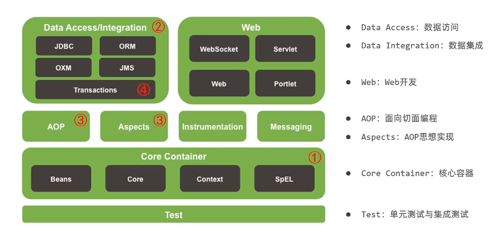

## IOC/DI

IOC：Inversion of control，控制反转。

- 在类的内部使用对象时，由**主动**`new`产生对象**转换为由外部提供**对象，此过程中**对象创建控制权**由程序转移到外部，此思想称为**控制反转**。

Spring技术实现IoC思想：

- Spring提供了一个容器，称为**IoC容器**，用来充当IoC思想中的**外部**；
- **IoC容器**负责对象的**创建、初始化**等一系列工作，被创建或被管理的**对象**在IoC容器中统称为**Bean**。

DI：Dependency Injection，依赖注入。

- 在**容器中**建立**bean与bean之间的依赖关系**的整个过程，称为**依赖注入**。

**IoC本质**：将自身对象中的一个内置对象的控制反转，反转后不再由自己本身的对象进行控制这个内置对象的创建，而是由第三方系统去控制这个内置对象的创建。简单来说就是把**本来在类内部控制的对象**，**反转到类外部进行创建后注入**，不在由类本身镜像控制，这就是IoC的本质。

**DI**：**自身对象中的内置对象**是通过**注入的方式**进行**创建**。

**IoC和DI的关系**：IoC就是容器，DI就是注入这一行为，那么DI确实就是IoC的具体功能的实现。而IoC则是DI发挥的平台和空间。所以说。IoC和DI即是相辅相成的拍档。他们都是为了实现解耦而服务的

### **入门案例**

1、创建spring项目，然后在`pom.xml`文件中添加`Spring`依赖：

```xml
<dependency>
	<groupId>org.springframework</groupId>
	<artifactId>spring-context</artifactId>
	<version>5.2.10.RELEASE</version> 
</dependency>
```

版本自定。

2、添加案例中需要的类

创建`BookService`,`BookServiceImpl`，`BookDao`和`BookDaoImpl`四个类

```java
public interface BookDao {
    public void save();
}
public class BookDaoImpl implements BookDao {
    public void save() {
        System.out.println("book dao save ...");
    }
}
public interface BookService {
    public void save();
}
public class BookServiceImpl implements BookService {
    private BookDao bookDao = new BookDaoImpl();
    public void save() {
        System.out.println("book service save ...");
        bookDao.save();
    }
}
```

3、添加spring配置文件

resources下添加spring配置文件applicationContext.xml，并完成bean的配置


4、在配置文件中完成bean的配置

```xml
<?xml version="1.0" encoding="UTF-8"?>
<beans xmlns="http://www.springframework.org/schema/beans"
       xmlns:xsi="http://www.w3.org/2001/XMLSchema-instance"
       xsi:schemaLocation="http://www.springframework.org/schema/beans http://www.springframework.org/schema/beans/spring-beans.xsd">
<!--    1、导入spring坐标-->
<!--    2、配置bean-->
<!--
    id 表示bean的名字
    class表示bean类型，即所属类
-->
    <bean id="bookDap" class="com.lxb.spring.dao.impl.BookDaoImpl"/>
    <bean id="bookService" class="com.lxb.spring.service.impl.BookServiceImpl"/>

</beans>
```

**==注意事项：bean定义时id属性在同一个上下文中(配置文件)不能重复==**

5、获取IOC容器

使用Spring提供的接口完成IoC容器的创建，创建App类，编写main方法

```java
public class App {
    public static void main(String[] args) {
        //获取IOC容器
		ClassPathXmlApplicationContext ctx = new ClassPathXmlApplicationContext("applicationContext.xml"); 
    }
}
```

6、从容器中获取对象进行方法调用

```java
public class App {
    public static void main(String[] args) {
        //获取IOC容器
		ApplicationContext ctx = new ClassPathXmlApplicationContext("applicationContext.xml"); 
//        BookDao bookDao = (BookDao) ctx.getBean("bookDao");
//        bookDao.save();
        BookService bookService = (BookService) ctx.getBean("bookService");
        bookService.save();
    }
}
```

### 个人理解

项目开发时，类里面的属性包含对象，所以会在类里面创建对象然后再使用，当类多了之后，互相之间联系密切，就会出现“牵一发而动全身”的问题。

为了解决这个问题，可以使用控制反转（IoC）思想，即将类的创建、初始化等操作交给Spring容器来完成，类只需要调用spring容器接收创建好的对象去干自己的事就行了。类的创建、初始化等操作由类在内部实现变成由Spring容器实现，即对类的控制权发生了变化，所以叫：控制反转。

#### **IoC容器实现**：

首先在pom配置文件里面添加Spring依赖，然后创建Spring配置文件，通过bean绑定需要控制的对象。在对应的类里使用Spring来进行对象创建。

#### **Spring配置文件解读**：

被spring管理的对象统称为`bean`；通过Spring配置文件告诉Spring容器需要管理哪些对象（即哪些bean）。

##### 书写规则

标签/元素定义：

```
<label> </label>
// 如果标签内部为空，也可以直接写成单标签
<label/>
```

##### bean元素

用来定义一个bean对象，指代需要控制的对象。

```xml
<bean id="bean唯一标识" name="bean名称" class="类的完整名称" factory-bean="工厂bean名称" factory-method="工厂方法"/>
```

**id**：bean的名称，在一个spring容器中必须唯一，通过bean名称可以从spring容器获取对应的bean对象。`context.getBeanDefinitionNames();` 获取所有bean的id名，以`String[]`数组形式返回

**name**：别名，即外号，也可以用来从spring容器获取对应的bean对象。`context.getAliases(id);`根据id名获取对应bean的所有别名

**bean名称别名定义规则**

1. 当**id存在**的时候，不管name有没有，**取id为bean的名称**；

2. 当**id不存在**，此时需要**看name**，name的值可以通过“,”或者“;”或者“ ”分割，最后会按照分隔符得到一个String数组，数组的**第一个元素作为bean的名称**，**其他**的作为bean的**别名**；

3. 当id和name**都存在**的时候，id为bean名称，name用来定义多个别名；

4. 当id和name**都不指定**的时候，bean名称**自动生成**，格式：bean的class的完整类名#编号

    上面的编号是从0开始的，同种类型的没有指定名称的依次递增。示例：`com.lxb.spring.service.impl.BookServiceImpl#0`。

###### property子元素

元素的子元素，用于调用 Bean **实例中的 setter 方法**对**属性进行赋值**，从而完成属性的注入。该元素的 `name` 属性用于指定 Bean 实例中**相应的属性名**。

##### alias元素

```xml
<alias name="需要定义别名的bean的id" alias="别名" />
```

即根据name给对应的bean设置别名alias。name可以是id或者bean里的name，即别名。

##### import元素

通过import元素引入其他bean配置文件。

```xml
<import resource="applicationContext.xml"/>
```


### 源码理解

