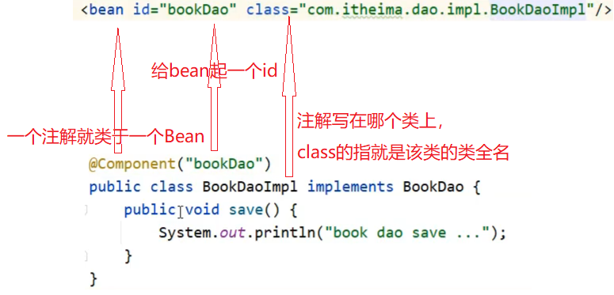

`注解开发定义bean`和`纯注解开发`

## 注解

### 注解开发定义bean

原本通过配置xml文件配置bean，绑定需要绑定需要创建对象的类。

现在通过**注解**的方式完成。

1、添加 `@Component` 注解：

```java
@Component("bookDao")
public class BookDaoImpl implements BookDao {

    private String name;

    public void setName(String name) {
        this.name = name;
    }

    @Override
    public void save() {
        System.out.println("dao..." + name);
    }
}
```

注解与l配置文件中bean的关系：



2、配置Spring的注解包扫描

```xml
<context:component-scan base-package="com.lxb"/>
```

3、创建对象

```java
public class App {
	public static void main(String[] args) {
        ApplicationContext ctx = new ClassPathXmlApplicationContext("applicationContext.xml");
        BookDao bookDao = (BookDao) ctx.getBean("bookDao");
System.out.println(bookDao);
        //按类型获取bean
        BookService bookService = ctx.getBean(BookService.class);
        System.out.println(bookService);
    }
}
```

一个是根据注解中的值创建对象，另一个是根据类class查找。

### 注解

`@Component/@Controller/@Service/@Repository`

**作用**：设置该类为spring管理的bean。

**属性**：value（默认）：定义bean的id。

### 纯注解开发模式

Spring在**3.0版**已经支持纯注解开发。

使用方式：用配置类代替配置文件，即用一个类，添加注解`@Configuration`标识为配置类，来替换原本的配置文件。

```java
@Configuration
public class SpringConfig {
}
```

用注解替换包扫描配置：

```java
@Configuration
@ComponentScan("com.lxb")
public class SpringConfig {
}
```

使用`AnnotationConfigApplicationContext`获取容器：

```java
public class ApplicationTest {
    public static void main(String[] args) {
        // ApplicationContext context = new ClassPathXmlApplicationContext("applicationContext.xml");
        ApplicationContext context = new AnnotationConfigApplicationContext(SpringConfig.class);
        BookDao bookDao = (BookDao) context.getBean("bookDao");
        System.out.println(bookDao);
        bookDao.save();
        BookService bookService = (BookService) context.getBean(BookService.class);
    }
}
```

**注解**：`@Configuration`

- 作用：设置该类为spring配置类；
- 属性：`value`（默认），定义bean的id；

`@ComponentScan`

- 作用：设置spring配置类扫描路径，用于加载使用注解格式定义的bean；
- 属性：`value`（默认）：扫描路径，此路径可以逐层向下扫描


`applicationContext.xml`中`<context:component-san/>`的作用是指定扫描包路径，对应的注解为`@ComponentScan`。

`@Configuration`标识该类为配置类，使用类替换applicationContext.xml文件。

`ClassPathXmlApplicationContext`是加载XML配置**文件**;

AnnotationConfigApplicationContext是加载**配置类**;

### 注解开发bean作用范围

使用注解开发的bean**默认单例**，要想变成非单例，只需要在其类上添加`@scope`注解：

```java
@Component
@Scope("prototype")
public class BookServiceImpl implements BookService {
    @Override
    public void save() {
        System.out.println("service...");
    }
}

```

注解`@scope`：

- 作用：设置该类创建对象的作用范围，可用于设置创建出的bean是否为单例对象；
- 属性：value，默认值`singleton`（单例），可选值`prototype`（非单例）；

### 注解开发bean声明周期

添加`init`和`destroy`方法：

```java
@Component("bookDao")
public class BookDaoImpl implements BookDao {
    public BookDaoImpl() {
    }

    @Override
    public void save() {
        System.out.println("dao ...");
    }
    
    @PostConstruct
    public void init() {
        System.out.println("init...");
    }
    
    @PreDestroy
    public void destroy() {
        System.out.println("destroy...");
    }
}
```

`@PostConstruct`注解：

- 在构造方法之后执行；
- 作用：设置该方法为初始化方法；

`@PreDestroy`注解：

- 在销毁方法之前执行；
- 作用：设置该方法为销毁方法；

运行类：

```java
public class ApplicationTest {
    public static void main(String[] args) {
        AnnotationConfigApplicationContext context = new AnnotationConfigApplicationContext(SpringConfig.class);
        BookService bookService = (BookService) context.getBean(BookService.class);
        bookService.save();
        context.close();
    }
}

// 输出
init...
service...
destroy...
```

spring容器关闭函数close是子类的方法，所以声明的时候需要直接声明成子类对象，不能使用`ApplicationContext`。

注意:`@PostConstruct`和`@PreDestroy`注解如果找不到，需要导入jar包：

```xml
<dependency>
	<groupId>javax.annotation</groupId>
	<artifactId>javax.annotation-api</artifactId>
	<version>1.3.2</version>
</dependency>
```

总结


### 注解开发依赖注入

spring没有提供构造函数注入、setter注入对应的注解，**只提供了自动装配**的注解实现。

#### 按照类型注入

在需要依赖注入的类里的**属性上添加**`@Autowired`注解：

```java
public class BookServiceImpl implements BookService {
    @Autowired
    private BookDao bookDao;
}
```

- `@Autowired`可以写在属性上，也可也写在setter方法上，最简单的处理方式是**写在属性上并将 setter方法删除掉**；
- 为什么setter方法删除：自动装配基于反射设计创建对象并通过暴力反射为私有属性进行设值；普通反射只能获取public修饰的内容；暴力反射除了获取public修饰的内容还可以获取private修改的内容；所以此处无需提供setter方法；
- `@Autowired`是按照类型注入，当**接口有多个实现类的时候，需要给不同类命名**，然后使用**按名字注入**。
- `@Autowired`注解的属性：`required`：true/false，定义该属性是否允许为null

#### 按名字注入

用父类来创建子类的引用变量（多态），但是如果子类有多个，这时就无法按类型自动找到子类，需要按名字注入，即为每个子类命名。

类的属性定义（引用变量）：

```java
public class BookServiceImpl implements BookService {
    @Autowired
    @Qualifier("bookDao1")
    private BookDao bookDao;
}
```

需要通过注解`@Qualifier`指定使用的是那个类，相当于**bean的id**。

**注意**：`@Qualifier`不能独立使用，必须和`@Autowired`一起使用。

引用变量对应的类：

```java
@Repository("bookDao2")
public class BookDaoImpl2 implements BookDao {
    @Override
    public void save() {
        System.out.println("save 2....");
    }
}
```

用注解`@Repository`指定该类的id。

#### 简单数据类型注入

直接用`@Value`注解写入：

```java
@Repository("bookDao")
public class BookDaoImpl implements BookDao {
	@Value("itheima")
	private String name;
}
```

#### 注解读取properties配置文件

将常用值放`properties`配置文件中，用注解读取。

1、`properties`文件：

```properties
name=apple
age=12
```

2、使用注解`PropertySource`加载properties配置文件：

```java
@PropertySource("jdbc.properties")
public class SpringConfig {
}
// 多个配置文件
@PropertySource({"jdbc.properties", ""})

// 路径也可以加classpath： 表示从项目根路径找文件
@PropertySource({"classpath:jdbc.properties"})
```

3、`@PropertySource`注解用于加载`properties`文件：

```java
@PropertySource("jdbc.properties")
public class SpringConfig {
}
```

4、使用`@Value`读取配置文件中的内容：

```java
@Repository("bookDao")
public class BookDaoImpl implements BookDao {
	@Value("${name}")
	private String name;
}
```

### IOC/DI注解开发管理第三方bean

`@Bean`

#### 管理Druid数据源

添加依赖：

```xml
        <dependency>
            <groupId>com.alibaba</groupId>
            <artifactId>druid</artifactId>
            <version>1.1.13</version>
        </dependency>
```

配置类springconfig中添加方法：

```java
    @Bean
    public DataSource dataSource() {
        DruidDataSource ds = new DruidDataSource();
        ds.setDriverClassName("com.mysql.jdbc.Driver");
        ds.setUrl("jdbc:mysql://localhost:3306/spring_db");
        ds.setUsername("root");
        ds.setPassword("root");
        return ds;
    }
```

`@Bean`注解的作用是将方法的返回值制作为`Spring`管理的一个`bean`对象。

注意：不能使用`DataSource ds = new DruidDataSource()`，因为DataSource接口中没有对应的setter方法来设置属性。

**引入第三方配置类**

分类管理，不同的bean配置到不同配置类中，最后汇总到`SpringConfig`中。

多个配置类：

```java
@Configuration
public class JdbcConfig {
	@Bean
	public DataSource dataSource(){
        // 逻辑
	}	
}
```

加载到`SpringConfig`配置类中：

- 使用包扫描的方式（很慢，不推荐）

    ```java
    @Configuration
    @ComponentScan("com.lxb.config") // 这里的路径是多个配置类的包的路径
    public class SpringConfig {
        
    }
    ```

- 使用`@Import`注解

    这时其他类上就不需要`@Configuration`注解了。

    ```java
    public class JdbcConfig {
    	@Bean
    	public DataSource dataSource(){
            // 逻辑
    	}	
    }
    
    @Configuration
    @Import({JdbcConfig.class})
    public class SpringConfig {
        
    }
    ```

    **注意**：`@Import`注解的**值是数组**。在配置类中只能写一次。

#### 为第三方bean注入资源

分为**简单数据类型**和**引用数据类型**。

##### 简单数据类型

jdbc配置类：

使用`@PropertySource`注解加载properties文件，`@Value`注解和`${key}` 来取值。

```
@PropertySource("jdbc.properties")
public class JdbcConfig {
    @Value("${jdbc.classname}")
    private String driver;
    @Value("${jdbc.url}")
    private String url;
    @Value("${jdbc.username}")
    private String userName;
    @Value("${jdbc.password}")
    private String password;
    @Bean
    public DataSource dataSource(){
        System.out.println(driver);
        System.out.println(url);
        System.out.println(userName);
        System.out.println(password);
        DruidDataSource ds = new DruidDataSource();
        ds.setDriverClassName(driver);
        ds.setUrl(url);
        ds.setUsername(userName);
        ds.setPassword(password);
        return ds;
    }
}

```

jdbc.properties文件：

```properties
jdbc.classname=com.mysql.jdbc.Driver
jdbc.url=jdbc:mysql://localhost:3306/spring_db
jdbc.username=root
jdbc.password=root
```

前面加`jdbc.`是为了避免读到系统环境变量。

##### 引用数据类型

即在构建第三方bean对象的时候，添加一个自定义的类的对象。

1、自定义的类的对象交给spring管理：

```java
// 使用扫描的方式

@Configuration
@ComponentScan("com.lxb.autospring.dao")
@Import({JdbcConfig.class})
public class SpringConfig {
}
```

2、创建第三方bean对象：

```java
@Bean
public DataSource dataSource(BookDao bookDao){
	System.out.println(bookDao);
	DruidDataSource ds = new DruidDataSource();
	ds.setDriverClassName(driver);
	ds.setUrl(url);
	ds.setUsername(userName);
	ds.setPassword(password);
	return ds;
}
```

引用类型注入只需要为bean定义方法设置形参即可，容器会根据类型自动装配对象。

### 总结

