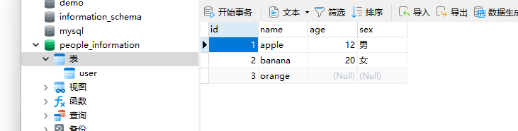
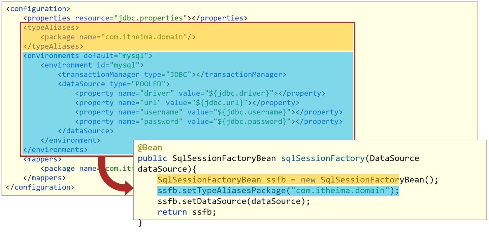
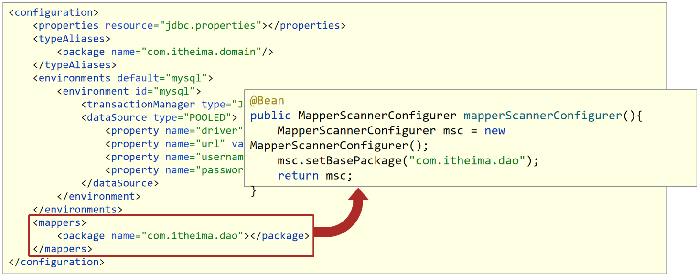

## Spring整合Mybatis

### 原生MyBatis开发

#### 环境配置

1、添加依赖：mybatis、mysql-connector-java

```xml
<dependency>
    <groupId>org.mybatis</groupId>
    <artifactId>mybatis</artifactId>
    <version>3.5.11</version>
</dependency>
<dependency>
    <groupId>mysql</groupId>
    <artifactId>mysql-connector-java</artifactId>
    <version>5.1.47</version>
</dependency>
```

2、添加mybatis配置文件：mybatis-config.xml

主要用于配置数据库连接相关信息：`<environments></environments>`。

分两部分：外部数据库相关信息的properties文件读取以及数据库环境配置。

```xml
<?xml version="1.0" encoding="UTF-8"?>
<!DOCTYPE configuration
        PUBLIC "-//mybatis.org//DTD Config 3.0//EN"
        "http://mybatis.org/dtd/mybatis-3-config.dtd">
<configuration>
    <!--读取外部properties配置文件-->
    <properties resource="jdbc.properties"></properties>    
     <!--数据库环境配置-->
    <environments default="mysql">
         <!--使用MySQL环境-->
        <environment id="mysql">
             <!--事务管理器：JDBC类型-->
            <transactionManager type="JDBC"></transactionManager>
             <!--连接池：内置POOLED-->
            <dataSource type="POOLED">
                <property name="driver" value="${jdbc.driver}"></property>
                <property name="url" value="${jdbc.url}"></property>
                <property name="username" value="${jdbc.username}" />
                <property name="password" value="${jdbc.password}" />
            </dataSource>
        </environment>
    </environments>
</configuration>
```

#### 开发过程

1、实体类

类的属性与数据库的表对应。

```java
public class Person implements Serializable {
    private Integer id;
    private String name;
    private String sex;
    private Integer age;

    public Integer getId() {
        return id;
    }

    public void setId(Integer id) {
        this.id = id;
    }

    public String getName() {
        return name;
    }

    public void setName(String name) {
        this.name = name;
    }

    public String getSex() {
        return sex;
    }

    public void setSex(String sex) {
        this.sex = sex;
    }

    public Integer getAge() {
        return age;
    }

    public void setAge(Integer age) {
        this.age = age;
    }

    @Override
    public String toString() {
        return name + " is " + age + ", " + sex;
    }
}
```

2、实体别名

在mybatis**配置文件**（mybatis-config.xml）中，**为实体类添加别名**，这样在Mapper映射文件中，我们就可以不用写实体的全限定名，用别名就行。

两种方式：

- 为每个类都手动命名：

    ```xml
    <typeAliases>
        <typeAlias	alias="name" type="com.lxb.autospring.entity.Person"></typeAlias>
    </typeAliases>
    ```

- 自动命名：

    需要给出包的扫描路径。

    ```xml
    <!--别名扫描的包路径-->
        <typeAliases>
            <package name="com.lxb.autospring"/>
        </typeAliases>
    ```

3、创建数据库表



4、创建Dao层

Dao（Data Access Object）层主要负责**和数据库进行交互**，执行持久化操作。

主要作用：

- 供对数据的持久化操作：Dao层封装了数据库的操作细节，包括插入、更新、删除和查询等。通过调用Dao层提供的方法，我们可以方便地进行数据的增删改查操作。
- 提供与数据库的交互接口：通过定义一组接口，Dao层隐藏了底层数据库的实现细节。这样，在业务逻辑层中，我们只需要关注接口的调用，而不需要关心底层数据库的具体实现。
- 实现数据访问的逻辑处理：Dao层可以包含一些复杂的数据库查询逻辑，例如多表关联查询、分页查询等。这些查询的逻辑处理可以封装在Dao层中，使得业务逻辑层更加简洁。

```java
public interface PersonDao {
    void save(Person person);
    void deleteById(Integer id);
    void updateById(Person person);
    Person findById(Integer id);
}

```

5、实现`Mapper`文件：PersonMapper.xml对Dao层进行实现

为Dao层接口添加对应的sql语句。

```xml
<?xml version="1.0" encoding="UTF-8"?>
<!DOCTYPE mapper PUBLIC "-//mybatis.org//DTD Mapper 3.0//EN"
        "http://mybatis.org/dtd/mybatis-3-mapper.dtd">
<mapper namespace="com.lxb.autospring.dao.PersonDao">
    <insert id="save" parameterType="Person">
        insert into user(name, age, sex) values (#{name}, #{age}, #{sex})
    </insert>
    <delete id="deleteById" parameterType="Integer">
        delete from user where id = #{id}
    </delete>
    <update id="updateById" parameterType="Person">
        update user set name=#{name}, age=#{age}, sex=#{sex} where id=#{id}
    </update>
    <select id="findById" parameterType="Integer" resultType="Person">
        select * from user where id = #{id}
    </select>
</mapper>
```

6、注册Mapper文件，在mybatis-config.xml中进行注册，因为此时UserMapper在resources根下面，所以可以直接写，或者以报名的形式：`com.lxb.......`

```xml
<?xml version="1.0" encoding="UTF-8"?>
<!DOCTYPE configuration
        PUBLIC "-//mybatis.org//DTD Config 3.0//EN"
        "http://mybatis.org/dtd/mybatis-3-config.dtd">
<configuration>
    <!--读取外部properties配置文件-->
    <properties resource="jdbc.properties"></properties>    
     <!--数据库环境配置-->
    <environments default="mysql">
         <!--使用MySQL环境-->
        <environment id="mysql">
             <!--事务管理器：JDBC类型-->
            <transactionManager type="JDBC"></transactionManager>
             <!--连接池：内置POOLED-->
            <dataSource type="POOLED">
                <property name="driver" value="${jdbc.driver}"></property>
                <property name="url" value="${jdbc.url}"></property>
                <property name="username" value="${jdbc.username}" />
                <property name="password" value="${jdbc.password}" />
            </dataSource>
        </environment>
    </environments>
    
    <mappers>
		<mapper resource="PersonMapper.xml"></mapper>
    </mappers>
</configuration>
```

7、使用

在运行类中测试。

```java
    public static void main(String[] args) throws IOException {
        InputStream inputStream = Resources.getResourceAsStream("sql.xml");
        // SqlSessionFactoryBuilder sqlSessionFactoryBuilder = new SqlSessionFactoryBuilder();
        SqlSessionFactory sqlSessionFactory = new SqlSessionFactoryBuilder().build(inputStream);
        SqlSession session = sqlSessionFactory.openSession();
        PersonDao personDao = session.getMapper(PersonDao.class);

        Person person = new Person();

        person.setName("apple");
        person.setAge(12);
        person.setSex("男");

        personDao.save(person);

        personDao.deleteById(1);

        person.setId(8);
        personDao.updateById(person);

        person = personDao.findById(4);

        System.out.println(person);
        session.commit();
    }

```

### Spring整合MyBatis

#### 整合原因

1. 上面的**第二步**，每个实体的别名都需要配置，麻烦；
1. 注册Mapper文件，每一个mapper文件都要做一次注册映射，麻烦；
1. MybatisAPI调用时代码冗余：sqlsession的创建代码是固定的，得到Dao对象也冗余。


所以整合可以分为两个部分：

- 将运行类里SqlSessionFactory的创建交给spring管理；
- 将MyBatis用到的配置文件交给spring管理；

#### Spring整合Mybatis

- Spring要管理MyBatis中的SqlSessionFactory；
- Spring要管理Mapper接口的扫描；

##### 1、相关依赖：

一共两个：spring操作数据库用的spring-jdbc和spring和mybatis整合的包。

```xml
<dependency>
<!--Spring操作数据库需要该jar包-->
	<groupId>org.springframework</groupId>
	<artifactId>spring-jdbc</artifactId>
	<version>5.2.10.RELEASE</version>
</dependency>
<dependency>
<!--
Spring与Mybatis整合的jar包
这个jar包mybatis在前面，是Mybatis提供的
-->
	<groupId>org.mybatis</groupId>
	<artifactId>mybatis-spring</artifactId>
	<version>1.3.0</version>
</dependency>
```

##### 2、Spring的主配置类：

```java
@Configuration
@ComponentScan("com.lxb.autospring") // 扫描路径 管理bean对象
public class SpringConfig {
}
```

##### 3、数据源配置类：

```java
@PropertySource("jdbc.properties")
public class JdbcConfig {
    @Value("${jdbc.driver}")
    private String driver;
    @Value("${jdbc.url}")
    private String url;
    @Value("${jdbc.username}")
    private String userName;
    @Value("${jdbc.password}")
    private String password;
    @Bean
    public DataSource dataSource(){
        DruidDataSource ds = new DruidDataSource();
        ds.setDriverClassName(driver);
        ds.setUrl(url);
        ds.setUsername(userName);
        ds.setPassword(password);
        return ds;
    }
}
```

##### 4、主配置类读取其他配置类：

```java
@Configuration
@ComponentScan("com.lxb.autospring")
@Import(JdbcConfig.class)
public class SpringConfig {
}
```

##### 5、创建Mybatis配置类

配置SqlSessionFactor进行管理。

```java
public class MybatisConfig {
	//定义bean，SqlSessionFactoryBean，用于产生SqlSessionFactory对象
	@Bean
	public SqlSessionFactoryBean sqlSessionFactory(DataSource dataSource){
        SqlSessionFactoryBean ssfb = new SqlSessionFactoryBean();
        //设置模型类的别名扫描
		ssfb.setTypeAliasesPackage("com.itheima.domain");
        //设置数据源
		ssfb.setDataSource(dataSource);
		return ssfb;
	}
	//定义bean，返回MapperScannerConfigurer对象
	@Bean
	public MapperScannerConfigurer mapperScannerConfigurer(){
        MapperScannerConfigurer msc = new MapperScannerConfigurer();
        msc.setBasePackage("com.itheima.dao");
        return msc;
	}
}
```

**说明:**

* 使用SqlSessionFactoryBean封装SqlSessionFactory需要的环境信息：

    

    * SqlSessionFactoryBean是前面我们讲解FactoryBean的一个子类，在该类中将SqlSessionFactory的创建进行了封装，简化对象的创建，我们只需要将其需要的内容设置即可。
    * 方法中有一个参数为dataSource,当前Spring容器中已经创建了Druid数据源，类型刚好是DataSource类型，此时在初始化SqlSessionFactoryBean这个对象的时候，发现需要使用DataSource对象，而容器中刚好有这么一个对象，就自动加载了DruidDataSource对象。

* 使用MapperScannerConfigurer加载Dao接口，创建代理对象保存到IOC容器中：

    

    * 这个MapperScannerConfigurer对象也是MyBatis提供的专用于整合的jar包中的类，用来处理原始配置文件中的mappers相关配置，加载数据层的Mapper接口类
    * MapperScannerConfigurer有一个核心属性basePackage，就是用来设置所扫描的包路径

## Spring整合Junit

一个开源的单元测试框架。

依赖：

```xml
        <dependency>
            <groupId>junit</groupId>
            <artifactId>junit</artifactId>
            <scope>test</scope>
        </dependency>
        <dependency>
            <groupId>org.springframework</groupId>
            <artifactId>spring-test</artifactId>
        </dependency>
```

