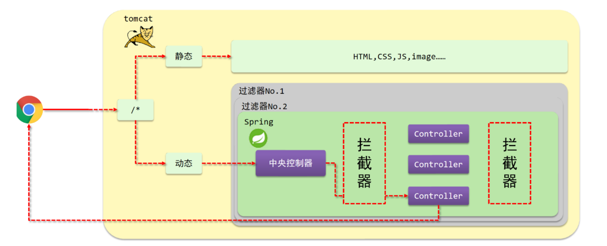
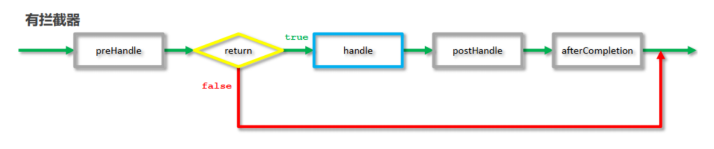

Mybatis、Spring和SpringMVC三个框架整合开发。

## 流程分析

**基础配置**

1. pom.xml添加SSM需要的依赖jar包。
2.  编写Web项目的入口配置类，实现`AbstractAnnotationConfigDispatcherServletInitializer`接口，重写以下方法：
    - `getRootConfigClasses()` ：返回Spring的配置类->需要SpringConfig配置类;
    - `getServletConfigClasses()` ：返回SpringMVC的配置类->需要SpringMvcConfig配置类;
    - `getServletMappings()`：设置SpringMVC请求拦截路径规则；
    - `getServletFilters()`：设置过滤器，解决POST请求中文乱码问题；
    - ```java
        public class ServletConfig extends
        AbstractAnnotationConfigDispatcherServletInitializer {
            //加载Spring配置类
            protected Class<?>[] getRootConfigClasses() {
                return new Class[]{SpringConfig.class};
            }
            //加载SpringMVC配置类
            protected Class<?>[] getServletConfigClasses() {
                return new Class[]{SpringMvcConfig.class};
            }
            //设置SpringMVC请求地址拦截规则
            protected String[] getServletMappings() {
                return new String[]{"/"};
            }
            //设置post请求中文乱码过滤器
            @Override
            protected Filter[] getServletFilters() {
                CharacterEncodingFilter filter = new
                    CharacterEncodingFilter();
                filter.setEncoding("utf-8");
                return new Filter[]{filter};
            }
        }
        ```
    
        

**SSM整合**

- `SpringConfig`
    - 标识该类为配置类，使用注解`@Configuration`。
    - 扫描Service所在的包，使用注解`@ComponentScan`。
    - 在Service层要管理事务，使用注解`@EnableTransactionManagement`。
    - 读取外部的`properties`配置文件，使用注解`@PropertySource`
    - 整合Mybatis需要引入Mybatis相关配置类，使用注解 `@Import`。
    - ```java
        @Configuration
        @ComponentScan("com.aop")
        @Import({JdbcConfig.class, MybatisConfig.class})
        @EnableTransactionManagement
        public class SpringConfig {
        }
        ```

        注意：@PropertySource注解可以放在spring配置类上，也可以放在需要用到properties文件的配置类上。
- `JdbcConfig`

    - 第三方数据源配置类，构建DataSource数据源，DruidDataSouroce，需要注入数据库连接四要素；

    - 构建平台事务管理器，DataSourceTransactionManager；

    - ```java
        public class JdbcConfig {
            @Value("${jdbc.driver}")
            private String driver;
            @Value("${jdbc.url}")
            private String url;
            @Value("${jdbc.username}")
            private String username;
            @Value("${jdbc.password}")
            private String password;
        
            @Bean
            public DataSource dataSource() {
                DruidDataSource dataSource = new DruidDataSource();
                dataSource.setDriverClassName(driver);
                dataSource.setUrl(url);
                dataSource.setUsername(username);
                dataSource.setPassword(password);
                return dataSource;
            }
        
            @Bean
            public PlatformTransactionManager transactionManager(DataSource dataSource){
                DataSourceTransactionManager transactionManager = new DataSourceTransactionManager();
                transactionManager.setDataSource(dataSource);
                return transactionManager;
            }
        }
        ```

        

- `MybatisConfig`

    - Mybatis配置类，构建SqlSessionFactoryBean并设置别名扫描与数据源，@Bean；

    - 构建MapperScannerConfigurer并设置DAO层的包扫描；

    - ```java
        @PropertySource("classpath:jdbc.properties")
        public class MybatisConfig {
            @Bean
            public SqlSessionFactoryBean sqlSessionFactory(DataSource dataSource){
                SqlSessionFactoryBean ssfb = new SqlSessionFactoryBean();
                ssfb.setTypeAliasesPackage("com.aop.entity");
                ssfb.setDataSource(dataSource);
                return ssfb;
            }
        
            @Bean
            public MapperScannerConfigurer mapperScannerConfigurer(){
                MapperScannerConfigurer msc = new MapperScannerConfigurer();
                msc.setBasePackage("com.aop.dao");
                return msc;
            }
        }
        ```

        

- `SpringMvcConfig`

    - 标识该类为配置类 @Configuration；

    - 扫描Controller所在的包 @ComponentScan；

    - 开启SpringMVC注解支持 @EnableWebMvc；

    - ```java
        @Configuration
        @ComponentScan("com.controller")
        @EnableWebMvc
        public class SpringMvcConfig {
        }
        ```

        


## 统一结果封装

将controller层的返回结果的数据进行统一，思路：

- 为了封装返回的结果数据：创建结果模型类，封装数据到data属性中；
- 为了封装返回的数据是何种操作及是否操作成功：封装操作结果到code属性中；
- 操作失败后为了封装返回的错误信息：封装特殊消息到message(msg)属性中；

1. 设置统一数据返回结果类

    ```java
    public class Result{
        // 返回的数据
        private Object data;
        // 编码，用于区分操作
        private Integer code;
        // 返回消息
        private String msg;
        
        // 构造函数 根据需求设置
        public Result(Integer code,Object data) {
            this.data = data;
            this.code = code;
        }
    	//构造方法是方便对象的创建
        public Result(Integer code, Object data, String msg) {
            this.data = data;
            this.code = code;
            this.msg = msg;
        }
    }
    ```

2. 定义返回码

    ```java
    public class Code {
        public static final Integer SAVE_OK = 20011;
        public static final Integer DELETE_OK = 20021;
        public static final Integer UPDATE_OK = 20031;
        public static final Integer GET_OK = 20041;
        public static final Integer SAVE_ERR = 20010;
        public static final Integer DELETE_ERR = 20020;
        public static final Integer UPDATE_ERR = 20030;
        public static final Integer GET_ERR = 20040;
    }
    ```

3. 更改controller层

    ```java
    @GetMapping
    public Result getAll() {
        List<Book> bookList = bookService.getAll();
        Integer code = bookList != null ? Code.GET_OK : Code.GET_ERR;
        String msg = bookList != null ? "" : "数据查询失败，请重试！";
        return new Result(code,bookList,msg);
    }
    ```

## 统一异常处理

将返回结果进行封装后，当后端执行出现错误时，会返回错误信息，此时前端会根据http协议设置返回结果展示在页面上，但是这个错误信息与后端设计的返回结果格式不一样。如何解决？

先分析异常的种类及出现异常的原因：

- 框架内部抛出的异常：因使用不合规导致；
- 数据层抛出的异常：因外部服务器故障导致（例如：服务器访问超时）；
- 业务层抛出的异常：因业务逻辑书写错误导致（例如：遍历业务书写操作，导致索引异常等）；
- 表现层抛出的异常：因数据收集、校验等规则导致（例如：不匹配的数据类型间导致异常）；
- 工具类抛出的异常：因工具类书写不严谨不够健壮导致（例如：必要释放的连接长期未释放等）；

解决办法：

- 每一层都有异常，单独处理，麻烦，**所有的异常均抛出到表现层进行处理**。
- 异常种类很多，**所以将异常分类处理**。
- 表现层处理异常，每个方法中单独书写，代码书写量巨大且意义不强，**用 AOP**。

**代码**

```java
// @RestControllerAdvice用于标识当前类为REST风格对应的异常处理器
@RestControllerAdvice
public class ProjectExceptionAdvice {
    /**
     * 功能描述：程序出现异常时执行的方法
     *
     * @param ex
     */
    @ExceptionHandler(Exception.class)
    public void solveException(Exception ex) {
        System.out.println("根据异常情况设置返回内容");
    }
}
```

`@RestControllerAdvice`，Rest风格开发的控制器增强类定义上方，为Rest风格开发的控制器类做增强，就算后台执行的过程中抛出异常，最终也能按照我们和前端约定好的格式返回给前端。 此注解自带@ResponseBody注解与@Component注解，具备对应的功能。

`@ExceptionHandler`注解专用于异常处理的控制器方法上方，设置指定异常的处理方案，功能等同于控制器方法，出现异常后终止原始控制器执行,并转入当前方法执行。

注意：可以根据处理的异常不同，制作多个方法分别处理对应的异常。

### 异常分类

## 拦截器



浏览器访问流程：

1. 浏览器发送一个请求会先到Tomcat的web服务器；
2. Tomcat服务器接收到请求以后，会去判断请求的是静态资源还是动态资源；
3. 如果是静态资源，会直接到Tomcat的项目部署目录下去直接访问；
4. 如果是动态资源，就需要交给项目的后台代码进行处理；
5. 在找到具体的方法之前，我们可以去配置过滤器(可以配置多个)，按照顺序进行执行；
6. 然后进入到到中央处理器(SpringMVC中的内容)，SpringMVC会根据配置的规则进行拦截；
7. 如果满足规则，则进行处理，找到其对应的controller类中的方法进行执行,完成后返回结果；
8. 如果不满足规则，则不进行处理；

如果我们需要**在每个Controller方法执行的前后添加业务**，就**需要拦截器**实现。

**拦截器**（Interceptor）是一种动态拦截方法调用的机制，在SpringMVC中动态拦截控制器方法的执行

**作用**：在指定的方法调用前后执行预先设定的代码，阻止原始方法的执行，其实拦截器就是用来做增强的。

**拦截器和过滤器之间的区别**：

- **归属不同**：Filter属于Servlet技术，Interceptor属于SpringMVC技术；
- **拦截内容不同**：Filter对所有访问进行增强，Interceptor仅针对SpringMVC的访问进行增强

### 拦截器开发

**创建拦截器**

```java
// 定义拦截器类，实现HandlerInterceptor接口，前类必须受Spring容器控制
@Component
public class ProjectInterceptor implements HandlerInterceptor {

    // 原始方法调用前执行
    @Override
    public boolean preHandle(HttpServletRequest request, HttpServletResponse response, Object handler) throws Exception {
        System.out.println("调用前执行");
        return true;
    }

    // 原始方法调用后执行
    @Override
    public void postHandle(HttpServletRequest request, HttpServletResponse response, Object handler, ModelAndView modelAndView) throws Exception {
        System.out.println("调用后执行");
    }

    // 原始方法调用完成执行
    @Override
    public void afterCompletion(HttpServletRequest request, HttpServletResponse response, Object handler, Exception ex) throws Exception {
        System.out.println("调用完成后执行");
    }
}
```

**配置拦截器类**

说明：addResourceHandlers方法用于放行静态资源请求。因为ServletConfig配置类里将所有的 `/` **请求都当作控制器请求**，所以请求静态资源时也会到控制层controller找，这是找不到的。

解决办法：新建SpringMvcSupport类，对静态资源放行。如下。

```java
@Configuration
public class SpringMvcSupport extends WebMvcConfigurationSupport {
    
    @Autowired
    private ProjectInterceptor projectInterceptor;
    
    //
    @Override
    protected void addResourceHandlers(ResourceHandlerRegistry registry) {
        registry.addResourceHandler("/pages/**").addResourceLocations("/pages/");
        registry.addResourceHandler("/css/**").addResourceLocations("/css/");
        registry.addResourceHandler("/js/**").addResourceLocations("/js/");
        registry.addResourceHandler("/plugins/**").addResourceLocations("/plugins/");
    }
    
    @Override
    protected void addInterceptors(InterceptorRegistry registry) {
        //配置拦截器
        registry.addInterceptor(projectInterceptor).addPathPatterns("/books", "books/*");
    }
}

```

**SpringMVC添加SpringMvcSupport包扫描**

```java
@Configuration
@ComponentScan({"com.controller","com.config"})
@EnableWebMvc
public class SpringMvcConfig{
}

```

**拦截器规则设置**

```java
@Override
    protected void addInterceptors(InterceptorRegistry registry) {
        //配置拦截器
        registry.addInterceptor(projectInterceptor).addPathPatterns("/books", "books/*");
    }
```

通过重写`addInterceptors`方法，将对应路径的请求拦截。

**注意**：拦截器中的`preHandler`方法，如果返回true,则代表放行，会执行原始 Controller类中要请求的方法，如果返回false，则代表拦截，后面的就不会再执行了。

**简化SpringMvcSupport编写**

```java
@Configuration
@ComponentScan({"com.controller"})
@EnableWebMvc
// 实现WebMvcConfigurer接口可以简化开发，但具有一定的侵入性
public class SpringMvcConfig implements WebMvcConfigurer {
    @Autowired
    private ProjectInterceptor projectInterceptor;
    
    @Override
    public void addInterceptors(InterceptorRegistry registry) {
        registry.addInterceptor(projectInterceptor).addPathPatterns("/books","/books/*");
    }
}
```

**拦截器执行流程**



### 拦截器参数

#### 前置处理

**preHandle**

```java
    // 原始方法调用前执行
    @Override
    public boolean preHandle(HttpServletRequest request, HttpServletResponse response, Object handler) throws Exception {
        System.out.println("调用前执行");
        return true;
    }
```

参数说明：

`request`：请求对象。

`response`：响应对象。

`handler`：被调用的处理器对象，本质上是一个方法对象，对反射中的Method对象进行了再包装；

使用request对象可以获取请求数据中的内容，如获取请求头的Content-Type。

使用handler参数，可以获取方法的相关信息。

#### 后置处理

**postHandle**

```java
    // 原始方法调用后执行
    @Override
    public void postHandle(HttpServletRequest request, HttpServletResponse response, Object handler, ModelAndView modelAndView) throws Exception {
        System.out.println("调用后执行");
    }
```

前三个参数和上面一致。

`modelAndView`：如果处理器执行完成具有返回结果，可以读取到对应数据与页面信息，并进行调整。

#### 完成处理

**afterCompletion**

```java
    // 原始方法调用完成执行
    @Override
    public void afterCompletion(HttpServletRequest request, HttpServletResponse response, Object handler, Exception ex) throws Exception {
        System.out.println("调用完成后执行");
    }
```

拦截器最后执行的方法，**无论原始方法是否执行**。

前三个参数与上面一致。

`ex`：如果处理器执行过程中出现异常对象，可以针对异常情况进行单独处理。

### 拦截器链配置

多个拦截器的时候怎么配置以及设置顺序。

**创建多个拦截器**

```java
@Component
public class ProjectInterceptor2 implements HandlerInterceptor {
    // 重写三个方法
}
```

**配置拦截器类**

```java
@Configuration
@ComponentScan({"com.itheima.controller"})
@EnableWebMvc
// 实现WebMvcConfigurer接口可以简化开发，但具有一定的侵入性
public class SpringMvcConfig implements WebMvcConfigurer {
    
    @Autowired
    private ProjectInterceptor projectInterceptor;
    @Autowired
    private ProjectInterceptor2 projectInterceptor2;
    
    @Override
    public void addInterceptors(InterceptorRegistry registry) {
        // 配置多拦截器
        registry.addInterceptor(projectInterceptor).addPathPatterns("/books","/books/*");
        registry.addInterceptor(projectInterceptor2).addPathPatterns("/books","/books/*");
    }
}
```

根据`addInterceptors`方法中的拦截器配置执行对应拦截器。

先进后出。
