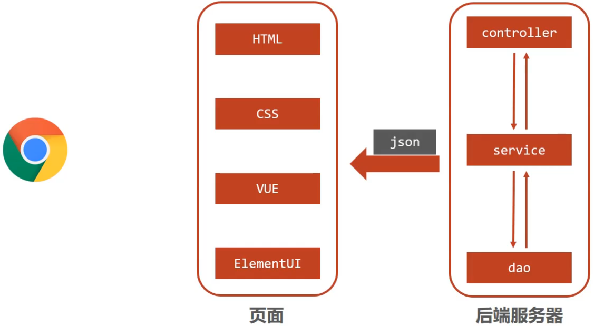
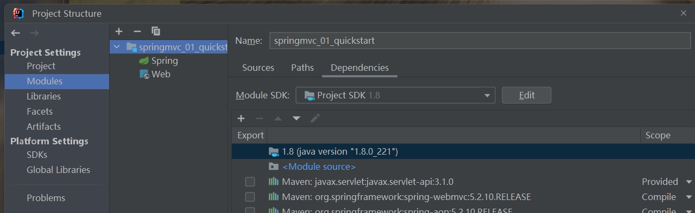

SpringMVC是隶属于Spring框架的一部分，主要是用来进行Web开发，是对Servlet进行了封装。

## web开发


浏览器发送一个请求给后端服务器，后端服务器现在是使用**Servlet**来接收请求和数据。

* 如果所有的处理都交给Servlet来处理的话，所有的东西都耦合在一起，对后期的维护和扩展极为不利；

**解决办法**：将后端服务器Servlet拆分成三层，分别是`web`、`service`和`dao`；

* **web层**主要由servlet来处理，负责响应页面请求以及反馈结果给前端；
* **service层**主要负责业务逻辑的处理；
* **dao层**主要负责数据的增删改查操作；

但是，servlet处理请求和数据的时候，存在问题：**一个servlet只能处理一个请求**。

**解决办法**：针对web层进行了优化，采用了MVC设计模式，将其设计为`Model`、`view`和`controller`。

* `controller`负责请求和数据的接收，接收后将其转发给service进行业务处理；
* `service`根据需要会调用`dao`对数据进行增删改查；
* `dao`把数据处理完后将结果交给service,service再交给controller；

* `controller`根据需求组装成Model和View，Model和View组合起来生成页面转发给前端浏览器；
* 优点：controller可以处理多个请求，并对请求进行分发，执行不同的业务操作。

上面的模式因为是**同步调用**，性能慢慢的跟不上需求。现在**异步调用**是比较流行的一种处理方式。

**异步调用**



采用异步调用时，后端不需要返回view视图，将其去除。

前端通过异步调用的方式进行交互，后台需要返回**json格式**的数据。

SpringMVC==主要==负责的就是：

* `controller`如何接收请求和数据；
* 如何将请求和数据转发给业务层；
* 如何将响应数据转换成json发回到前端；

**SpringMVC**：

* SpringMVC是一种基于Java实现MVC模型的轻量级Web框架；

* 优点

    * 使用简单、开发便捷(相比于Servlet)；
    * 灵活性强；


## 入门案例

### 项目创建

1. 创建web工程(Maven结构)；

    

    右键项目，添加webapp文件（有插件的情况下，没有插件就手动创建）

    

    手动：

    

2. 设置tomcat服务器，加载web工程(tomcat插件)；

3. 导入坐标(SpringMVC+Servlet)；

    ```xml
    <?xml version="1.0" encoding="UTF-8"?>
    <project xmlns="http://maven.apache.org/POM/4.0.0"
             xmlns:xsi="http://www.w3.org/2001/XMLSchema-instance"
             xsi:schemaLocation="http://maven.apache.org/POM/4.0.0 http://maven.apache.org/xsd/maven-4.0.0.xsd">
      <modelVersion>4.0.0</modelVersion>
      <groupId>com.itheima</groupId>
      <artifactId>springmvc_01_quickstart</artifactId>
      <version>1.0-SNAPSHOT</version>
      <packaging>war</packaging>
      <dependencies>
        <dependency>
          <groupId>javax.servlet</groupId>
          <artifactId>javax.servlet-api</artifactId>
          <version>3.1.0</version>
          <scope>provided</scope>
        </dependency>
        <dependency>
          <groupId>org.springframework</groupId>
          <artifactId>spring-webmvc</artifactId>
          <version>5.2.10.RELEASE</version>
        </dependency>
      </dependencies>
      <build>
        <plugins>
          <plugin>
            <groupId>org.apache.tomcat.maven</groupId>
            <artifactId>tomcat7-maven-plugin</artifactId>
            <version>2.1</version>
            <configuration>
              <port>80</port>
              <path>/</path>
            </configuration>
          </plugin>
        </plugins>
      </build>
    </project>
    ```

    **注意**:servlet的坐标为什么需要添加provided ?

    - 如果不设置，默认的范围是`compile`，在编译、运行、测试时均有效。如果运行有效的话就会和tomcat中的servlet-api包发生冲突，导致启动报错。
    - `provided`代表的是该包只在编译和测试的时候用，**运行的时候无效**。直接使用tomcat中的，就避免冲突。

    **注意**：当**端口冲突**的时候，在pom.xml文件中更改其他端口。

4. 定义处理请求的功能类(UserController)、各种类；

    

    ```java
    // 配置类
    @Configuration
    @ComponentScan("com")
    public class SpringMvcConfig {
    }
    
    // controller包
    @Controller
    public class UserController {
    
        @RequestMapping("/list")
        @ResponseBody
        public String list() {
            System.out.println("list");
            return "{'info':'springmvc'}";
        }
    }
    
    // 注意返回格式应该使用json  字符串不行。
    ```

5. 设置请求映射(配置映射关系)；

    配置类：`ServletContainersInitConfig`

    ```java
    
    public class ServletContainersInitConfig extends
            AbstractDispatcherServletInitializer {
        //加载springmvc配置类
        protected WebApplicationContext createServletApplicationContext() {
    //初始化WebApplicationContext对象
            AnnotationConfigWebApplicationContext ctx = new
                    AnnotationConfigWebApplicationContext();
    //加载指定配置类
            ctx.register(SpringConfig.class);
            return ctx;
        }
        //设置由springmvc控制器处理的请求映射路径
        protected String[] getServletMappings() {
            return new String[]{"/"};
        }
        //加载spring配置类
        protected WebApplicationContext createRootApplicationContext() {
            return null;
        }
    }
    ```

6. 将SpringMVC设定加载到Tomcat容器中；

    编辑运行：`edit configuration`。


#### 重点

- SpringMVC是基于Spring的，在pom.xml**只导入了spring-webmvc的依赖**，因为它会自动依赖 spring相关坐标；
- `AbstractDispatcherServletInitializer`类是SpringMVC提供的快速初始化Web3.0容器的抽象类；
- `AbstractDispatcherServletInitializer`提供了**三个接口方法**供用户实现： 
    - `createServletApplicationContext`方法，创建Servlet容器时，加载SpringMVC对应的bean并放入WebApplicationContext对象范围中，而WebApplicationContext的作用范围为ServletContext范围，即整个web容器范围；
    - `getServletMappings`方法，设定SpringMVC对应的请求映射路径，即SpringMVC拦截哪些请求；
    - `createRootApplicationContext`方法，如果创建Servlet容器时需要加载非SpringMVC 对应的bean,使用当前方法进行，使用方式和createServletApplicationContext相同；
    - `createServletApplicationContext`用来加载SpringMVC环境；
    - `createRootApplicationContext`用来加载Spring环境；

## SpringMVC工作流程分析

分两个阶段来分析，分别是**启动服务器初始化过程**和**单次请求过程**。


###  启动服务器初始化过程

1. 服务器启动，执行`ServletContainersInitConfig`类，**初始化web容器**，功能类似于以前的web.xml；

2. 执行`createServletApplicationContext`方法，创建了WebApplicationContext对象，该方法加载SpringMVC的配置类SpringMvcConfig来初始化SpringMVC的容器；

3. 加载SpringMvcConfig配置类；

4. 执行`@ComponentScan`加载对应的bean；

5. 加载`UserController`，每个@RequestMapping的名称对应一个具体的方法；

    即将**接口和方法**对应起来。

6. 执行`getServletMappings`方法，设定SpringMVC拦截请求的路径规则；

    ```java
    protected String[] getServletMappings() {
    	return new String[]{"/"};
    }
    ```

    `/`代表所拦截请求的路径规则，只有被拦截后才能交给SpringMVC来处理请求。

### 单次请求过程

浏览器请求对应地址的过程。

1. 发送请求：http://localhost/save；
2. web容器发现该请求满足SpringMVC拦截规则，将请求交给SpringMVC处理；
3. 解析请求路径/save；
4. 由/save匹配执行对应的方法save()；
5. 执行save()；
6. 检测到**有`@ResponseBody`**直接将save()方法的返回值作为响应体返回给请求方；

### bean加载控制

项目中一般有`controller`、`dao`、`service`和`config`包，其中**controller、service和dao**这些类都需要被容器管理成bean对象：

- **SpringMVC**加载其相关bean(表现层bean)，**也就是controller包下的类**；
- **Spring**控制的bean：**业务bean(Service)**和**功能bean(DataSource,SqlSessionFactoryBean,MapperScannerConfigurer等)**

如何实现各管各的bean？

**解决方案**：加载Spring控制的bean的时候**排除**掉SpringMVC控制的bean。

**排除方式**：

- 方式一：`Spring`加载的bean设定扫描范围为精准范围，例如service包、dao包等；

    将spring配置类的扫描范围设置为精准范围。

    ```java
    @Configuration
    @ComponentScan({"com.example.service","com.example.dao"})
    public class SpringConfig {
    }
    ```

- 方式二：`Spring`加载的bean设定扫描范围为com.xxx，排除掉controller包中的bean；

    使用`ComponentScan`注解的属性：

    ```java
    @Configuration
    @ComponentScan(value="com.itheima",
                   excludeFilters=@ComponentScan.Filter(
                       type = FilterType.ANNOTATION,
                       classes = Controller.class
                   )
                  )
    public class SpringConfig {
    }
    ```

    `excludeFilters`属性：设置扫描加载bean时，排除的过滤规则；

    `type`属性：设置排除规则，FilterType.ANNOTATION表示**按照bean定义时的注解类型进行排除**：

    - `ANNOTATION`：**按照注解类型**排除（@Service、@Controller等）；（记这一个即可）
    - `ASSIGNABLE_TYPE`：按照指定的类型过滤；
    - `ASPECTJ`：按照Aspectj表达式排除，基本上不会用；
    - `REGEX`：按照正则表达式排除；
    - `CUSTOM`：按照自定义规则排除；

- 方式三：不区分Spring与SpringMVC的环境，加载到同一个环境中；（了解）

### Servlet配置类简化

`ServletContainersInitConfig`的简化写法：

```java
public class ServletContainersInitConfig extends AbstractAnnotationConfigDispatcherServletInitializer { 
    protected Class<?>[] getServletConfigClasses() {
        return new Class[]{SpringMvcConfig.class};
    }
    protected String[] getServletMappings() {
        return new String[]{"/"};
    }
    protected Class<?>[] getRootConfigClasses() {
        return new Class[0];
    }
}
```

## 请求

SpringMVC是web层的框架，主要的作用是接收请求、接收数据、响应结果。

### 设置请求映射路径

使用`@RequestMapping`注解：

在Controller类的上面添加RequestMapping注解，为当前类的方法统一添加路径。RequestMapping注解的值里的`/`可要可不要。

```java
@RequestMapping("book")
public class BookController {

    @GetMapping("listAll")
    public void listAll() {
        System.out.println("dfgdf");
    }
}
```

### 请求参数

#### get请求

即将参数放入地址中。


##### 传递单个参数

**请求地址**：localhost:9999/book/listAll?name=lisa

```java
    @GetMapping("/listAll")
    public void listAll(String name) {
        System.out.println(name);
    }
```

##### 传递多个参数

**请求地址**：localhost:9999/book/listAll?name=lisa&age=12

```java
    @GetMapping("/listAll")
    public void listAll(String name, String age) {
        System.out.println(name);
        System.out.println(age);
    }
```

##### 乱码问题

传递的参数是中文的时候可能会出现乱码。

**Tomcat8.5以后**的版本已经处理了中文乱码的问题，但是IDEA中的 Tomcat插件目前只到Tomcat7，所以需要修改pom.xml来解决GET请求中文乱码问题：

`uriEncoding`标签设置。

```xml
<build>
    <plugins>
        <plugin>
            <groupId>org.apache.tomcat.maven</groupId>
            <artifactId>tomcat7-maven-plugin</artifactId>
            <version>2.1</version>
            <configuration>
                <port>80</port><!--tomcat端口号-->
                <path>/</path> <!--虚拟目录-->
                
                
                <uriEncoding>UTF-8</uriEncoding><!--访问路径编解码字符集-->
                
                
            </configuration>
        </plugin>
    </plugins>
</build>
```

#### post请求

##### 传递参数

即将参数作为表单数据传递，放在请求体中，不在地址中出现。


```java
    @PostMapping("/listAll")
    public void listAll(String name, String age) {
        System.out.println(name);
        System.out.println(age);
    }
```

##### 乱码问题

在`ServletContainersInitConfig`配置类中配置过滤器：

重写`getServletFilters`方法。

```java
@Override
protected Filter[] getServletFilters() {
    CharacterEncodingFilter filter = new CharacterEncodingFilter();
    filter.setEncoding("UTF-8");
    return new Filter[]{filter};
}
```

注意：CharacterEncodingFilter是在spring-web包中，需要导包。

```xml
    <dependency>
      <groupId>org.springframework</groupId>
      <artifactId>spring-web</artifactId>
      <version>5.2.10.RELEASE</version>
    </dependency>
```

### 五种参数类型

普通参数、POJO类型参数、嵌套POJO类型参数、数组类型参数、集合类型参数。

#### 普通参数

即上面的get请求的传参方式。

将参数放入地址，传递的时候**参数名要和对应的方法的参数名相同**，否则接收不到。

或者使用RequestPaam注解指定参数名和方法中的参数名，使其一一对应：

```java
    @PostMapping("/listAll")
    public void listAll(@RequestParam("name") String userName, @RequestParam("age") String userAge) {
        System.out.println(userName);
        System.out.println(userAge);
    }
```

#### POJO数据类型

参数：

```java
public class User {
    private String name;
    private Integer age;
    // 要添加getter和setter方法
}
```

**注意**：传递的参数中的key要和pojo类中的属性名称一致。

##### get请求

客户端：


服务器端：

```java
    @GetMapping("/listAll")
    public void listAll(User user) {
        System.out.println(user.toString());
    }
```

##### post请求

客户端：


服务器端：

```java
    @PostMapping("/listAll")
    public void listAll(User user) {
        System.out.println(user.toString());
    }
```


#### 嵌套POJO类型参数

```java
public class Wife {
    private String name;
    private Integer age;
}
public class User {
    private String name;
    private Integer age;
    private Wife wife;
}
// getter 和 setter都省略
```

与上面pojo类型参数类似，请求参数名与形参对象属性名相同，按照嵌套的格式传递参数即可。

##### get请求

客户端：


服务器端：

```java
    @GetMapping("/listAll")
    public void listAll(User user) {
        System.out.println(user.toString());
    }
```


##### post请求

客户端：


服务器端：

```java
    @PostMapping("/listAll")
    public void listAll(User user) {
        System.out.println(user.toString());
    }
```

#### 数组类型参数

##### get请求

客户端：


服务器端：

方法中的数组参数名须和前端传递来的一样。

```java
    @GetMapping("/listAll")
    public void listAll(String[] hobbies) {
        for (int i = 0; i < hobbies.length; i ++) {
            System.out.print(hobbies[i] + ' ');
        }
    }
```

##### post请求

客服端：


服务器端：

```java
    @PostMapping("/listAll")
    public void listAll(String[] hobbies) {
        for (int i = 0; i < hobbies.length; i ++) {
            System.out.print(hobbies[i] + ' ');
        }
    }
```

#### 集合类型参数

客户端：


服务器端：

不能这样：

```java
public void listAll(List <String> hobbies)
```

原因：SpringMVC将List看做是一个POJO对象来处理，将其创建一个对象并准备把前端的数据封装到对象中，但是List是一个接口无法创建对象，所以报错。

**解决办法**：使用`@RequestParam`注解。

**集合参数**：同名请求参数可以使用`@RequestParam`注解**映射到对应名称的集合对象中作为数据**。

```java
public void listAll(@RequestParam List<String> likes){
}
```

### JSON数据传输

1、SpringMVC默认使用的是jackson来处理json的转换，在pom.xml添加jackson依赖：

```xml
<dependency>
    <groupId>com.fasterxml.jackson.core</groupId>
    <artifactId>jackson-databind</artifactId>
    <version>2.9.0</version>
</dependency>
```

2、在SpringMVC的配置类中开启`SpringMVC`的注解支持，这里面就包含了将JSON转换成对象的功能：

```java
@EnableWebMvc
public class SpringMvcConfig {
}
```

#### 发送JSON数据

##### 普通数组

客户端：


服务器端：

使用**`@RequestBody`**注解将外部传递的json数组数据映射到形参的集合对象中作为数据。

```java
    @GetMapping("/listAll")
    public void listAll(@RequestBody List<String> hobbies) {
        for (String hobby: hobbies) {
            System.out.println(hobby);
        }
    }
    @PostMapping("/listAll")
    public void listAll(@RequestBody List<String> hobbies) {
        for (String hobby: hobbies) {
            System.out.println(hobby);
        }
    }
```

##### JSON对象

数据格式如下：

```json
{
    "name":"apple",
    "age":12
}
```

客户端：


服务器端：

```java
    @GetMapping("/listAll")
    public void listAll(@RequestBody Wife wife) {
        System.out.println(wife.toString());
    }
    @PostMapping("/listAll")
    public void listAll(@RequestBody Wife wife) {
        System.out.println(wife.toString());
    }
```

**注意**：方法参数中必须用`@RequestBody`注解，不然无法解析json格式数据。

参数中，`RequestBody`注解只能有一个，`RequestParam`注解可以有多个。

@RequestBody主要用于处理请求体中的数据,适用于POST请求;而@RequestParam主要用于处理URL或表单中的参数,适用于GET请求。

嵌套形式的json也是一样传即可。

##### JSON对象数组

数据格式：

```json
[
    {"name":"apple", "age":12},
    {"name":"apple", "age":12}
]
```

客户端：


服务器端：

```java
    @GetMapping("/listAll")
    public void listAll(@RequestBody List<Wife> wife) {
        for (Wife wife1: wife) {
            System.out.println(wife1.toString());
        }
    }
```

#### 总结

1. 导入jackson包；
2. 客户端传递JSON数据；
3. 开启SpringMVC注解驱动：在配置类上添加@EnableWebMvc注解；
4. Controller方法的参数前添加@RequestBody注解；

**@RequestBody与@RequestParam区别**

- `@RequestParam`用于接收url地址传参，表单传参【application/x-www-formurlencoded】；

- @RequestBody用于接收json数据【application/json】；

### 日期类型参数

#### 默认日期

默认的日期格式：yyyy/mm/dd hh:mm:ss。

客户端：


服务器端：

```java
@GetMapping("getDate")
public void time(Date date) {
    System.out.println(date);
}
```

`Date`类可以接受默认格式的时间日期参数。

#### 自定义时间日期格式

使用`@DateTimeFormat`注解：

```java
    @GetMapping("getDate")
    public void time(@DateTimeFormat(pattern = "yyyy.mm.dd") Date date) {
        System.out.println(date);
    }
```

`pattern`属性指定传递的时间日期格式，客户端需要根据指定格式进行传递。

## 响应

服务器端收到客户端的请求后，进行响应。

使用`@ResponseBody`注解将返回的字符串作为文本数据，如果不加，则会将返回的字符串当作页面名称去查找。

**`@ResponseBody`**

- 该注解可以写在类上或者方法上;
- 写在类上就是该类下的所有方法都有@ReponseBody功能;
- 当方法上有@ReponseBody注解后:
    - 方法的**返回值为字符串**，会将其**作为文本内容**直接响应给前端;
    - 方法的**返回值为对象**，会将对象**转换成JSON**响应给前端

### 返回文本数据

```java
    @GetMapping("test")
    @ResponseBody
    public String test() {
        return "返回";
    }
```

### 返回JSON数据

跟json有关的都要在springmvc中添加`@EnableWebMvc`注解。

**返回JSON数据就是返回对象**。

```java
    @GetMapping("test")
    @ResponseBody
    public Wife test() {
        Wife wife = new Wife();
        wife.setAge(1);
        wife.setName("dasa");
        return wife;
    }
```


### 返回POJO集合

```java
    @GetMapping("test")
    @ResponseBody
    public List<Wife> test() {
        Wife wife = new Wife();
        wife.setAge(1);
        wife.setName("dasa");
        List<Wife> list = new ArrayList<>();
        list.add(wife);
        list.add(wife);
        return list;
    }
```

返回数据：

```json
[
    {
        "name": "dasa",
        "age": 1
    },
    {
        "name": "dasa",
        "age": 1
    }
]
```

## Rest风格

REST（Representational State Transfer），表现形式状态转换,它是一种软件架构风格。

当我们想表示一个网络资源的时候，可以使用两种方式。

- 传统风格资源描述形式：
    - http://localhost/user/getById?id=1——查询id为1的用户信息
    -  http://localhost/user/saveUser——保存用户信息 
- REST风格描述形式：
    - http://localhost/user/1 
    - http://localhost/user 

传统方式一般是一个请求url对应一种操作，这样做不仅麻烦，也不安全，很容易就会被看出要干什么。

REST风格的描述，使请求地址变的简单了，并且光看请求URL并不是很能猜出来该URL的具体功能。

**REST的优点**:

- 隐藏资源的访问行为，无法通过地址得知对资源是何种操作；
- 书写简化；

**常用方式**：

- http://localhost/users——查询全部用户信息——GET（查询）；
- http://localhost/users/1——查询指定用户信息——GET（查询）；
- http://localhost/users——添加用户信息——POST（新增/保存）；
- http://localhost/users——修改用户信息——PUT（修改/更新）；
- http://localhost/users/1——删除用户信息——DELETE（删除）；

**GET请求**用来**查询**；**POST**请求用来**新增**；**PUT请求**用来**修改**；**DELETE**请求用来**删除**。

**`RESTful`**：根据REST风格对资源进行访问。

**代码实现**

**增**：

```

```

