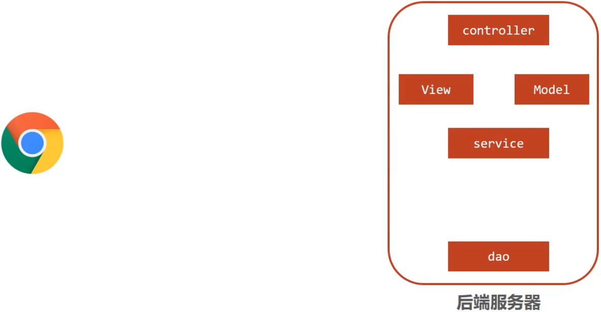
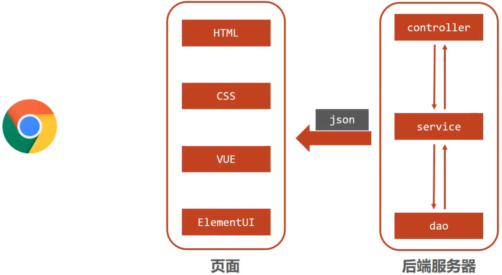

SpringMVC是隶属于Spring框架的一部分，主要是用来进行Web开发，是对Servlet进行了封装。

## web开发

浏览器发送一个请求给后端服务器，后端服务器现在是使用**Servlet**来接收请求和数据。

* 如果所有的处理都交给Servlet来处理的话，所有的东西都耦合在一起，对后期的维护和扩展极为不利；

**解决办法**：将后端服务器Servlet拆分成三层，分别是`web`、`service`和`dao`；

* **web层**主要由servlet来处理，负责响应页面请求以及反馈结果给前端；
* **service层**主要负责业务逻辑的处理；
* **dao层**主要负责数据的增删改查操作；

但是，servlet处理请求和数据的时候，存在问题：**一个servlet只能处理一个请求**。

**解决办法**：针对web层进行了优化，采用了MVC设计模式，将其设计为`Model`、`view`和`controller`。

* `controller`负责请求和数据的接收，接收后将其转发给service进行业务处理；
* `service`根据需要会调用`dao`对数据进行增删改查；
* `dao`把数据处理完后将结果交给service,service再交给controller；

* `controller`根据需求组装成Model和View，Model和View组合起来生成页面转发给前端浏览器；
* 优点：controller可以处理多个请求，并对请求进行分发，执行不同的业务操作。

上面的模式因为是**同步调用**，性能慢慢的跟不上需求。现在**异步调用**是比较流行的一种处理方式。

**异步调用**

采用异步调用时，后端不需要返回view视图，将其去除。

前端通过异步调用的方式进行交互，后台需要返回**json格式**的数据。

SpringMVC==主要==负责的就是：

* `controller`如何接收请求和数据；
* 如何将请求和数据转发给业务层；
* 如何将响应数据转换成json发回到前端；

**SpringMVC**：

* SpringMVC是一种基于Java实现MVC模型的轻量级Web框架；

* 优点

    * 使用简单、开发便捷(相比于Servlet)；
    * 灵活性强；

## 入门案例

