# Spring Security

Spring Security是一个功能强大且高度可定制的**身份验证和访问控制**框架。Spring Security致力于为Java应用程序提供身份验证和授权的能力。像所有Spring项目一样，Spring Security的真正强大之处在于它可以轻松扩展以满足定制需求的能力。

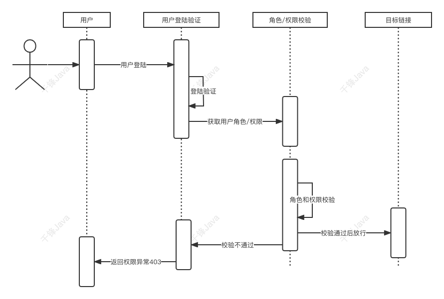

Spring Security两大重要核心功能：**用户认证（Authentication）**和**用户授权（Authorization）**。

- **用户认证Authentication**：验证某个用户是否为系统中的合法主体，也就是说**用户能否访问该系统**。用户认证一般要求用户提供用户名和密码。系统通过校验用户名和密码来完成认证过程。
- **用户授权Authorization**：验证某个用户**是否有权限执行某个操作**。在一个系统中，不同用户所有的权限是不同的。比如对一个文件来说，有的用户只能进行读取，有的用户既能读取，又能修改。一般来说，系统会为不同的用户分配不同的角色，而每个角色则对应一系列的权限。

## 概述

Spring Security**本质**上就是一个过滤器链，通过过滤器拦截请求并进行处理。

### 一般流程

1. 用户登录时，前端将用户输入的**用户名、密码信息传输到后台**，后台**用一个类对象将其封装起来**，通常使用的是`UsernamePasswordAuthenticationToken`这个类。
2. 程序负责**验证**这个类对象。验证方法是调用Service根据username从数据库中取用户信息到实体类的实例中，比较两者的密码，如果密码正确就成功登陆，同时把包含着用户的用户名、密码、所具有的权限等信息的类对象放到`SecurityContextHolder`（安全上下文容器，类似Session）中去。
3. 用户访问一个资源的时候，**首先判断是否是受限资源。如果是的话还要判断当前是否未登录，没有的话就跳到登录页面。**
4. 如果用户已经登录，访问一个受限资源的时候，程序要根据url去数据库中取出该资源所对应的所有可以访问的角色，然后拿着当前用户的所有角色一一对比，判断用户是否可以访问（这里就是和**权限**相关）。

## 入门项目

### 默认认证

创建一个 spring boot 项目，主要安装两个依赖：

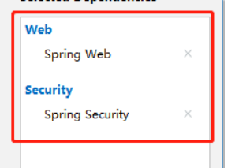

```xml
 <dependency>
     <groupId>org.springframework.boot</groupId>
     <artifactId>spring-boot-starter-security</artifactId>
</dependency>
<dependency>
    <groupId>org.springframework.boot</groupId>
    <artifactId>spring-boot-starter-web</artifactId>
</dependency>
```

**解决跨域**

```java
package com.springsecurity.config;

import org.springframework.context.annotation.Configuration;
import org.springframework.web.servlet.config.annotation.CorsRegistry;
import org.springframework.web.servlet.config.annotation.WebMvcConfigurer;

// 解决跨域
@Configuration
public class CorsConfig implements WebMvcConfigurer {
    @Override
    public void addCorsMappings(CorsRegistry registry) {
        registry.addMapping("/**")
                .allowedOriginPatterns("*")
                .allowedMethods("GET", "HEAD", "POST", "PUT", "DELETE", "OPTIONS")
                .allowCredentials(true)
                .maxAge(3600)
                .allowedHeaders("*");
    }
}

```

**控制层设置接口**

```java
@RestController
@RequestMapping("/test")
public class Test {

    @GetMapping("/test")
    public String test() {
        System.out.println("收到请求");
        return "success";
    }
}
```

**访问后端**

在浏览器中输入：`http://localhost:8888/test/test`

会自动进行认证，调转到登录页面：

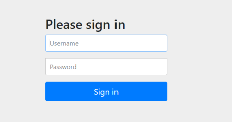

用户名默认为：`user`，密码后端自动生成：


这是引入了SpringSecurity依赖之后默认的登陆页面，即实现了“认证”。

### 默认认证实现原理

仅仅只需要引入一个依赖，就开启了认证，如何实现的？

首先，Spring Security 中 `认证、授权` 等功能都是基于 `过滤器` 完成的。

1. 观察控制台日志输出：

    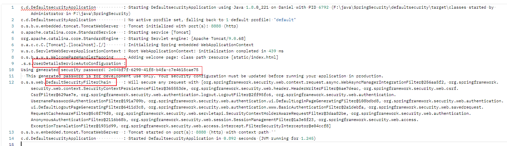

    项目启动时候的**临时密码**是**org.springframework.boot.autoconfigure.security.servlet**包下的`UserDetailsServiceAutoConfiguration`类生成的，部分源码如下：

    ```java
        private String getOrDeducePassword(SecurityProperties.User user, PasswordEncoder encoder) {
            String password = user.getPassword();
            if (user.isPasswordGenerated()) {
                logger.warn(String.format("%n%nUsing generated security password: %s%n%nThis generated password is for development use only. Your security configuration must be updated before running your application in production.%n", user.getPassword()));
            }
    
            return encoder == null && !PASSWORD_ALGORITHM_PATTERN.matcher(password).matches() ? "{noop}" + password : password;
        }
    ```

2. 从源码可以看出，密码来自于 `SecurityProperties` 的内部类 `User`：`SecurityProperties.User user`，查看源码：

    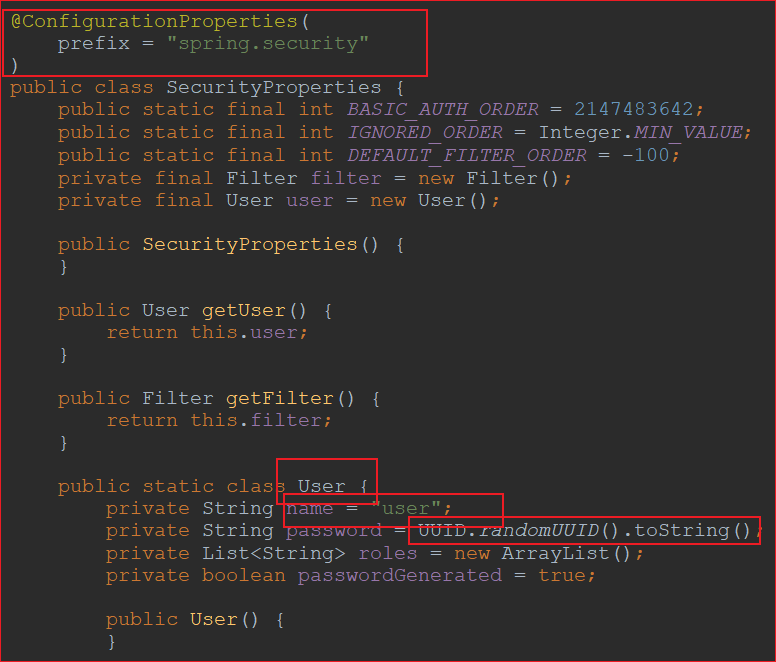

    `User` 是 `SecurityProperties` 的静态内部类，默认的用户名为“user”，且密码的生成方式是UUID。

    **此外**：该类上添加了注解 `@ConfigurationProperties`：

    - 该注解的作用：获取配置文件中的属性值，类似于 `@Value` 注解。
    - 前缀 `prefix` ：定义了哪些外部属性将绑定到类的字段上。

    所以我们可以在配置文件中自己设置用户名和密码：

    ```yaml
    spring:
      security:
        user:
          password: admin
          name: admin
    ```

    分析`User`静态类的源码可以发现，属性 `passwordGenerated` 的值默认为true，即密码不指定的话默认是自动生成的，如果我们在配置文件中重新设置了用户密码，则创建`User`的时候进行setter注入就会将配置文件的用户名密码注入，并将`passwordGenerated`设置为`false`，此时`UserDetailsServiceAutoConfiguration`类的就不会打印密码了，如下图。

    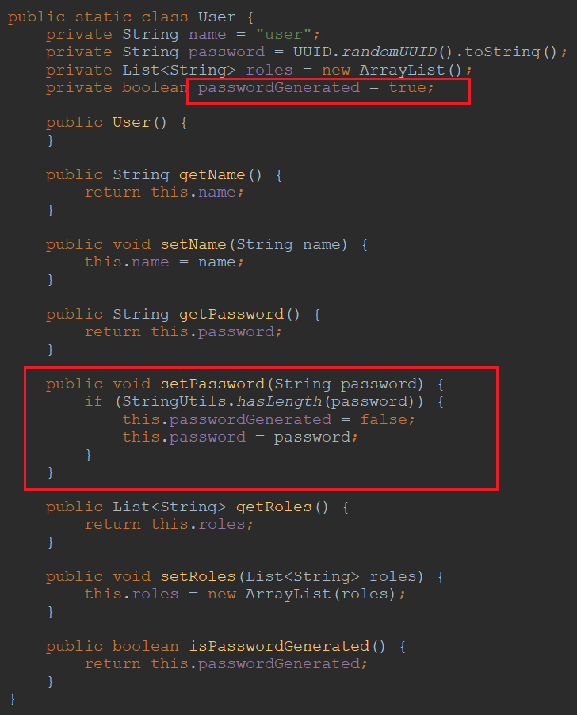

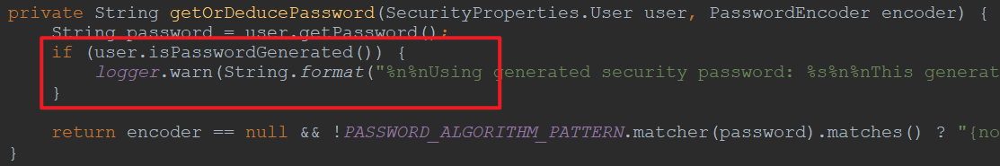

继续看 `UserDetailsServiceAutoConfiguration`，该类以 `AutoConfiguration` 结尾，即自动配置类，该类上添加的注解：

```java
注释：
Auto-configuration for a Spring Security in-memory AuthenticationManager. Adds an InMemoryUserDetailsManager with a default user and generated password. This can be disabled by providing a bean of type AuthenticationManager, AuthenticationProvider or UserDetailsService.

自动配置内存中的Spring Security AuthenticationManager。使用默认用户和生成的密码添加InMemoryUserDetailsManager。可以通过提供AuthenticationManager、AuthenticationProvider或UserDetailsService类型的bean来禁用。

@Configuration(
    proxyBeanMethods = false
)
@ConditionalOnClass({AuthenticationManager.class})
@ConditionalOnBean({ObjectPostProcessor.class})
@ConditionalOnMissingBean(
    value = {AuthenticationManager.class, AuthenticationProvider.class, UserDetailsService.class, AuthenticationManagerResolver.class},
    type = {"org.springframework.security.oauth2.jwt.JwtDecoder", "org.springframework.security.oauth2.server.resource.introspection.OpaqueTokenIntrospector", "org.springframework.security.oauth2.client.registration.ClientRegistrationRepository"}
)
public class UserDetailsServiceAutoConfiguration {
```

**关于自动配置类**：Spring Boot的自动配置功能是**通过条件注解实现**的。这种方式可以根据一定的条件来判断是否需要自动配置某些组件，在程序启动时**自动装配这些组件到Spring容器中**。这样,我们在使用Spring Boot时，只需要添加相应的依赖，就可以直接使用这些组件了，无需手动配置。

所以 该类是自动配置类，可以使用默认的用户和生成的密码。

注解 `@ConditionalOnXxxxx` 和 `@ConditionalOnMissingXxxxx` 表示项目中包含`Xxxxx` 和不包含 `Xxxxx` 的时候才满足条件。

注意：`@ConditionalOnMissingXxxxx`的参数value表示数组里所有Xxxxx都不在项目中才满足条件。

所以该类在类路径下存在 `AuthenticationManager` 、在Spring 容器中存在`Bean` `ObjectPostProcessor` 并且不存在`Bean` `AuthenticationManager` , `AuthenticationProvider` , `UserDetailsService` 的情况下生效。

因此可以手动实现value数组中任何一个使得条件不生效，从而不使用 `UserDetailsServiceAutoConfiguration` 自动配置类。（注释中也说明了）

所以一般自己实现 `UserDetailsService` 接口。

接着分析 `UserDetailsServiceAutoConfiguration` 的源码：

```java
public class UserDetailsServiceAutoConfiguration {

	private static final String NOOP_PASSWORD_PREFIX = "{noop}";

	private static final Pattern PASSWORD_ALGORITHM_PATTERN = Pattern.compile("^\\{.+}.*$");

	private static final Log logger = LogFactory.getLog(UserDetailsServiceAutoConfiguration.class);

	@Bean
	@Lazy
	public InMemoryUserDetailsManager inMemoryUserDetailsManager(SecurityProperties properties,
			ObjectProvider<PasswordEncoder> passwordEncoder) {
		SecurityProperties.User user = properties.getUser();
		List<String> roles = user.getRoles();
		return new InMemoryUserDetailsManager(
				User.withUsername(user.getName()).password(getOrDeducePassword(user, passwordEncoder.getIfAvailable()))
						.roles(StringUtils.toStringArray(roles)).build());
	}

	private String getOrDeducePassword(SecurityProperties.User user, PasswordEncoder encoder) {
		String password = user.getPassword();
		if (user.isPasswordGenerated()) {
			logger.warn(String.format(
					"%n%nUsing generated security password: %s%n%nThis generated password is for development use only. "
							+ "Your security configuration must be updated before running your application in "
							+ "production.%n",
					user.getPassword()));
		}
		if (encoder != null || PASSWORD_ALGORITHM_PATTERN.matcher(password).matches()) {
			return password;
		}
		return NOOP_PASSWORD_PREFIX + password;
	}

}
```

该类通过 `@Lazy` （该注解表示只有在需要使用时才会被实例化,以减少启动时间和资源占用）初始化了类名为 `InMemoryUserDetailsManager` 的内存用户管理器：

```java
public class InMemoryUserDetailsManager implements UserDetailsManager, UserDetailsPasswordService {
    .....
}
public interface UserDetailsManager extends UserDetailsService {
    .....
}
```

该管理器实现了 `UserDetailsManager` 接口，通过配置注入了一个默认的 UserDetails 存在内存中，就是我们上面用的那个 user ，每次启动 user 都是动态生成的。而 `UserDetailsManager` 接口又继承了 `UserDetailsService` 接口（注意：接口可以继承接口，实体类不能继承接口，只能实现），所以实际上还是用 `UserDetailsService` 加载用户信息。

下面看 `UserDetailsService` 接口:

```java
public interface UserDetailsService {
    UserDetails loadUserByUsername(String username) throws UsernameNotFoundException;
}
```

一个很简单的接口，只有一个方法：`loadUserByUsername`，即通过用户名来加载用户。这个方法主要用于从系统数据中查询并加载具体的用户到 Spring Security中。返回类型是 `UserDetails`，交给spring。

`UserDetails`：该接口是**提供用户信息的核心接口**。该接口**的实现仅仅存储用户的信息**。后续会将该接口提供的用户信息封装到认证对象 Authentication 中去。 UserDetails 默认提供了：

```java
public interface UserDetails extends Serializable {
	// 用户的权限集， 默认需要添加 ROLE_ 前缀
	Collection<? extends GrantedAuthority> getAuthorities();
	// 用户的加密后的密码， 不加密会使用 {noop} 前缀
	String getPassword();
    // 应用内唯一的用户名
	String getUsername();
    // 账户是否过期
	boolean isAccountNonExpired();
    // 账户是否锁定
	boolean isAccountNonLocked();
    // 凭证是否过期
	boolean isCredentialsNonExpired();
	// 用户是否可用
	boolean isEnabled();

}
```

可以实现该接口以存储更多的用户信息。比如用户的邮箱、手机 号等等。通常我们使用其实现类：

```java
org.springframework.security.core.userdetails.User
```

该类内置一个建造器 UserBuilder 会很方便地帮助我们构建 UserDetails 对象。

**自定义用户管理**

上面提到过默认使用的是`UserDetailsManager` 的实现类 `InMemoryUserDetailsManager` 进行用户管理，我们可以定义自己的 UserDetailsManager Bean，实现我们需要的用户管理逻辑：

```JAVA
@Configuration
public class UserDetailsServiceConfiguration {

    @Bean
    public UserDetailsRepository userDetailsRepository() {
        UserDetailsRepository userDetailsRepository = new UserDetailsRepository();

        // 为了让我们的登录能够运行 这里我们初始化一个用户Felordcn 密码采用明文 当你在密码12345上使用了前缀{noop} 意味着你的密码不使用加密，authorities 一定不能为空 这代表用户的角色权限集合
        UserDetails felordcn = User.withUsername("Felordcn").password("{noop}12345").authorities(AuthorityUtils.NO_AUTHORITIES).build();
        userDetailsRepository.createUser(felordcn);
        return userDetailsRepository;
    }


    @Bean
    public UserDetailsManager userDetailsManager(UserDetailsRepository userDetailsRepository) {
        return new UserDetailsManager() {
            @Override
            public void createUser(UserDetails user) {
                userDetailsRepository.createUser(user);
            }

            @Override
            public void updateUser(UserDetails user) {
                userDetailsRepository.updateUser(user);
            }

            @Override
            public void deleteUser(String username) {
                userDetailsRepository.deleteUser(username);
            }

            @Override
            public void changePassword(String oldPassword, String newPassword) {
                userDetailsRepository.changePassword(oldPassword, newPassword);
            }

            @Override
            public boolean userExists(String username) {
                return userDetailsRepository.userExists(username);
            }

            @Override
            public UserDetails loadUserByUsername(String username) throws UsernameNotFoundException {
                return userDetailsRepository.loadUserByUsername(username);
            }
        };
    }
}


/**
 * 自己实现 UserDetailsManager
 * @author Daniel
 * @date 2023/12/28
 */
public class UserDetailsRepository {

    /**
     * 替换为 抽象DAO接口可进行用户持久化操作
     */
    private Map<String, UserDetails> users = new HashMap<>();

    /**
     * Create user.
     * @param user the user
     */
    public void createUser(UserDetails user) {
        users.putIfAbsent(user.getUsername(), user);
    }

    /**
     * Update user.
     * @param user the user
     */
    public void updateUser(UserDetails user) {
        users.put(user.getUsername(), user);
    }

    /**
     * Delete user.
     * @param username the username
     */
    public void deleteUser(String username) {
        users.remove(username);
    }

    /**
     * Change password.
     * @param oldPassword the old password
     * @param newPassword the new password
     */
    public void changePassword(String oldPassword, String newPassword) {
        Authentication currentUser = SecurityContextHolder.getContext()
                .getAuthentication();

        if (currentUser == null) {
            // This would indicate bad coding somewhere
            throw new AccessDeniedException(
                    "Can't change password as no Authentication object found in context "
                            + "for current user.");
        }

        String username = currentUser.getName();

        UserDetails user = users.get(username);


        if (user == null) {
            throw new IllegalStateException("Current user doesn't exist in database.");
        }

        // 实现具体的更新密码逻辑
    }

    /**
     * User exists boolean.
     * @param username the username
     * @return the boolean
     */
    public boolean userExists(String username) {
        return users.containsKey(username);
    }

    /**
     * Load user by username user details.
     * @param username the username
     * @return the user details
     * @throws UsernameNotFoundException the username not found exception
     */
    public UserDetails loadUserByUsername(String username) throws UsernameNotFoundException {
        return users.get(username);
    }

}
```

只需要将 UserDetailsRepository 中的 users 属性替代为抽象的Dao接口，即可使用数据库来管理用户。


### 密码加密

```java
	public InMemoryUserDetailsManager inMemoryUserDetailsManager(SecurityProperties properties,	ObjectProvider<PasswordEncoder> passwordEncoder) {
```

上面的`UserDetailsServiceAutoConfiguration` 的源码里在初始化 `InMemoryUserDetailsManager` 的时候，传入了一个参数：`ObjectProvider<PasswordEncoder>`，这里的 **`PasswordEncoder`** 就是对密码进行编码的工具接口。该接口只有两个功能： 匹配验证、密码编码。

```java
public interface PasswordEncoder {
    String encode(CharSequence rawPassword); // 编码
    boolean matches(CharSequence rawPassword, String encodedPassword); // 匹配 明文和密文
    // 该方法用来判断当前密码是否需要升级，可以看见这个方法是默认的
	// 默认返回值是 false
    default boolean upgradeEncoding(String encodedPassword) {
        return false;
    }
}
```

`PasswordEncoder` 的常见实现类：

- `BCryptPasswordEncoder`：加密密码；
- `DelegatingPasswordEncoder`：委托密码编码器；

#### 委托密码编码器 DelegatingPasswordEncoder

Delegate，委托。即自己不干，交给别人干。

之所以使用 委托 设计模式，而不直接使用具体的加密类，原因：

- 有很多应用程序使用旧的密码编码不容易进行迁移；
- 密码存储的最佳实践就被更改了；
- 而 Spring Security 作为一个框架而言，不能这么轻易地带破坏性的更改。

使用 DelegatingPasswordEncoder 的好处：

- 确保使用的密码编码可以进行规范的正确的密码存储；
- 允许以现代和遗留格式验证密码；
- 允许将来升级编码；

该类的成员属性：

```java
public class DelegatingPasswordEncoder implements PasswordEncoder {
    // 默认包裹 id 的前、后缀
	private static final String PREFIX = "{";
	private static final String SUFFIX = "}";
	private final String idForEncode; // 通过id来匹配具体编码器，即用来匹配 PasswordEncoder的实现类
	private final PasswordEncoder passwordEncoderForEncode; // 实际采用的加密的方案对象，即PasswordEncoder的某种实现类 如BCryptPasswordEncoder
	private final Map<String, PasswordEncoder> idToPasswordEncoder; // 用来维护多个 idForEncode 与具体 PasswordEncoder 实现类的映射关系。 DelegatingPasswordEncoder 初始化时
装载进去，会在初始化时进行一些规则校验。
	private PasswordEncoder defaultPasswordEncoderForMatches = new UnmappedIdPasswordEncoder(); // 默认的密码匹配器，上面的 Map 中都不存在就用它来执行 	matches 方法进行匹配验证。这是一个内部类实现。
	}
```

`DelegatingPasswordEncoder` 中的编码方法：

```java
	@Override
	public String encode(CharSequence rawPassword) {
		return PREFIX + this.idForEncode + SUFFIX + this.passwordEncoderForEncode.encode(rawPassword);
	}
```

可以看出编码规则：`{idForEncode}encodePassword`，即 前缀 + 编码方式 + 后缀 + 原始密码编码后的密码。

`DelegatingPasswordEncoder` 中的**密码匹配**方法：

```java
	@Override
	// rawPassword 是原密码，即用户输入的
    // prefixEncodePassword 可以理解为是保存在数据库中的密码（数据库保存的是密文）
	public boolean matches(CharSequence rawPassword, String prefixEncodedPassword) {
		if (rawPassword == null && prefixEncodedPassword == null) {
			return true;
		}
		String id = extractId(prefixEncodedPassword); // 从 {id} 中获取 id
		PasswordEncoder delegate = this.idToPasswordEncoder.get(id); // 找出id对应的编码类（PasswordEncoder实现类）
		if (delegate == null) { // 找不到就用默认的比对方式
			return this.defaultPasswordEncoderForMatches.matches(rawPassword, prefixEncodedPassword);
		}
        // 找到了就进行比对
		String encodedPassword = extractEncodedPassword(prefixEncodedPassword);
		return delegate.matches(rawPassword, encodedPassword);
	}
```

传入**原始密码和遵循 `{idForEncode}encodePassword` 规则的密码编码串**。通过获取编码方式id ( idForEncode ) 来从 DelegatingPasswordEncoder 中的映射集合 idToPasswordEncoder 中获取具体的 PasswordEncoder 实现类进行匹配校验。找不到就使用默认的`defaultPasswordEncoderForMatches`方法生成的属性 `UnmappedIdPasswordEncoder`。

#### 密码器静态工厂 PasswordEncoderFactories

DelegatingPasswordEncoder 在哪实例化的？

`PasswordEncoderFactories`，密码编码器工厂类，专门制造 `PasswordEncoder`。

```java
public final class PasswordEncoderFactories {

	private PasswordEncoderFactories() {
	}

	@SuppressWarnings("deprecation")
	public static PasswordEncoder createDelegatingPasswordEncoder() {
		String encodingId = "bcrypt";
		Map<String, PasswordEncoder> encoders = new HashMap<>();
		encoders.put(encodingId, new BCryptPasswordEncoder());
		encoders.put("ldap", new org.springframework.security.crypto.password.LdapShaPasswordEncoder());
		encoders.put("MD4", new org.springframework.security.crypto.password.Md4PasswordEncoder());
		encoders.put("MD5", new org.springframework.security.crypto.password.MessageDigestPasswordEncoder("MD5"));
		encoders.put("noop", org.springframework.security.crypto.password.NoOpPasswordEncoder.getInstance());
		encoders.put("pbkdf2", new Pbkdf2PasswordEncoder());
		encoders.put("scrypt", new SCryptPasswordEncoder());
		encoders.put("SHA-1", new org.springframework.security.crypto.password.MessageDigestPasswordEncoder("SHA-1"));
		encoders.put("SHA-256",
				new org.springframework.security.crypto.password.MessageDigestPasswordEncoder("SHA-256"));
		encoders.put("sha256", new org.springframework.security.crypto.password.StandardPasswordEncoder());
		encoders.put("argon2", new Argon2PasswordEncoder());
		return new DelegatingPasswordEncoder(encodingId, encoders);
	}

}

```

可以看出，该类是一个静态类，只提供了初始化 `PasswordEncoder` 的方法 `createDelegatingPasswordEncoder`，即创建`DelegatingPasswordEncoder`。

从方法中可以看出 id 是 `bcrypt`，即默认采用的是`bcrypt`进行编码。

另外，可以看出 `"noop"` 对应的是 `NoOpPasswordEncoder`，即不加密密码，直接使用明文和明文对比，所以前面默认认证以及我们实现管理器的时候密码都会加上 `{noop}`，以此来使用 `NoOpPasswordEncoder` 取代默认的密码加密方式。这也是为啥前端输入的密码xxx能和我们设置的{noop}xxx匹配上。

这样做的好处：增加了”**多样性**“，即使以后我们对密码编码规则进行替换，也不会影响以前的用户使用的加密编码规则。

**Spring Security 加载 PasswordEncoder 的规则**

`PasswordEncoderFactories` 又是从哪来的呢？

`WebSecurityConfigurerAdapter`里面可以找到：

```java
static class LazyPasswordEncoder implements PasswordEncoder {
        private ApplicationContext applicationContext;
        private PasswordEncoder passwordEncoder;
        LazyPasswordEncoder(ApplicationContext applicationContext) {
            this.applicationContext = applicationContext;
        }
        public String encode(CharSequence rawPassword) {
            return this.getPasswordEncoder().encode(rawPassword);
        }
        public boolean matches(CharSequence rawPassword, String encodedPassword) {
            return this.getPasswordEncoder().matches(rawPassword, encodedPassword);
        }
        public boolean upgradeEncoding(String encodedPassword) {
            return this.getPasswordEncoder().upgradeEncoding(encodedPassword);
        }
    -------------------------这里----------------
        private PasswordEncoder getPasswordEncoder() {
            if (this.passwordEncoder != null) {
                return this.passwordEncoder;
            } else {
                PasswordEncoder passwordEncoder = (PasswordEncoder)this.getBeanOrNull(PasswordEncoder.class);
                if (passwordEncoder == null) {
                    passwordEncoder = PasswordEncoderFactories.createDelegatingPasswordEncoder();
                }

                this.passwordEncoder = passwordEncoder;
                return passwordEncoder;
            }
        }
        private <T> T getBeanOrNull(Class<T> type) {
            try {
                return this.applicationContext.getBean(type);
            } catch (NoSuchBeanDefinitionException var3) {
                return null;
            }
        }
        public String toString() {
            return this.getPasswordEncoder().toString();
        }
    }
```

在一个实现了 `PasswordEncoder` 接口的静态内部类 `LazyPasswordEncoder` 里面。

该类的 `getPasswordEncoder` 方法中用到了 `PasswordEncoderFactories`。

该方法返回 `PasswordEncoder`，如果现有`PasswordEncoder`非空，则直接返回；否则先从spring的ioc容器中找，找到了就返回；如果找不到就用 `PasswordEncoderFactories` 创建的，即用`PasswordEncoderFactories`的方法`createDelegatingPasswordEncoder`创建 `DelegatingPasswordEncoder`。

上面的**自定义用户管理** 就是先创建了一个 `UserDetailsRepository` 代理默认的 `InMemoryUserDetailsManager` 的功能，将其作为参数（通过bean注解注入容器）传递给`UserDetailsManager`（），再注入spring容器中，这样spring就能找到`PasswordEncoder`，不适用默认的。缺点：只能用一种 PasswordEncoder 进行密码比对，好处就是专一、密码前不用写{id}。

如果不写 {id} 呢？会怎么密码比对呢？

从源码中可以看出：执行DelegatingPasswordEncoder 中的默认方案（找不到匹配的时候），即会抛出java.lang.IllegalArgumentException: There is no PasswordEncoder mapped for the id "null"的异常。

### 关于bcrypt

前面提到过默认的编码方式是`bcrypt`加密。

`bcrypt` 使用的是布鲁斯·施内尔在1993年发布的 Blowfish 加密算法。 `bcrypt` 算法将 salt 随机并混入最终加密后的密码，验证时也无需单独提供之前的 salt ，从而无需单独处理 salt 问题。加密后的格式一般为：  

```tex
$2a$10$/bTVvqqlH9UiE0ZJZ7N2Me3RIgUCdgMheyTgV0B4cMCSokPa.6oCa
```

`$` 是分割符，无意义; `2a` 是 bcrypt 加密版本号； `10` 是 cost 的值；而后的前 22 位是 `salt` 值；再然后的字符串就是密码的密文。

**bcrypt 特点**

- 慢，难以破解。
- 同样的密码每次使用 bcrypt 编码，密码暗文都是不一样的。


配置类中注入PaswordEncoder的bean对象：

```java
@Bean
public PasswordEncoder password() {
    return new BCryptPasswordEncoder();
}
```

通常而言，在配置类中注入PaswordEncoder的bean对象是必须的，因为Spring Security 要求容器中必须有 PasswordEncoder 实例,才能加密。所以当我们手动加入自定义登录逻辑时，要求必须给容器注入PaswordEncoder的bean对象。

如果不想使用它自带的加密方式，也可以使用自己的。**写一个类实现PasswordEncoder接口。**

注意：同一个字符串，通过加密生成的字符串每次都不一样，但是尽管每次都不一样，也都不会匹配失败。即同一个密码生成的密文每次都不一样，但是无论是哪个密文，最终都能解析成功。

### 自定义账户密码

#### 配置文件中定义

在application配置文件中设置账户密码：

```yaml
spring:
  security:
    user:
      name: apple
      password: 123456
```

这是认证的时候账号密码就变成了配置文件里的。

#### 通过数据库

1. 编写配置类

    ```java
    @Configuration
    public class SecurityConfig extends WebSecurityConfigurerAdapter {
        @Autowired
        private UserDetailsService userDetailsService;
    
        @Override
        protected void configure(AuthenticationManagerBuilder auth) throws Exception {
            auth.userDetailsService(userDetailsService)
                    .passwordEncoder(password());
        }
    
        @Bean
        public PasswordEncoder password() {
            return new BCryptPasswordEncoder();
        }
    }
    
    ```

2. 层

    ```java
    // controller
    @RestController
    @RequestMapping("test")
    public class TestController {
    
        @Autowired
        private UserMapper userMapper;
    
    
        @GetMapping("test")
        public void test() {
            System.out.println("测试");
            System.out.println(userMapper.selectList(null).size());
        }
    
    }
    
    // mapper
    @Mapper
    public interface UserMapper extends BaseMapper<User> {
    }
    
    // pojo
    @Data
    @NoArgsConstructor
    @AllArgsConstructor
    @TableName("user")
    public class User {
        private Integer id;
        private String username;
        private String password;
    }
    
    ```

3. service层

    注意：这个UserDetailsService接口是springsecurity内部提供的，只需要编写对应的实现类即可完成用户认证授权。

    ```java
    package com.sqlsecurity.service;
    
    import com.baomidou.mybatisplus.core.conditions.query.QueryWrapper;
    import com.sqlsecurity.dao.UserMapper;
    import com.sqlsecurity.pojo.User;
    import org.springframework.beans.factory.annotation.Autowired;
    import org.springframework.security.core.GrantedAuthority;
    import org.springframework.security.core.authority.AuthorityUtils;
    import org.springframework.security.core.authority.SimpleGrantedAuthority;
    import org.springframework.security.core.userdetails.UserDetails;
    import org.springframework.security.core.userdetails.UserDetailsService;
    import org.springframework.security.core.userdetails.UsernameNotFoundException;
    import org.springframework.security.crypto.bcrypt.BCryptPasswordEncoder;
    import org.springframework.stereotype.Service;
    
    import java.util.ArrayList;
    import java.util.Collection;
    import java.util.List;
    
    @Service
    public class MyUserDetailsService implements UserDetailsService {
    
        @Autowired
        private UserMapper userMapper;
    
    
        @Override
        public UserDetails loadUserByUsername(String username) throws UsernameNotFoundException {
            // 授权
            List<GrantedAuthority> authorities = AuthorityUtils.commaSeparatedStringToAuthorityList("manager");
            /**
             * 根据用户名从数据库查询符合要求的用户
             * user 是spring security默认的用户类  包含username password；或者自定义用户类
             * 该项目用的是mybatis-plus
             */
            QueryWrapper<com.sqlsecurity.pojo.User> queryWrapper =  new QueryWrapper<>();
            queryWrapper.eq("username", username);
            User user = userMapper.selectOne(queryWrapper);
            if (user == null) { // 排除用户不存在异常
                throw new UsernameNotFoundException("用户不存在");
            }
            // 三个参数分别是 用户名 密码 用户权限
            return new org.springframework.security.core.userdetails.User(
                    user.getUsername(),
                    user.getPassword(),
                    authorities
            );
        }
    }
    
    ```

4. 配置数据库连接

    ```yaml
    server:
      port: 8888
    spring:
      datasource:
        driver-class-name: com.mysql.cj.jdbc.Driver
        url: jdbc:mysql://localhost:3306/database?serverTimezone=Asia/Shanghai&useUnicode=true&characterEncoding=utf-8
        username: root
        password: xxxxxx
    ```

用数据库中的用户名和密码即可进行登录认证。

1. 系统默认提供一个登录页面和登录接口。

2. 密码校验是由SpringSecurity内部完成。不需要我们来处理。我们只需要**将数据库查出来的用户名和密码交给spring security提供的User类即可**。即service层里的`loadUserByUsername`方法返回值。

#### 自定义登录页面

默认情况下使用的是springsecurity自带的登录页面，我们可以自己实现。

主要是通过配置类中，重写configure（HttpSecurity http）的这个方法：

```java
    @Override
    protected void configure(HttpSecurity http) throws Exception {
        http.formLogin()//表示进行表单登录
                .loginPage("/login.html")//自定义的登录页面
                .loginProcessingUrl("/login")//传一个登录处理的接口，不管你传的接口地址是什么，都由Security内部完成。当然也可以自己写这个接口，这样就不会用系统来完成登录处理校验用户名密码了。还有就是如果自定义了登录页面，那么登录处理的接口loginProcessingUrl项一定要写，不管是写系统自带的，还是你自己写的处理接口都行，否则报错。
                .usernameParameter("username") //定义登录时的用户名的key，即表单中name的值，默认为username
                .passwordParameter("password") //定义登录时的密码key,即表单中name的值，默认是password
                //设置的这两个用户名、密码的key，如果不自己写登录页面的话，可以不用写，因为系统默认提供的页面就是这个默认值。写了的话，一定要与表单页面中定义的name值一致才行。
                .defaultSuccessUrl("/pages/main")//登录成功跳转到的页面或者路径。当然，如果你不是从登录页面登录的，那么拦截之后会进入到你的请求路径（或页面）中
                .failureUrl("/login.html")//登录失败跳转到的页面
                .permitAll() //指和登录表单相关的接口 都通过，不拦截
                .and()
                .authorizeRequests()//开启授权请求
                .antMatchers("/","/pages/main","/login").permitAll()//设置哪些路径放行，不需要认证	不需要登录可以访问的
                .anyRequest().authenticated()//除开上面的，其他所有请求全部都需要认证。因为还没有用户授权，所以目前所有的接口登录后都能访问。
                .and()
                .csrf().disable();//关闭csrf防护
    }
```

### 授权

不授权的情况下，当用户认证完成后可以访问所有路径。

#### 为路径授权

**示例**：

```java
.antMatchers("/security/test").hasAuthority("admin")
//表示当前登录用户，只有具有权限名称为admin时，才能访问此地址
```

在配置文件重写的`configure`方法中添加授权：

```java
    @Override
    protected void configure(HttpSecurity http) throws Exception {
        http.formLogin()//表示进行表单登录
                .loginPage("/login.html")//自定义的登录页面
                .loginProcessingUrl("/login")//传一个登录处理的接口，不管你传的接口地址是什么，都由Security内部完成。当然也可以自己写这个接口，这样就不会用系统来完成登录处理校验用户名密码了。还有就是如果自定义了登录页面，那么登录处理的接口loginProcessingUrl项一定要写，不管是写系统自带的，还是你自己写的处理接口都行，否则报错。
                .usernameParameter("username") //定义登录时的用户名的key，即表单中name的值，默认为username
                .passwordParameter("password") //定义登录时的密码key,即表单中name的值，默认是password
                //设置的这两个用户名、密码的key，如果不自己写登录页面的话，可以不用写，因为系统默认提供的页面就是这个默认值。写了的话，一定要与表单页面中定义的name值一致才行。
                .defaultSuccessUrl("/pages/main")//登录成功跳转到的页面或者路径。当然，如果你不是从登录页面登录的，那么拦截之后会进入到你的请求路径（或页面）中
                .failureUrl("/login.html")//登录失败跳转到的页面
                .permitAll() //指和登录表单相关的接口 都通过，不拦截
                .and()
                .authorizeRequests()//开启授权请求
                .antMatchers("/","/pages/main","/login").permitAll()//设置哪些路径放行，不需要认证	
                .antMatchers("/security/test").hasAuthority("admin")//表示当前登录用户，只有具有权限名称为admin时，才能访问此地址
                .anyRequest().authenticated()//除开上面的，其他所有请求全部都需要认证。
                .and()
                .csrf().disable();//关闭csrf防护
    }
```

#### 为用户添加权限

##### 用方法授权

在`UserDetailsService`实现类中，重写方法中增加权限

```java
 @Override
    public UserDetails loadUserByUsername(String username) throws UsernameNotFoundException {
        // 授权
        List<GrantedAuthority> authorities = AuthorityUtils.commaSeparatedStringToAuthorityList("manager, admin");
```

也可以通过查询数据库获取权限，然后添加进去。

常见授权方法：

- `hasAuthority(String authority)`

    意思是如果当主体具有指定的权限，则返回true，否则返回false。

    注意：该方法只能判断是否有某种权限。

    ```java
    // 配置类中设置访问权限
    .antMatchers("/security/test").hasAuthority("admin")
    
    // UserDetailsService实现类中设置
    List<GrantedAuthority> authorities = AuthorityUtils.commaSeparatedStringToAuthorityList("manager, admin");
    ```

- `hasAnyAuthority(String... authorities)`

    当前主体**具有任意一个权限**，则返回true，否则返回false。

    ```java
    .antMatchers("/security/test").hasAnyAuthority("admin, role1, role1")
    ```

    参数是逗号分隔得字符串。

- `hasRole(String role)`

    当前主体具有指定的角色，则返回true，否则返回false。

    ```java
    .antMatchers("/security/test").hasRole("sale")
    ```

    注意：如果是hasRole，那么**在userDetailsService实现类中的角色名前面一定要添加ROLE_**

    ```java
    List<GrantedAuthority> authorities = AuthorityUtils.commaSeparatedStringToAuthorityList("manager, ROLE_admin");
    ```

- `hasAnyRole(String... roles)`

    当前主**体具备任何一个角色**，则返回true，否则返回false。

    ```java
    .antMatchers("/security/test").hasAnyRole("sale, ROLE_role1")
    ```

##### 用注解授权

也可以**在对应的控制器方法上**，添加对应的注解来进行授权访问。

首先需要在启动类上添加注解：

```java
@EnableGlobalMethodSecurity(securedEnabled=true)
```

在方法上授权的注解：`@Secured`

判断**是否具有某个角色**。注意：匹配的角色字符串需要添加前缀“ROLE_“。

```java
@Secured({"ROLE_role1", "ROLE_role2"})
@GetMapping("test")
public void test() {
    
}
```

注意：该注解表示只要拥有任一角色即可访问，如果需要同时满足多个角色，该注解就无法满足需求。

使用注解：**`@PreAuthorize`**

```java
@PreAuthorize("hasAnyRole('normal','admin')")
```

可以判断是否**具有某个角色**或**权限**，也判断是否**同时具有某些角色**或**权限**

```java
@PreAuthorize("hasRole('ROLE_ADMIN') and hasRole('ROLE_USER')")
```

```java
@PostAuthorize： 在目标方法执行之后进行权限校验。
@PostFilter： 在目标方法执行之后对方法的返回结果进行过滤。
@PreAuthorize： 在目标方法执行之前进行权限校验。
@PreFilter： 在目标方法执行之前对方法参数进行过滤。
@secured： 访问目标方法必须具备相应的角色。
@DenyAll： 拒绝所有访问。
@PermitAll： 允许所有访问。
@RolesAllowed： 访问目标方法必须具备相应的角色。
```

## Spring Security 自动配置

springboot的自动配置都在 `spring-boot-autoconfigure-版本号` 下。

### Spring Boot 下 Spring Security 的自动配置

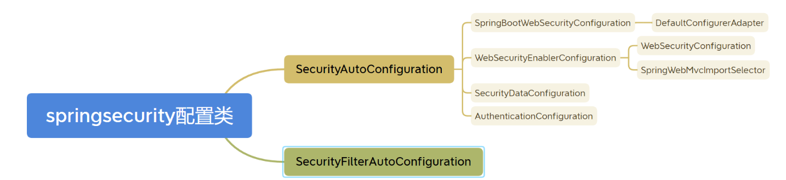

`org.springframework.boot.autoconfigure.security.servlet` 中找到Spring Security 关于 Servlet 的自动配置类。

#### SecurityAutoConfiguration

先来看`SecurityAutoConfiguration`：

```java
@Configuration(proxyBeanMethods = false)
@ConditionalOnClass(DefaultAuthenticationEventPublisher.class)
@EnableConfigurationProperties(SecurityProperties.class)
@Import({ SpringBootWebSecurityConfiguration.class, WebSecurityEnablerConfiguration.class,
		SecurityDataConfiguration.class, ErrorPageSecurityFilterConfiguration.class })
public class SecurityAutoConfiguration {

	@Bean
	@ConditionalOnMissingBean(AuthenticationEventPublisher.class)
	public DefaultAuthenticationEventPublisher authenticationEventPublisher(ApplicationEventPublisher publisher) {
		return new DefaultAuthenticationEventPublisher(publisher);
	}

}
```

该类是安全配置类（自动配置），该类引入（ @import ）了 `SpringBootWebSecurityConfiguration` 、 `WebSecurityEnablerConfiguration` 、`SecurityDataConfiguration` 和 `ErrorPageSecurityFilterConfiguration` 四个配置类，让这四个模块的类生效。是一个复合配置，是 Spring Security 自动配置最重要的一个类之一。Spring Boot 自动配置经常使用这种方式以达到灵活配置的目的，这也是我们研究 Spring Security 自动配置的一个重要入口。

~~同时 SecurityAutoConfiguration 还将 DefaultAuthenticationEventPublisher 作为默认的 AuthenticationEventPublisher 注入 Spring IoC 容器。~~不懂

接着看引入的四个配置类：

- `SpringBootWebSecurityConfiguration.class`：

    ```java
    @Configuration(proxyBeanMethods = false)
    @ConditionalOnDefaultWebSecurity
    @ConditionalOnWebApplication(type = Type.SERVLET)
    class SpringBootWebSecurityConfiguration {
    
    	@Bean
    	@Order(SecurityProperties.BASIC_AUTH_ORDER)
    	SecurityFilterChain defaultSecurityFilterChain(HttpSecurity http) throws Exception {
    		http
                .authorizeRequests()
                .anyRequest()
                .authenticated()
                .and()
                .formLogin()
                .and()
                .httpBasic();
    		return http.build();
    	}
    
    }
    ```

    通过源码可以知道，默认对所有请求进行认证。**这也是为什么在引入 Spring Security 中没有任何配置情况下，请求会被拦截的原因。**

    该类引入了注解：`@ConditionalOnDefaultWebSecurity`，即默认的安全配置：

    ```java
    // @ConditionalOnDefaultWebSecurity注解
    @Target({ ElementType.TYPE, ElementType.METHOD })
    @Retention(RetentionPolicy.RUNTIME)
    @Documented
    @Conditional(DefaultWebSecurityCondition.class)
    public @interface ConditionalOnDefaultWebSecurity {
    
    }
    该注解包含了DefaultWebSecurityCondition类
    class DefaultWebSecurityCondition extends AllNestedConditions {
    
    	DefaultWebSecurityCondition() {
    		super(ConfigurationPhase.REGISTER_BEAN);
    	}
    
    	@ConditionalOnClass({ SecurityFilterChain.class, HttpSecurity.class })
    	static class Classes {
    
    	}
    
    	@ConditionalOnMissingBean({ WebSecurityConfigurerAdapter.class, SecurityFilterChain.class })
    	static class Beans {
    
    	}
    
    }
    ```

    可以看出，生效的条件：存在 `SecurityFilterChain.class`, `HttpSecurity.class` 和  没有自定义 `WebSecurityConfigurerAdapter.class`, `SecurityFilterChain.class`。

- `WebSecurityEnablerConfiguration.class`：该类文件如下，可以看到其中声明了@EnableWebSecurity注解，该配置类会在 `SpringBootWebSecurityConfiguration` **注入 Spring IoC 容器后启用** @EnableWebSecurity 注解：

    ```java
    @Configuration(
        proxyBeanMethods = false
    )
    // 只有当BeanFactory中没有指定的bean的时候才能匹配，主要是用来做自动配置的，当程序没有配置指定的类的时候，就会使用默认配置
    @ConditionalOnMissingBean(
       name = {"springSecurityFilterChain"}
    )
    @ConditionalOnClass({EnableWebSecurity.class})
    @ConditionalOnWebApplication(
        type = Type.SERVLET
    )
    @EnableWebSecurity
    class WebSecurityEnablerConfiguration {
        WebSecurityEnablerConfiguration() {
        }
    }
    ```

#### @EnableWebSecurity 注解

源码

```java
@Retention(RetentionPolicy.RUNTIME)
@Target({ElementType.TYPE})
@Documented
@Import({WebSecurityConfiguration.class, SpringWebMvcImportSelector.class, OAuth2ImportSelector.class, HttpSecurityConfiguration.class})
@EnableGlobalAuthentication
@Configuration
public @interface EnableWebSecurity {
    boolean debug() default false;
}
```

`@Enable*` 这类注解都是带配置导入的注解。通过导入一些配置来启用一些特定功能。

可以看出，`@EnableWebSecurity` 导入了 `WebSecurityConfiguration` 、 `SpringWebMvcImportSelector` 、 `OAuth2ImportSelector` 以及启用了 `@EnableGlobalAuthentication` 注解。

- **WebSecurityConfiguration**：

    **WebSecurity** 是 Spring Security 提供的用于配置 Web 安全的主要配置类之一。它提供了一些方法，用于配置 Spring Security 的一些基本行为，如忽略某些请求、设置用户信息来源、启用 HTTPS 等。

    简单的说，这个类的作用就是用来创建`FilterChainProxy`，`FilterChainProxy`是一个Servlet Filter，他是一组`SecurityFilterChain`的代理，用于管理这些`SecurityFilterChain`

    首先，`FilterChainProxy`是`SpringSecurity`提供的基于Servlet标准的过滤器，他可以被Servlet容器使用。`SecurityFilterChain`是SpringSecurity提供的自有安全过滤器链，他不是基于Servlet标准的过滤器。`SpringSecurity`使用`FilterChainProxy`管理一组SecurityFilterChain，这样就可以通过代理的方式将`SpringSecurity`自有的滤器链应用于Servlet容器。

    然后，当前配置类会加载容器中所有的WebSecurityConfigurer配置类、WebSecurityCustomizer配置类（5.4以后）、SecurityFilterChain过滤器链。这些都是用于配置生成一个WebSecurity。

    接着，当WebSecurity实例被构建完成后，会使用WebSecurity去创建一个FilterChainProxy，这个FilterChainProxy会被放到容器中。

    **属性字段**：

    ```java
    @Configuration(
        proxyBeanMethods = false
    )
    public class WebSecurityConfiguration implements ImportAware, BeanClassLoaderAware {
        // SpringSecurity的FilterChainProxy的建造器
        private WebSecurity webSecurity; 
        // 标识是否开启debug模式，来自注解@EnableWebSecurity的属性debug 默认false
        private Boolean debugEnabled;
        // SpringSecurity的配置类列表
        private List<SecurityConfigurer<Filter, WebSecurity>> webSecurityConfigurers;
    	// SpringSecurity的核心过滤器链的列表
        private List<SecurityFilterChain> securityFilterChains = Collections.emptyList();
        // 用户自定义WebSecurity的配置类列表（5.4版本之后新增的配置类）
        private List<WebSecurityCustomizer> webSecurityCustomizers = Collections.emptyList();
        // 一个类加载器
        private ClassLoader beanClassLoader;
        // 对象后处理器（这里依赖注入的是AutowireBeanFactoryObjectPostProcessor）
        @Autowired(
            required = false
        )
        private ObjectPostProcessor<Object> objectObjectPostProcessor;
    ```
    **主要方法**：

    1. springSecurityFilterChain

        构建Spring Security 核心过滤器 Spring Security Filter Chain ，`Bean ID` 为 `springSecurityFilterChain`。

        首先，在这个方法中**首先会判断是否有用户自定义的WebSecurityConfigurer和SecurityFilterChain**：

        - 如果这两种自定义实例同时存在则会抛出异常。
        - 如果只存在SecurityFilterChains，将其设置到已经被创建的webSecurity中。
        - 如果这两个自定义实例都不存在，则会创建一个默认的WebSecurityConfigurerAdapter配置，并将其设置到已经被创建的webSecurity中。

        然后，调用webSecurity.build()方法（最后一行）创建一个FilterChainProxy，返回的是Bean，会被放到容器中。

        ```java
        @Bean(
            name = {"springSecurityFilterChain"}
        )
        public Filter springSecurityFilterChain() throws Exception {
            boolean hasConfigurers = this.webSecurityConfigurers != null && !this.webSecurityConfigurers.isEmpty();
            boolean hasFilterChain = !this.securityFilterChains.isEmpty();
            Assert.state(!hasConfigurers || !hasFilterChain, "Found WebSecurityConfigurerAdapter as well as SecurityFilterChain. Please select just one.");
            if (!hasConfigurers && !hasFilterChain) {
                WebSecurityConfigurerAdapter adapter = (WebSecurityConfigurerAdapter)this.objectObjectPostProcessor.postProcess(new WebSecurityConfigurerAdapter() {
                });
                this.webSecurity.apply(adapter);
            }
        ------------------------设置webSecurity的拦截器链和拦截器
            Iterator var7 = this.securityFilterChains.iterator();
        
            while(true) {
                while(var7.hasNext()) {
                    SecurityFilterChain securityFilterChain = (SecurityFilterChain)var7.next();
                    this.webSecurity.addSecurityFilterChainBuilder(() -> {
                        return securityFilterChain;
                    });
                    Iterator var5 = securityFilterChain.getFilters().iterator();
        
                    while(var5.hasNext()) {
                        Filter filter = (Filter)var5.next();
                        if (filter instanceof FilterSecurityInterceptor) {
                            this.webSecurity.securityInterceptor((FilterSecurityInterceptor)filter);
                            break;
                        }
                    }
                }
        ----------------------------用户的一些自定义配置webSecurity
                var7 = this.webSecurityCustomizers.iterator();
        
                while(var7.hasNext()) {
                    WebSecurityCustomizer customizer = (WebSecurityCustomizer)var7.next();
                    customizer.customize(this.webSecurity);
                }
                return (Filter)this.webSecurity.build();
            }
        }
        ```

    2. setFilterChainProxySecurityConfigurer

        创建一个WebSecurity实例。

        将注解参数列表中@Value()注解引入的所有WebSecurityConfigurer配置设置到WebSecurity实例中。同时初始化了当前配置类的两个属性值webSecurity和webSecurityConfigurers。

        @Value()引入方式就是调用 `AutowiredWebSecurityConfigurersIgnoreParents` 的方法
    
        ```java
            /**
            * 获取并设置容器中已经加载的所有WebSecurityConfigurer实例用于配置，初始化一个WebSecurity
            * 
            * @param objectPostProcessor   后处理对象（AutowireBeanFactoryObjectPostProcessor）
            * @param webSecurityConfigurers 用户自定义的配置（WebSecurityConfigurerAdapter的子类或是WebSecurityConfigurer接口的实现）
            * @throws Exception
            */
            
            @Autowired(
                required = false
            )
            public void setFilterChainProxySecurityConfigurer(ObjectPostProcessor<Object> objectPostProcessor, @Value("#{@autowiredWebSecurityConfigurersIgnoreParents.getWebSecurityConfigurers()}") List<SecurityConfigurer<Filter, WebSecurity>> webSecurityConfigurers) throws Exception {
                // 初始化webSecurity
                this.webSecurity = (WebSecurity)objectPostProcessor.postProcess(new WebSecurity(objectPostProcessor));
                // 是否开启debug
                if (this.debugEnabled != null) {
                    this.webSecurity.debug(this.debugEnabled);
                }
            
                webSecurityConfigurers.sort(WebSecurityConfiguration.AnnotationAwareOrderComparator.INSTANCE);
                Integer previousOrder = null;
                Object previousConfig = null;
            
                Iterator var5;
                SecurityConfigurer config;
                for(var5 = webSecurityConfigurers.iterator(); var5.hasNext(); previousConfig = config) {
                    config = (SecurityConfigurer)var5.next();
                    Integer order = WebSecurityConfiguration.AnnotationAwareOrderComparator.lookupOrder(config);
                    if (previousOrder != null && previousOrder.equals(order)) {
                        throw new IllegalStateException("@Order on WebSecurityConfigurers must be unique. Order of " + order + " was already used on " + previousConfig + ", so it cannot be used on " + config + " too.");
                    }
            
                    previousOrder = order;
                }
            
                var5 = webSecurityConfigurers.iterator();
            	// 将配置添加到webSecurity中
                while(var5.hasNext()) {
                    config = (SecurityConfigurer)var5.next();
                    this.webSecurity.apply(config);
                }
               	// 将配置类列表复制到类属性webSecurityConfigurers上
                this.webSecurityConfigurers = webSecurityConfigurers;
            }
        ```
    
        ​    
    
    3. 从当前bean容器中获取所有的WebSecurityConfigurer bean
    
        这些WebSecurityConfigurer通常是由开发人员实现的配置类，并且继承自 WebSecurityConfigurerAdapter。
    
        ```java
        // 初始化一个AutowiredWebSecurityConfigurersIgnoreParents实例，用于加载容器中的所有WebSecurityConfigurer实例
        
        @Bean
        public static AutowiredWebSecurityConfigurersIgnoreParents autowiredWebSecurityConfigurersIgnoreParents(ConfigurableListableBeanFactory beanFactory) {
            return new AutowiredWebSecurityConfigurersIgnoreParents(beanFactory);
        }
        ```
    
    4. 获取注解 @EnableWebSecurity 的属性 debugEnabled
    
        ```java
        public void setImportMetadata(AnnotationMetadata importMetadata) {
            Map<String, Object> enableWebSecurityAttrMap = importMetadata.getAnnotationAttributes(EnableWebSecurity.class.getName());
            AnnotationAttributes enableWebSecurityAttrs = AnnotationAttributes.fromMap(enableWebSecurityAttrMap);
            this.debugEnabled = enableWebSecurityAttrs.getBoolean("debug");
            if (this.webSecurity != null) {
                this.webSecurity.debug(this.debugEnabled);
            }
        
        }
        ```
    
    5. 用于获取类上的@Order注解，并提供比较的功能
    
        ```java
        private static class AnnotationAwareOrderComparator extends OrderComparator {
            private static final AnnotationAwareOrderComparator INSTANCE = new AnnotationAwareOrderComparator();
        
            private AnnotationAwareOrderComparator() {
            }
        
            protected int getOrder(Object obj) {
                return lookupOrder(obj);
            }
        
            private static int lookupOrder(Object obj) {
                if (obj instanceof Ordered) {
                    return ((Ordered)obj).getOrder();
                } else {
                    if (obj != null) {
                        Class<?> clazz = obj instanceof Class ? (Class)obj : obj.getClass();
                        Order order = (Order)AnnotationUtils.findAnnotation(clazz, Order.class);
                        if (order != null) {
                            return order.value();
                        }
                    }
        
                    return Integer.MAX_VALUE;
                }
            }
        }
        ```

* **SpringWebMvcImportSelector**

    该类是为了对 Spring Mvc 进行支持的。一旦发现应用使用 Spring Mvc 的核心前置控制器 DispatcherServlet 就会引入 WebMvcSecurityConfiguration 。主要是为了适配 Spring Mvc 。

* **OAuth2ImportSelector**

    该类是为了对 OAuth2.0 开放授权协议进行支持。 ClientRegistration 如果被引用，具体点也就是 spring-security-oauth2 模块被启用（引入依赖jar）时。会启用 OAuth2 客户端配置 OAuth2ClientConfiguration。

* **HttpSecurityConfiguration**

    @EnableWebSecurity注解上的@Import()注解引入的四类之一。

    首先，他会通过@Autowired去获取容器中的一个AuthenticationManager实例，如果没能获取到则使用依赖注入的AuthenticationConfiguration实例创建一个AuthenticationManager实例，这个实例其实就是ProviderManager。以上介绍就是当前配置类中的authenticationManager()方法的实现方式。

    然后，他会创建一个AuthenticationManagerBuilder（使用的是DefaultPasswordEncoderAuthenticationManagerBuilder），使用的密码编码器是LazyPasswordEncoder，同时将这个建造器的Parent-AuthenticationManager设置成当前配置类创建的AuthenticationManager（这里其实就是ProviderManager的一个实例）。

    接着，使用DefaultPasswordEncoderAuthenticationManagerBuilder这个建造器构建一个HttpSecurity实例，并为HttpSecurity设置了一些默认配置。这个单例的HttpSecurity会被注入到容器中，用户就可以使用他进行自定义的鉴权配置了。

    **类的属性**：

    ```java
    @Configuration(
        proxyBeanMethods = false
    )
    class HttpSecurityConfiguration {
        // 类名前缀
        private static final String BEAN_NAME_PREFIX = "org.springframework.security.config.annotation.web.configuration.HttpSecurityConfiguration.";
        // 在容器中的HttpSecurit实例名称
        private static final String HTTPSECURITY_BEAN_NAME = "org.springframework.security.config.annotation.web.configuration.HttpSecurityConfiguration.httpSecurity";
        // 对象后处理器
        private ObjectPostProcessor<Object> objectPostProcessor;
        // 鉴权管理器
        private AuthenticationManager authenticationManager;
        // 鉴权管理器的配置，如果没有从容器中获取到AuthenticationManager，会使用该配置创建一个AuthenticationManager
        private AuthenticationConfiguration authenticationConfiguration;
        // 容器
        private ApplicationContext context;
    ```
    **主要方法**

    1. `httpSecurity()`

        ```java
        @Bean({"org.springframework.security.config.annotation.web.configuration.HttpSecurityConfiguration.httpSecurity"})
         @Scope("prototype")
         HttpSecurity httpSecurity() throws Exception {
             // 密码编码器
             WebSecurityConfigurerAdapter.LazyPasswordEncoder passwordEncoder = new WebSecurityConfigurerAdapter.LazyPasswordEncoder(this.context);
             // AuthenticationManager建造器
             AuthenticationManagerBuilder authenticationBuilder = new WebSecurityConfigurerAdapter.DefaultPasswordEncoderAuthenticationManagerBuilder(this.objectPostProcessor, passwordEncoder);
             // 获取AuthenticationManager（ProviderManager），设置为父AuthenticationManager，用于管理所有的AuthenticationProvider
             authenticationBuilder.parentAuthenticationManager(this.authenticationManager());
             authenticationBuilder.authenticationEventPublisher(this.getAuthenticationEventPublisher());
             // 创建一个HttpSecurity，相当于xml文件配置中的http名称空间
             HttpSecurity http = new HttpSecurity(this.objectPostProcessor, authenticationBuilder, this.createSharedObjects());
             // 一些默认的配置
             http
                 .csrf(Customizer.withDefaults())
                 .addFilter(new WebAsyncManagerIntegrationFilter())
                 .exceptionHandling(Customizer.withDefaults())
                 .headers(Customizer.withDefaults())
                 .sessionManagement(Customizer.withDefaults())
                 .securityContext(Customizer.withDefaults())
                 .requestCache(Customizer.withDefaults())
                 .anonymous(Customizer.withDefaults())
                 .servletApi(Customizer.withDefaults())
                 .apply(new DefaultLoginPageConfigurer());
             http.logout(Customizer.withDefaults());
             return http;
         }
        ```
    
    2. `authenticationManager()`
    
        获取AuthenticationManager（ProviderManager），如果已经初始化就直接返回，如果没有就直接使用authenticationConfiguration配置类创建一个。
    
        ```java
         private AuthenticationManager authenticationManager() throws Exception {
             return this.authenticationManager != null ? this.authenticationManager : this.authenticationConfiguration.getAuthenticationManager();
         }
        ```
    
    3. `getAuthenticationEventPublisher()`
    
        ```java
        private AuthenticationEventPublisher getAuthenticationEventPublisher() {
                return this.context.getBeanNamesForType(AuthenticationEventPublisher.class).length > 0 ? (AuthenticationEventPublisher)this.context.getBean(AuthenticationEventPublisher.class) : (AuthenticationEventPublisher)this.objectPostProcessor.postProcess(new DefaultAuthenticationEventPublisher());
            }
        ```
    
    4. `createSharedObjects()`
    
       将ApplicationContext包装起来供HttpSecurity使用
    
       ```java
               private Map<Class<?>, Object> createSharedObjects() {
                   Map<Class<?>, Object> sharedObjects = new HashMap();
                   sharedObjects.put(ApplicationContext.class, this.context);
                   return sharedObjects;
               }
       ```

#### SecurityFilterAutoConfiguration

```java
@Configuration(proxyBeanMethods = false)
@ConditionalOnWebApplication(type = Type.SERVLET)
@EnableConfigurationProperties(SecurityProperties.class)
@ConditionalOnClass({ AbstractSecurityWebApplicationInitializer.class, SessionCreationPolicy.class })
@AutoConfigureAfter(SecurityAutoConfiguration.class)
public class SecurityFilterAutoConfiguration {
    
    // 要注册到 Servlet 容器的 DelegatingFilterProxy Filter的目标代理Filter bean的名称 ：springSecurityFilterChain
	private static final String DEFAULT_FILTER_NAME = AbstractSecurityWebApplicationInitializer.DEFAULT_FILTER_NAME;
```

顾名思义，是一个过滤器的自动配置类。

`@ConditionalOnWebApplication(type = Type.SERVLET)`：表示仅在 Servlet 环境下生效。

`@EnableConfigurationProperties(SecurityProperties.class)`：确保安全属性配置信息被加载并以bean形式被注册到容器 。

`@ConditionalOnClass({ AbstractSecurityWebApplicationInitializer.class, SessionCreationPolicy.class })`：仅在特定类存在于 classpath 上时才生效（即存在特定类）。

`@AutoConfigureAfter(SecurityAutoConfiguration.class)`：指定该配置类**在 SecurityAutoConfiguration 配置类应用之后应用**。

```java

	@Bean
	@ConditionalOnBean(name = DEFAULT_FILTER_NAME)
	public DelegatingFilterProxyRegistrationBean securityFilterChainRegistration(
			SecurityProperties securityProperties) {
		DelegatingFilterProxyRegistrationBean registration = new DelegatingFilterProxyRegistrationBean(
				DEFAULT_FILTER_NAME);
		registration.setOrder(securityProperties.getFilter().getOrder());
		registration.setDispatcherTypes(getDispatcherTypes(securityProperties));
		return registration;
	}

	private EnumSet<DispatcherType> getDispatcherTypes(SecurityProperties securityProperties) {
		if (securityProperties.getFilter().getDispatcherTypes() == null) {
			return null;
		}
		return securityProperties.getFilter().getDispatcherTypes().stream()
				.map((type) -> DispatcherType.valueOf(type.name()))
				.collect(Collectors.toCollection(() -> EnumSet.noneOf(DispatcherType.class)));
	}

```

当存在名字叫做 `springSecurityFilterChain` 的bean时，就会往容器中注入一个DelegatingFilterProxyRegistrationBean类对象。所以SecurityFilterAutoConfiguration类对象主要用于生成DelegatingFilterProxyRegistrationBean类对象。`DelegatingFilterProxyRegistrationBean`用于是注册DelegatingFilterProxys的 bean 到 Servlet 容器。

## WebSecurityConfigurerAdapter

自定义配置类。

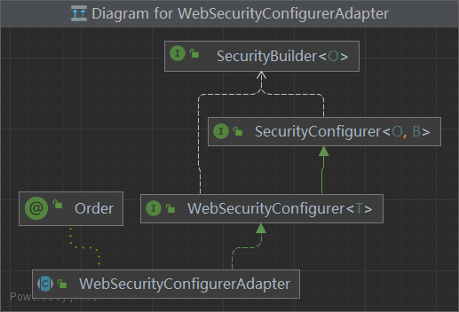

WebSecurityConfigurerAdapter是为创建WebSecurityConfigurer实例提供方便的基类，该类允许开发人员通过覆盖方法进行定制。
WebSecurityConfigurer是一个空的接口，它允许对WebSecurity进行定义，目的就是配置一个WebSecurity。

从类图可以发现 `WebSecurityConfigurerAdapter` 实现了接口`SecurityConfigurer`、`SecurityBuilder`、`WebSecurityConfigurer`，使用注解 `@Order`。

1. `WebSecurityConfigurer`：

  ```java
  public interface WebSecurityConfigurer<T extends SecurityBuilder<Filter>> extends SecurityConfigurer<Filter, T> {
  }
  ```

  是一个空接口，但是它里边约束了泛型。可以发现：

   1. SecurityBuilder 中的泛型 Filter，表示 SecurityBuilder 最终的目的是为了构建一个 Filter 对象出来。
   2. SecurityConfigurer 中两个泛型，第一个表示的含义也是 SecurityBuilder 最终构建的对象。

  同时这里还定义了新的泛型 T，T 需要继承自 SecurityBuilder，根据 WebSecurityConfigurerAdapter 中的定义，我们可以知道，T 就是 WebSecurity，我们也大概能猜出 WebSecurity 就是 SecurityBuilder 的子类。

  所以 WebSecurityConfigurer 的目的我们可以理解为就是为了配置 WebSecurity。

2. `WebSecurity`

    而 `WebSecurity`继承自 `AbstractConfiguredSecurityBuilder`<Filter, WebSecurity> 同时实现了 SecurityBuilder 接口：

     ```java
     public final class WebSecurity extends AbstractConfiguredSecurityBuilder<Filter, WebSecurity>
             implements SecurityBuilder<Filter>, ApplicationContextAware, ServletContextAware {
    
     ```

    **官方注释为**：WebSecurity是由WebSecurityConfiguration创建的，用于创建称为Spring Security Filter Chain（springSecurityFilterChain）的FilterChainProxy。springSecurityFilterChain是DelegatingFilterProxy委托给的筛选器。可以通过创建WebSecurityConfigurer、重写WebSecurityCnfigurerAdapter或公开WebSecurityCustomizer bean来对WebSecurity进行自定义。

3. `AbstractConfiguredSecurityBuilder`

    首先 AbstractConfiguredSecurityBuilder 中定义了一个枚举类，将整个构建过程分为 5 种状态，也可以理解为构建过程生命周期的五个阶段，如下：

    ```java
    private enum BuildState {
    	UNBUILT(0),
    	INITIALIZING(1),
    	CONFIGURING(2),
    	BUILDING(3),
    	BUILT(4);
    	private final int order;
    	BuildState(int order) {
    		this.order = order;
    	}
    	public boolean isInitializing() {
    		return INITIALIZING.order == order;
    	}
    	public boolean isConfigured() {
    		return order >= CONFIGURING.order;
    	}
    }
    ```

    五种状态分别是 UNBUILT、INITIALIZING、CONFIGURING、BUILDING 以及 BUILT。另外还提供了两个判断方法，isInitializing 判断是否正在初始化，isConfigured 表示是否已经配置完毕。
    
    ```java
    private <C extends SecurityConfigurer<O, B>> void add(C configurer) {
    	Assert.notNull(configurer, "configurer cannot be null");
    	Class<? extends SecurityConfigurer<O, B>> clazz = (Class<? extends SecurityConfigurer<O, B>>) configurer
    			.getClass();
    	synchronized (configurers) {
    		if (buildState.isConfigured()) {
    			throw new IllegalStateException("Cannot apply " + configurer
    
       + " to already built object");
         	}
         	List<SecurityConfigurer<O, B>> configs = allowConfigurersOfSameType ? this.configurers
         			.get(clazz) : null;
         	if (configs == null) {
         		configs = new ArrayList<>(1);
         	}
         	configs.add(configurer);
         	this.configurers.put(clazz, configs);
         	if (buildState.isInitializing()) {
         		this.configurersAddedInInitializing.add(configurer);
         	}
         }
         }
         private Collection<SecurityConfigurer<O, B>> getConfigurers() {
         List<SecurityConfigurer<O, B>> result = new ArrayList<>();
         for (List<SecurityConfigurer<O, B>> configs : this.configurers.values()) {
         	result.addAll(configs);
         }
         return result;
         }
    ```
    
    第一个是 `add` 方法，这相当于是在收集所有的配置类。将所有的 xxxConfigure 收集起来存储到 configurers 中，将来再统一初始化并配置，configurers 本身是一个 LinkedHashMap ，key 是配置类的 class，value 是一个集合，集合里边放着 xxxConfigure 配置类。当需要对这些配置类进行集中配置的时候，会通过 getConfigurers 方法获取配置类，这个获取过程就是把 LinkedHashMap 中的 value 拿出来，放到一个集合中返回。
    
    另一个方法就是 doBuild 方法：
    
    ```java
    
    @Override
    protected final O doBuild() throws Exception {
    	synchronized (configurers) {
    		buildState = BuildState.INITIALIZING;
    		beforeInit();
    		init();
    		buildState = BuildState.CONFIGURING;
    		beforeConfigure();
    		configure();
    		buildState = BuildState.BUILDING;
    		O result = performBuild();
    		buildState = BuildState.BUILT;
    		return result;
    	}
    }
    private void init() throws Exception {
    	Collection<SecurityConfigurer<O, B>> configurers = getConfigurers();
    	for (SecurityConfigurer<O, B> configurer : configurers) {
    		configurer.init((B) this);
    	}
    	for (SecurityConfigurer<O, B> configurer : configurersAddedInInitializing) {
    		configurer.init((B) this);
    	}
    }
    private void configure() throws Exception {
    	Collection<SecurityConfigurer<O, B>> configurers = getConfigurers();
    	for (SecurityConfigurer<O, B> configurer : configurers) {
    		configurer.configure((B) this);
    	}
    }
    ```
    
    在 AbstractSecurityBuilder 类中，过滤器的构建被转移到 doBuild 方法上面了，不过在 AbstractSecurityBuilder 中只是定义了抽象的 doBuild 方法，具体的实现在 AbstractConfiguredSecurityBuilder。
    
    doBuild 方法就是一边更新状态，一边进行初始化。
    
    beforeInit 是一个预留方法，没有任何实现。
    
    init 方法就是找到所有的 xxxConfigure，挨个调用其 init 方法进行初始化。
    
    beforeConfigure 是一个预留方法，没有任何实现。
    
    configure 方法就是找到所有的 xxxConfigure，挨个调用其 configure 方法进行配置。
    
    最后则是 performBuild 方法，是真正的过滤器链构建方法，但是在 AbstractConfiguredSecurityBuilder 中 performBuild 方法只是一个抽象方法，具体的实现在它的子类中，也就是 WebSecurityConfigurer。

4. `SecurityBuilder`

    SecurityBuilder 就是用来构建过滤器链的，在 HttpSecurity 实现 SecurityBuilder 时，传入的泛型就是 DefaultSecurityFilterChain，所以 SecurityBuilder#build 方法的功能很明确，就是用来构建一个过滤器链出来，但是那个过滤器链是 Spring Security 中的。在 WebSecurityConfigurerAdapter 中定义的泛型是 SecurityBuilder，所以最终构建的是一个普通 Filter，其实就是 FilterChainProxy。

5. `WebSecurity`

    WebSecurity 的核心逻辑集中在 performBuild 构建方法上：

    ```java
    @Override
    protected Filter performBuild() throws Exception {
    	Assert.state(
    			!securityFilterChainBuilders.isEmpty(),
    			() -> "At least one SecurityBuilder<? extends SecurityFilterChain> needs to be specified. "
    					+ "Typically this done by adding a @Configuration that extends WebSecurityConfigurerAdapter. "
    					+ "More advanced users can invoke "
    					+ WebSecurity.class.getSimpleName()
    					+ ".addSecurityFilterChainBuilder directly");
    	int chainSize = ignoredRequests.size() + securityFilterChainBuilders.size();
    	List<SecurityFilterChain> securityFilterChains = new ArrayList<>(
    			chainSize);
    	for (RequestMatcher ignoredRequest : ignoredRequests) {
    		securityFilterChains.add(new DefaultSecurityFilterChain(ignoredRequest));
    	}
    	for (SecurityBuilder<? extends SecurityFilterChain> securityFilterChainBuilder : securityFilterChainBuilders) {
    		securityFilterChains.add(securityFilterChainBuilder.build());
    	}
    	FilterChainProxy filterChainProxy = new FilterChainProxy(securityFilterChains);
    	if (httpFirewall != null) {
    		filterChainProxy.setFirewall(httpFirewall);
    	}
    	filterChainProxy.afterPropertiesSet();
    	Filter result = filterChainProxy;
    	if (debugEnabled) {
    		logger.warn("\n\n"
    				+ "********************************************************************\n"
    				+ "**********        Security debugging is enabled.       *************\n"
    				+ "**********    This may include sensitive information.  *************\n"
    				+ "**********      Do not use in a production system!     *************\n"
    				+ "********************************************************************\n\n");
    		result = new DebugFilter(filterChainProxy);
    	}
    	postBuildAction.run();
    	return result;
    }
    
    ```

    先来说一句，这里的 performBuild 方法只有一个功能，那就是构建 FilterChainProxy，如果你还不了解什么是 FilterChainProxy，可以参考松哥之前的介绍：深入理解 FilterChainProxy【源码篇】。

    把握住了这条主线，我们再来看方法的实现就很容易了。

    首先统计过滤器链的总条数，总条数包括两个方面，一个是 ignoredRequests，这是忽略的请求，通过 WebSecurity 配置的忽略请求，松哥之前介绍过，参见：Spring Security 两种资源放行策略，千万别用错了！，另一个则是 securityFilterChainBuilders，也就是我们通过 HttpSecurity 配置的过滤器链，有几个就算几个。
    创建 securityFilterChains 集合，并且遍历上面提到的两种类型的过滤器链，并将过滤器链放入 securityFilterChains 集合中。
    我在深入理解 HttpSecurity【源码篇】一文中介绍过，HttpSecurity 构建出来的过滤器链对象就是 DefaultSecurityFilterChain，所以可以直接将 build 结果放入 securityFilterChains 中，而 ignoredRequests 中保存的则需要重构一下才可以存入 securityFilterChains。
    securityFilterChains 中有数据之后，接下来创建一个 FilterChainProxy。
    给新建的 FilterChainProxy 配置上防火墙，防火墙的介绍参考松哥之前的：Spring Security 自带防火墙！你都不知道自己的系统有多安全！。
    最后我们返回的就是 FilterChainProxy 的实例。
    从这段分析中，我们可以看出来 WebSecurity 和 HttpSecurity 的区别：

    HttpSecurity 目的是构建过滤器链，一个 HttpSecurity 对象构建一条过滤器链，一个过滤器链中有 N 个过滤器，HttpSecurity 所做的事情实际上就是在配置这 N 个过滤器。
    WebSecurity 目的是构建 FilterChainProxy，一个 FilterChainProxy 中包含有多个过滤器链和一个 Firewall。
    这就是 WebSecurity 的主要作用，核心方法是 performBuild。

### WebSecurityConfigurerAdapter

有三个主要方法：

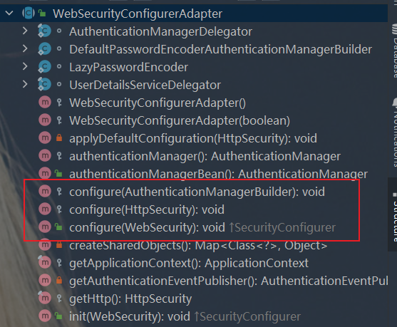

#### 认证管理器配置方法

`void configure(AuthenticationManagerBuilder auth)`

用来配置认证管理器 `AuthenticationManager` 。说白了就是所有 UserDetails 相关的它都管，包含 `PasswordEncoder` 密码机。

#### 核心过滤器配置方法

`void configure(WebSecurity web)`

用来配置 WebSecurity 。而 WebSecurity 是基于 Servlet Filter 用来配置 springSecurityFilterChain 。而 springSecurityFilterChain 又 被委托给了 Spring Security 核心过滤器 Bean DelegatingFilterProxy 。 相关逻辑你可以在 WebSecurityConfiguration 中找到。我们一般不会过多来自定义 WebSecurity , 使用较多的使其 ignoring() 方法用来忽略 Spring Security 对静态资源的控制。

#### 安全过滤器链配置方法

`void configure(HttpSecurity http)`

用来配置 `HttpSecurity`。 HttpSecurity 用于构建一个安全过滤器链 SecurityFilterChain 。 SecurityFilterChain 最终 被注入核心过滤器 。 HttpSecurity 有许多我们需要的配置。我们可以通过它来进行自定义安全访问策略。

## HttpSecurity 配置

前面的`SpringBootWebSecurityConfiguration`类里提到过，Spring Security 在 Spring Boot 中的默认配置：

```java
http
.authorizeRequests()
.anyRequest().authenticated()
.and()
.formLogin().and()
.httpBasic();
```

- 所有的请求访问都需要被授权。
- 使用 form 表单进行登陆(默认路径为 /login )，也就是默认的登录页。
- 防止 CSRF 攻击、 XSS 攻击。
- 启用 HTTP Basic 认证。

HttpSecurity 使用了 builder 的构建方式来灵活制定访问策略。最早基于 XML 标签对 HttpSecurity 进行配置。现在大部分使用 javaConfig 方式。常用的方法解读如下：
openidLogin()	用于基于 OpenId 的验证
headers()	将安全标头添加到响应
cors()	配置跨域资源共享（ CORS ）
sessionManagement()	允许配置会话管理
portMapper()	允许配置一个PortMapper(HttpSecurity#(getSharedObject(class)))，其他提供SecurityConfigurer的对象使用 PortMapper 从 HTTP 重定向到 HTTPS 或者从 HTTPS 重定向到 HTTP。默认情况下，Spring Security使用一个PortMapperImpl映射 HTTP 端口8080到 HTTPS 端口8443，HTTP 端口80到 HTTPS 端口443
jee()	配置基于容器的预认证。 在这种情况下，认证由Servlet容器管理
x509()	配置基于x509的认证
rememberMe	允许配置“记住我”的验证
authorizeRequests()	允许基于使用HttpServletRequest限制访问
requestCache()	允许配置请求缓存
exceptionHandling()	允许配置错误处理
securityContext()	在HttpServletRequests之间的SecurityContextHolder上设置SecurityContext的管理。 当使用WebSecurityConfigurerAdapter时，这将自动应用
servletApi()	将HttpServletRequest方法与在其上找到的值集成到SecurityContext中。 当使用WebSecurityConfigurerAdapter时，这将自动应用
csrf()	添加 CSRF 支持，使用WebSecurityConfigurerAdapter时，默认启用
logout()	添加退出登录支持。当使用WebSecurityConfigurerAdapter时，这将自动应用。默认情况是，访问URL”/ logout”，使HTTP Session无效来清除用户，清除已配置的任何#rememberMe()身份验证，清除SecurityContextHolder，然后重定向到”/login?success”
anonymous()	允许配置匿名用户的表示方法。 当与WebSecurityConfigurerAdapter结合使用时，这将自动应用。 默认情况下，匿名用户将使用org.springframework.security.authentication.AnonymousAuthenticationToken表示，并包含角色 “ROLE_ANONYMOUS”
formLogin()	指定支持基于表单的身份验证。如果未指定FormLoginConfigurer#loginPage(String)，则将生成默认登录页面
oauth2Login()	根据外部OAuth 2.0或OpenID Connect 1.0提供程序配置身份验证
requiresChannel()	配置通道安全。为了使该配置有用，必须提供至少一个到所需信道的映射
httpBasic()	配置 Http Basic 验证
addFilterAt()	在指定的Filter类的位置添加过滤器

## URI中的 Ant 风格

### Ant 风格

Ant 风格就是一种路径匹配表达式。主要用来对 uri 的匹配。其实跟正则表达式作用是一样的，只不过正则表达式适用面更加宽泛， Ant 仅仅用于路径匹配。 

### Ant 通配符

Ant 中的通配符有三种：

- `?` 匹配任何单字符；
- `*` 匹配0或者任意数量的字符；
- `**` 匹配0或者更多的目录

注意：单个 `*` 是在一个目录内进行匹配。 而 `**` 是可以匹配多个目录，一定不要迷糊。

### Ant 通配符示例

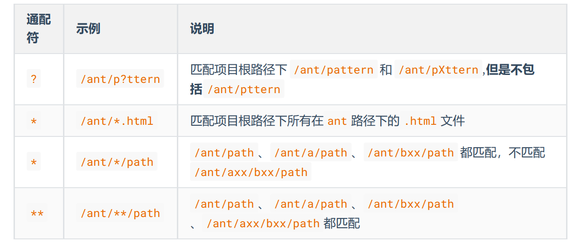

### 最长匹配原则

`*` 和 `**` 是有冲突的情况存在的。为了解决这种冲突就规定了最长匹配原则(has more characters)。 一旦一个 uri 同时符合两个 Ant 匹配那么走匹配规则字符最多的。

原因：因为字符越长信息越多就越具体。比如 /ant/a/path 同时满足 `/**/path` 和 `/ant/*/path` 那么 走 `/ant/*/path`。

**Spring MVC 中的 Ant 风格**

在控制器中写如下接口：

```java
/**
* ant style test.
*
* @return the string
*/
@GetMapping("/?ant")
public String ant() {
    return "ant";
}
```

你使用任意合法 uri 字符替代 ? 发现都可以匹配，比如 /bant 。 还有Spring MVC 的一些过滤器注册、格式化器注册都用到了 Ant 风格。

**Spring Security 中的 Ant 风格**

在 Spring Security 中 WebSecurityConfigurerAdapter 中的可以通过如下配置进行路由权限访问控制：

```java
public class SecurityConfig extends WebSecurityConfigurerAdapter {
    @Autowired
    public void configureGlobal(AuthenticationManagerBuilder authenticationManagerBuilder) throws Exception {
        authenticationManagerBuilder.inMemoryAuthentication().withUser("admin").password("admin").roles("USER");
    }
    @Override
    protected void configure(HttpSecurity http) throws Exception {
        http.authorizeRequests()
            //放行静态资源 首页
            .antMatchers("/index.html","/static/**").permitAll()
            .anyRequest().authenticated();
    }
}
```

上面 Spring Security 的配置中在 antMatchers 方法中通过 Ant 通配符来控制了资源的访问权限。这是接口权限控制的重要组成部分。

## 过滤器

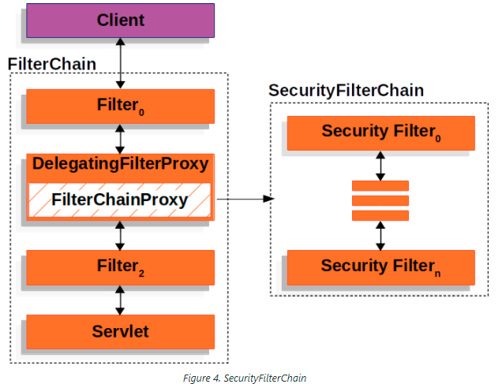

### 基本过滤器

在 Spring Security 中 `认证、授权` 等功能都是基于 **过滤器** 完成的。

默认过滤器并不是直接放在 Web 项目的原生过滤器链中，而是通过一个
FlterChainProxy 来统一管理。Spring Security 中的过滤器链通过 FilterChainProxy 嵌入到 Web项目的原生过滤器链中。FilterChainProxy 作为一个顶层的管理者，将统一管理 Security Filter。FilterChainProxy 本身是通过 Spring 框架提供的 DelegatingFilterProxy 整合到原生的过滤器链中。

即 生成一个名字为 `springSecurityFilterChain`，类型为 `DelegatingFilterProxy` 类型的实例，然后这个实例会自动加入到 Servlet 容器的过滤器链中。

当有请求达到 `Servlet` 容器时，会依次按照过滤器声明和映射的顺序，依次执行过滤器的逻辑。

debug调试WebSecurityConfiguration的下面的代码，查看变量值：

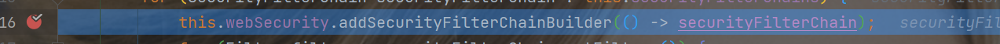

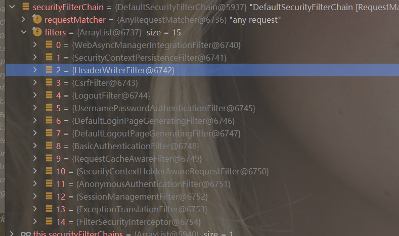

Spring Security 提供了 30 多个过滤器。默认情况下Spring Boot 在对 Spring Security 进入自动化配置时，会创建一个名为 SpringSecurityFilerChain 的过滤器，并注入到 Spring 容器中，这个过滤器将负责所有的安全管理，包括用户认证、授权、重定向到登录页面等。一共会默认加载15个过滤器。

**三个重点过滤器**：

1. `FilterSecurityInterceptor`，是一个方法级的权限过滤器, 基本位于过滤链的最底部。

    ```java
    public class FilterSecurityInterceptor extends AbstractSecurityInterceptor implements Filter {
        private static final String FILTER_APPLIED = "__spring_security_filterSecurityInterceptor_filterApplied";
        private FilterInvocationSecurityMetadataSource securityMetadataSource;
        private boolean observeOncePerRequest = true;
    
        public FilterSecurityInterceptor() {
        }
    
        public void init(FilterConfig arg0) {
        }
    
        public void destroy() {
        }
    
        public void doFilter(ServletRequest request, ServletResponse response, FilterChain chain) throws IOException, ServletException {
            this.invoke(new FilterInvocation(request, response, chain));
        }
    ```

    实现了Filter接口，所以是一个过滤器：

    ```java
    public interface Filter {
        default void init(FilterConfig filterConfig) throws ServletException {
        }
    
        void doFilter(ServletRequest var1, ServletResponse var2, FilterChain var3) throws IOException, ServletException;
    
        default void destroy() {
        }
    }
    ```

    每一个过滤器都必须实现`init`、`doFilter`、`destory` 方法，表示创建、销毁、以及过滤行为。

    可以看到，FilterSecurityInterceptor在`doFilter`方法中执行了 `invoke`方法：

    ```java
        public void invoke(FilterInvocation filterInvocation) throws IOException, ServletException {
            if (this.isApplied(filterInvocation) && this.observeOncePerRequest) {
                filterInvocation.getChain().doFilter(filterInvocation.getRequest(), filterInvocation.getResponse());
            } else {
                if (filterInvocation.getRequest() != null && this.observeOncePerRequest) {
                    filterInvocation.getRequest().setAttribute("__spring_security_filterSecurityInterceptor_filterApplied", Boolean.TRUE);
                }
    
                InterceptorStatusToken token = super.beforeInvocation(filterInvocation);
    
                try {
                    filterInvocation.getChain().doFilter(filterInvocation.getRequest(), filterInvocation.getResponse());
                } finally {
                    super.finallyInvocation(token);
                }
    
                super.afterInvocation(token, (Object)null);
            }
        }
    ```

    先判断该请求是否已经调用过过滤器，如果掉过则直接放行；如果是第一次调用，需要执行安全检查；然后用`beforeInvocation`查看之前的过滤器是否通过，接着：

    ```java
     filterInvocation.getChain().doFilter(filterInvocation.getRequest(), filterInvocation.getResponse());
    ```

    调用真正的过滤服务。

2. `ExceptionTranslationFilter`：是个异常过滤器，用来处理在认证授权过程中抛出的异常。

    ```java
    	private void doFilter(HttpServletRequest request, HttpServletResponse response, FilterChain chain)
    			throws IOException, ServletException {
    		try {
    			chain.doFilter(request, response);
    		}
    		catch (IOException ex) {
    			throw ex;
    		}
    		catch (Exception ex) {
    			// 尝试从堆栈中提取SpringSecurityException
    			Throwable[] causeChain = this.throwableAnalyzer.determineCauseChain(ex);
    			RuntimeException securityException = (AuthenticationException) this.throwableAnalyzer
    					.getFirstThrowableOfType(AuthenticationException.class, causeChain);
    			if (securityException == null) {
    				securityException = (AccessDeniedException) this.throwableAnalyzer
    						.getFirstThrowableOfType(AccessDeniedException.class, causeChain);
    			}
    			if (securityException == null) {
    				rethrow(ex);
    			}
    			if (response.isCommitted()) {
    				throw new ServletException("Unable to handle the Spring Security Exception "
    						+ "because the response is already committed.", ex);
    			}
    			handleSpringSecurityException(request, response, chain, securityException);
    		}
    	}
    ```

3. `UsernamePasswordAuthenticationFilter`：对/login 的 POST 请求做拦截，校验表单中用户名，密码。

    ```java
    	@Override
    	public Authentication attemptAuthentication(HttpServletRequest request, HttpServletResponse response)
    			throws AuthenticationException {
    		if (this.postOnly && !request.getMethod().equals("POST")) {
    			throw new AuthenticationServiceException("Authentication method not supported: " + request.getMethod());
    		}
    		String username = obtainUsername(request);
    		username = (username != null) ? username : "";
    		username = username.trim();
    		String password = obtainPassword(request);
    		password = (password != null) ? password : "";
    		UsernamePasswordAuthenticationToken authRequest = new UsernamePasswordAuthenticationToken(username, password);
    		// 允许子类设置“details”属性
    		setDetails(request, authRequest);
    		return this.getAuthenticationManager().authenticate(authRequest);
    	}
    ```

    对post请求的账户密码进行校验。

### DelegatingFilterProxy

DelegatingFilterProxy是一个Servlet过滤器，它**代理了Servlet Filter**。这样，被代理的Filter就可以享受Spring的依赖注入和生命周期管理功能。即”管理“filter。它会将请求委托给目标过滤器来处理。

`DelegatingFilterProxy` 部分属性：

```java
	@Nullable
	private String targetBeanName;

	private boolean targetFilterLifecycle = false;
```

其中，`targetFilterLifecycle` 参数是在 `DelegatingFilterProxy` 的构造函数中使用的一个布尔值参数。它用于指定是否由 `DelegatingFilterProxy` 负责管理目标过滤器的生命周期。

如果将 `targetFilterLifecycle` 参数设置为 `true`，则 `DelegatingFilterProxy` 将负责调用目标过滤器的 `init()` 和 `destroy()` 方法。这意味着 `DelegatingFilterProxy` 将在容器启动时自动调用目标过滤器的 `init()` 方法，并在容器关闭时调用目标过滤器的 `destroy()` 方法。

如果将 `targetFilterLifecycle` 参数设置为 `false`，则 `DelegatingFilterProxy` 将不会管理目标过滤器的生命周期。这意味着你需要手动调用目标过滤器的 `init()` 和 `destroy()` 方法，确保它们在适当的时候被调用。

默认情况下，`targetFilterLifecycle` 参数被设置为 `false`，即 `DelegatingFilterProxy` 不会管理目标过滤器的生命周期。如果你希望 `DelegatingFilterProxy` 管理目标过滤器的生命周期，你可以将 `targetFilterLifecycle` 参数设置为 `true`。

DelegatingFilterProxy 和普通 Filter 的区别：

- DelegatingFilterProxy 是一个**代理类**，它**本身不实现** Filter 接口，而是将 Filter 的功能委托给一个 Spring 容器管理的 Filter 实现类。
- DelegatingFilterProxy 可以让 Filter 实现类享受 Spring 的依赖注入和生命周期管理的优势，而普通 Filter 则需要自己管理这些。
- DelegatingFilterProxy 可以**根据 `targetBeanName` 属性来指定要代理的 Filter 实现类的名称**，如果不指定，则默认使用 filter-name 作为 bean 名称。当 `DelegatingFilterProxy` 接收到请求时，它将查找 Spring 容器中与 `targetBeanName` 参数匹配的目标过滤器的 bean。然后，`DelegatingFilterProxy` 将委托实际的过滤工作给找到的目标过滤器实例。
- DelegatingFilterProxy 可以和 Spring Security 配合使用，实现安全过滤的功能。

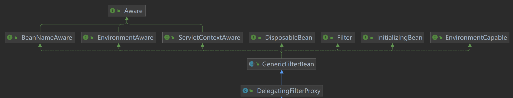

在spring security中，`DelegatingFilterProxy` 是整个Spring Security 过滤器链的**入口**，拦截所有的请求；最后交给 `FilterChainProxy` 处理。

filter的三大件：init()、doFilter()、destroy()。

从类图可以看出，`DelegatingFilterProxy` 继承于抽象类GenericFilterBean，间接实现了 Filter接口。

`init` 是由父类抽象类GenericFilterBean实现，在init里调用了initFilterBean，如下。

DelegatingFilterProxy的`initFilterBean`

```java
// 初始化过滤器 bean
protected void initFilterBean() throws ServletException {
        // 在代理监视器对象上同步
        synchronized(this.delegateMonitor) {
                    // 如果代理是空的
            if (this.delegate == null) {
                if (this.targetBeanName == null) {
                    // 如果没有设置targentBeanName属性，则直接根据Filter名称来查找
                    this.targetBeanName = this.getFilterName();
                }
                // 调用 findWebApplicationContext，通过 WebApplicationContextUtils 获取对应的应用上下文，将 DelegatingFilterProxy 和 spring 关联起来
                WebApplicationContext wac = this.findWebApplicationContext();
                if (wac != null) {
                    // 从 Spring容器中找到 代理的filter
                    this.delegate = this.initDelegate(wac);
                }
            }

        }
    }
```

其中，`getFilterName` 在GenericFilterBean类中，作用是 获取代理的filter在spring容器中配置的名称

```java
@Nullable // 表示
protected String getFilterName() {
    //获取代理的filter在Spring容器中配置的ID
    return this.filterConfig != null ? this.filterConfig.getFilterName() : this.beanName;
}
```

`initDelegate` 作用是获取代理的filter

```java
protected Filter initDelegate(WebApplicationContext wac) throws ServletException {
    String targetBeanName = this.getTargetBeanName();
    Assert.state(targetBeanName != null, "No target bean name set");
    Filter delegate = (Filter)wac.getBean(targetBeanName, Filter.class);
    // 通过targetFilterLifecycle的属性 指定 是否要将servlet过滤器的生命周期方法（init和destroy）委托给Spring容器中的bean。
    // 如果返回true，由servlet容器管理过滤器的生命周期。
    // 如果返回false，由依赖Spring容器来管理bean的生命周期。
    if (this.isTargetFilterLifecycle()) {
        delegate.init(this.getFilterConfig());
    }

    return delegate;
}
```

`doFilter`：使用了**双重锁检测**模式来初始化一个代理filter，然后调用代理filter的doFilter方法：

```java
public void doFilter(ServletRequest request, ServletResponse response, FilterChain filterChain) throws ServletException, IOException {
    Filter delegateToUse = this.delegate;

    if (delegateToUse == null) {
        synchronized(this.delegateMonitor) {
            delegateToUse = this.delegate;
            if (delegateToUse == null) {
                WebApplicationContext wac = this.findWebApplicationContext();
                if (wac == null) {
                    throw new IllegalStateException("No WebApplicationContext found: no ContextLoaderListener or DispatcherServlet registered?");
                }

                // 获取代理的filter
                delegateToUse = this.initDelegate(wac);
            }

            this.delegate = delegateToUse;
        }
    }

    // 执行代理filter的doFilter方法
    this.invokeDelegate(delegateToUse, request, response, filterChain);
}
```

DelegatingFilterProxy是代理，本身不搞过滤器的工作，它的dofilter方法执行的是代理的过滤器的doFilter方法。

`destroy`：

```java
@Override
public void destroy() {
    Filter delegateToUse = this.delegate;
    if (delegateToUse != null) {
        destroyDelegate(delegateToUse);
    }
}

protected void destroyDelegate(Filter delegate) {
    if (isTargetFilterLifecycle()) {
        delegate.destroy();
    }
}
```

即根据 `targetFilterLifecycle` 的值判断是否交给代理的过滤器进行处理。

**`GenericFilterBean` 继承的 `Aware` 接口有什么用**

虽然说 `DelegatingFilterProxy` 继承了 `GenericFilterBean`，但是`DelegatingFilterProxy` 实例不是 `spring bean`，不受 `spring` 控制，当然是谁继承 `GenericFilterBean`，并声明为 `spring bean` 时，就会通过 `spring bean` 的声明周期，享受各种 `Aware` 调用。

### UserDetailsService 接口

前面讲过，当什么也没有配置的时候，账号和密码是由 Spring Security 定义生成的。而在实际项目中账号和密码都是从数据库中查询出来的。 所以我们要通过自定义逻辑控制认证逻辑。

如果需要自定义逻辑（查询数据库的用户）时，只需要实现 UserDetailsService 接口即可。该接口定义如下：

```java
public interface UserDetailsService {
	UserDetails loadUserByUsername(String username) throws UsernameNotFoundException;
}
```

声明了方法 `loadUserByUsername`，即根据用户名返回用户，返回值类型是 `UserDetails`，这个类是系统默认的用户 “**主体**”。

```java
public interface UserDetails extends Serializable {
	// 表示获取登录用户所有权限
	Collection<? extends GrantedAuthority> getAuthorities();
	// 表示获取密码
	String getPassword();
	// 表示获取用户名
	String getUsername();
	// 表示判断账户是否过期
	boolean isAccountNonExpired();
	// 表示判断账户是否被锁定
	boolean isAccountNonLocked();
	// 表示凭证{密码}是否过期
	boolean isCredentialsNonExpired();
	// 表示当前用户是否可用
	boolean isEnabled();
}
```

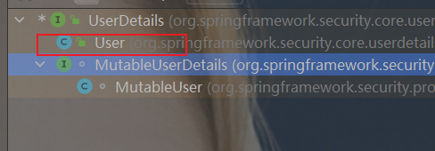

UserDetails接口的实现类如上，以后我们只需要使用 User 这个实体类即可，或者自己编写一个继承`UserDetails`的用户类。

`UserDetailsService` 可以理解为我们平时用的service层，用于从数据库获取信息。

spring security中对账户密码进行处理的过滤器是 `UsernamePasswordAuthenticationFilter` ，即对账户密码进行校验，如果我们想自己实现就需要继承该类，然后在该类中 `UserDetailsService` 进行实现，返回User对象（spring security提供的）。

### PasswordEncoder 接口

```java
public interface PasswordEncoder {
    // 将原始密码编码
	String encode(CharSequence rawPassword);
    // 将原始密码和加密后的密码匹配
	boolean matches(CharSequence rawPassword, String encodedPassword);
    // 表示如果解析的密码能够再次进行解析且达到更安全的结果则返回 true，否则返回false。默认返回 false。
	default boolean upgradeEncoding(String encodedPassword) {
		return false;
	}
}
```

该类的主要实现类：

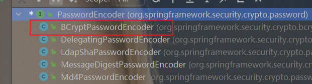

`BCryptPasswordEncoder` 就是我们常用的，前面提到过。

### UsernamePasswordAuthenticationFilter

该过滤器主要处理身份验证表单提交。

在Spring Security 3.0之前调用了AuthenticationProcessingFilter。

登录表单必须为此筛选器提供两个参数：用户名和密码。

默认情况下参数名为：username、password。

还可以**通过设置usernameParameter和passwordParameter属性**来更改参数名称，在配置类的configure方法中修改，见下面。

默认情况下，此筛选器会响应路径 `/login`。

```java
public class UsernamePasswordAuthenticationFilter extends AbstractAuthenticationProcessingFilter {

   public static final String SPRING_SECURITY_FORM_USERNAME_KEY = "username";

   public static final String SPRING_SECURITY_FORM_PASSWORD_KEY = "password";

   private static final AntPathRequestMatcher DEFAULT_ANT_PATH_REQUEST_MATCHER = new AntPathRequestMatcher("/login",
         "POST");

   private String usernameParameter = SPRING_SECURITY_FORM_USERNAME_KEY;

   private String passwordParameter = SPRING_SECURITY_FORM_PASSWORD_KEY;

   private boolean postOnly = true;
```

## SpringSecurity Web 权限方案

### 基础权限

前面我们直接已经实现 `UserDetailsService` 接口实现了连接数据库。

配置类如下：

两部分：密码加密 和 `configure`配置。

```java
@Configuration
public class SecurityConfig extends WebSecurityConfigurerAdapter {

    @Bean
    public PasswordEncoder password() {
        return new BCryptPasswordEncoder();
    }

    @Override
    protected void configure(HttpSecurity http) throws Exception {
        http.authorizeRequests()
                .antMatchers("index") // 匹配到的路径执行permitAll，即全部放行，一般用于静态资源
                .permitAll()
                .anyRequest() // 任何请求都要authenticated() 即都要先认证
                .authenticated();
    }
}
```

其中，`configure`配置：

**登录页配置**

```java
// 配置认证
http.formLogin()  // 表示采用form表单认证
    .loginPage("/index") // 配置哪个 url 为登录页面
	.loginProcessingUrl("/login") // 设置哪个是登录的 url。
	.successForwardUrl("/success") // 登录成功之后跳转到哪个 url
	.failureForwardUrl("/fail");// 登录失败之后跳转到哪个 url

http.authorizeRequests()
    .antMatchers("/layui/**","/index") //表示配置请求路径
	.permitAll() // 指定 URL 无需保护。
	.anyRequest() // 其他请求
	.authenticated(); //需要认证

	// 关闭 csrf
	http.csrf().disable();
}
```

**修改默认的登录参数名**

```java
// 配置认证
http.formLogin()  // 表示采用form表单认证
    .loginPage("/index") // 配置哪个 url 为登录页面
	.loginProcessingUrl("/login") // 设置哪个是登录的 url。
	.successForwardUrl("/success") // 登录成功之后跳转到哪个 url
	.failureForwardUrl("/fail")// 登录失败之后跳转到哪个 url
    ---- 修改账户密码的参数名----
	.usernameParameter("name")
	.passwordParameter("pwd");
```

### 角色或权限的访问

在配置文件中固定实现的权限管理见入门案例的授权。

这里展示**基于数据库实现权限认证**。

1. 配置文件里设置访问权限

    ```java
    public class SecurityConfig extends WebSecurityConfigurerAdapter {
    
        @Bean
        public PasswordEncoder password() {
            return new BCryptPasswordEncoder();
        }
    
        @Override
        protected void configure(HttpSecurity http) throws Exception {
            http.formLogin()
                    .and()
                    .authorizeRequests()
                    .antMatchers("/login").permitAll()
                -------
                    .antMatchers("/test/test").hasRole("admin") // 路径具有角色 admin才能访问
                -------
                    .anyRequest()
                    .authenticated();
        }
    }
    ```

2. 实现 `UserDetailsService`

    ```java
    @Service
    public class UsersServiceImpl implements UserDetailsService {
    
        @Autowired
        private UserInfoMapper userInfoMapper;
        @Autowired
        private UserMapper userMapper;
    
        @Override
        public UserDetails loadUserByUsername(String username) throws UsernameNotFoundException {
            System.out.println("这里--UsersServiceImpl");
            User user = userMapper.selectByUsername(username);
            List<Role> roleList = userInfoMapper.selectRoleByUserId(user.getId());
            System.out.println(roleList);
            List<GrantedAuthority> grantedAuthorityList = new ArrayList<>();
            for (Role role : roleList) {
                SimpleGrantedAuthority simpleGrantedAuthority = new SimpleGrantedAuthority("ROLE_" + role.getName());
                grantedAuthorityList.add(simpleGrantedAuthority);
            }
            return new org.springframework.security.core.userdetails.User(username, user.getPassword(), grantedAuthorityList);
        }
    }
    ```

    注意：这里返回的是默认提供的User对象，或者自己实现一个继承`UserDetails`的类，实现构造函数（用户名、密码、角色权限list）

3. 数据库表设计

    角色表：

    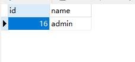

    用户表：

    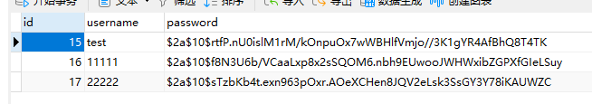

4. 最后进行测试即可。

此外，也可以使用注解在对应的controller层方法上添加角色限制。

**使用注解先要开启注解功能**：`@EnableGlobalMethodSecurity(securedEnabled=true)`


## 记住我

### 保持登录

设置登录有效期，一定期限内不需要重复登录

1. 配置文件

    ```java
    @Configuration
    public class BrowserSecurityConfig {
    
        @Autowired
        private DataSource dataSource;
        @Bean
        public PersistentTokenRepository persistentTokenRepository() {
            JdbcTokenRepositoryImpl jdbcTokenRepository = new JdbcTokenRepositoryImpl();
            // 赋值数据源
            jdbcTokenRepository.setDataSource(dataSource);
            // 自动创建表,第一次执行会创建，以后要执行就要删除掉！
            // jdbcTokenRepository.setCreateTableOnStartup(true);
            return jdbcTokenRepository;
        }
    }
    ```

2. 更改安全配置类

    `configure(HttpSecurity http)` 方法中：

    ```
        @Autowired
        private UsersServiceImpl usersService;
        @Autowired
        private PersistentTokenRepository tokenRepository;
    
    
    http.rememberMe()
                    .tokenValiditySeconds(100) // 设置有效期 单位是 秒
                    .tokenRepository(tokenRepository)
                    .userDetailsService(usersService);
    ```

    **注意登录有效期的设置**。

3. 运行后发现，登录页面有变化：

    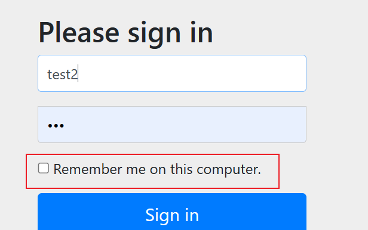

    多了 `记住我`。

### 注销

在配置类中添加退出映射地址：

```java
http.logout()
    .logoutUrl("/logout") // 退出地址（接口）
```

访问这个接口会自动退出。


## 认证

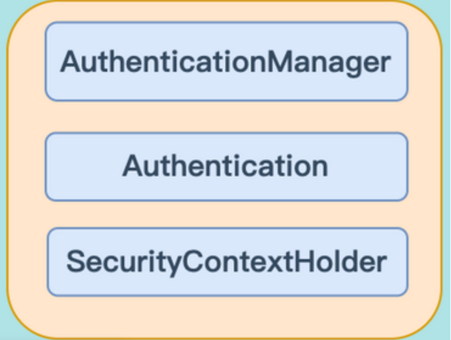

认证包含三个模块`AuthenticationManager`， `Authentication`，`SecurityContextHolder`。

### Authentication

```java
public interface Authentication extends Principal, Serializable {
    // 由AuthenticationManager（用于验证Authentication请求）设置，用于指示已授予主体的权限
    Collection<? extends GrantedAuthority> getAuthorities();
    // 证明主体的凭据
	// 通常是一个密码，但可以是与AuthenticationManager相关的任何内容
  	Object getCredentials();
	/**
	 * 存储有关身份验证请求的其他详细信息
	 * 可能是IP地址、证书序列号等
	 */
    Object getDetails();
    /**
	 * 被认证的主体的身份
	 * 在使用用户名和密码的身份验证请求情况下，这是用户名
	 */
    Object getPrincipal();
 	/**
	 * 用于向AbstractSecurityInterceptor指示它是否应该向AuthenticationManager提供身份验证令牌
	 * 通常，AuthenticationManager将在身份验证成功后返回一个不可变的身份验证令牌
	 * 在这种情况下，该令牌的此方法可以安全地返回true
	 * 返回true将提高性能，因为不再需要为每个请求调用AuthenticationManager
	 * 出于安全原因，这个接口的实现应该非常小心地从这个方法返回true
	 * 除非它们是不可变的，或者有某种方式确保属性自最初创建以来没有被更改
	 */
    boolean isAuthenticated();
	/**
	 * 实现应始终允许使用false参数调用此方法
	 * 可以使用它来指定不应信任的身份验证令牌
	 */
    void setAuthenticated(boolean isAuthenticated) throws IllegalArgumentException;

}
```

`Authentication`接口继承`Principal`接口，`Principal`接口表示主体的抽象概念，可用于表示任何实体。一般用来表示账号。

`Authentication` 的实现类：

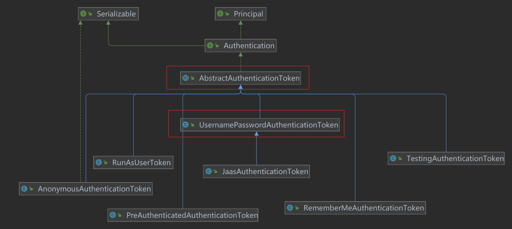

**AbstractAuthenticationToken**

实现Authentication接口的抽象类，剩下七个都是基于该抽象类的实现。

AbstractAuthenticationToken的构造方法：

```java
public AbstractAuthenticationToken(Collection<? extends GrantedAuthority> authorities) {
		if (authorities == null) {
			this.authorities = AuthorityUtils.NO_AUTHORITIES;
			return;
		}
		for (GrantedAuthority a : authorities) {
			Assert.notNull(a, "Authorities collection cannot contain any null elements");
		}
		this.authorities = Collections.unmodifiableList(new ArrayList<>(authorities));
	}
```

即 AbstractAuthenticationToken 是根据提供的权限authorities来创建令牌的。

其余的七种实现通过不同方式认证时，使用的不同的实现类存储认证成功或待认证的用户信息。比如下面的通过账号和密码。

**UsernamePasswordAuthenticationToken**

Authentication的实现，继承`AbstractAuthenticationToken`抽象类，旨在简单地表示用户名和密码。`principal`和`credentials`属性应设置为通过其`toString`方法提供相应属性的`Object`，最简单的就是`String`类型。

构造方法1：

```java
	public UsernamePasswordAuthenticationToken(Object principal, Object credentials) {
		super(null);
		this.principal = principal; // 账号
		this.credentials = credentials; // 密码
		setAuthenticated(false);
	}
```

该构造方法只是根据主体 principal（常指用户名）和凭据 credentials（常指密码）生成的Token令牌并没有认证任何权限。

构造方法2：

```java
	public UsernamePasswordAuthenticationToken(Object principal, Object credentials,
			Collection<? extends GrantedAuthority> authorities) {
		super(authorities);
		this.principal = principal;
		this.credentials = credentials;
		super.setAuthenticated(true); // must use super, as we override
	}
```

此方法由`AuthenticationManager` 或 `AuthenticationProvider` 生成可信的（即isAuthenticated（）=true）身份验证令牌。并且最后调用super.setAuthenticated()设置为true，用户已认证成功。该方法表明该Token认证成功且有效。

可以看出，`Authentication`的职责有两个，第一个是封装验证请求的参数，第二个便是封装用户的权限信息。

**RememberMeAuthenticationToken**

表示需要记住的`Authentication`，需要记住的`Authentication`必须提供完全有效的`Authentication` ，包括适用的`GrantedAuthority`。

使用记住我选项进行登录认证。

### AuthenticationManager

```java
public interface AuthenticationManager {
   Authentication authenticate(Authentication authentication) throws AuthenticationException;
}
```

AuthenticationManager 是定义 Spring Security 的过滤器如何执行Authentication 身份验证的 API。

即 **认证** 是由 AuthenticationManager 接口来负责的。

从源码可以看出，AuthenticationManager 中定义了一个方法 authenticate 方法 传入参数是Authentication （一个**不完整**的Authentication ），返回 Authentication 表示认证成功 （一个**完整**的Authentication ）
返回 AuthenticationException 异常，表示认证失败。

`AuthenticationManager` 的实现类：

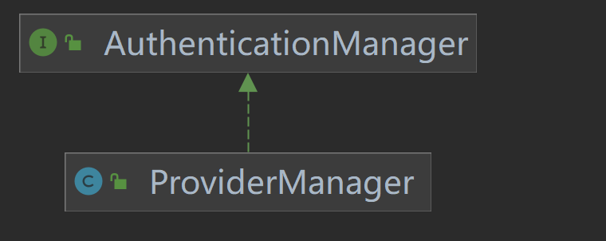

在 `ProviderManager` 中管理了众多 `AuthenticationProvider` 实例。即 `ProviderManager` 本身不处理认证请求，而是将任务委托给一个配置好的 `AuthenticationProvider` 的列表，其中每一个 AuthenticationProvider 按序确认能否完成认证，每个provider如果认证失败，会抛出一个异常，如果认证通过，则会返回一个 Authentication 对象。

在一次完整的认证流程中，Spring Security 允许存在多个 `AuthenticationProvider` ，用来**实现多种认证方式**，这些 AuthenticationProvider 都是由 ProviderManager 进行统一管理的。

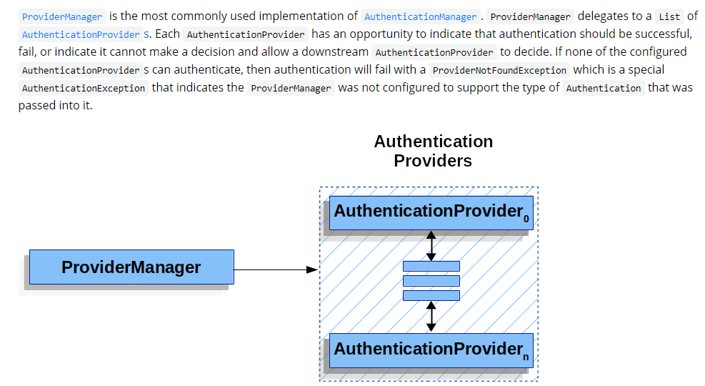

`ProviderManager`：

```java
public class ProviderManager implements AuthenticationManager, MessageSourceAware, InitializingBean {
	。。。。。
    private List<AuthenticationProvider> providers = Collections.emptyList();
    
	public ProviderManager(AuthenticationProvider... providers) {
		this(Arrays.asList(providers), null);
	}

	public ProviderManager(List<AuthenticationProvider> providers) {
		this(providers, null);
	}

	public ProviderManager(List<AuthenticationProvider> providers, AuthenticationManager parent) {
		Assert.notNull(providers, "providers list cannot be null");
		this.providers = providers;
		this.parent = parent;
		checkState();
	}
    ------
        重写了 authenticate 
    -----
    public Authentication authenticate(Authentication authentication) throws AuthenticationException {
		Class<? extends Authentication> toTest = authentication.getClass();
		AuthenticationException lastException = null;
		AuthenticationException parentException = null;
		Authentication result = null;
		Authentication parentResult = null;
		int currentPosition = 0;
		int size = this.providers.size();
		for (AuthenticationProvider provider : getProviders()) {
			if (!provider.supports(toTest)) {
				continue;
			}
			if (logger.isTraceEnabled()) {
				logger.trace(LogMessage.format("Authenticating request with %s (%d/%d)",
						provider.getClass().getSimpleName(), ++currentPosition, size));
			}
			try {
				result = provider.authenticate(authentication);
				if (result != null) {
					copyDetails(authentication, result);
					break;
				}
			}
			catch (AccountStatusException | InternalAuthenticationServiceException ex) {
				prepareException(ex, authentication);
				// SEC-546: Avoid polling additional providers if auth failure is due to
				// invalid account status
				throw ex;
			}
			catch (AuthenticationException ex) {
				lastException = ex;
			}
		}
		if (result == null && this.parent != null) {
			// Allow the parent to try.
			try {
				parentResult = this.parent.authenticate(authentication);
				result = parentResult;
			}
			catch (ProviderNotFoundException ex) {
				// ignore as we will throw below if no other exception occurred prior to
				// calling parent and the parent
				// may throw ProviderNotFound even though a provider in the child already
				// handled the request
			}
			catch (AuthenticationException ex) {
				parentException = ex;
				lastException = ex;
			}
		}
		if (result != null) {
			if (this.eraseCredentialsAfterAuthentication && (result instanceof CredentialsContainer)) {
				// Authentication is complete. Remove credentials and other secret data
				// from authentication
				((CredentialsContainer) result).eraseCredentials();
			}
			// If the parent AuthenticationManager was attempted and successful then it
			// will publish an AuthenticationSuccessEvent
			// This check prevents a duplicate AuthenticationSuccessEvent if the parent
			// AuthenticationManager already published it
			if (parentResult == null) {
				this.eventPublisher.publishAuthenticationSuccess(result);
			}

			return result;
		}

		// Parent was null, or didn't authenticate (or throw an exception).
		if (lastException == null) {
			lastException = new ProviderNotFoundException(this.messages.getMessage("ProviderManager.providerNotFound",
					new Object[] { toTest.getName() }, "No AuthenticationProvider found for {0}"));
		}
		// If the parent AuthenticationManager was attempted and failed then it will
		// publish an AbstractAuthenticationFailureEvent
		// This check prevents a duplicate AbstractAuthenticationFailureEvent if the
		// parent AuthenticationManager already published it
		if (parentException == null) {
			prepareException(lastException, authentication);
		}
		throw lastException;
	}
}


```

从源码可以看出，`ProviderManager` 继承了 `AuthenticationManager` 接口，重写了 `authenticate` 方法，`authentication`方法尝试对传入的Authentication对象进行认证，传入的Authentication是用户的提交的认证信息，比如用户名和密码，创建的一个Authentication对象。会依次询问各个AuthenticationProvider，当provider支持对传入的Authentication认证，便会尝试使用该provider进行认证。如果有多个provider都支持认证传入的Authentication对象，则只会使用第一个支持的provider进行认证。一旦有一个provider认证成功了，便会忽略之前任何provider抛出的异常，之后的provider也不会再继续认证的尝试。如果所有provider都认证失败，方法则会抛出最后一个provider抛出的异常。

`AuthenticationProvider`：

AuthenticationProvider也是一个接口，用来完成具体的认证逻辑（ProviderManager将认证的具体工作都交给了 `AuthenticationProvider`）。

```java
public interface AuthenticationProvider {
    // 具体认证逻辑
	Authentication authenticate(Authentication authentication) throws AuthenticationException;
    // 判断是否支持传入的Authentication认证信息
	boolean supports(Class<?> authentication);

}
```

`AuthenticationProvider` 的实现类：

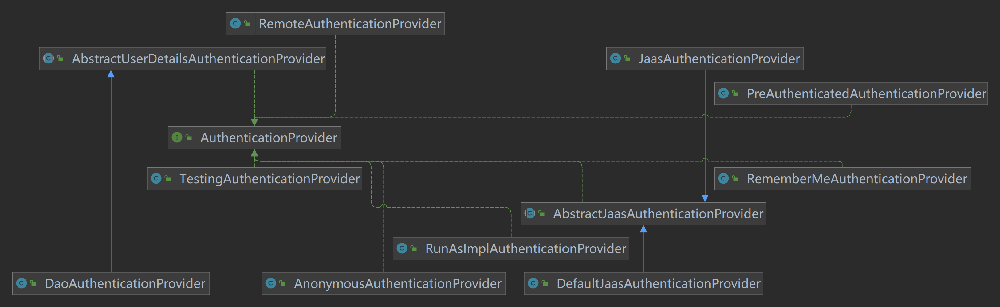

不同的provider实现类对应不同的认证逻辑处理方式，例如`DaoAuthenticationProvider`就是验证账户密码，使用UserDetailsService作为一个DAO来查询用户名、密码以及用户的权限GrantedAuthority。它认证用户的方式就是简单的比较UsernamePasswordAuthenticationToken中由用户提交的密码和通过UserDetailsService查询获得的密码是否一致。

源码：

```java
public class DaoAuthenticationProvider extends AbstractUserDetailsAuthenticationProvider {

	private static final String USER_NOT_FOUND_PASSWORD = "userNotFoundPassword";

	private PasswordEncoder passwordEncoder;

	private volatile String userNotFoundEncodedPassword;

	private UserDetailsService userDetailsService;

	private UserDetailsPasswordService userDetailsPasswordService;

	public DaoAuthenticationProvider() {
		setPasswordEncoder(PasswordEncoderFactories.createDelegatingPasswordEncoder());
	}
    // 检查密码是否非空以及是否匹配
	@Override
	@SuppressWarnings("deprecation")
	protected void additionalAuthenticationChecks(UserDetails userDetails,
			UsernamePasswordAuthenticationToken authentication) throws AuthenticationException {
		if (authentication.getCredentials() == null) {
			this.logger.debug("Failed to authenticate since no credentials provided");
			throw new BadCredentialsException(this.messages
					.getMessage("AbstractUserDetailsAuthenticationProvider.badCredentials", "Bad credentials"));
		}
		String presentedPassword = authentication.getCredentials().toString();
		if (!this.passwordEncoder.matches(presentedPassword, userDetails.getPassword())) {
			this.logger.debug("Failed to authenticate since password does not match stored value");
			throw new BadCredentialsException(this.messages
					.getMessage("AbstractUserDetailsAuthenticationProvider.badCredentials", "Bad credentials"));
		}
	}

}

```

`DaoAuthenticationProvider` 继承了抽象类 `AbstractUserDetailsAuthenticationProvider`：

```java
public abstract class AbstractUserDetailsAuthenticationProvider
		implements AuthenticationProvider, InitializingBean, MessageSourceAware {
		。。。。
        @Override
	public Authentication authenticate(Authentication authentication) throws AuthenticationException {
		Assert.isInstanceOf(UsernamePasswordAuthenticationToken.class, authentication,
				() -> this.messages.getMessage("AbstractUserDetailsAuthenticationProvider.onlySupports",
						"Only UsernamePasswordAuthenticationToken is supported"));
        // 从传入的Authentication对象中获取用户名
		String username = determineUsername(authentication);
		boolean cacheWasUsed = true;
        // 根据用户名，从缓存中获取用户的UserDetails
		UserDetails user = this.userCache.getUserFromCache(username);
		if (user == null) {
			cacheWasUsed = false;
			try {
                // 如果从缓存中没有获取到用户，则通过方法retrieveUser来获取用户信息
            // retrieve方法为一个抽象方法，不同的子类中有不同的实现，而在子类中，一般又会通过UserDetailService来获取用户信息，返回UserDetails
				user = retrieveUser(username, (UsernamePasswordAuthenticationToken) authentication);
			}
			catch (UsernameNotFoundException ex) {
				this.logger.debug("Failed to find user '" + username + "'");
				if (!this.hideUserNotFoundExceptions) {
					throw ex;
				}
				throw new BadCredentialsException(this.messages
						.getMessage("AbstractUserDetailsAuthenticationProvider.badCredentials", "Bad credentials"));
			}
			Assert.notNull(user, "retrieveUser returned null - a violation of the interface contract");
		}
		try {
			this.preAuthenticationChecks.check(user);
            // additionalAuthenticationChecks为具体的认证逻辑，是一个抽象方法，在子类中实现。比如上面
			additionalAuthenticationChecks(user, (UsernamePasswordAuthenticationToken) authentication);
		}
		catch (AuthenticationException ex) {
			if (!cacheWasUsed) {
				throw ex;
			}
			// There was a problem, so try again after checking
			// we're using latest data (i.e. not from the cache)
			cacheWasUsed = false;
			user = retrieveUser(username, (UsernamePasswordAuthenticationToken) authentication);
			this.preAuthenticationChecks.check(user);
			additionalAuthenticationChecks(user, (UsernamePasswordAuthenticationToken) authentication);
		}
		this.postAuthenticationChecks.check(user);
		if (!cacheWasUsed) {
			this.userCache.putUserInCache(user);
		}
		Object principalToReturn = user;
		if (this.forcePrincipalAsString) {
			principalToReturn = user.getUsername();
		}
		return createSuccessAuthentication(principalToReturn, authentication, user);
	}
		。。。。。
}
```


## CSRF

Cross-site request forgery，跨站请求伪造，也被称为 one-click  attack 或者 session riding，通常缩写为 CSRF 或者 XSRF， 是一种挟制用户在当前已登录的 Web 应用程序上执行非本意的操作的攻击方法。跟跨网站脚本（XSS）相比，XSS 利用的是用户对指定网站的信任，CSRF 利用的是网站对用户网页浏览器的信任。

跨站请求攻击，简单地说，是攻击者通过一些技术手段欺骗用户的浏览器去访问一个自己曾经认证过的网站并运行一些操作（如发邮件，发消息，甚至财产操作如转账和购买商品）。由于浏览器曾经认证过，所以被访问的网站会认为是真正的用户操作而去运行。这利用了 web 中用户身份验证的一个漏洞：**简单的身份验证只能保证请求发自某个用户的浏览器，却不能保证请求本身是用户自愿发出的。**

从 Spring Security 4.0 开始，默认情况下会启用。

### Spring Security 实现 CSRF 的原理

接口 **`CsrfToken`**：

```java
public interface CsrfToken extends Serializable {

	String getHeaderName();
	String getParameterName();
	String getToken();
}
```

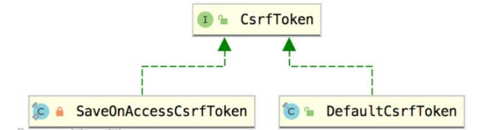

该接口有两个实现类：`SaveOnAccessCsrfToken` 和  `DefaultCsrfToken` 。

`SaveOnAccessCsrfToken` 是位于 `LazyCsrfTokenRepository` 类内部的静态常量（final）内部类：

```java
public final class LazyCsrfTokenRepository implements CsrfTokenRepository {
	......
		private static final class SaveOnAccessCsrfToken implements CsrfToken {
            ......
        }
    .....
}
```

`SaveOnAccessCsrfToken `源码:

注意：`transient` 作用： 一旦类的某个成员变量被transient修饰,该变量将不再是对象持久化的一部分,即无法被序列化和反序列化。

```java
	private static final class SaveOnAccessCsrfToken implements CsrfToken {

		private transient CsrfTokenRepository tokenRepository;

		private transient HttpServletRequest request;

		private transient HttpServletResponse response;

		private final CsrfToken delegate;

		SaveOnAccessCsrfToken(CsrfTokenRepository tokenRepository, HttpServletRequest request,
				HttpServletResponse response, CsrfToken delegate) {
			this.tokenRepository = tokenRepository;
			this.request = request;
			this.response = response;
			this.delegate = delegate;
		}

		@Override
		public String getHeaderName() {
			return this.delegate.getHeaderName();
		}

		@Override
		public String getParameterName() {
			return this.delegate.getParameterName();
		}

		@Override
		public String getToken() {
			saveTokenIfNecessary();
			return this.delegate.getToken();
		}

		@Override
		public boolean equals(Object obj) {
			if (this == obj) {
				return true;
			}
			if (obj == null || getClass() != obj.getClass()) {
				return false;
			}
			SaveOnAccessCsrfToken other = (SaveOnAccessCsrfToken) obj;
			if (this.delegate == null) {
				if (other.delegate != null) {
					return false;
				}
			}
			else if (!this.delegate.equals(other.delegate)) {
				return false;
			}
			return true;
		}

		@Override
		public int hashCode() {
			final int prime = 31;
			int result = 1;
			result = prime * result + ((this.delegate == null) ? 0 : this.delegate.hashCode());
			return result;
		}

		@Override
		public String toString() {
			return "SaveOnAccessCsrfToken [delegate=" + this.delegate + "]";
		}

		private void saveTokenIfNecessary() {
			if (this.tokenRepository == null) {
				return;
			}
			synchronized (this) {
				if (this.tokenRepository != null) {
					this.tokenRepository.saveToken(this.delegate, this.request, this.response);
					this.tokenRepository = null;
					this.request = null;
					this.response = null;
				}
			}
		}

	}

}
```

`SaveOnAccessCsrfToken` 里有一个属性是接口 `CsrfTokenRepository` 类型：

```java
public interface CsrfTokenRepository {
	CsrfToken generateToken(HttpServletRequest request);
	void saveToken(CsrfToken token, HttpServletRequest request, HttpServletResponse response);
	CsrfToken loadToken(HttpServletRequest request);
}
```

该接口的实现类：

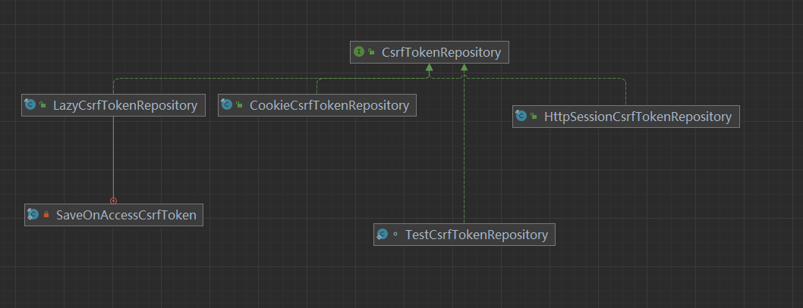

红线表示内部实现类，即上面说的 `SaveOnAccessCsrfToken`。

看 `CookieCsrfTokenRepository`：

```java
public final class CookieCsrfTokenRepository implements CsrfTokenRepository {

	static final String DEFAULT_CSRF_COOKIE_NAME = "XSRF-TOKEN";

	static final String DEFAULT_CSRF_PARAMETER_NAME = "_csrf";

	static final String DEFAULT_CSRF_HEADER_NAME = "X-XSRF-TOKEN";

	private String parameterName = DEFAULT_CSRF_PARAMETER_NAME;

	private String headerName = DEFAULT_CSRF_HEADER_NAME;

	private String cookieName = DEFAULT_CSRF_COOKIE_NAME;

	private boolean cookieHttpOnly = true;

	private String cookiePath;

	private String cookieDomain;

	private Boolean secure;

	private int cookieMaxAge = -1;

	public CookieCsrfTokenRepository() {
	}

	@Override
	public CsrfToken generateToken(HttpServletRequest request) {
		return new DefaultCsrfToken(this.headerName, this.parameterName, createNewToken());
	}
    。。。。
	private String createNewToken() {
		return UUID.randomUUID().toString();
	}
    。。。。
}        
```

根据类的属性 `DEFAULT_CSRF_PARAMETER_NAME` 可以发现默认的 CSRF 参数名为 `_csrf`。

`generateToken` 返回 `CsrfToken`，用的是`CsrfToken` 的实现类 `DefaultCsrfToken`。

生成csrfToken 保存到 HttpSession 或者 Cookie 中。

请求到来时，从请求中提取 csrfToken，和保存的 csrfToken 做比较，进而判断当前请求是否合法。主要通过 CsrfFilter 过滤器来完成。

## SpringSecurity 微服务权限方案

微服务架构风格是一种使用一套小服务来开发单个应用的方式途径，每个服务运行在自己的进程中，并使用轻量级机制通信，通常是 HTTP API，这些服务基于业务能力构建，并能够通过自动化部署机制来独立部署，这些服务使用不同的编程语言实现，以及不同数据存储技术，并保持最低限度的集中式管理。

**微服务优势**

1. 微服务每个模块就相当于一个单独的项目，代码量明显减少，遇到问题也相对来说比 较好解决。
2. 微服务每个模块都可以使用不同的存储方式（比如有的用 redis，有的用 mysql 等），数据库也是单个模块对应自己的数据库。
3. 微服务每个模块都可以使用不同的开发技术，开发模式更灵活。

**微服务本质**

1. 微服务，关键其实不仅仅是微服务本身，而是系统要提供一套基础的架构，这种架构 使得微服务可以独立的部署、运行、升级，不仅如此，这个系统架构还让微服务与微服务 之间在结构上“松耦合”，而在功能上则表现为一个统一的整体。这种所谓的“统一的整 体”表现出来的是统一风格的界面，统一的权限管理，统一的安全策略，统一的上线过 程，统一的日志和审计方法，统一的调度方式，统一的访问入口等等。
2. 微服务的目的是有效的拆分应用，实现敏捷开发和部署。

### 微服务认证与授权实现思路

#### 认证授权过程分析

1. 如果是基于 Session，那么 Spring-security 会对 cookie 里的 sessionid 进行解析，找到服务器存储的 session 信息，然后判断当前用户是否符合请求的要求。

2. 如果是 token，则是解析出 token，然后将当前请求加入到 Spring-security 管理的权限信息中去

    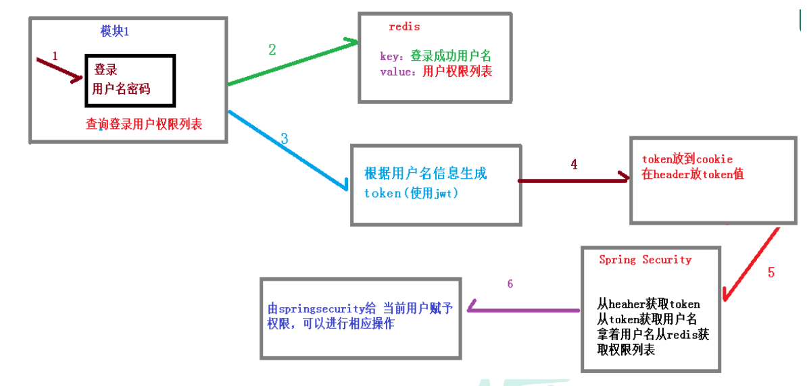

如果系统的模块众多，每个模块都需要进行授权与认证，所以我们选择基于 token 的形式进行授权与认证，用户根据用户名密码认证成功，然后获取当前用户角色的一系列权限值，并以用户名为 key，权限列表为 value 的形式存入 redis 缓存中，根据用户名相关信息生成 token 返回，浏览器将 token 记录到 cookie 中，每次调用 api 接口都默认将 token 携带到 header 请求头中，Spring-security 解析 header 头获取 token 信息，解析 token 获取当前用户名，根据用户名就可以从 redis 中获取权限列表，这样 Spring-security 就能够判断当前请求是否有权限访问。

#### 用户权限与与角色

一般用三个表：用户表、权限（角色）表、用户和权限一一对应的表。

## jwt介绍

### 访问令牌的类型

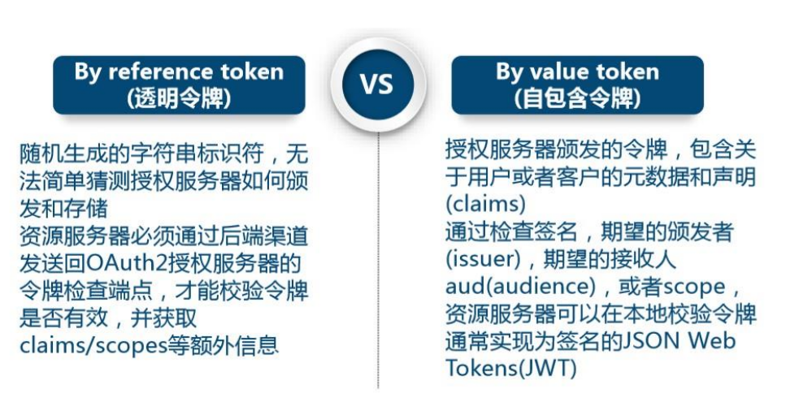

### JWT组成

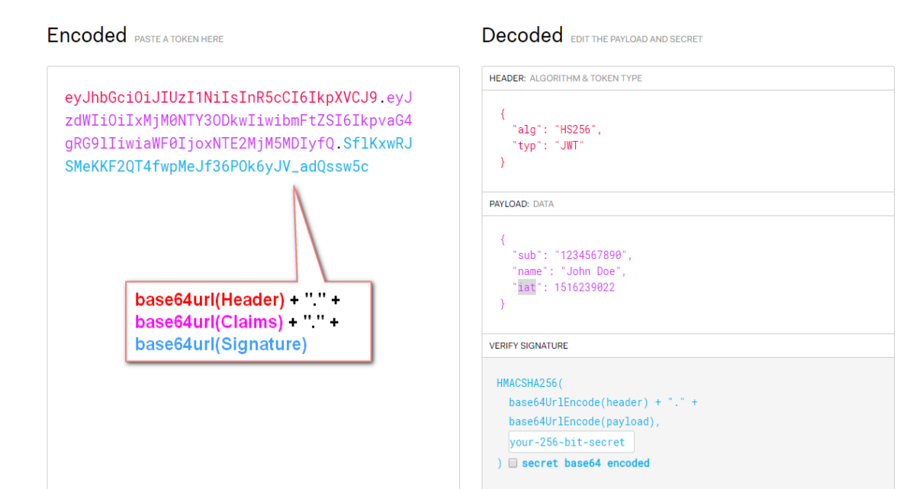

该对象为一个很长的字符串，字符之间通过"."分隔符分为三个子串。

每一个子串表示了一个功能块，总共有以下**三个部分**：JWT 头、有效载荷和签名

#### JWT 头

JWT 头部分是一个描述 JWT 元数据的 JSON 对象，通常如下所示：

```json
{
    "alg":"HS256",
    "typ": "JWT"
}
```

`alg` 属性表示签名使用的算法，默认为 HMAC SHA256（写为 HS256）； 

`typ` 属性表示令牌的类型，JWT 令牌统一写为 JWT。最后，使用 Base64 URL 算法将上述 JSON 对象转换为字符串保存。

#### 有效载荷

有效载荷部分，是 JWT 的主体内容部分，也是一个 JSON 对象，包含需要传递的数据。 JWT 指定七个默认字段供选择。

iss：发行人；

exp：到期时间；

sub：主题；

aud：用户；

nbf：在此之前不可用；

iat：发布时间；

jti：JWT ID 用于标识该 JWT；

除以上默认字段外，我们还可以自定义私有字段，如：

```json
{
"name": "Helen",
"admin": true
}
```

**注意**：默认情况下 JWT 是未加密的，任何人都可以解读其内容，因此不要构建隐私信息字段，存放保密信息，以防止信息泄露。 JSON 对象也使用 Base64 URL 算法转换为字符串保存。

签名哈希部分是对上面两部分数据签名，通过指定的算法生成哈希，以确保数据不会被篡改。

首先，需要指定一个密码（secret）。该密码仅仅为保存在服务器中，并且不能向用户公开。然后，使用标头中指定的签名算法（默认情况下为 HMAC SHA256）根据以下公式生成签名。

HMACSHA256(base64UrlEncode(header) + "." + base64UrlEncode(claims), secret) 

在计算出签名哈希后，JWT 头，有效载荷和签名哈希的三个部分组合成一个字符串，每个部分用"."分隔，就构成整个 JWT 对象。

**Base64URL 算法**

JWT 头和有效载荷序列化的算法都用到了 Base64URL。该算法和常见 Base64 算 法类似，稍有差别。

作为令牌的 JWT 可以放在 URL 中（例如 api.example/?token=xxx）。 Base64 中用的三个字符是"+"，"/"和"="，由于在 URL 中有特殊含义，因此 Base64URL 中对他们做了替换： "="去掉，"+"用"-"替换，"/"用"_"替换，这就是 Base64URL 算法。

### 实现

**思路分析**：

1. 登录

    自定义登录接口：调用 `ProviderManager` 的方法进行认证，如果认证通过生成jwt，把用户信息存入redis中。

    自定义 `UserDetailsService`。在这个实现类中去查询数据库。

2. 校验

    定义Jwt认证过滤器；

    获取token；

    解析token获取其中的userid；

    从redis中获取用户信息；

    存入SecurityContextHolder；

**代码实现**


1. 配置文件

    Spring Security 的核**心配置**就是继承 `WebSecurityConfigurerAdapter` 并注解 `@EnableWebSecurity` 的配置。这个配置指明了用户名密码的处理方式、请求路径、登录、登出控制等和安全相关的配置。

    分三个：密码加密、configure、以及认证管理。

    ```java
    @Configuration
    @EnableWebSecurity
    public class SecurityConfig extends WebSecurityConfigurerAdapter {
    
        @Bean
        @Override
        public AuthenticationManager authenticationManagerBean() throws Exception {
            return super.authenticationManagerBean();
        }
    
        @Bean
        public PasswordEncoder passwordEncoder() {
            return new BCryptPasswordEncoder();
        }
    
        @Override
        protected void configure(HttpSecurity http) throws Exception {
            http.csrf().disable()
                    .sessionManagement().sessionCreationPolicy(SessionCreationPolicy.STATELESS)
                    .and()
                    .authorizeRequests()
                    .antMatchers("/login/login").permitAll()
                    .anyRequest().authenticated();
        }
    }
    ```

2. 用户实体类

    `User`：

    ```java
    @Data
    @AllArgsConstructor
    @NoArgsConstructor
    public class User {
        @TableId(type = IdType.AUTO)
        private String id;
        private String username;
        private String password;
    }
    ```

3. 实现 `UserDetailsService`

    `UserDetailsService` 即service层，调用mapper从数据库获取对应的用户和密码。

    ```java
    @Service
    public class UserDetailsServiceImpl implements UserDetailsService {
    
        @Autowired
        private UserMapper userMapper;
    
        @Override
        public UserDetails loadUserByUsername(String username) throws UsernameNotFoundException {
            QueryWrapper queryWrapper = new QueryWrapper();
            queryWrapper.eq("username", username);
            User user = userMapper.selectOne(queryWrapper);
            if (user == null) {
                throw new UsernameNotFoundException("用户找不到");
            }
            return new LoginUser(user);
        }
    }
    ```

    因为`UserDetailsService` 中方法的返回值是 `UserDetails`，所以需要定义类实现该接口，将获取到的用户信息类 User（包含账户、密码）封装到里面。

    `LoginUser`：

    ```java
    public class LoginUser implements UserDetails {
    
        private User user;
    
        public User getUser() {
            return user;
        }
    
        public void setUser(User user) {
            this.user = user;
        }
        // 手动实现的构造函数 封装User
        public LoginUser(User user) {
            this.user = user;
        }
    
        /**
         * 返回用户权限，可以从数据库取
         * @return {@link Collection}<{@link ?} {@link extends} {@link GrantedAuthority}>
         */
        @Override
        public Collection<? extends GrantedAuthority> getAuthorities() {
            return null;
        }
    
        @Override
        public String getPassword() {
            return user.getPassword();
        }
    
        @Override
        public String getUsername() {
            return user.getUsername();
        }
    
        public String getUserId() {
            return user.getId();
        }
    
    
        @Override
        public boolean isAccountNonExpired() {
            return true;
        }
    
        @Override
        public boolean isAccountNonLocked() {
            return true;
        }
    
        @Override
        public boolean isCredentialsNonExpired() {
            return true;
        }
    
        @Override
        public boolean isEnabled() {
            return true;
        }
    }
    ```

4. 登录接口

    ```java
    @RestController
    @RequestMapping("login")
    public class LoginController {
    
        @Autowired
        private LoginService loginService;
    
        @PostMapping("login")
        public Object login(@RequestBody User user) {
            return loginService.login(user);
        }
    }
    ```

5. 自定义登陆逻辑类（service层）

    ```java
    public interface LoginService {
    
        Object login(User user);
    }
    ```

    ```java
    @Service
    public class LoginServiceImpl implements LoginService {
    
        @Autowired
        private AuthenticationManager authenticationManager;
    
        @Override
        public Object login(User user) {
            Authentication authentication = null;
            UsernamePasswordAuthenticationToken authenticationToken = new UsernamePasswordAuthenticationToken(user.getUsername(), user.getPassword());
            // authenticate该方法会去调用UserDetailsServiceImpl.loadUserByUsername方法
    		// 在该方法中进行用户名的校验
            authentication = authenticationManager.authenticate(authenticationToken);
            if (Objects.isNull(authentication)) {
                throw new RuntimeException("用户名或者密码错误");
            }
            LoginUser loginUser = (LoginUser) authentication.getPrincipal();
            System.out.println(loginUser);
            String userId = loginUser.getUserId();
    		// 生成token返回前端
            String token = JwtUtil.createJWT(userId);
    
            // 返回token，方便下次验证，可以用redis等存储
            Map<String, String> map = new HashMap<>();
            map.put("token", token);
            return map;
        }
    }
    ```

6. 添加token认证过滤器

    需要自定义一个类TokenAuthenticationFilter，继承SpringSecurity给我们提供的OncePerRequestFilter这个过滤器类，把他变成我们想要的过滤器，这个过滤器会去获取请求头中的token，对token进行解析取出其中的userid,使用userid去redis中获取对应的LoginUser对象。然后封装Authentication对象存入SecurityContextHolder。

    ```java
    package com.jwtsecurity.filter;
    
    import com.jwtsecurity.dao.UserMapper;
    import com.jwtsecurity.pojo.LoginUser;
    import com.jwtsecurity.pojo.User;
    import com.jwtsecurity.utils.JwtUtil;
    import com.sun.istack.internal.NotNull;
    import io.jsonwebtoken.Claims;
    import org.springframework.beans.factory.annotation.Autowired;
    import org.springframework.security.authentication.UsernamePasswordAuthenticationToken;
    import org.springframework.security.config.annotation.web.configuration.EnableWebSecurity;
    import org.springframework.security.core.context.SecurityContextHolder;
    import org.springframework.stereotype.Component;
    import org.springframework.util.StringUtils;
    import org.springframework.web.filter.OncePerRequestFilter;
    
    import javax.servlet.FilterChain;
    import javax.servlet.ServletException;
    import javax.servlet.http.HttpServletRequest;
    import javax.servlet.http.HttpServletResponse;
    import java.io.IOException;
    import java.util.Objects;
    
    @Component
    public class TokenAuthenticationFilter extends OncePerRequestFilter {
    
        @Autowired
        private UserMapper userMapper;
    
        @Override
        // protected void doFilterInternal(HttpServletRequest request, HttpServletResponse response, FilterChain filterChain) throws ServletException, IOException {
            public void doFilterInternal(HttpServletRequest request, @NotNull HttpServletResponse response, @NotNull FilterChain filterChain) throws ServletException, IOException {
            String token = request.getHeader("Authorization");
            // System.out.println(token);
            // 判断token是否存在，若不存在则为第一次登录，直接放行；
            // 若存在则为第一次登录后的再次访问，需要进行token解析校验用户身份
            if (!StringUtils.hasText(token)) {
                // 放行
                filterChain.doFilter(request, response);
                return;
            }
            // 解析token
            String userid;
            try {
                Claims claims = JwtUtil.parseJWT(token);
                userid = claims.getSubject();
            } catch (Exception e) {
                e.printStackTrace();
                throw new RuntimeException("token非法");
            }
            // 获取用户信息
            User user = userMapper.selectById(Integer.parseInt(userid));
            // 也可从redis中获取
    
            if(Objects.isNull(user)){
                throw new RuntimeException("用户未登录");
            }
            // 获取权限信息封装到Authentication中
            UsernamePasswordAuthenticationToken authenticationToken =
                    new UsernamePasswordAuthenticationToken(new LoginUser(user),null,null);
            // 存入SecurityContextHolder
            SecurityContextHolder.getContext().setAuthentication(authenticationToken);
            // 放行
            filterChain.doFilter(request, response);
        }
    }
    ```

    要把过滤器添加进配置，并且放到UsernamePasswordAuthenticationFilter前面，因为UsernamePasswordAuthenticationFilter过滤器是security过滤器链首位的，在他之前就要把用户状态存进SecurityContextHolder。

    ```java
    @Configuration
    public class SecurityConfig extends WebSecurityConfigurerAdapter {
        @Resource
        private TokenAuthenticationFilter tokenAuthenticationFilter;
        @Override
        protected void configure(HttpSecurity http) throws Exception {
            //此行要和上面配置文件中该方法中的内容写在一块，此处为了省略篇幅不都粘过来了
            http.addFilterBefore(tokenAuthenticationFilter, UsernamePasswordAuthenticationFilter.class);
        }
    }
    
    ```

