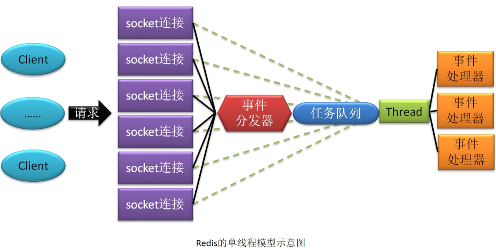
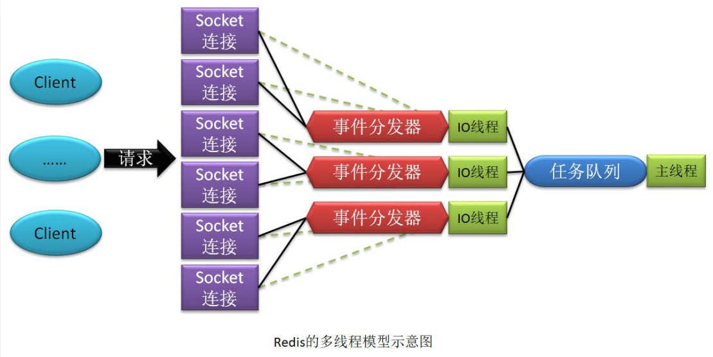
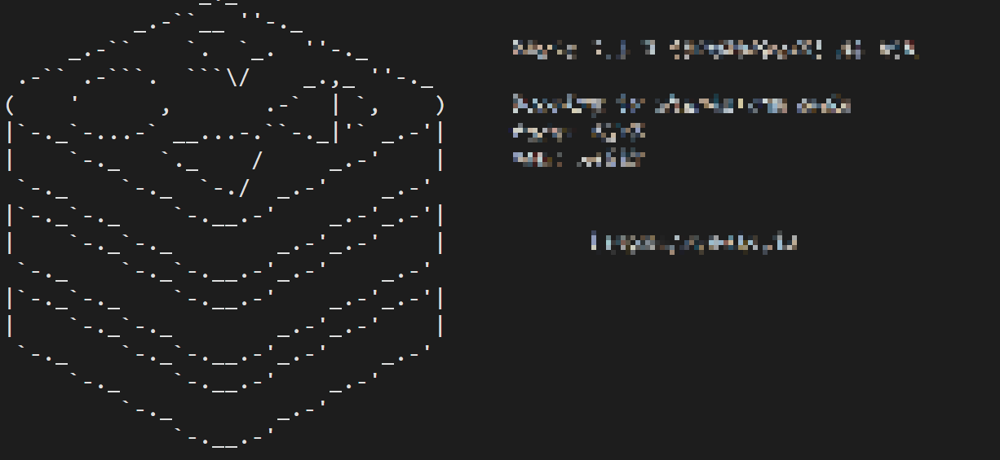
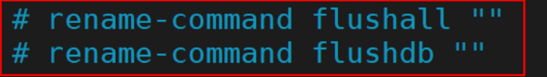
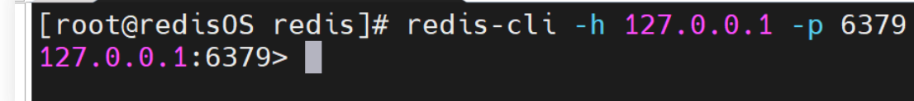

# Redis

## 概述

### Redis简介

`Redis`，Remote Dictionary Server，远程字典服务，是一个使用 ANSI C 语言编写、支持网络、可基于内存亦可持久化的日志型、NoSQL 开源内存数据库。

之所以称之为字典服务，是因为 Redis 是一个 `key-value` 存储系统。支持存储的 value 类型很多，包括 String(字符串)、List(链表)、Set(集合)、Zset(sorted set --有序集合)和 Hash（哈希类型）等。

#### NoSQL

NoSQL（“non-relational”， “Not Only SQL”），泛指**非关系型的数据库**。

**特点**：

- **键值存储数据库**：就像 Map 一样的 key-value 对。典型代表就是 Redis；
- **列存储数据库**：关系型数据库是典型的行存储数据库。其存在的问题是，按行存储的数据在物理层面占用的是连续存储空间，不适合海量数据存储。而按列存储则可实现分布式存储，适合海量存储。典型代表是 HBase；
- **文档型数据库**：其是 NoSQL 与关系型数据的结合，最像关系型数据库的 NoSQL。典型代表是 MongoDB；
- **图形(Graph)数据库**：用于存放一个节点关系的数据库，例如描述不同人间的关系。典型代表是 Neo4J；

#### 用途

Redis 在生产中使用最多的场景就是**做数据缓存**。即客户端从 DBMS 中查询出的数据首先写入到 Redis 中，后续无论哪个客户端再需要访问该数据，直接读取 Redis 中的即可，不仅减小了 RT，而且降低了 DBMS 的压力。

根据缓存数据和数据库数据的同步性将缓存划分为两类：实时同步缓存、阶段性同步缓存。

**实时同步缓存**是指，DBMS 中数据更新后，Redis **缓存中的存放的相关数据会被立即清除**，以促使再有对该数据的访问请求到来时，必须先从 DBMS 中查询获取到最新数据，然后再写入到 Redis。

**阶段性同步缓存**是指，Redis 缓存中的数据**允许在一段时间内与 DBMS 中的数据不完全一致**。而这个时间段就是这个缓存数据的过期时间。

### Redis 特性

1. **性能极高**：Redis 读的速度可以达到 11w 次/s，写的速度可以达到 8w 次/s。高性能的原因：
    - Redis 的所有操作都是在内存中发生的。
    - Redis 是用 C 语言开发的。
    - Redis 源码非常精细（集性能与优雅于一身）。
2. **简单稳定**：Redis 源码很少。早期版本只有 2w 行左右。从 3.0 版本开始，增加了集群功能，代码变为了 5w 行左右。
3. **持久化**：Redis 内存中的数据可以进行持久化，其有两种方式：RDB 与 AOF。
4. **高可用集群**：Redis 提供了高可用的主从集群功能，可以确保系统的安全性。
5. **丰富的数据类型**：Redis 是一个 key-value 存储系统。支持存储的 value 类型很多，包括 String(字符串)、List(链表)、Set(集合)、Zset(sorted set --有序集合)和 Hash（哈希类型） 等，还有 BitMap、HyperLogLog、Geospatial 类型。
6. **BitMap**：一般用于大数据量的二值性统计。
7. **HyperLogLog**：其是 Hyperlog Log，用于对数据量超级庞大的日志做去重统计。
8. **Geospatial**：地理空间，其主要用于地理位置相关的计算。
9. **强大的功能**：Redis 提供了数据过期功能、发布/订阅功能、简单事务功能，还支持 Lua 脚本扩展功能。
10. **客户端语言广泛**：Redis提供了简单的 TCP 通信协议，编程语言可以方便地的接入 Redis。
11. **支持 ACL 权限控制**：之前的权限控制非常笨拙。从 Redis6 开始引入了 ACL 模块，可以为不同用户定制不同的用户权限。
    - ACL，Access Control List，访问控制列表，是一种细粒度的权限管理策略，可以针对任意用户与组进行权限控制。目前大多数 Unix 系统与 Linux 2.6 版本已经支持 ACL 了。 Zookeeper 早已支持 ACL 了。 Unix 与 Linux 系统默认使用是 UGO（User、Group、Other）权限控制策略，其是一种粗粒度的权限管理策略。
12. **支持多线程 IO 模型**：Redis 之前版本采用的是单线程模型，从 6.0 版本开始支持了多线程模型。

### Redis 的 IO 模型

Redis **处理客户端请求所采用的处理架构**，称为 Redis 的 IO 模型。

#### 单线程模型

对于 Redis 3.0 及其以前版本，Redis 的 IO 模型采用的是纯粹的单线程模型。即所有客户端的请求全部由一个线程处理。



Redis 的单线程模型采用了**多路复用技术**。

对于多路复用器的多路选择算法常见的有三种：select 模型、poll 模型、epoll 模型。 

1. poll 模型的选择算法：采用的是轮询算法。该模型对客户端的就绪处理是有延迟的。
2. epoll 模型的选择算法：采用的是回调方式。根据就绪事件发生后的处理方式的不同， 又可分为 LT 模型与 ET 模型。

每个客户端若要向 Redis 提交请求，都需要与 Redis 建立一个 socket 连接，并向事件分发器注册一个事件。一旦该事件发生就表明该连接已经就绪。而一旦连接就绪，事件分发器就会感知到，然后获取客户端通过该连接发送的请求，并将由该事件分发器所绑定的这个唯一的线程来处理。如果该线程还在处理多个任务，则将该任务写入到任务队列等待线程处理。只所以称为事件分发器，是因为它会根据不同的就绪事件，将任务交由不同的事件处理器去处理。

#### 混合线程模型

从 Redis 4.0 版本开始，Redis 中就开始加入了多线程元素。处理客户端请求的仍是单线程模型，但对于一些比较耗时但又不影响对客户端的响应的操作，就由后台其它线程来处理。

例如，持久化、对 AOF 的 rewrite、对失效连接的清理等。 


Redis 6.0 版本，才是真正意义上的多线程模型。因为其对于客户端请求的处理采用的是多线程模型。



多线程 IO 模型中的“多线程”仅用于接受、解析客户端的请求，然后将解析出的请求写入到任务队列。而对具体任务（命令）的处理，仍是由主线程处理。这样做使得用户无需考虑线程安全问题，无需考虑事务控制，无需考虑像 LPUSH/LPOP 等命令的执行顺序问题。

**优缺点总结**

- 单线程模型
    - 优点：可维护性高，性能高。不存在并发读写情况，所以也就不存在执行顺序的不确定 性，不存在线程切换开销，不存在死锁问题，不存在为了数据安全而进行的加锁/解锁 开销。
    - 缺点：性能会受到影响，且由于单线程只能使用一个处理器，所以会形成处理器浪费。
- 多线程模型
    - 优点：其结合了多线程与单线程的优点，避开了它们的所有不足
    - 缺点：该模型没有明显不足。如果非要找其不足的话就是，其并非是一个真正意义上的 “多线程”，因为真正处理“任务”的线程仍是单线程。所以，其对性能也是有些影响的。

## 安装与配置

官网`redis.io`下载最新版的稳定安装包，然后上传到服务器。

因为redis基于c语言编写的，所以还需要安装c/c++编译器：

```shell
apt install -y gcc tcl
```

然后到redis压缩包所在的目录进行解压：

```shell
tar -zxvf redis-7.2.3.tar.gz
```

安装：

```shell
make && make install
```

测试安装成功与否：

```shell
redis-server
```



出现redis日志输出的启动页面，说明安装成功。

**注意**：`redis-server`命令类似于jar包的部署，都是前台运行，关闭页面就会停止运行。

默认安装位置是 `/usr/local/bin`。

### 后台启动

1. 使用 nohub 命令：

```shell
nohup redis-server &
```

会在当前目录创建一个日志输出文件，后台运行redis。

**停止运行**

```shell
redis-cli shutdown
```

2. 配置式后台启动

修改 Linux 中 Redis 的核心配置文件 `redis.conf` 达到后台启动的目的。**redis.conf 文件在 Redis 的安装目录根下。**

**将 daemonize 属性值由 no 改为 yes，使 Redis 进程以守护进程方式运行。**

修改后再启动 Redis，就无需再键入 nohup 与&符，但**必须要指定启动所使用的 Redis 配置文件**。

原因：使用 `nohup redis-server &` 命令启动 Redis 时，启动项中已经设置好了 Redis 各个参数的默认值，Redis 会按照这些设置的参数进行启动。

但这些参数是可以在配置文件中进行修改的，修改后，需要在启动命令中指定要加载的配置文件，这样，配置文件中的参数值将覆盖原默认值。 

```shell
redis-server redis.conf
```

## 连接

Redis 是一个内存数据库服务器，就像 MySQL 一样，对其操作也需要通过客户端进行，需要进行配置。

**绑定客户端IP**

Redis 可以通过修改配置文件来**限定可以访问自己的客户端 IP**。如只允许当前主机访问：

```
bind 127.0.0.1 -::1
```

不需要的时候直接注释掉即可。

**关闭保护模式**

默认**保护模式**是开启的，**只允许本机的客户端访问**，即只允许自己访问自己。一般都要关闭，使得其它客户端可以连接 Redis。

```
protected-mode no
```

**设置访问密码**

 为 Redis 设置访问密码，可以对要读/写 Redis 的用户进行身份验证。没有密码的用户可以登录 Redis，但无法访问（无法读写）。

- 密码设置：访问密码的设置位置在 redis.conf 配置文件中。默认是被注释掉的，没有密码。

    ```
    requirepass 123456
    ```

**使用密码**

对于密码的使用，有两种方式：

- 登录时未使用密码，则访问时先输入密码；
- 登录时直接使用密码登录，访问时无需再输入密码。

**禁止/重命名命令**

flushal 与 flushdb。用于直接删除整个 Redis 数据库的。

Redis 可以通过修改配置文件来禁止使用这些命令，或重命名这些命令。

禁用 flushall 与 flushdb 命令：



## Redis客户端

Redis 客户端也像 MySQL 客户端一样有多种类型：命令行客户端、图形界面客户端、Java 代码客户端。

### 命令行客户端

Redis 提供了基本的命令行客户端。打开命令行客户端的命令为 `redis-cli`：



-h：指定要连接的 Redis 服务器的 IP。 

-p：指定要连接的 Redis 的端口号。

若连接的是本机 Redis，且端口号没有改变，保持默认的 6379，则-h 与-p 选项可以省略不写。

### 图形界面客户端

RedisPlus， https://gitee.com/MaxBill/RedisPlus。

### Java 代码客户端

所谓 Java 代码客户端就是一套操作 Redis 的 API，其作用就像 JDBC 一样，所以 Java 代码客户端其实就是一个或多个 Jar 包，提供了对 Redis 的操作接口。 对 Redis 操作的 API 很多，例如 jdbc-redis、jredis 等，但最常用的是 Jedis。

## Redis 配置文件

redis.conf

