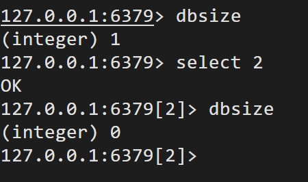

## 基本命令

需要先通过 `redis-cli` 命令进入到 Redis 命令行客户端，然后再运行下面的命令:

```shell
redis-cli -h 127.0.0.1 -p 6379 -a xxxxxx
```

进入控制台：


### 心跳命令


表明该客户端与 Redis 的连接是正常。

### 帮助命令

格式：help 命令；

作用：查看一个命令的具体用法。


### 读写键值命令

`set key value`：将指定 key-value 写入到 DB。

`get key`：读取指定 key 的 value 值。


### DB 切换 select

Redis 默认有 16 个数据库。这个在 Redis Desktop Manager（RDM）图形客户端中可以直观地看到。


**默认使用的是 0 号 DB**，可以通过 select db 索引来切换 DB。

例如，切换到 DB1，并会将 age-23 写入到 DB1 中：


### 查看 key 数量

dbsize 命令可以查看当前数据库中 key 的数量。



### 删除数据库

1. `flushdb` 命令

仅删除当前数据库中的数据，不影响其它库。


解释：0、1初始都有一个键值对，`flushdb`将 数据库1清空，数据库 0不受影响。

2. `flushall` 命令

删除所有数据库数据。

### 退出客户端

`exit` 或者 `quit`


## Key 操作命令

Redis 中存储的数据整体是一个 Map，其 key 为 String 类型，而 value 则可以是 String、 Hash 表、List、Set 等类型。

### keys

- 格式：`KEYS pattern`；
- 功能：查找所有符合给定模式 pattern 的 key，pattern 为正则表达式；
- 说明：KEYS 的速度非常快，但在一个大的数据库中使用它可能会阻塞当前服务器的服务。所以**生产环境中一般不使用**该命令，而**使用 scan 命令代替**；

### exists

- 格式：EXISTS key；
- 功能：检查给定 key 是否存在；
- 说明：若 key 存在，返回 1 ，否则返回 0 ；

### del

- 格式：DEL key [key ...]；
- 功能：删除给定的一个或多个 key 。**不存在的 key 会被忽略**；
- 说明：**返回值**是被删除 key 的数量；

```
del key
del key1 key2 key3
```

### rename

- 格式：RENAME key newkey；
- 功能：将 key 改名为 newkey；
- 说明：当 key 和 newkey 相同，或者 key 不存在时，返回一个错误。当 newkey 已经 存在时， RENAME 命令将覆盖旧值。改名成功时提示 OK ，失败时候返回一个错误。 

### move

格式：MOVE key db；

功能：将当前数据库的 key 移动到给定的数据库 db 当中；

说明：如果当前数据库(源数据库)和给定数据库(目标数据库)有相同名字的给定 key ， 或者 key 不存在于当前数据库，那么 MOVE 没有任何效果。移动成功返回 1 ，失败 则返回 0；

### type

- 格式：TYPE key；
- 功能：返回 key 所储存的值的类型；
- 说明：返回值有以下六种：
    - none (key 不存在)；
    - string (字符串)；
    - list (列表)；
    - set (集合)；
    - zset (有序集)；
    - hash (哈希表)

### expire 与 pexpire

- 格式：EXPIRE key seconds；

- 功能：为**给定 key 设置生存时间**。当 key 过期时(生存时间为 0)，它会被自动删除。 `expire` 的时间单位为**秒**，`pexpire` 的时间单位为**毫秒**。在 Redis 中，带有生存时间的 key 被称为“易失的”(volatile)；

- 说明：生存时间设置成功返回 1。若 key 不存在时返回 0 。rename 操作不会改变 key 的生存时间；

### ttl 与 pttl

- 格式：TTL key；

- 功能：TTL, time to live，返回给定 key 的**剩余生存时间**；

- 说明：其返回值存在三种可能：
    - 当 key 不存在时，返回 -2 。
    - 当 key 存在但没有设置剩余生存时间时，返回 -1 。
    - 否则，返回 key 的剩余生存时间。
    - ttl 命令返回的时间单位为秒，而 pttl 命令 返回的时间单位为毫秒。

### persist

- 格式：PERSIST key；
- 功能：去除给定 key 的生存时间，将这个 key 从“易失的”转换成“持久的”；
- 说明：当生存时间移除成功时，返回 1；若 key 不存在或 key 没有设置生存时间，则 返回 0。

### randomkey

- 格式：RANDOMKEY

- 功能：从当前数据库中随机返回(不删除)一个 key；
- 说明：当数据库不为空时，返回一个 key。当数据库为空时，返回 nil。

### scan

- 格式：SCAN cursor [MATCH pattern] [COUNT count] [TYPE type]；

- 功能：用于迭代数据库中的数据库键。其各个选项的意义为：

    - cursor：本次迭代开始的游标；

    - pattern ：本次迭代要匹配的 key 的模式；

    - count ：本次迭代要从数据集里返回多少元素，默认值为 10；

    - type：本次迭代要返回的 value 的类型，默认为所有类型。 

        SCAN 命令是一个基于游标 cursor 的迭代器：SCAN 命令每次被调用之后，都会向用户返回返回一个包含两个元素的数组， 第一个元素是用于进行下一次迭代的新游标，而第二个元素则是一个数组，这个数组中包含了所有被迭代的元素。用户在下次迭代 时需要使用这个新游标作为 SCAN 命令的游标参数，以此来延续之前的迭代过程。当 SCAN 命令的游标参数被设置为 0 时，服务器将开始一次新的迭代。如果新游标返回 0  表示迭代已结束；

- 说明：使用间断的、负数、超出范围或者其他非正常的游标来执行增量式迭代不会造成服务器崩溃。当数据量很大时，count 的数量的指定可能会不起作用，Redis 会自动调整每次的遍历数目。由于 scan 命令每次执行都只会返回少量元素，所以该命令可以用于生产环境，而不会出现像 KEYS 命令带来的服务器阻塞问题。增量式迭代命令所使用的算法只保证在数据集的大小有界的情况下迭代才会停止，换句话说，如果被迭代数据集的大小不断地增长的话，增量式迭代命令可能永远也无法完成一次完整迭代。即当一个数据集不断地变大时，想要访问这个数据集中的所有元素就需要做越来越多的工作，能否结束一个迭代取决于用户执行迭代的速度是否比数据集增长的速度更快；
- 相关命令：另外还有 3 个 scan 命令用于对三种类型的 value 进行遍历。
    - hscan：属于 Hash 型 Value 操作命令集合，用于遍历当前 db 中指定 Hash 表的所有 field-value 对。
    - sscan：属于 Set 型 Value 操作命令集合，用于遍历当前 db 中指定 set 集合的所有元素；
    -  zscan：属于 ZSet 型 Value 操作命令集合，用于遍历当前 db 中指定有序集合的所有元素（数值与元素值）

### key的层级格式

Redis没有类似MySQL中的Table的概念，如何区分不同类型的key呢？

例如，需要存储用户、商品信息到redis，有一个用户id是1，有一个商品id恰好也是1，此时如果使用id作为key，那就会冲突了，该怎么办？

可以**通过给key添加前缀加以区分**，不过这个前缀不是随便加的，有一定的**规范**：

Redis的key允许有多个单词形成层级结构，多个单词之间用':'隔开，格式如下：

项目名:业务名:类型:id

格式并非固定，也可以根据自己的需求来删除或添加词条。


## String 型 Value 操作命令

Redis 存储数据的 Value 可以是一个 String 类型数据。String 类型的 Value 是 Redis 中最基本、最常见的类型。**String 类型的 Value 中可以存放任意数据，包括数值型，甚至是二进制的图片、音频、视频、序列化对象等**。一个 String 类型的 Value **最大是 512M** 大小。

### set

- 格式：SET key value [EX seconds | PX milliseconds] [NX|XX]；
- 功能：SET 除了可以直接将 key 的值设为 value 外，还可以指定一些参数。
    - EX seconds：为当前 key 设置过期时间，单位**秒**。**等价于 SETEX 命令**。
    - PX milliseconds：为当前 key 设置过期时间，单位**毫秒**。等价于 `PSETEX` 命令。
    - NX：指定的 key 不存在才会设置成功，用于添加指定的 key。等价于 `SETNX` 命令。
    - XX：指定的 key 必须存在才会设置成功，用于更新指定 key 的 value。
- 说明：如果 value 字符串中**带有空格**，则该字符串**需要使用双引号或单引号引起来**，否则会认为 set 命令的参数数量不正确，报错。

### setex 与 psetex

- 格式：SETEX/PSETEX key seconds value；

- 功能：set expire，其不仅为 key 指定了 value，还为其设置了生存时间。`setex` 的单位为 `秒`，`psetex` 的单位为`毫秒`；

- 说明：如果 key 已经存在，则覆写旧值。该命令类似于以下两个命令，不同之处是， SETEX 是一个原子性操作，关联值和设置生存时间两个动作会在同一时间内完成，该命令在 Redis 用作缓存时，非常实用。

    - SET key value 

        EXPIRE key seconds # 设置生存时间

### setnx

- 格式：SETNX key value；
- 功能：SET if Not eXists，将 key 的值设为 value ，**当且仅当 key 不存在**。若给定的 key 已经存在，则 SETNX 不做任何动作。成功，返回 1，否则，返回 0；
- 说明：该命令等价于 set key value nx；

### getset

- 格式：GETSET key value；
- 功能：将给定 key 的值设为 value ，并**返回 key 的旧值**；
- 说明：**当 key 存在但不是字符串类型时，返回一个错误；当 key 不存在时，返回 nil 。**

### mset 与 msetnx

- 格式：MSET/MSETNX key value [key value ...]；
- 功能：同时设置一个或多个 key-value 对；
- 说明：如果某个给定 key 已经存在，那么 MSET **会用新值覆盖原来的旧值**，如果这不是你所希望的效果，请考虑使用 `MSETNX`

`MSETNX`：它只会在**所有给定 key** **都不存在的情况下进行设置操作**。MSET/MSETNX 是一个原子性(atomic)操作，所有给定 key 都会在同一时间内被设置，某些给定 key 被更新而另一些给定 key 没有改变的情况不可能发生。该命令永不失败。

### mget

- 格式：MGET key [key ...]；
- 功能：返回所有(一个或多个)给定 key 的值；
- 说明：如果给定的 key 里面，有某个 key 不存在，那么这个 key 返回特殊值 nil 。因此，该命令永不失败。

### append

- 格式：APPEND key value；
- 功能：如果 key 已经存在并且是一个字符串， APPEND 命令将 value 追加到 key 原来的值的末尾。如果 key 不存在， APPEND 就简单地将给定 key 设为 value ，就像执行 SET key value 一样；
- 说明：追加 value 之后， key 中字符串的长度。

### incr 与 decr

- 格式：INCR key 或 DECR key；
- 功能：
    - `increment`，**自动递增**。将 key 中存储的数字值增一。
    - `decrement`，**自动递减**。将 key 中存储的数字值减一。
- 说明：如果 key 不存在，那么 key 的值会先被初始化为 0，然后再执行增一/减一操作。如果值不能表示为数字，那么返回一个错误提示。如果执行正确，则返回增一/减一后的值。


### incrby 与 decrby

- 格式：INCRBY key increment 或 DECRBY key decrement；
- 功能：将 key 中存储的数字值**增加/减少指定的数值**，这个数值**只能是整数，可以是负数，但不能是小数**；
- 说明：如果 key 不存在，那么 key 的值会先被初始化为 0，然后再执行增/减操作。如 果值不能表示为数字，那么返回一个错误提示。如果执行正确，则返回增/减后的值。


### incrbyfloat

- 格式：INCRBYFLOAT key increment；
- 功能：为 key 中所储存的值**加上浮点数增量** `increment` ；
- 说明：与之前的说明相同。没有 decrbyfloat 命令，但 **increment 为负数可以实现减操作效果**。

### strlen

- 格式：STRLEN key；
- 功能：**返回 key 所储存的字符串值的长度；**
- 说明：当 key 储存的不是字符串值时，返回一个错误；当 key 不存在时，返回 0 。

### getrange

- 格式：GETRANGE key start end；
- 功能：返回 key 中字符串值的子字符串，字符串的截取范围由 start 和 end 两个偏移 量决定，包括 start 和 end 在内；
- 说明：end 必须要比 start 大。支持负数偏移量，表示从字符串最后开始计数，-1 表示最后一个字符，-2 表示倒数第二个，以此类推。

### setrange

- 格式：SETRANGE key offset value；
- 功能：用 value 参数替换给定 key 所储存的字符串值 str，从偏移量 offset 开始。
- 说明：当 offset 值大于 str 长度时，中间使用零字节\x00 填充，即 0000 0000 字节填充； 对于不存在的 key 当作空串处理。

### 位操作命令

名称中包含 BIT 的命令，都是对二进制位的操作命令，例如，setbit、getbit、bitcount、bittop、bitfield，这些命令不常用。

### 应用场景

#### 数据缓存

Redis 作为数据缓存层，MySQL 作为数据存储层。应用服务器首先从 Redis 中获取数据，如果缓存层中没有，则从 MySQL 中获取后先存入缓存层再返回给应用服务器。

#### 计数器

在 Redis 中写入一个 value 为数值型的 key 作为平台计数器、视频播放计数器等。每个有效客户端访问一次，或视频每播放一次，都是直接修改 Redis 中的计数器，然后再以异步方式持久化到其它数据源中，例如持久化到 MySQL。

#### 共享 Session


对于一个分布式应用系统，如果将类似用户登录信息这样的 Session 数据保存在提供登录服务的服务器中，那么如果用户再次提交像收藏、支付等请求时可能会出现问题：在提供收藏、支付等服务的服务器中并没有该用户的 Session 数据，从而导致该用户需要重新登录。对于用户来说，这是不能接受的。

此时，可以将系统中所有用户的 Session 数据全部保存到 Redis 中，用户在提交新的请求后，系统先从 Redis 中查找相应的 Session 数据，如果存在，则再进行相关操作，否则跳转到登录页面。这样就不会引发“重新登录”问题。

#### 限速器

现在很多平台为了防止 DoS（Denial of Service，拒绝服务）攻击，一般都会限制一个 IP 不能在一秒内访问超过 n 次。而 Redis 可以可以结合 key 的过期时间与 incr 命令来完成限速 功能，充当限速器。

注意，其无法防止 DDoS（Distributed Denial of Service，分布式拒绝服务）攻击。

```sql
// 客户端每提交一次请求，都会执行下面的代码
// 等价于 set 192.168.192.55 1 ex 60 nx
// 指定新 ip 作为 key 的缓存过期时间为 60 秒
Boolean isExists = redis.set(ip, 1, “EX 60”, “NX”);
if(isExists != null || redis.incr(ip) <= 5) {
 // 通过
} else {
// 限流
}
```

## Hash 型 Value 操作命令

Redis 存储数据的 Value 可以是一个 Hash 类型。Hash 类型也称为 Hash 表、字典等。

Hash 表就是一个映射表 Map，也是由键-值对构成，为了与整体的 key 进行区分，这里的键称为 field，值称为 value。注意，Redis 的 Hash 表中的 field-value 对均为 String 类型。

**注意hash和string区别**

String：


String的value是字符串，是一个**json**，只是展示为字符串。对json里的某个属性的修改麻烦。

Hash：


Hash则都是字符串（field-value）。可以单独修改某个field。

### hset

- 格式：HSET key field value；
- 功能：将哈希表 key 中的域 field 的值设为 value ；
- 说明：如果 key 不存在，一个新的哈希表被创建并进行 HSET 操作。如果域 field 已经存在于哈希表中，旧值将被覆盖。如果 field 是哈希表中的一个新建域，并且值设置成功，返回 1 。如果哈希表中域 field 已经存在且旧值已被新值覆盖，返回 0 。


### hget

- 格式：HGET key field；
- 功能：返回哈希表 key 中给定域 field 的值；
- 说明：当给定域不存在或是给定 key 不存在时，返回 nil 。

### hmset

- 格式：HMSET key field value [field value ...]；
- 功能：同时将多个 field-value (域-值)对设置到哈希表 key 中；
- 说明：此命令会覆盖哈希表中已存在的域。如果 key 不存在，一个空哈希表被创建并执行 HMSET 操作。如果命令执行成功，返回 OK 。当 key 不是哈希表(hash)类型时， 返回一个错误。

### hmget

- 格式：HMGET key field [field ...]；
- 功能：按照给出顺序返回哈希表 key 中一个或多个域的值；
- 说明：如果给定的域不存在于哈希表，那么返回一个 nil 值。因为不存在的 key 被当作一个空哈希表来处理，所以对一个不存在的 key 进行 HMGET 操作将返回一个只带 有 nil 值的表。

### hgetall

- 格式：HGETALL key；

- 功能：返回哈希表 key 中所有的域和值；
- 说明：在返回值里，紧跟每个域名(field name)之后是域的值(value)，所以返回值的长度是哈希表大小的两倍。若 key 不存在，返回空列表。若 key 中包含大量元素，则该命 令可能会阻塞 Redis 服务。所以生产环境中一般不使用该命令，而使用 hscan 命令代替。

### hsetnx

- 格式：HSETNX key field value；
- 功能：将哈希表 key 中的域 field 的值设置为 value ，当且仅当域 field 不存在；
- 说明：若域 field 已经存在，该操作无效。如果 key 不存在，一个新哈希表被创建并 执行 HSETNX 命令。

### hdel

- 格式：HDEL key field [field ...]；
- 功能：删除哈希表 key 中的一个或多个指定域，不存在的域将被忽略；
- 说明：返回被成功移除的域的数量，不包括被忽略的域；

### hexits

- 格式：HEXISTS key field；
- 功能：查看哈希表 key 中给定域 field 是否存在；
- 说明：如果哈希表含有给定域，返回 1 。如果不含有给定域，或 key 不存在，返回 0 。

### hincrby 与 hincrbyfloat

- 格式：HINCRBY key field increment；

- 功能：为哈希表 key 中的域 field 的值加上增量 increment 。hincrby 命令只能增加整 数值，而 hincrbyfloat 可以增加小数值。

- 说明：增量也可以为负数，相当于对给定域进行减法操作。如果 key 不存在，一个新 的哈希表被创建并执行 HINCRBY 命令。如果域 field 不存在，那么在执行命令前，域 的值被初始化为 0。对一个储存字符串值的域 field 执行 HINCRBY 命令将造成一个错误。

### hkeys 与 hvals

- 格式：HKEYS key 或 HVALS key

- 功能：返回哈希表 key 中的所有域/值。

- 说明：当 key 不存在时，返回一个空表。

### hlen

- 格式：HLEN key

- 功能：返回哈希表 key 中域的数量。

- 说明：当 key 不存在时，返回 0 。

### hstrlen

- 格式：HSTRLEN key field 

- 功能：返回哈希表 key 中，与给定域 field 相关联的值的字符串长度（string length）。

- 说明：如果给定的键或者域不存在， 那么命令返回 0 。

### 应用场景

Hash 型 Value 非常适合存储对象数据。key 为对象名称，value 为描述对象属性的 Map， 对对象属性的修改在 Redis 中就可直接完成。其不像 String 型 Value 存储对象，那个对象是 序列化过的，例如序列化为 JSON 串，对对象属性值的修改需要先反序列化为对象后再修改， 修改后再序列化为 JSON 串后写入到 Redis。

## List 型 Value 操作命令

Redis 存储数据的 Value 可以是一个 String 列表类型数据。即该列表中的每个元素均为 String 类型数据。列表中的数据会**按照插入顺序进行排序**（头插法）。不过，该列表的底层**实际是一个无头节点的双向链表**，所以对列表表头与表尾的操作性能较高，但对中间元素的插入与删除的操作的性能相对较差。

### lpush/rpush

- 格式：LPUSH key value [value ...] 或 RPUSH key value [value ...]；
- 功能：将一个或多个值 value 插入到列表 key 的表头/表尾（表头在左表尾在右）；
- 说明：如果有多个 value 值，对于 `lpush` 来说，**各个 value 会按从左到右的顺序依次插入到表头**；对于 `rpush` 来说，各个 value 会**按从左到右的顺序依次插入到表尾**。如果 key 不存在，一个空列表会被创建并执行操作。当 key 存在但不是列表类型时，返回一个 错误。执行成功时返回列表的长度
- 

### llen

- 格式：LLEN key；
- 功能：返回列表 key 的长度；
- 说明：如果 key 不存在，则 key 被解释为一个空列表，返回 0 。如果 key 不是列表 类型，返回一个错误。

### lindex

- 格式：LINDEX key index；
- 功能：返回列表 key 中，下标为 index 的元素。列表从 0 开始计数；
- 说明：如果 index 参数的值不在列表的区间范围内(out of range)，返回 nil 。

### lset

- 格式：LSET key index value；
- 功能：将列表 key 下标为 index 的元素的值设置为 value ；
- 说明：当 index 参数超出范围，或对一个空列表（key 不存在）进行 LSET 时，返回一个错误；

### lrange

- 格式：LRANGE key start stop；
- 功能：返回列表 key 中指定区间[start, stop]内的元素，即包含两个端点；
- 说明：List 的下标从 0 开始，即以 0 表示列表的第一个元素，以 1 表示列表的第二个元素，以此类推。也可以使用负数下标，以 -1 表示列表的最后一个元素， -2 表示列 表的倒数第二个元素，以此类推。超出范围的下标值不会引起错误。如果 start 下标比 列表的最大下标 还要大，那么 LRANGE 返回一个空列表。如果 stop 下标比最大下标 还要大，Redis 将 stop 的值设置为最大下标。

### lpushx 与 rpushx

- 格式：LPUSHX key value 或 RPUSHX key value；
- 功能：将值 value 插入到列表 key 的表头/表尾，当且仅当 key 存在并且是一个列表；
- 说明：当 key 不存在时，命令什么也不做。若执行成功，则输出表的长度。

### linsert

- 格式：LINSERT key BEFORE|AFTER pivot value；
- 功能：将值 value 插入到列表 key 当中，位于元素 pivot 之前或之后；
- 说明：当 pivot 元素不存在于列表中时，不执行任何操作，返回-1；当 key 不存在时， key 被视为空列表，不执行任何操作，返回 0；如果 key 不是列表类型，返回一个错误；如果命令执行成功，返回插入操作完成之后，列表的长度。

### lpop / rpop

- 格式：LPOP key [count] 或 RPOP key [count]；
- 功能：从列表 key 的表头/表尾移除 count 个元素，并返回移除的元素。count 默认值 1；
- 说明：当 key 不存在时，返回 nil；

### blpop / brpop

- 格式：BLPOP key [key ...] timeout 或 BRPOP key [key ...] timeout；
- 功能：BLPOP/BRPOP 是列表的阻塞式(blocking)弹出命令。它们是 LPOP/RPOP 命令的阻 塞版本，当给定列表内没有任何元素可供弹出的时候，连接将被 BLPOP/BRPOP 命令阻 塞，直到等待 timeout 超时或发现可弹出元素为止。当给定多个 key 参数时，按参数 key 的先后顺序依次检查各个列表，弹出第一个非空列表的头元素。timeout 为阻塞时长， 单位为秒，其值若为 0，则表示只要没有可弹出元素，则一直阻塞。
- 说明：假如在指定时间内没有任何元素被弹出，则返回一个 nil 和等待时长。反之，返 回一个含有两个元素的列表，第一个元素是被弹出元素所属的 key ，第二个元素是被 弹出元素的值。

### rpoplpush

- 格式：RPOPLPUSH source destination；
- 功能：命令 RPOPLPUSH 在一个原子时间内，执行以下两个动作：
    - 将列表 source 中的最后一个元素(尾元素)弹出，并返回给客户端。
    - 将 source 弹出的元素插入到列表 destination ，作为 destination 列表的的头元素。 如果 source 不存在，值 nil 被返回，并且不执行其他动作。如果 source 和 destination 相同，则列表中的表尾元素被移动到表头，并返回该元素，可以把这种特殊情况视作列 表的旋转(rotation)操作。

### brpoplpush

- 格式：BRPOPLPUSH source destination timeout；
- 功能：BRPOPLPUSH 是 RPOPLPUSH 的阻塞版本，当给定列表 source 不为空时， BRPOPLPUSH 的表现和 RPOPLPUSH 一样。当列表 source 为空时， BRPOPLPUSH 命令 将阻塞连接，直到等待超时，或有另一个客户端对 source 执行 LPUSH 或 RPUSH 命令 为止。timeout 为阻塞时长，单位为秒，其值若为 0，则表示只要没有可弹出元素，则 一直阻塞。
- 说明：假如在指定时间内没有任何元素被弹出，则返回一个 nil 和等待时长。反之，返 回一个含有两个元素的列表，第一个元素是被弹出元素的值，第二个元素是等待时长。

### lrem

- 格式：LREM key count value；
- 功能：根据参数 count 的值，移除列表中与参数 value 相等的元素。count 的值可以 是以下几种：
    - count > 0 : 从表头开始向表尾搜索，移除与 value 相等的元素，数量为 count 。
    - count < 0 : 从表尾开始向表头搜索，移除与 value 相等的元素，数量为 count 的 绝对值。
    - count = 0 : 移除表中所有与 value 相等的值。
- 说明：返回被移除元素的数量。当 key 不存在时， LREM 命令返回 0 ，因为不存在 的 key 被视作空表(empty list)。

### ltrim

- 格式：LTRIM key start stop；
- 功能：对一个列表进行修剪(trim)，就是说，让列表只保留指定区间内的元素，不在指 定区间之内的元素都将被删除。
- 说明：下标(index)参数 start 和 stop 都以 0 为底，也就是说，以 0 表示列表的第一 个元素，以 1 表示列表的第二个元素，以此类推。也可以使用负数下标，以 -1 表示 列表的最后一个元素， -2 表示列表的倒数第二个元素，以此类推。当 key 不是列表 类型时，返回一个错误。如果 start 下标比列表的最大下标 end ( LLEN list 减去 1 )还要 大，或者 start > stop ， LTRIM 返回一个空列表，因为 LTRIM 已经将整个列表清空。 如果 stop 下标比 end 下标还要大，Redis 将 stop 的值设置为 end 。

### 应用场景

Value 为 List 类型的应用场景很多，主要是通过构建不同的数据结构来实现相应的业务功能。这里仅对这些数据结构的实现方式进行总结，不举具体的例子。

#### 栈

通过 `lpush + lpop` 可以实现栈数据结构效果：先进后出。通过 lpush 从列表左侧插入数 据，通过 lpop 从列表左侧取出数据。当然，通过 rpush + rpop 也可以实现相同效果，只不过 操作的是列表右侧。

#### 队列

通过 `lpush + rpop` 可以实现队列数据结构效果：先进先出。通过 lpush 从列表左侧插入 数据，通过 rpop 从列表右侧取出数据。当然，通过 rpush + lpop 也可以实现相同效果，只不 过操作的方向正好相反。

#### 阻塞式消息队列

通过 lpush + brpop 可以实现阻塞式消息队列效果。作为消息生产者的客户端使用 lpush 从列表左侧插入数据，作为消息消费者的多个客户端使用 brpop 阻塞式“抢占”列表尾部数 据进行消费，保证了消费的负载均衡与高可用性。brpop 的 timeout 设置为 0，表示只要没 有数据可弹出，就永久阻塞。

#### 动态有限集合

通过 lpush + ltrim 可以实现有限集合。通过 lpush 从列表左侧向列表中添加数据，通过 ltrim 保持集合的动态有限性。像企业的末位淘汰、学校的重点班等动态管理，都可通过这 种动态有限集合来实现。当然，通过 rpush + ltrim 也可以实现相同效果，只不过操作的方向 正好相反。

## Set 型 Value 操作命令

Redis 存储数据的 `Value` 可以是一个 `Set` 集合，且集合中的每一个元素均 `String` 类型。Set 与 List 非常相似，但不同之处是 `Set` 中的元素**具有无序性与不可重复性**，而 **List 则具有有序性与可重复性**。 Redis 中的 Set 集合与 Java 中的 Set 集合的实现相似，其底层都是 value 为 null 的 hash 表。也正因为此，才会引发无序性与不可重复性。

### sadd

- 格式：SADD key member [member ...]；
- 功能：将一个或多个 member 元素加入到集合 key 当中，已经存在于集合的 member 元素将被忽略；
- 说明：假如 key 不存在，则创建一个只包含 member 元素作成员的集合。当 key 不是集合类型时，返回一个错误。 

### smembers

- 格式：SMEMBERS key；
- 功能：返回集合 key 中的所有成员；
- 说明：不存在的 key 被视为空集合。若 key 中包含大量元素，则该命令可能会阻塞 Redis 服务。所以生产环境中一般不使用该命令，而使用 sscan 命令代替；

### scard

- 格式：SCARD key；
- 功能：返回 Set 集合的长度；
- 说明：当 key 不存在时，返回 0 。

### sismember

- 格式：SISMEMBER key member；
- 功能：判断 member 元素是否集合 key 的成员。
- 说明：如果 member 元素是集合的成员，返回 1 。如果 member 元素不是集合的成 员，或 key 不存在，返回 0 。

### smove

- 格式：SMOVE source destination member；


- 功能：将 member 元素从 source 集合移动到 destination 集合。


- 说明：如果 source 集合不存在或不包含指定的 member 元素，则 SMOVE 命令不执 行任何操作，仅返回 0 。否则， member 元素从 source 集合中被移除，并添加到 destination 集合中去，返回 1。当 destination 集合已经包含 member 元素时， SMOVE 命令只是简单地将 source 集合中的 member 元素删除。当 source 或 destination 不 是集合类型时，返回一个错误。


### srem

- 格式：SREM key member [member ...]；
- 功能：移除集合 key 中的一个或多个 member 元素，不存在的 member 元素会被忽 略，且返回成功移除的元素个数。
- 说明：当 key 不是集合类型，返回一个错误。

### srandmember

- 格式：SRANDMEMBER key [count]；
- 功能：返回集合中的 count 个随机元素。count 默认值为 1；
- 说明：若 count 为正数，且小于集合长度，那么返回一个包含 count 个元素的数组，数组中的元素各不相同。如果 count 大于等于集合长度，那么返回整个集合。如果count 为负数，那么返回一个包含 count 绝对值个元素的数组，但数组中的元素可能 会出现重复。

### spop

- 格式：SPOP key [count]；
- 功能：移除并返回集合中的 count 个随机元素。count 必须为正数，且默认值为 1；
- 说明：如果 count 大于等于集合长度，那么移除并返回整个集合。

### sdiff / sdiffstore

- 格式：SDIFF key [key ...] 或 SDIFFSTORE destination key [key ...]；


- 功能：返回第一个集合与其它集合之间的差集。差集，difference。


- 说明：这两个命令的不同之处在于，sdiffstore 不仅能够显示差集，还能将差集存储到指 定的集合 destination 中。如果 destination 集合已经存在，则将其覆盖。不存在的 key 被 视为空集。


### sinter / sinterstore

- 格式：SINTER key [key ...] 或 SINTERSTORE destination key [key ...]；

- 功能：返回多个集合间的交集。交集，intersection；

- 说明：这两个命令的不同之处在于，sinterstore 不仅能够显示交集，还能将交集存储到指定的集合 destination 中。如果 destination 集合已经存在，则将其覆盖。不存在的 key  被视为空集；


### sunion / sunionstore

- 格式：SUNION key [key ...] 或 SUNIONSTORE destination key [key ...]

- 功能：返回多个集合间的并集。并集，union；

- 说明：这两个命令的不同之处在于，sunionstore 不仅能够显示并集，还能将并集存储到 指定的集合 destination 中。如果 destination 集合已经存在，则将其覆盖。不存在的 key  被视为空集。


### 应用场景

Value 为 Set 类型的应用场景很多，这里对这些场景仅进行总结。

#### 动态黑白名单

例如某服务器中要设置用于访问控制的黑名单。如果直接将黑名单写入服务器的配置文 件，那么存在的问题是，无法动态修改黑名单。此时可以将黑名单直接写入 Redis，只要有 客户端来访问服务器，服务器在获取到客户端 IP后先从 Redis的黑名单中查看是否存在该 IP， 如果存在，则拒绝访问，否则访问通过。

#### 有限随机数

有限随机数是指返回的随机数是基于某一集合范围内的随机数，例如抽奖、随机选人。 通过 spop 或 srandmember 可以实现从指定集合中随机选出元素。

#### 用户画像

社交平台、电商平台等各种需要用户注册登录的平台，会根据用户提供的资料与用户使 用习惯，为每个用户进行画像，即为每个用户定义很多可以反映该用户特征的标签，这些标 签就可以使用 sadd 添加到该用户对应的集合中。这些标签具有无序、不重复特征。 同时平台还可以使用 sinter/sinterstore 根据用户画像间的交集进行好友推荐、商品推荐、 客户推荐等。

## 有序 Set 型 Value 操作命令

Redis 存储数据的 Value 可以是一个有序 Set，这个有序 Set 中的每个元素**均** `String` 类型。 有序 Set 与 Set 的不同之处是，**有序 Set 中的每一个元素都有一个分值 score**，Redis 会**根据 score 的值对集合进行由小到大的排序**。其与 Set 集合要求相同，**元素不能重复**，但元素的 **score 可以重复**。由于该类型的所有命令均是字母 z 开头，所以该 Set 也称为 `ZSet`。

### zadd

- 格式：ZADD key score member [[score member] [score member] ...]；
- 功能：将一个或多个 member 元素及其 score 值加入到有序集 key 中的适当位置；
- 说明：score 值可以是整数值或双精度浮点数。如果 key 不存在，则创建一个空的有序 集并执行 ZADD 操作。当 key 存在但不是有序集类型时，返回一个错误。如果命令执行成功，则返回被成功添加的新成员的数量，不包括那些被更新的、已经存在的成员。 若写入的 member 值已经存在，但 score 值不同，则新的 score 值将覆盖老 score。

### zrange 与 zrevrange

- 格式：ZRANGE key start stop [WITHSCORES] 或 ZREVRANGE key start stop [WITHSCORES]
- 功能：返回有序集 key 中，指定区间内的成员。zrange 命令会按 score 值递增排序， zrevrange命令会按score递减排序。具有相同 score 值的成员按字典序/逆字典序排列。 可以通过使用 WITHSCORES 选项，来让成员和它的 score 值一并返回；
- 说明：下标参数从 0 开始，即 0 表示有序集第一个成员，以 1 表示有序集第二个成员， 以此类推。也可以使用负数下标，-1 表示最后一个成员，-2 表示倒数第二个成员，以 此类推。超出范围的下标并不会引起错误。例如，当 start 的值比有序集的最大下标还 要大，或是 start > stop 时，ZRANGE 命令只是简单地返回一个空列表。再比如 stop 参 数的值比有序集的最大下标还要大，那么 Redis 将 stop 当作最大下标来处理。 若 key 中指定范围内包含大量元素，则该命令可能会阻塞 Redis 服务。所以生产环 境中如果要查询有序集合中的所有元素，一般不使用该命令，而使用 zscan 命令代替。 

### zrangebyscore与 zrevrangebyscore

- 格式：ZRANGEBYSCORE key min max [WITHSCORES] [LIMIT offset count] ZREVRANGEBYSCORE key max min [WITHSCORES] [LIMIT offset count]；
- 功能：返回有序集 key 中，所有 score 值介于 min 和 max 之间(包括等于 min 或 max )的成员。有序集成员按 score 值递增/递减次序排列。具有相同 score 值的成员按 字典序/逆字典序排列。可选的 LIMIT 参数指定返回结果的数量及区间(就像 SQL 中的 SELECT LIMIT offset, count )，注意当 offset 很大时，定位 offset 的操作可能需要遍历整 个有序集，此过程效率可能会较低。可选的 WITHSCORES 参数决定结果集是单单返回 有序集的成员，还是将有序集成员及其 score 值一起返回；
- 说明：min 和 max 的取值是正负无穷大的。默认情况下，区间的取值使用闭区间 (小 于等于或大于等于)，也可以通过给参数前增加左括号“(”来使用可选的开区间 (小于或 大于)。 

### zcard

- 格式：ZCARD key  功能：返回集合的长度；
- 说明：当 key 不存在时，返回 0 。

### zcount

- 格式：ZCOUNT key min max；
- 功能：返回有序集 key 中，score 值在 min 和 max 之间(默认包括 score 值等于 min  或 max )的成员的数量。

### zscore

- 格式：ZSCORE key member；

- 功能：返回有序集 key 中，成员 member 的 score 值；

- 说明：如果 member 元素不是有序集 key 的成员，或 key 不存在，返回 nil 。

### zincrby

- 格式：ZINCRBY key increment member；
- 功能：为有序集 key 的成员 member 的 score 值加上增量 increment 。increment 值 可以是整数值或双精度浮点数；
- 说明：可以通过传递一个负数值 increment ，让 score 减去相应的值。当 key 不存在， 或 member 不是 key 的成员时， ZINCRBY key increment member 等同于 ZADD key  increment member 。当 key 不是有序集类型时，返回一个错误。命令执行成功，则返 回 member 成员的新 score 值。

### zrank 与 zrevrank

- 格式：ZRANK key member 或 ZREVRANK key member；
- 功能：返回有序集 key 中成员 member 的排名。zrank 命令会按 score 值递增排序， zrevrank 命令会按 score 递减排序；
- 说明：score 值最小的成员排名为 0 。如果 member 不是有序集 key 的成员，返回 nil 。 

### zrem

- 格式：ZREM key member [member ...]

- 功能：移除有序集 key 中的一个或多个成员，不存在的成员将被忽略

- 说明：当 key 存在但不是有序集类型时，返回一个错误。执行成功，则返回被成功移 除的成员的数量，不包括被忽略的成员。

### zremrangebyrank

- 格式：ZREMRANGEBYRANK key start stop

- 功能：移除有序集 key 中，指定排名(rank)区间内的所有成员。

- 说明：排名区间分别以下标参数 start 和 stop 指出，包含 start 和 stop 在内。排名 区间参数从 0 开始，即 0 表示排名第一的成员， 1 表示排名第二的成员，以此类推。 也可以使用负数表示，-1 表示最后一个成员，-2 表示倒数第二个成员，以此类推。命 令执行成功，则返回被移除成员的数量；

### zremrangebyscore

- 格式：ZREMRANGEBYSCORE key min max

- 功能：移除有序集 key 中，所有 score 值介于 min 和 max 之间(包括等于 min 或 max )的成员

- 说明：命令执行成功，则返回被移除成员的数量；

### zrangebylex

- 格式：ZRANGEBYLEX key min max [LIMIT offset count]；

- 功能：该命令仅适用于集合中所有成员都具有相同分值的情况。当有序集合的所有成员 都具有相同的分值时，有序集合的元素会根据成员的字典序（lexicographical ordering） 来进行排序。即这个命令返回给定集合中元素值介于 min 和 max 之间的成员。如果 有序集合里面的成员带有不同的分值， 那么命令的执行结果与 zrange key 效果相同；

- 说明：合法的 min 和 max 参数必须包含左小括号“(”或左中括号“[”，其中左小括号“(” 表示开区间， 而左中括号“[”则表示闭区间。min 或 max 也可使用特殊字符“+”和“-”， 分别表示正无穷大与负无穷大；

### zlexcount

- 格式：ZLEXCOUNT key min max

- 功能：该命令仅适用于集合中所有成员都具有相同分值的情况。该命令返回该集合中元 素值本身（而非 score 值）介于 min 和 max 范围内的元素数量；

### zremrangebylex

- 格式：ZREMRANGEBYLEX key min max

- 功能：该命令仅适用于集合中所有成员都具有相同分值的情况。该命令会移除该集合中元素值本身介于 min 和 max 范围内的所有元素。

### 应用场景

有序 Set 最为典型的应用场景就是排行榜，例如音乐、视频平台中根据播放量进行排序的排行榜；电商平台根据用户评价或销售量进行排序的排行榜等。将播放量作为 score，将作品 id 作为 member，将用户评价积分或销售量作为 score，将商家 id 作为 member。使用 zincrby 增加排序 score，使用 zrevrange 获取 Top 前几名，使用 zrevrank 查询当前排名，使用 zscore 查询当前排序 score 等。