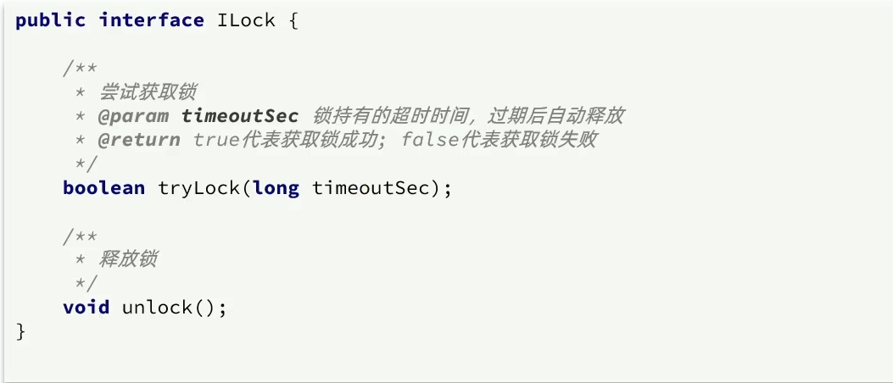
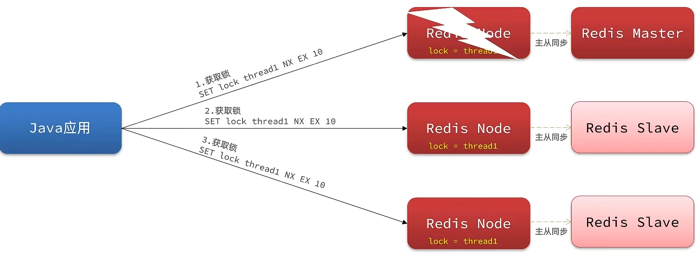
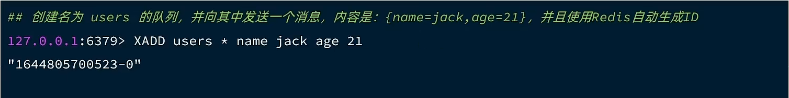

## 概述

分布式锁是控制分布式系统间同步访问共享资源的一种方式，其可以保证共享资源在并发场景下的数据一致性。

分布式锁的工作原理 当有多个线程要访问某一个共享资源（DBMS 中的数据或 Redis 中的数据，或共享文件 等）时，为了达到协调多个线程的同步访问，此时就需要使用分布式锁了。为了达到同步访问的目的，规定，让这些线程在访问共享资源之前先要获取到一个令牌 token，只有具有令牌的线程才可以访问共享资源。这个令牌就是通过各种技术实现的分布式锁。而这个分布锁是一种“互斥资源”，即只有一个。只要有线程抢到了锁，那么其它线程只能等待，直到锁被释放或等待超时。

分布式锁的**核心思想**就是让大家都使用同一把锁，只要大家使用的是同一把锁，那么我们就能锁住线程，不让线程进行，让程序串行执行，这就是分布式锁的核心思路

分布式锁：满足分布式系统或集群模式下多进程可见并且互斥的锁。

**常见的分布式锁有三种**

Mysql：mysql本身就带有锁机制，但是由于mysql性能本身一般，所以采用分布式锁的情况下，其实使用mysql作为分布式锁比较少见

**Redis**：redis作为分布式锁是非常常见的一种使用方式，现在企业级开发中基本都使用redis或者zookeeper作为分布式锁，利用setnx这个方法，如果插入key成功，则表示获得到了锁，如果有人插入成功，其他人插入失败则表示无法获得到锁，利用这套逻辑来实现分布式锁

**Zookeeper**：zookeeper也是企业级开发中较好的一个实现分布式锁的方案。


## Redis分布式锁

实现分布式锁时需要实现的两个基本方法：

* 获取锁：

    * **互斥**：**确保只能有一个线程获取锁**
    * 非阻塞：尝试一次，成功返回true，失败返回false

* 释放锁：

    * 手动释放
    * 超时释放：获取锁时添加一个超时时间

    

核心思路：

我们利用redis 的setNx 方法，当有多个线程进入时，我们就利用该方法，第一个线程进入时，redis 中就有这个 key 了，返回了1，如果结果是1，则表示他抢到了锁，那么他去执行业务，然后再删除锁，退出锁逻辑，没有抢到锁的等待一定时间后重试即可 

### 实现分布式锁版本一

* 加锁逻辑

**锁的基本接口**



利用setnx方法进行加锁，同时增加过期时间，防止死锁，此方法可以保证加锁和增加过期时间具有原子性

```java
private static final String KEY_PREFIX="lock:"
@Override
public boolean tryLock(long timeoutSec) {
    // 获取线程标示
    String threadId = Thread.currentThread().getId()
    // 获取锁
    Boolean success = redisTemplate.opsForValue()
            .setIfAbsent(KEY_PREFIX + name, threadId + "", timeoutSec, TimeUnit.SECONDS);
    return success;
}
```

* 释放锁逻辑

释放锁，防止删除别人的锁

```java
public void unlock() {
    //通过del删除锁
    redisTemplate.delete(KEY_PREFIX + name);
}
```

### Redis分布式锁误删情况说明

逻辑说明：

持有锁的线程在**锁的内部出现了阻塞，导致他的锁自动释放**，这时其他线程，线程2来尝试获得锁，就拿到了这把锁，然后线程2在持有锁执行过程中**，线程1反应过来，继续执行，而线程1执行过程中，走到了删除锁逻辑，**此时就会把本应该属于线程2的锁进行删除，这就是误删别人锁的情况说明;

**解决方案**：解决方案就是在**每个线程释放锁的时候，去判断一下当前这把锁是否属于自己，如果属于自己，则不进行锁的删除**，假设还是上边的情况，线程1卡顿，锁自动释放，线程2进入到锁的内部执行逻辑，此时线程1反应过来，然后删除锁，但是线程1，一看当前这把锁不是属于自己，于是不进行删除锁逻辑，当线程2走到删除锁逻辑时，如果没有卡过自动释放锁的时间点，则判断当前这把锁是属于自己的，于是删除这把锁。


### 解决Redis分布式锁误删问题

需求：修改之前的分布式锁实现，满足：**在获取锁时存入线程标示**（可以用UUID表示）
在释放锁时先获取锁中的线程标示，判断是否与当前线程标示一致

* 如果一致则释放锁
* 如果不一致则不释放锁

核心逻辑：在存入锁时，放入自己线程的标识，在删除锁时，判断当前这把锁的标识是不是自己存入的，如果是，则进行删除，如果不是，则不进行删除。


具体代码如下：加锁

```java
private static final String ID_PREFIX = UUID.randomUUID() + "-";
@Override
public boolean tryLock(long timeoutSec) {
   // 获取线程id
   String threadId = ID_PREFIX + Thread.currentThread().getId();
   // 获取锁
   Boolean success = redisTemplate.opsForValue()
                .setIfAbsent(KEY_PREFIX + name, threadId, timeoutSec, TimeUnit.SECONDS);
   return Boolean.TRUE.equals(success);
}
```

与之前相比，存入redis的键包含了自己线程id，所以可以判断是不是自己上的锁。

**键值对是**：（前缀key+name，线程id）

释放锁

```java
public void unlock() {
    // 获取线程标示
    String threadId = ID_PREFIX + Thread.currentThread().getId();
    // 获取锁中的标示
    String id = redisTemplate.opsForValue().get(KEY_PREFIX + name);
    // 判断标示是否一致
    if(threadId.equals(id)) {
        // 释放锁
        stringRedisTemplate.delete(KEY_PREFIX + name);
    }
}
```

**有关代码实操说明：**

在我们修改完此处代码后，我们重启工程，然后启动两个线程，第一个线程持有锁后，手动释放锁，第二个线程 此时进入到锁内部，再放行第一个线程，此时第一个线程由于锁的value值并非是自己，所以不能释放锁，也就无法删除别人的锁，此时第二个线程能够正确释放锁，通过这个案例初步说明我们解决了锁误删的问题。

### 分布式锁的原子性问题

更为极端的误删逻辑说明：

线程1现在持有锁之后，在执行业务逻辑过程中，他正准备删除锁，而且已经走到了条件判断的过程中，比如他已经拿到了当前这把锁确实是属于他自己的，**正准备删除锁**，但是**此时他的锁到期**了，那么**此时线程2进来**，但是线程1他会接着往后执行，当他卡顿结束后，他直接就会执行删除锁那行代码，相当于条件判断并没有起到作用，这就是**删锁时的原子性问题**，之所以有这个问题，是因为**线程1的拿锁，比锁，删锁，实际上并不是原子性的**，我们要防止刚才的情况发生，


### Lua脚本解决多条命令原子性问题

Redis提供了**Lua脚本功能，在一个脚本中编写多条Redis命令，确保多条命令执行时的原子性**。Lua是一种编程语言，它的基本语法大家可以参考网站：https://www.runoob.com/lua/lua-tutorial.html，这里重点介绍Redis提供的调用函数，我们可以使用lua去操作redis，又能保证他的原子性，这样就可以实现拿锁比锁删锁是一个原子性动作了，作为Java程序员这一块并不作一个简单要求，并不需要大家过于精通，只需要知道他有什么作用即可。

这里重点介绍Redis提供的调用函数，语法如下：

```lua
redis.call('命令名称', 'key', '其它参数', ...)
```

例如，我们要执行set name jack，则脚本是这样：

```lua
# 执行 set name jack
redis.call('set', 'name', 'jack')
```

例如，我们要先执行set name Rose，再执行get name，则脚本如下：

```lua
# 先执行 set name jack
redis.call('set', 'name', 'Rose')
# 再执行 get name
local name = redis.call('get', 'name')
# 返回
return name
```

写好脚本以后，需要用Redis命令来调用脚本，调用脚本的常见命令如下：


**即**：`eval + "脚本"`

例如，我们要执行 redis.call('set', 'name', 'rose') 这个脚本，语法如下：


如果**脚本中的key、value不想写死，可以作为参数传递**。key类型参数会放入**KEYS数组**，其它参数会放入**ARGV数组**，在脚本中可以从KEYS和ARGV数组获取这些参数：


释放锁的逻辑：

​	1、获取锁中的线程标示

​	2、判断是否与指定的标示（当前线程标示）一致

​	3、如果一致则释放锁（删除）

​	4、如果不一致则什么都不做

用Lua脚本来表示：

最终我们操作redis的拿锁比锁删锁的lua脚本就会变成这样

```lua
-- 这里的 KEYS[1] 就是锁的key，这里的ARGV[1] 就是当前线程标示
-- 获取锁中的标示，判断是否与当前线程标示一致
if (redis.call('GET', KEYS[1]) == ARGV[1]) then
  -- 一致，则删除锁
  return redis.call('DEL', KEYS[1])
end
-- 不一致，则直接返回
return 0
```

### 利用Java代码调用Lua脚本改造分布式锁

lua脚本本身并不需要大家花费太多时间去研究，只需要知道如何调用，大致是什么意思即可。

RedisTemplate中，可以利用`execute`方法去执行lua脚本，参数对应关系就如下图股


**Java代码**

```java
private static final DefaultRedisScript<Long> UNLOCK_SCRIPT;
    static {
        UNLOCK_SCRIPT = new DefaultRedisScript<>();
        UNLOCK_SCRIPT.setLocation(new ClassPathResource("unlock.lua"));
        UNLOCK_SCRIPT.setResultType(Long.class);
    }

public void unlock() {
    // 调用lua脚本
    redisTemplate.execute(
            UNLOCK_SCRIPT,
            Collections.singletonList(KEY_PREFIX + name),
            ID_PREFIX + Thread.currentThread().getId());
}
经过以上代码改造后，我们就能够实现 拿锁比锁删锁的原子性动作了~
```

小总结：

基于Redis的分布式锁实现思路：

* 利用set nx ex获取锁，并设置过期时间，保存线程标识
* 释放锁时先判断线程标示是否与自己一致，一致则删除锁
    * 特性：
        * 利用set nx满足互斥性
        * 利用set ex保证故障时锁依然能释放，避免死锁，提高安全性
        * 利用Redis集群保证高可用和高并发特性

笔者总结：我们一路走来，利用添加过期时间，防止死锁问题的发生，但是有了过期时间之后，可能出现误删别人锁的问题，这个问题我们开始是利用删之前 通过拿锁，比锁，删锁这个逻辑来解决的，也就是删之前判断一下当前这把锁是否是属于自己的，但是现在还有原子性问题，也就是我们没法保证拿锁比锁删锁是一个原子性的动作，最后通过lua表达式来解决这个问题

但是目前还剩下一个问题锁不住，什么是锁不住呢，你想一想，如果当过期时间到了之后，我们可以给他续期一下，比如续个30s，就好像是网吧上网， 网费到了之后，然后说，来，网管，再给我来10块的，是不是后边的问题都不会发生了，那么续期问题怎么解决呢，可以依赖于我们接下来要学习redission啦

**测试逻辑：**

第一个线程进来，得到了锁，手动删除锁，模拟锁超时了，其他线程会执行lua来抢锁，当第一天线程利用lua删除锁时，lua能保证他不能删除他的锁，第二个线程删除锁时，利用lua同样可以保证不会删除别人的锁，同时还能保证原子性。

## redission

### redission功能介绍

**基于setnx实现的分布式锁存在下面的问题**：

**重入问题**：重入问题是指获得锁的线程可以再次进入到相同的锁的代码块中，可重入锁的意义在于防止死锁，比如HashTable这样的代码中，他的方法都是使用synchronized修饰的，假如他在一个方法内，调用另一个方法，那么此时如果是不可重入的，不就死锁了吗？所以可重入锁他的主要意义是防止死锁，我们的synchronized和Lock锁都是可重入的。

**不可重试**：是指目前的分布式只能尝试一次，我们认为合理的情况是：当线程在获得锁失败后，他应该能再次尝试获得锁。

**超时释放：**我们在加锁时增加了过期时间，这样的我们可以防止死锁，但是如果卡顿的时间超长，虽然我们采用了lua表达式防止删锁的时候，误删别人的锁，但是毕竟没有锁住，有安全隐患

**主从一致性：** 如果Redis提供了主从集群，当我们向集群写数据时，主机需要异步的将数据同步给从机，而万一在同步过去之前，主机宕机了，就会出现死锁问题。


那么什么是Redission呢

**Redisson是一个在Redis的基础上实现的Java驻内存数据网格（In-Memory Data Grid）。它不仅提供了一系列的分布式的Java常用对象，还提供了许多分布式服务，其中就包含了各种分布式锁的实现。**

Redission提供了分布式锁的多种多样的功能


### Redission快速入门

#### 创建

引入依赖：

```java
<dependency>
	<groupId>org.redisson</groupId>
	<artifactId>redisson</artifactId>
	<version>3.13.6</version>
</dependency>
```

配置Redisson客户端：

```java
@Configuration
public class RedissonConfig {

    @Bean
    public RedissonClient redissonClient(){
        // 配置
        Config config = new Config();
        config.useSingleServer().setAddress("redis://xxx.xxx.xxx.xxx:6379")
            .setPassword("xxxxxx");
	        .setDatabase(0); // 可以不要
        // 创建RedissonClient对象
        return Redisson.create(config);
    }
}
```

#### 字符串操作

Redisson 支持通过`RBucket`对象来操作字符串数据结构。

```java
    public RedissonClient getRedisson() {
        Config config = new Config();
        config.useSingleServer()
                .setAddress("redis://47.108.56.231:6379")
                .setPassword("200018");
        return Redisson.create(config);

    }

RedissonClient redissonClient = getRedisson();
RBucket<String> rBucket = redissonClient.getBucket("name"); // key
// 设置key对应的值
rBucket.set("颤三", 10, TimeUnit.MINUTES);
// 获取键对应的值
System.out.println(redissonClient.getBucket("name").get());
```

#### 对象操作

Redisson 支持将对象作为`value`存入`redis`，被存储的对象事先必须要实现序列化接口`Serializable`。

```java
class Demo implements Serializable {

    private String id;
    private String name;
    private Integer age;

    public Demo(String id, String name, Integer age) {
        this.id = id;
        this.name = name;
        this.age = age;
    }

    @Override
    public String toString() {
        return "Demo{" +
                "id='" + id + '\'' +
                ", name='" + name + '\'' +
                ", age=" + age +
                '}';
    }

}


RedissonClient redissonClient = getRedisson();
RBucket<Demo> rBucket =  redissonClient.getBucket("key");
Demo demo = new Demo("111", "apple", 18);
rBucket.set(demo, 30, TimeUnit.SECONDS);
System.out.println(redissonClient.getBucket("key").get());
```

#### 哈希操作

Redisson 支持通过 `RMap` 对象来操作哈希数据结构。

```java
    public void tests() {
        RedissonClient redissonClient = getRedisson();
        RMap<String, String> rMap = redissonClient.getMap("user:infor:mapKey");
        rMap.put("name", "apple");
        rMap.put("age", "12");
        rMap.expire(10, TimeUnit.MINUTES);
    }
    
// 通过key获取value
System.out.println(redissonClient.getMap("mapkey").get("name"));
```

#### 列表操作

Redisson 支持通过`RList`对象来操作列表数据结构，简单样例如下！

```java
    public void lid() {
        RedissonClient redissonClient = getRedisson();
        // key
        RList<Demo> rList = redissonClient.getList("user");
        Demo demo1 = new Demo("1", "apple", 12);
        Demo demo2 = new Demo("2", "apple2", 13);
        Demo demo3 = new Demo("2", "apple2", 14);
        rList.add(demo1);
        rList.add(demo2);
        rList.add(demo3);
        rList.expire(10, TimeUnit.MINUTES);
        // 根据key 获取list
        System.out.println(redissonClient.getList("user"));
    }
```

#### 集合操作

Redisson 支持通过`RSet`对象来操作集合数据结构，简单样例如下！

```java
    public void set() {
        RedissonClient redissonClient = getRedisson();
        RSet<String> rSet = redissonClient.getSet("setKey");
        rSet.add("name");
        rSet.add("age");
        rSet.add("id");
        rSet.expire(10, TimeUnit.MINUTES);
        System.out.println(redissonClient.getSet("setKey"));
    }
```

#### 有序集合操作

Redisson 支持通过`RSortedSet`对象来操作有序集合数据结构，在使用对象来存储之前，实体对象必须先实现`Comparable`接口，并重写比较逻辑，否则会报错，简单样例如下！

```java
    public void sortedSet() {
        RedissonClient redissonClient = getRedisson();
        RSortedSet<String> rSortedSet = redissonClient.getSortedSet("sortedKey");
        rSortedSet.add("name");
        rSortedSet.add("id");
        rSortedSet.add("age");
        rSortedSet.expire(10, TimeUnit.MINUTES);
        System.out.println(redissonClient.getSortedSet("sortedKey"));
    }
    ——————————————————
    输出
    [age, id, name]

```

#### 布隆过滤器

布隆过滤器（Bloom Filter）是 1970 年由布隆提出的。它实际上是一个很长的二进制向量和一系列随机映射函数。

布隆过滤器可以用于检索一个元素是否在一个集合中。它的优点是空间效率和查询时间都比一般的算法要好的多，缺点是有一定的误识别率和删除困难。

Redisson 支持通过`RBloomFilter`对象来操作布隆过滤器，简单样例如下！

```java
RBloomFilter rBloomFilter = redissonClient.getBloomFilter("seqId");
// 初始化预期插入的数据量为10000和期望误差率为0.01
rBloomFilter.tryInit(10000, 0.01);
// 插入部分数据
rBloomFilter.add("100");
rBloomFilter.add("200");
rBloomFilter.add("300");
//设置过期时间
rBloomFilter.expire(30, TimeUnit.SECONDS);
// 判断是否存在
System.out.println(rBloomFilter.contains("300"));
System.out.println(rBloomFilter.contains("200"));
System.out.println(rBloomFilter.contains("999"));
```

### Redission 的分布式锁

**tryLock**

tryLock是一种非阻塞式的分布式锁，它可以**在没有获取锁的情况下立即返回**，而不是一直等待。

**实现方式**

Redisson TryLock实现原理是**通过Redis的SETNX命令**来实现的。使用它的API时，Redisson会在Redis中创建一个对应的key，**这个key的值就是要加锁的资源名称**。

如果这个key不存在，Redis会创建它并返回1，那么这个线程就获得了锁；如果这个key已存在，Redisson也不会阻塞等待，而是直接为这个key设置过期时间，然后返回 0 （当然自己也可以根据设置的等待时间再次尝试获取锁）。这样，其他线程也可以获取这个锁，只要这个锁的过期时间已过或者被释放。

```java
@Resource
private RedissionClient redissonClient;

@Test
void testRedisson() throws Exception{
    //获取锁(可重入)，指定锁的名称 key
    RLock lock = redissonClient.getLock("anyLock");
    //尝试获取锁，参数分别是：获取锁的最大等待时间(期间会重试)，锁自动释放时间，时间单位
    boolean isLock = lock.tryLock(1, 10, TimeUnit.SECONDS); // 等待1s 锁失效时间 10s
    //判断获取锁成功
    if(isLock){
        try{
            System.out.println("执行业务");          
        }finally{
            //释放锁
            lock.unlock();
        }        
    }    
}
```

### redission可重入锁原理

Redisson 可重入锁是一种分布式锁，它基于 Redis 实现。**可重入**指的是**同一个线程在持有锁的情况下，可以多次获取该锁而不会造成死锁。**

- 它可以在分布式系统中用于实现互斥锁。这种锁可以允许多个线程同时获取锁，但在任何给定时间只有一个线程可以执行受保护的代码块。
- Redission锁提供了一种简单的方法来保证在分布式系统中的互斥性，同时支持可重入性。这意味着一个线程可以在获取锁之后再次获取同一个锁，而不需要等待锁释放。

**原理**

1. 当线程 A 尝试获取锁时，它会向 Redis 服务器发送 `SETNX` 命令来尝试将锁的键设置为特定的值。如果 SETNX 命令返回成功，说明线程 A 成功获取了锁。
2. 如果 `SETNX` 命令返回失败，说明锁的键已经被其他线程持有，这时 Redisson **会检查当前持有锁的线程是否是同一个线程。如果是，则允许该线程再次获取锁，并将锁的计数器加一**。
3. 如果 `SETNX` 命令返回失败且当前持有锁的线程不是同一个线程，则表示其他线程已经持有了锁，此时线程 A 需要**等待**。
4. 线程 A 在等待期间会使用 Redis 的**订阅与发布功能（Pub/Sub）来订阅锁的释放事件**。
5. 当持有锁的线程释放锁时，Redis 服务器会发布一个锁释放的消息。线程 A收到消息后会重新尝试获取锁。

通过以上的机制，Redisson 实现了可重入锁的功能。它能够保证同一个线程可以多次获取锁，而其他线程在锁被持有期间会进入等待状态。
需要注意的是，**为了避免死锁，线程必须释放它所持有的所有锁，即锁的计数器必须归零。只有当锁的计数器为零时，其他线程才能获取该锁**。

```lua
"if (redis.call('exists', KEYS[1]) == 0) then " +
                  "redis.call('hset', KEYS[1], ARGV[2], 1); " +
                  "redis.call('pexpire', KEYS[1], ARGV[1]); " +
                  "return nil; " +
              "end; " +
              "if (redis.call('hexists', KEYS[1], ARGV[2]) == 1) then " +
                  "redis.call('hincrby', KEYS[1], ARGV[2], 1); " +
                  "redis.call('pexpire', KEYS[1], ARGV[1]); " +
                  "return nil; " +
              "end; " +
              "return redis.call('pttl', KEYS[1]);"
```

**KEYS[1] ： 锁名称**；表示表示这把锁是否存在

**ARGV[1]：  锁失效时间**

**ARGV[2]：  id + ":" + threadId; 锁的小key**；表示当前这把锁被哪个线程持有。

**第一步**：exists: 判断数据是否存在 name：即lock是否存在,如果==0，就表示当前这把锁不存在。

`redis.call('hset', KEYS[1], ARGV[2], 1);` 表示不存在锁，此时往redis里边去写数据 ，写成一个hash结构

Lock{

​    id + **":"** + threadId :  1

}

**第二步**：如果当前这把锁存在，则第一个条件不满足，执行第二个if：

`redis.call('hexists', KEYS[1], ARGV[2]) == 1`

通过大key+小key判断当前这把锁是否是属于自己的，如果是自己的，则进行

`redis.call('hincrby', KEYS[1], ARGV[2], 1)`

将当前这个锁的value进行+1 ，redis.call('pexpire', KEYS[1], ARGV[1]); 然后再对其设置过期时间，如果以上两个条件都不满足，则表示当前这把锁抢锁失败，最后返回pttl，即为当前这把锁的失效时间。


```lua

```


### redission锁重试和WatchDog机制

```java
 @Override
 public boolean tryLock(long waitTime, long leaseTime, TimeUnit unit) throws InterruptedException {
     long time = unit.toMillis(waitTime);
     long current = System.currentTimeMillis();
     // 获取线程 ID
     long threadId = Thread.currentThread().getId();
     // tryAcquire 尝试获取锁（获取锁成功返回 null, 获取锁失败返回剩余ttl)
     Long ttl = tryAcquire(waitTime, leaseTime, unit, threadId);
     if (ttl == null) { // 成功获取锁
         return true;
     }
     
     // time 是超时释放时间（单位：毫秒）
     // time = time - (System.currentTimeMillis() - current)
     time -= System.currentTimeMillis() - current; // 刷新超时释放时间
     if (time <= 0) { // 超时释放时间到了
         acquireFailed(waitTime, unit, threadId);
         return false; // 获取锁失败
     }
     
     current = System.currentTimeMillis();
     // 等待释放锁的通知（订阅释放锁的信号）
     RFuture<RedissonLockEntry> subscribeFuture = subscribe(threadId);
 	// 等到超时释放时间结束还没有收到释放锁的通知的话, 返回 false
     // 获取锁失败 
     if (!subscribeFuture.await(time, TimeUnit.MILLISECONDS)) {
         if (!subscribeFuture.cancel(false)) { // 取消订阅
             subscribeFuture.onComplete((res, e) -> {
                 if (e == null) {
                     unsubscribe(subscribeFuture, threadId);
                 }
             });
         }
         acquireFailed(waitTime, unit, threadId);
         return false;
     }
     // 接收到释放锁的信号
     try {
     	// 判断释放到超时时间
         time -= System.currentTimeMillis() - current;
         if (time <= 0) {
             acquireFailed(waitTime, unit, threadId);
             return false; // 获取锁失败
         }
         while (true) { // 反复尝试
             long currentTime = System.currentTimeMillis();
             ttl = tryAcquire(waitTime, leaseTime, unit, threadId);
             // lock acquired
             if (ttl == null) { // 获取锁成功
                 return true;
             }

             time -= System.currentTimeMillis() - currentTime;
             if (time <= 0) {
                 acquireFailed(waitTime, unit, threadId);
                 return false;
             }

             // waiting for message
             // 代码来到这里：没有获取到锁, 超时时间有剩余
             // 等待释放锁的信号
             currentTime = System.currentTimeMillis();
             if (ttl >= 0 && ttl < time) {
                 subscribeFuture.getNow().getLatch().tryAcquire(ttl, TimeUnit.MILLISECONDS);
             } else {
                 subscribeFuture.getNow().getLatch().tryAcquire(time, TimeUnit.MILLISECONDS);
             }

             time -= System.currentTimeMillis() - currentTime;
             if (time <= 0) {
                 acquireFailed(waitTime, unit, threadId);
                 return false;
             }
         }
     } finally {
         unsubscribe(subscribeFuture, threadId);
     }
//        return get(tryLockAsync(waitTime, leaseTime, unit));
 }


```

抢锁过程中，获得当前线程，通过tryAcquire进行抢锁，该抢锁逻辑和之前逻辑相同

1、先判断当前这把锁是否存在，如果不存在，插入一把锁，返回null

2、判断当前这把锁是否是属于当前线程，如果是，则返回null

所以如果返回是null，则代表着当前这哥们已经抢锁完毕，或者可重入完毕，但是如果以上两个条件都不满足，则进入到第三个条件，返回的是锁的失效时间，同学们可以自行往下翻一点点，你能发现有个while( true) 再次进行tryAcquire进行抢锁

```java
long threadId = Thread.currentThread().getId();
Long ttl = tryAcquire(-1, leaseTime, unit, threadId);
// lock acquired
if (ttl == null) {
    return;
}
```

接下来会有一个条件分支，因为lock方法有重载方法，一个是带参数，一个是不带参数，如果带带参数传入的值是-1，如果传入参数，则leaseTime是他本身，所以如果传入了参数，此时leaseTime != -1 则会进去抢锁，抢锁的逻辑就是之前说的那三个逻辑

```java
if (leaseTime != -1) {
    return tryLockInnerAsync(waitTime, leaseTime, unit, threadId, RedisCommands.EVAL_LONG);
}
```

如果是没有传入时间，则此时也会进行抢锁， 而且抢锁时间是默认看门狗时间 commandExecutor.getConnectionManager().getCfg().getLockWatchdogTimeout()

ttlRemainingFuture.onComplete((ttlRemaining, e) 这句话相当于对以上抢锁进行了监听，也就是说当上边抢锁完毕后，此方法会被调用，具体调用的逻辑就是去后台开启一个线程，进行续约逻辑，也就是看门狗线程

```java
RFuture<Long> ttlRemainingFuture = tryLockInnerAsync(waitTime,
                                        commandExecutor.getConnectionManager().getCfg().getLockWatchdogTimeout(),
                                        TimeUnit.MILLISECONDS, threadId, RedisCommands.EVAL_LONG);
ttlRemainingFuture.onComplete((ttlRemaining, e) -> {
    if (e != null) {
        return;
    }

    // lock acquired
    if (ttlRemaining == null) {
        scheduleExpirationRenewal(threadId);
    }
});
return ttlRemainingFuture;
```

此逻辑就是续约逻辑，注意看commandExecutor.getConnectionManager().newTimeout（） 此方法

Method(  **new** TimerTask() {},参数2 ，参数3  )

指的是：通过参数2，参数3 去描述什么时候去做参数1的事情，现在的情况是：10s之后去做参数一的事情

因为锁的失效时间是30s，当10s之后，此时这个timeTask 就触发了，他就去进行续约，把当前这把锁续约成30s，如果操作成功，那么此时就会递归调用自己，再重新设置一个timeTask()，于是再过10s后又再设置一个timerTask，完成不停的续约

那么大家可以想一想，假设我们的线程出现了宕机他还会续约吗？当然不会，因为没有人再去调用renewExpiration这个方法，所以等到时间之后自然就释放了。

```java
private void renewExpiration() {
    ExpirationEntry ee = EXPIRATION_RENEWAL_MAP.get(getEntryName());
    if (ee == null) {
        return;
    }
    
    Timeout task = commandExecutor.getConnectionManager().newTimeout(new TimerTask() {
        @Override
        public void run(Timeout timeout) throws Exception {
            ExpirationEntry ent = EXPIRATION_RENEWAL_MAP.get(getEntryName());
            if (ent == null) {
                return;
            }
            Long threadId = ent.getFirstThreadId();
            if (threadId == null) {
                return;
            }
            
            RFuture<Boolean> future = renewExpirationAsync(threadId);
            future.onComplete((res, e) -> {
                if (e != null) {
                    log.error("Can't update lock " + getName() + " expiration", e);
                    return;
                }
                
                if (res) {
                    // reschedule itself
                    renewExpiration();
                }
            });
        }
    }, internalLockLeaseTime / 3, TimeUnit.MILLISECONDS);
    
    ee.setTimeout(task);
}
```

### redission锁的MutiLock原理

假如写命令，写在主机上， 主机会将数据同步给从机，但是假设在主机还没有来得及把数据写入到从机去的时候，此时主机宕机，哨兵会发现主机宕机，并且选举一个slave变成master，而此时新的master中实际上并没有锁信息，此时锁信息就已经丢掉了。


为了解决这个问题，redission提出来了MutiLock锁，使用这把锁，每个节点的地位都是一样的， 这把锁加锁的逻辑需要写入到每一个主丛节点上，只有所有的服务器都写入成功，此时才是加锁成功，假设现在某个节点挂了，那么他去获得锁的时候，只要有一个节点拿不到，都不能算是加锁成功，就保证了加锁的可靠性。



MutiLock 加锁原理：

当我们去设置了多个锁时，redission会将多个锁添加到一个集合中，然后用while循环去不停去尝试拿锁，但是会有一个总共的加锁时间，这个时间是用需要加锁的个数 * 1500ms ，假设有3个锁，那么时间就是4500ms，假设在这4500ms内，所有的锁都加锁成功， 那么此时才算是加锁成功，如果在4500ms有线程加锁失败，则会再次去进行重试.


## Redis消息队列

### 认识消息队列

什么是消息队列：字面意思就是存放消息的队列。最简单的消息队列模型包括3个角色：

* 消息队列：存储和管理消息，也被称为消息代理（Message Broker）
* 生产者：发送消息到消息队列
* 消费者：从消息队列获取消息并处理消息


使用队列的好处：

**解耦**。

这种场景在我们秒杀中就变成了：下单之后，利用redis去进行校验下单条件，再通过队列把消息发送出去，然后再启动一个线程去消费这个消息，完成解耦，同时也加快我们的响应速度。

这里我们可以使用一些现成的mq，比如kafka，rabbitmq等等，但是呢，如果没有安装mq，我们也可以直接使用redis提供的mq方案，降低我们的部署和学习成本。

### 基于List实现消息队列

**基于List结构模拟消息队列**

消息队列（Message Queue），字面意思就是存放消息的队列。而Redis的list数据结构是一个双向链表，很容易模拟出队列效果。

可以利用：LPUSH 结合 RPOP、或者 RPUSH 结合 LPOP来实现。
不过要注意的是，当队列中没有消息时RPOP或LPOP操作会返回null，并不像JVM的阻塞队列那样会阻塞并等待消息。因此这里应该使用BRPOP或者BLPOP来实现阻塞效果。


基于List的消息队列有哪些优缺点？
优点：

* 利用Redis存储，不受限于JVM内存上限
* 基于Redis的持久化机制，数据安全性有保证
* 可以满足消息有序性

缺点：

* 无法避免消息丢失
* 只支持单消费者


### 基于PubSub的消息队列

PubSub（发布订阅）是Redis2.0版本引入的消息传递模型。顾名思义，消费者可以订阅一个或多个channel，生产者向对应channel发送消息后，所有订阅者都能收到相关消息。

 `SUBSCRIBE channel [channel]` ：订阅一个或多个频道
 `PUBLISH channel msg` ：向一个频道发送消息
 `PSUBSCRIBE pattern[pattern]` ：订阅与pattern格式匹配的所有频道


基于PubSub的消息队列有哪些优缺点？
优点：

* 采用发布订阅模型，支持多生产、多消费

缺点：

* 不支持数据持久化
* 无法避免消息丢失
* 消息堆积有上限，超出时数据丢失

### 基于Stream的消息队列

Stream 是 Redis 5.0 引入的一种新数据类型，可以实现一个功能非常完善的消息队列。

发送消息的命令：


例如：



读取消息的方式之一：XREAD


例如，使用XREAD读取第一个消息：


XREAD阻塞方式，读取最新的消息：


在业务开发中，我们可以循环的调用XREAD阻塞方式来查询最新消息，从而实现持续监听队列的效果，伪代码如下


**注意**：当我们指定起始ID为$时，代表读取最新的消息，如果我们处理一条消息的过程中，又有超过1条以上的消息到达队列，则下次获取时也只能获取到最新的一条，会出现漏读消息的问题。

STREAM类型消息队列的XREAD命令特点：

* 消息可回溯
* 一个消息可以被多个消费者读取
* 可以阻塞读取
* 有消息漏读的风险

### 基于Stream的消息队列-消费者组

消费者组（Consumer Group）：将多个消费者划分到一个组中，监听同一个队列。具备下列特点：


创建消费者组：

key：队列名称
groupName：消费者组名称
ID：起始ID标示，$代表队列中最后一个消息，0则代表队列中第一个消息
MKSTREAM：队列不存在时自动创建队列
其它常见命令：

 **删除指定的消费者组**

```java
XGROUP DESTORY key groupName
```

 **给指定的消费者组添加消费者**

```java
XGROUP CREATECONSUMER key groupname consumername
```

 **删除消费者组中的指定消费者**

```java
XGROUP DELCONSUMER key groupname consumername
```

从消费者组读取消息：

```java
XREADGROUP GROUP group consumer [COUNT count] [BLOCK milliseconds] [NOACK] STREAMS key [key ...] ID [ID ...]
```

* group：消费组名称
* consumer：消费者名称，如果消费者不存在，会自动创建一个消费者
* count：本次查询的最大数量
* BLOCK milliseconds：当没有消息时最长等待时间
* NOACK：无需手动ACK，获取到消息后自动确认
* STREAMS key：指定队列名称
* ID：获取消息的起始ID：

">"：从下一个未消费的消息开始
其它：根据指定id从pending-list中获取已消费但未确认的消息，例如0，是从pending-list中的第一个消息开始

消费者监听消息的基本思路：

STREAM类型消息队列的XREADGROUP命令特点：

* 消息可回溯
* 可以多消费者争抢消息，加快消费速度
* 可以阻塞读取
* 没有消息漏读的风险
* 有消息确认机制，保证消息至少被消费一次

最后我们来个小对比


### 基于Redis的Stream结构作为消息队列，实现异步秒杀下单

需求：

* 创建一个Stream类型的消息队列，名为stream.orders
* 修改之前的秒杀下单Lua脚本，在认定有抢购资格后，直接向stream.orders中添加消息，内容包含voucherId、userId、orderId
* 项目启动时，开启一个线程任务，尝试获取stream.orders中的消息，完成下单\

修改lua表达式,新增3.6 


VoucherOrderServiceImpl

```java
private class VoucherOrderHandler implements Runnable {

    @Override
    public void run() {
        while (true) {
            try {
                // 1.获取消息队列中的订单信息 XREADGROUP GROUP g1 c1 COUNT 1 BLOCK 2000 STREAMS s1 >
                List<MapRecord<String, Object, Object>> list = stringRedisTemplate.opsForStream().read(
                    Consumer.from("g1", "c1"),
                    StreamReadOptions.empty().count(1).block(Duration.ofSeconds(2)),
                    StreamOffset.create("stream.orders", ReadOffset.lastConsumed())
                );
                // 2.判断订单信息是否为空
                if (list == null || list.isEmpty()) {
                    // 如果为null，说明没有消息，继续下一次循环
                    continue;
                }
                // 解析数据
                MapRecord<String, Object, Object> record = list.get(0);
                Map<Object, Object> value = record.getValue();
                VoucherOrder voucherOrder = BeanUtil.fillBeanWithMap(value, new VoucherOrder(), true);
                // 3.创建订单
                createVoucherOrder(voucherOrder);
                // 4.确认消息 XACK
                stringRedisTemplate.opsForStream().acknowledge("s1", "g1", record.getId());
            } catch (Exception e) {
                log.error("处理订单异常", e);
                //处理异常消息
                handlePendingList();
            }
        }
    }

    private void handlePendingList() {
        while (true) {
            try {
                // 1.获取pending-list中的订单信息 XREADGROUP GROUP g1 c1 COUNT 1 BLOCK 2000 STREAMS s1 0
                List<MapRecord<String, Object, Object>> list = stringRedisTemplate.opsForStream().read(
                    Consumer.from("g1", "c1"),
                    StreamReadOptions.empty().count(1),
                    StreamOffset.create("stream.orders", ReadOffset.from("0"))
                );
                // 2.判断订单信息是否为空
                if (list == null || list.isEmpty()) {
                    // 如果为null，说明没有异常消息，结束循环
                    break;
                }
                // 解析数据
                MapRecord<String, Object, Object> record = list.get(0);
                Map<Object, Object> value = record.getValue();
                VoucherOrder voucherOrder = BeanUtil.fillBeanWithMap(value, new VoucherOrder(), true);
                // 3.创建订单
                createVoucherOrder(voucherOrder);
                // 4.确认消息 XACK
                stringRedisTemplate.opsForStream().acknowledge("s1", "g1", record.getId());
            } catch (Exception e) {
                log.error("处理pendding订单异常", e);
                try{
                    Thread.sleep(20);
                }catch(Exception e){
                    e.printStackTrace();
                }
            }
        }
    }
}

```

## UV统计

### UV统计-HyperLogLog

* UV：全称Unique Visitor，也叫独立访客量，是指通过互联网访问、浏览这个网页的自然人。1天内同一个用户多次访问该网站，只记录1次。
* PV：全称Page View，也叫页面访问量或点击量，用户每访问网站的一个页面，记录1次PV，用户多次打开页面，则记录多次PV。往往用来衡量网站的流量。

通常来说UV会比PV大很多，所以衡量同一个网站的访问量，我们需要综合考虑很多因素，所以我们只是单纯的把这两个值作为一个参考值

UV统计在服务端做会比较麻烦，因为要判断该用户是否已经统计过了，需要将统计过的用户信息保存。但是如果每个访问的用户都保存到Redis中，数据量会非常恐怖，那怎么处理呢？

Hyperloglog(HLL)是从Loglog算法派生的概率算法，用于确定非常大的集合的基数，而不需要存储其所有值。相关算法原理大家可以参考：https://juejin.cn/post/6844903785744056333#heading-0
Redis中的HLL是基于string结构实现的，单个HLL的内存**永远小于16kb**，**内存占用低**的令人发指！作为代价，其测量结果是概率性的，**有小于0.81％的误差**。不过对于UV统计来说，这完全可以忽略。


### UV统计-测试百万数据的统计

测试思路：我们直接利用单元测试，向HyperLogLog中添加100万条数据，看看内存占用和统计效果如何


经过测试：我们会发生他的误差是在允许范围内，并且内存占用极小                                                                                                                                                                             