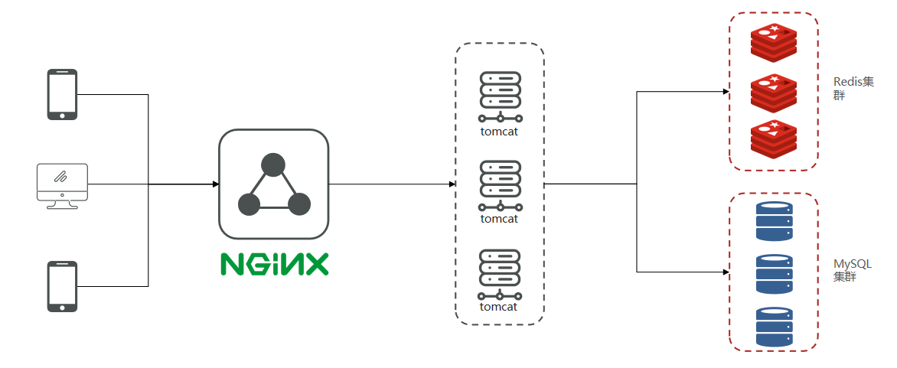
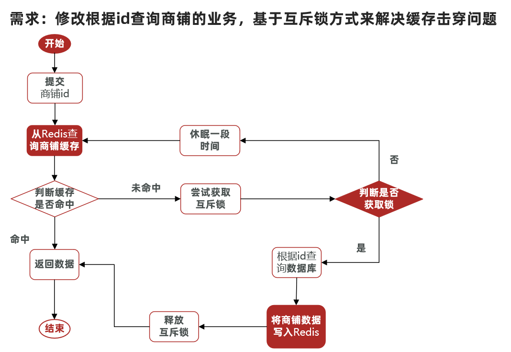

项目架构



前后端分离。

## 短信登录

### 基于Session实现登录流程


**发送验证码：**

用户在提交手机号后，会**校验手机号**是否合法，如果不合法，则要求用户重新输入手机号。

如果手机号合法，后台此时**生成对应的验证码**，同时将验证码进行**保存**，然后再通过短信的方式将验证码**发送给用户**。

**短信验证码登录、注册：**

用户将验证码和手机号进行输入，后台**从session中拿**到当前验证码，然后和用户输入的验证码进行**校验**，如果不一致，则无法通过校验，如果一致，则后台根据手机号查询用户，如果用户不存在，则为用户创建账号信息，保存到数据库，**无论是否存在，都会将用户信息保存到session中，方便后续获得当前登录信息**。

**校验登录状态:**

用户在请求时候，会从cookie中携带者JsessionId到后台，后台通过JsessionId从session中拿到用户信息，如果没有session信息，则进行拦截，如果有session信息，则将用户信息保存到threadLocal中，并且放行

#### 具体实现

1. 验证码发送

    ```java
        public Result sendCode(@RequestParam("phone") String phone, HttpSession session) {
            if (RegexUtils.isPhoneInvalid(phone)) {
                return Result.fail("手机号格式错误！");
            }
            String code = RandomUtil.randomNumbers(6);
            session.setAttribute("code", code);
            log.debug("验证码：{}", code);
            return Result.ok();
        }
    ```

    `javax.servlet.http.HttpSession`接口表示一个会话，我们可以把一个会话内需要共享的数据保存到HttSession对象中！

    作为session域, 实现同一次会话内.数据的共享, 一次会话,包含n次请求。同一次会话: 从打开浏览器访问服务器开始, 到关闭浏览器, 表示一次会话。

    **获取HttpSession对象**

    HttpSession request.getSesssion()：如果当前会话已经有了session对象那么直接返回，如果当前会话还不存在会话，那么创建session并返回；
    HttpSession request.getSession(boolean)：当参数为true时，与requeset.getSession()相同。如果参数为false，那么如果当前会话中存在session则返回，不存在返回null；

    request 表示 HttpServletRequest。

    ```java
    public void doGet(HttpServletRequest request, HttpServletResponse response) {
    }
    ```

2. 登录

    ```java
        @Override
        public Result login(LoginFormDTO loginForm, HttpSession session) {
            String phone = loginForm.getPhone();
            if (RegexUtils.isPhoneInvalid(phone)) {
                return Result.fail("手机号错误.");
            }
            String cacheCode = session.getAttribute("code").toString();
            String code = loginForm.getCode();
            if (cacheCode == null || !cacheCode.equals(code)) {
                Result.fail("验证码错误");
            }
            User user = query().eq("phone", phone).one();
            if (user == null) {
                user = createUser(phone);
            }
            session.setAttribute("user", user);
            return Result.ok();
        }
    
        private User createUser(String phone) {
            User user = new User();
            user.setPhone(phone);
            user.setNickName("user_" + RandomUtil.randomNumbers(5));
            save(user);
            return user;
        }
    ```

    代码写在serviceimpl里，`query()、save()` 是mybatis-plus的提供的增删改查。

#### 登录拦截

当用户发起请求时，会访问对应端口，任何程序想要运行，都需要**有一个线程对当前端口号进行监听**，tomcat也不例外，当监听线程知道**用户想要和tomcat连接连接时**，那会**由监听线程创建socket连接**，socket都是成对出现的，用户通过socket互相传递数据，当tomcat端的socket接受到数据后，此时**监听线程会从tomcat的线程池中取出一个线程执行用户请求**，在我们的服务部署到tomcat后，线程会找到用户想要访问的工程，然后用这个线程转发到工程中的controller，service，dao中，并且访问对应的DB，在用户执行完请求后，再统一返回，再找到tomcat端的socket，再将数据写回到用户端的socket，完成请求和响应

**每个用户其实对应都是去找tomcat线程池中的一个线程来完成工作的**，使用完成后再进行回收，既然每个请求都是独立的，所以在每个用户去访问我们的工程时，我们可以使用threadlocal来做到线程隔离，每个线程操作自己的一份数据。

**关于threadlocal**

在threadLocal中，无论是他的put方法和他的get方法， 都是先获得当前用户的线程，然后从线程中取出线程的成员变量map，只要线程不一样，map就不一样，所以可以通过这种方式来做到线程隔离。

通过ThreadLocal将user存到当前线程中，这样不同的用户取到的用户就不一样，用于隔离。

```java
public class UserHolder {
    private static final ThreadLocal<UserDTO> tl = new ThreadLocal<>();

    public static void saveUser(UserDTO user){
        tl.set(user);
    }

    public static UserDTO getUser(){
        return tl.get();
    }

    public static void removeUser(){
        tl.remove();
    }
}
```

### 基于Redis共享session登录

可以用String或者Hash，String存储的是json格式，会占用额外空间，根据需求选择。

使用String实现。

String 的 key 要唯一，使用随机生成。

**流程**

用户去登录会去校验用户提交的手机号和验证码，是否一致，如果一致，则根据手机号查询用户信息，不存在则新建，最后将用户数据保存到redis，并且生成token作为redis的key，当我们校验用户是否登录时，会去携带着token进行访问，从redis中取出token对应的value，判断是否存在这个数据，如果没有则拦截，如果存在则将其保存到threadLocal中，并且放行。

**UserServiceImpl代码**

```java
@Override
    public Result login(LoginFormDTO loginForm, HttpSession session) {
        String phone = loginForm.getPhone();
        if (RegexUtils.isPhoneInvalid(phone)) {
            Result.fail("手机号不行");
        }
        String cacheCode = redisTemplate.opsForValue().get(phone).toString();
        String code = loginForm.getCode();
        if (cacheCode == null || !cacheCode.equals(code)) {
            return Result.fail("验证码不一致");
        }
        User user = query().eq("phone", phone).one();
        if (user == null) { //用户不存在
            // 创建用户
        }

        // 验证通过，保存到redis中
        // 作为redis中的key
        String token = UUID.randomUUID().toString();
        Map<String, Object> userMap = user; // 将user对象转换为hashmap存储,方便存进redis
        redisTemplate.opsForHash().putAll(token, userMap);
        // 设置有效期
        redisTemplate.expire (token, 60, TimeUnit.MINUTES);
        return Result.ok();

    }
```

**重点**：user对象转为map、设置到期时间。

### 状态刷新问题

每次刷新都更新有效期。

对于任何请求，都进行用户验证，如果验证正确，则在redis中更新有效期。

## 缓存

### 插入

方便快速查询。

**思路**：标准的操作方式就是**查询数据库之前先查询缓存**，如果缓存数据存在，则直接从缓存中返回，如果缓存数据不存在，再查询数据库，然后将数据存入redis。


```java
    public Result query(Long id) {
        // 获取对应位置的数据id
        String key = "cache:ship:" + id;
        // 获取缓存数据
        String shopJson = redisTemplate.opsForValue().get(key).toString();
        // 缓存中有
        if (shopJson != null) {
            // 根据json解析程对应的实体类然后返回数据
            return Result.ok();
        }
        // 缓存中没有
        Shop shop = getById(id);
        if (shop == null) {
            return Result.fail("店铺不存在");
        }
        // 将数据库中查到的转成json存入redis
        redisTemplate.opsForValue().set("key", jsonShop);
        return Result.ok();
    }
```

### 更新

缓存更新是redis为了节约内存而设计出来的一个东西，主要是因为内存数据宝贵，当我们向redis插入太多数据，此时就可能会导致缓存中的数据过多，所以redis会对部分数据进行更新，或者把他叫为淘汰更合适。

**内存淘汰：**redis**自动进行**，当redis内存达到咱们设定的max-memery的时候，会自动触发淘汰机制，淘汰掉一些不重要的数据(**可以自己设置策略方式**)；

**超时剔除：**当我们给redis设置了**过期时间**ttl之后，redis会将超时的数据进行删除，方便咱们继续使用缓存；

**主动更新：**我们可以**手动**调用方法把缓存**删掉**，通常用于**解决缓存和数据库不一致**问题；

#### 数据库缓存不一致解决方案

由于我们的**缓存的数据源来自于数据库**,而数据库的**数据是会发生变化的**,因此,如果当数据库中**数据发生变化,而缓存却没有同步**,此时就会有**一致性问题存在**。

**解决方案**

- Cache Aside Pattern 人工编码方式：缓存调用者在更新完数据库后再去更新缓存，也称之为双写方案；
- Read/Write Through Pattern : 由系统本身完成，数据库与缓存的问题交由系统本身去处理；
- Write Behind Caching Pattern ：调用者只操作缓存，其他线程去异步处理数据库，实现最终一致；

有三个问题需要考虑：

* 删除缓存还是更新缓存？
    * 更新缓存：每次更新数据库都更新缓存，无效写操作较多；
    * **删除缓存**：更新数据库时让缓存失效，查询时再更新缓存；

* 如何保证缓存与数据库的操作的同时成功或失败？
    * 单体系统，将缓存与数据库操作放在一个事务；
    * **分布式系统**，利用TCC等分布式事务方案；

* 先操作缓存还是先操作数据库？
    * 先删除缓存，再操作数据库
    * **先操作数据库，再删除缓存**
    * 原因在于，如果你选择第一种方案，在两个线程并发来访问时，假设线程1先来，他先把缓存删了，此时线程2过来，他查询缓存数据并不存在，此时他写入缓存，当他写入缓存后，线程1再执行更新动作时，实际上写入的就是旧的数据，新的数据被旧数据覆盖了；


**总结**： `先更新数据库，然后删除缓存`。

```java
    @Transactional
    public Result update(Shop shop) {
        Long id = shop.getId();
        if (id == null) {
            return Result.fail("店铺id为空");
        }
        // 先更新数据库
        updateById(shop);
        // 再删除缓存
        redisTemplate.delete("cache:shop:" + id);
        return Result.ok();
    }
```

### 缓存穿透问题

当用户访问的数据既不在缓存也不在数据库中时，就会导致每个用户查询都会“穿透” 缓存“直抵”数据库。这种情况就称为缓存穿透。当高度发的访问请求到达时，缓存穿透不 仅增加了响应时间，而且还会引发对 DBMS 的高并发查询，这种高并发查询很可能会导致 DBMS 的崩溃。 

缓存穿透产生的主要原因有两个：一是在数据库中没有相应的查询结果，二是查询结果为空时，不对查询结果进行缓存。

所以，针对以上两点，解决方案也有两个：

- 对非法请求进行限制；
- 对结果为空的查询给出默认值；

常见的解决方案有两种：

* 缓存空对象
    * 优点：实现简单，维护方便
    * 缺点：
        * 额外的内存消耗
        * 可能造成短期的不一致
* 布隆过滤
    * 优点：内存占用较少，没有多余key
    * 缺点：
        * 实现复杂
        * 存在误判可能


**缓存空对象思路分析：**当我们客户端访问不存在的数据时，先请求redis，但是此时redis中没有数据，此时会访问到数据库，但是数据库中也没有数据，这个数据穿透了缓存，直击数据库，我们都知道数据库能够承载的并发不如redis这么高，如果大量的请求同时过来访问这种不存在的数据，这些请求就都会访问到数据库，简单的解决方案就是哪怕这个数据在数据库中也不存在，我们也把这个数据存入到redis中去，这样，下次用户过来访问这个不存在的数据，那么在redis中也能找到这个数据就不会进入到缓存了


**布隆过滤：**布隆过滤器其实采用的是哈希思想来解决这个问题，通过一个庞大的二进制数组，走哈希思想去判断当前这个要查询的这个数据是否存在，如果布隆过滤器判断存在，则放行，这个请求会去访问redis，哪怕此时redis中的数据过期了，但是数据库中一定存在这个数据，在数据库中查询出来这个数据后，再将其放入到redis中，

假设布隆过滤器判断这个数据不存在，则直接返回

这种方式优点在于节约内存空间，存在误判，误判原因在于：布隆过滤器走的是哈希思想，只要哈希思想，就可能存在哈希冲突


### 缓存雪崩问题

在同一时段大量的缓存key同时失效（过期时间几乎同时都到了）或者Redis服务宕机，导致大量请求到达数据库，带来巨大压力。

解决方案：

* 给不同的Key的TTL添加**随机值**；
* 利用Redis集群提高服务的可用性；
* 给缓存业务添加降级限流策略；
* 给业务添加多级缓存；

### 缓存击穿问题

**缓存击穿问题**也叫**热点Key问题**，就是**一个被高并发访问并且缓存重建业务较复杂的key突然失效了**，无数的请求访问会在瞬间给数据库带来巨大的冲击。

对于某一个缓存，在高并发情况下若其访问量特别巨大，当该缓存的有效时限到达时， 可能会出现大量的访问都要重建该缓存，即这些访问请求发现缓存中没有该数据，则立即到 DBMS 中进行查询，那么这就有可能会引发对 DBMS 的高并发查询，从而接导致 DBMS 的崩 溃。这种情况称为缓存击穿，而该缓存数据称为热点数据

常见的解决方案有两种：

* 互斥锁
* 逻辑过期

解决方案一、使用锁来解决：

因为锁能实现互斥性。假设线程过来，只能一个人一个人的来访问数据库，从而避免对于数据库访问压力过大，但这也会影响查询的性能，因为此时会让查询的性能从并行变成了串行，我们可以采用tryLock方法 + double check来解决这样的问题。

假设现在线程1过来访问，他查询缓存没有命中，但是此时他获得到了锁的资源，那么线程1就会一个人去执行逻辑，假设现在线程2过来，线程2在执行过程中，并没有获得到锁，那么线程2就可以进行到休眠，直到线程1把锁释放后，线程2获得到锁，然后再来执行逻辑，此时就能够从缓存中拿到数据了。


核心思路：相较于原来从缓存中查询不到数据后直接查询数据库而言，现在的方案是进行查询之后，如果从缓存没有查询到数据，则进行互斥锁的获取，获取互斥锁后，判断是否获得到了锁，如果没有获得到，则休眠，过一会再进行尝试，直到获取到锁为止，才能进行查询

如果获取到了锁的线程，再去进行查询，查询后将数据写入redis，再释放锁，返回数据，利用互斥锁就能保证只有一个线程去执行操作数据库的逻辑，防止缓存击穿

**代码实现**



```java
--- 尝试获取锁 ---
public boolean tryLock(String key) {
        Boolean flag = redisTemplate.opsForValue().setIfAbsent(key, "1". 10, TimeUnit.MINUTES);
        return flag;
    }
--- 释放锁 ---
    public void unlock(String key) {
        redisTemplate.delete(key);
    }
---  ---
    public void queryById(Long id) {
        String key = preString + id;
        String shopjson = redisTemplate.opsForValue().get(key);
        if (checkJson(shop)) { // 获取到的数据是否存在
            // 存在，即缓存中有，则可以直接返回
            return shopjson_to_shop;
        }
        // 缓存重构
        String lockKey = preString + id;
        Shop shop = null;
        try {
            boolean flag = tryLock(lockKey);
            if (!flag) {
                Thread.sleep(1000);;
                return queryById(id);
            }
            shop = getById(id);
            if (shop == null) {
                // 数据不存在，空值也要插入缓存，防止
                redisTemplate.opsForValue().set(key, "", 10, TimeUnit.MINUTES);
                return null;
            }
            redisTemplate.opsForValue().set(key, shop, 10, TimeUnit.MINUTES);
        }catch (Exception e) {
            throw new RuntimeException(e);
        }
        finally {
            unlock(lockKey);
        }
        return shop;
    } ---
```


解决方案二、逻辑过期方案

方案分析：我们之所以会出现这个缓存击穿问题，主要原因是在于我们对key设置了过期时间，假设我们不设置过期时间，其实就不会有缓存击穿的问题，但是不设置过期时间，这样数据不就一直占用我们内存了吗，我们可以采用逻辑过期方案。

我们把过期时间设置在 redis的value中，注意：这个过期时间并不会直接作用于redis，而是我们后续通过逻辑去处理。假设线程1去查询缓存，然后从value中判断出来当前的数据已经过期了，此时线程1去获得互斥锁，那么其他线程会进行阻塞，获得了锁的线程他会开启一个 线程去进行 以前的重构数据的逻辑，直到新开的线程完成这个逻辑后，才释放锁， 而线程1直接进行返回，假设现在线程3过来访问，由于线程线程2持有着锁，所以线程3无法获得锁，线程3也直接返回数据，只有等到新开的线程2把重建数据构建完后，其他线程才能走返回正确的数据。

这种方案巧妙在于，异步的构建缓存，缺点在于在构建完缓存之前，返回的都是脏数据。


思路分析：当用户开始查询redis时，判断是否命中，如果没有命中则直接返回空数据，不查询数据库，而一旦命中后，将value取出，判断value中的过期时间是否满足，如果没有过期，则直接返回redis中的数据，如果过期，则在开启独立线程后直接返回之前的数据，独立线程去重构数据，重构完成后释放互斥锁。


**代码实现**

```java
@Data
public class RedisData {
    private LocalDateTime expireTime;
    private Object data;
}
```

```java
private static final ExecutorService CACHE_REBUILD_EXECUTOR = Executors.newFixedThreadPool(10);
public Shop queryWithLogicalExpire( Long id ) {
    String key = CACHE_SHOP_KEY + id;
    // 1.从redis查询商铺缓存
    String json = stringRedisTemplate.opsForValue().get(key);
    // 2.判断是否存在
    if (StrUtil.isBlank(json)) {
        // 3.存在，直接返回
        return null;
    }
    // 4.命中，需要先把json反序列化为对象
    RedisData redisData = JSONUtil.toBean(json, RedisData.class);
    Shop shop = JSONUtil.toBean((JSONObject) redisData.getData(), Shop.class);
    LocalDateTime expireTime = redisData.getExpireTime();
    // 5.判断是否过期
    if(expireTime.isAfter(LocalDateTime.now())) {
        // 5.1.未过期，直接返回店铺信息
        return shop;
    }
    // 5.2.已过期，需要缓存重建
    // 6.缓存重建
    // 6.1.获取互斥锁
    String lockKey = LOCK_SHOP_KEY + id;
    boolean isLock = tryLock(lockKey);
    // 6.2.判断是否获取锁成功
    if (isLock){
        CACHE_REBUILD_EXECUTOR.submit( ()->{

            try{
                //重建缓存
                this.saveShop2Redis(id,20L);
            }catch (Exception e){
                throw new RuntimeException(e);
            }finally {
                unlock(lockKey);
            }
        });
    }
    // 6.4.返回过期的商铺信息
    return shop;
}
```

进行对比

**互斥锁方案：**由于保证了互斥性，所以数据一致，且实现简单，因为仅仅只需要加一把锁而已，也没其他的事情需要操心，所以没有额外的内存消耗，缺点在于有锁就有死锁问题的发生，且只能串行执行性能肯定受到影响

**逻辑过期方案：** 线程读取过程中不需要等待，性能好，有一个额外的线程持有锁去进行重构数据，但是在重构数据完成前，其他的线程只能返回之前的数据，且实现起来麻烦


## 优惠券秒杀

### 全局id

数据量较多的时候使用自增id不合适，同样的数据分表存储时使用自增id会出现冲突。需要设计一个全局id。

格式：

ID的组成部分：符号位：1bit，永远为0

时间戳：31bit，以秒为单位，可以使用69年

序列号：32bit，秒内的计数器，支持每秒产生2^32个不同ID

**代码实现**

```java
class RedisId {
    // 开始时间戳
    private static final long BEGIN_TIMESTAMP = 1640995200L;
    // 序列号位数
    private static final int COUNT_BITS = 32;

    private RedisTemplate redisTemplate;

    public RedisId(RedisTemplate redisTemplate) {
        this.redisTemplate = redisTemplate;
    }

    public long nextId(String keyPrefix) {
        // 生成时间戳
        LocalDateTime now = LocalDateTime.now();
        long nowSecond = now.toEpochSecond(ZoneOffset.UTC);
        long timestamp = nowSecond - BEGIN_TIMESTAMP;

        // 生成序列号
        // 1. 当天日期
        String date = now.format(DateTimeFormatter.ofPattern("yyyy:mm:dd"));
        // 2. 自增
        long count = redisTemplate.opsForValue().increment(keyPrefix + ":" + date);
        // 3. 拼接
        return timestamp << COUNT_BITS | count;
    }
}
```

### 秒杀券领取

先判断时间是否满足，在判断库存是否有，都满足，则抢到，否则直接结束。

**存在问题**：假设线程1过来查询库存，判断出来库存大于1，正准备去扣减库存，但是还没有来得及去扣减，此时线程2过来，线程2也去查询库存，发现这个数量一定也大于1，那么这两个线程都会去扣减库存，最终多个线程相当于一起去扣减库存，此时就会出现库存的超卖问题。


**悲观锁：**

 悲观锁可以实现对于数据的串行化执行，比如syn，和lock都是悲观锁的代表，同时，悲观锁中又可以再细分为公平锁，非公平锁，可重入锁，等等

**乐观锁：**

  乐观锁：会有一个版本号，每次操作数据会对版本号+1，再提交回数据时，会去校验是否比之前的版本大1 ，如果大1 ，则进行操作成功，这套机制的核心逻辑在于，如果在操作过程中，版本号只比原来大1 ，那么就意味着操作过程中没有人对他进行过修改，他的操作就是安全的，如果不大1，则数据被修改过，当然乐观锁还有一些变种的处理方式比如cas

  乐观锁的典型代表：就是cas，利用cas进行无锁化机制加锁，var5 是操作前读取的内存值，while中的var1+var2 是预估值，如果预估值 == 内存值，则代表中间没有被人修改过，此时就将新值去替换内存值。

  其中do while 是为了在操作失败时，再次进行自旋操作，即把之前的逻辑再操作一次。

## 缓存穿透

关于使用bitmap来解决缓存穿透的方案

回顾**缓存穿透**：

发起了一个数据库不存在的，redis 里边也不存在的数据，通常你可以把他看成一个攻击。

解决方案：

* 判断id < 0；

* 如果数据库是空，那么就可以直接往redis里边把这个空数据缓存起来；

第一种解决方案：遇到的问题是如果用户访问的是id不存在的数据，则此时就无法生效；

第二种解决方案：遇到的问题是：如果是不同的id那就可以防止下次过来直击数据；

所以我们如何解决呢？

我们可以**将数据库的数据，所对应的 id 写入到一个 list 集合中，当用户过来访问的时候，我们直接去判断 list 中是否包含当前的要查询的数据，如果说用户要查询的 id 数据并不在 list 集合中，则直接返回，如果 list 中包含对应查询的id数据，则说明不是一次缓存穿透数据，则直接放行。**


**存在问题**：主键很长

现在的问题是这个主键其实并没有那么短，而是很长的一个主键

哪怕你单独去提取这个主键，但是在11年左右，淘宝的商品总量就已经超过10亿个

所以如果采用以上方案，这个list也会很大，所以我们可以**使用bitmap来减少list的存储空间**

我们可以**把list数据抽象成一个非常大的bitmap，我们不再使用list，而是将db中的id数据利用哈希思想**，比如：

id % bitmap.size  = 算出当前这个id对应应该落在bitmap的哪个索引上，然后将这个值从0变成1，然后当用户来查询数据时，此时已经没有了list，让用户用他查询的id去用相同的哈希算法， 算出来当前这个id应当落在bitmap的哪一位，然后判断这一位是0，还是1，如果是0则表明这一位上的数据一定不存在，  采用这种方式来处理，需要重点考虑一个事情，就是误差率，所谓的误差率就是指当发生哈希冲突的时候，产生的误差。


## 