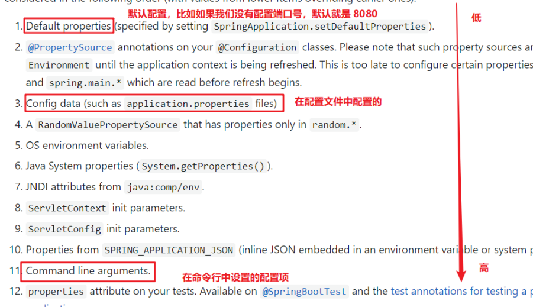

`spring boot` 的目的是用来简化 `Spring` 应用的初始搭建以及开发过程。

`SpringMVC` 开发回顾：

1. 添加依赖

    ```xml
            <dependency>
                <groupId>javax.servlet</groupId>
                <artifactId>javax.servlet-api</artifactId>
                <version>3.1.0</version>
                <scope>provided</scope>
            </dependency>
            <dependency>
                <groupId>org.springframework</groupId>
                <artifactId>spring-webmvc</artifactId>
                <version>5.0.9.RELEASE</version>
            </dependency>
    ```

    注意：`provided` 表示在编译、测试时有效，但是在运行时无效。provided意味着打包的时候不会打入jar包，别的设施(Web Container)会提供。

2. 编写web3.0配置类

    ```java
    public class ServletConfig extends AbstractAnnotationConfigDispatcherServletInitializer {
        protected Class<?>[] getRootConfigClasses() {
            return new Class[]{SpringConfig.class};
        }
        protected Class<?>[] getServletConfigClasses() {
            return new Class[]{SpringMvcConfig.class};
        }
        protected String[] getServletMappings() {
            return new String[]{"/"};
        }
    }
    ```

3. 编写SpringMVC配置类

    ```java
    @Configuration
    @ComponentScan("com.springmvc.controller")
    @EnableWebMvc
    public class SpringMvcConfig {
        
    }
    ```

## SpringBoot概述

开发步骤：

- 创建新模块，选择Spring初始化，并配置模块相关基础信息；
- 选择当前模块需要使用的技术集；
- 开发控制器类；
- 运行自动生成的Application类；

### 依赖文件分析

```xml
<?xml version="1.0" encoding="UTF-8"?>
<project xmlns="http://maven.apache.org/POM/4.0.0" xmlns:xsi="http://www.w3.org/2001/XMLSchema-instance"
         xsi:schemaLocation="http://maven.apache.org/POM/4.0.0 https://maven.apache.org/xsd/maven-4.0.0.xsd">
    <modelVersion>4.0.0</modelVersion>
    <groupId>com.example</groupId>
    <artifactId>springboot</artifactId>
    <version>0.0.1-SNAPSHOT</version>
    <name>springboot</name>
    <description>springboot</description>
    <!-- 项目的配置信息 -->
    <properties>
        <java.version>1.8</java.version>
        <project.build.sourceEncoding>UTF-8</project.build.sourceEncoding>
        <project.reporting.outputEncoding>UTF-8</project.reporting.outputEncoding>
        <spring-boot.version>2.6.13</spring-boot.version>
    </properties>
    <!-- 项目依赖 -->
    <dependencies>
        <dependency>
            <groupId>org.springframework.boot</groupId>
            <artifactId>spring-boot-starter-jdbc</artifactId>
        </dependency>

        <dependency>
            <groupId>org.springframework.boot</groupId>
            <artifactId>spring-boot-devtools</artifactId>
            <scope>runtime</scope>
            <optional>true</optional>
        </dependency>
        <dependency>
            <groupId>com.mysql</groupId>
            <artifactId>mysql-connector-j</artifactId>
            <scope>runtime</scope>
            <version>8.0.32</version>
        </dependency>
        <dependency>
            <groupId>org.projectlombok</groupId>
            <artifactId>lombok</artifactId>
            <optional>true</optional>
        </dependency>
        <!-- 单元测试的依赖 -->
        <dependency>
            <groupId>org.springframework.boot</groupId>
            <artifactId>spring-boot-starter-test</artifactId>
            <scope>test</scope>
        </dependency>
    </dependencies>
    <!--
	<dependencyManagement>元素用于提供依赖的版本管理，它通常继承自spring-boot-dependencies。
	说明：
	从spring-boot-dependencies导入依赖管理；
	不需要指定版本,继承自Boot的依赖管理。
	使用<dependencyManagement>的好处:
		控制依赖的版本,避免版本冲突
		依赖版本可以集中管理
		依赖版本不需要重复声明
		注意：它只是声明了版本管理,并不会引入实际的依赖。需要在<dependencies>中显式声明。		
	-->
    <dependencyManagement>
        <dependencies>
            <dependency>
                <groupId>org.springframework.boot</groupId>
                <artifactId>spring-boot-dependencies</artifactId>
                <version>${spring-boot.version}</version>
                <type>pom</type>
                <scope>import</scope>
            </dependency>
        </dependencies>
    </dependencyManagement>

    <build>
        <plugins>            
            <plugin>
                <groupId>org.apache.maven.plugins</groupId>
                <artifactId>maven-compiler-plugin</artifactId>
                <version>3.8.1</version>
                <configuration>
                    <source>1.8</source>
                    <target>1.8</target>
                    <encoding>UTF-8</encoding>
                </configuration>
            </plugin>
            <!-- 打包时需要的插件 --> 
            <plugin>
                <groupId>org.springframework.boot</groupId>
                <artifactId>spring-boot-maven-plugin</artifactId>
                <version>${spring-boot.version}</version>
                <configuration>
                    <mainClass>com.springboot.SpringbootApplication</mainClass>
                    <skip>true</skip>
                </configuration>
                <executions>
                    <execution>
                        <id>repackage</id>
                        <goals>
                            <goal>repackage</goal>
                        </goals>
                    </execution>
                </executions>
            </plugin>
        </plugins>
    </build>

</project>
```

### 切换服务器

默认使用的是 tomcat 服务器，切换服务器：

使用`exclusion`标签将不想使用的服务器排除掉，然后配置想添加的服务器。

```xml
<!-- 排除 -->
<dependency>
    <groupId>org.springframework.boot</groupId>
    <artifactId>spring-boot-starter-web</artifactId>
    <exclusions>
        <exclusion>
            <artifactId>spring-boot-starter-tomcat</artifactId>
            <groupId>org.springframework.boot</groupId>
        </exclusion>
    </exclusions>
</dependency>

<!-- 添加 -->
<dependency>
    <groupId>org.springframework.boot</groupId>
    <artifactId>spring-boot-starter-jetty</artifactId>
</dependency>
```

### 配置文件分析

#### 基础

`application.properties`

**配置服务器端口号**：

- `application.properties`文件中：`server.port=8080`；

- `application.yml/yaml` 文件中：

    ```properties
    server:
    	port: 8080
    ```

    在 `:` 后，**数据前一定要加空格。**

**注意**： SpringBoot 程序的**配置文件名必须是 `application`** ，只是后缀名不同而已，文件位置为 `resources` 文件夹。

**多个配置文件的优先级**：`application.properties > application.yml > application.yaml`。

#### yaml格式

YAML（YAML Ain't Markup Language），一种数据序列化格式。

**格式对比**：

- xml格式：

    ```xml
    <enterprise>
        <name>itcast</name>
        <age>16</age>
        <tel>4006184000</tel>
    </enterprise>
    ```

- `properties`格式：

    ```properties
    enterprise.name=itcast
    enterprise.age=16
    enterprise.tel=4006184000
    ```

- `yaml`格式：

    ```yaml
    enterprise:
    	name: itcast
    	age: 16
    	tel: 4006184000
    ```

**优点**：

- 容易阅读，结构更加清晰；
- 容易与脚本语言交互；
- 以数据为核心，重数据轻格式；

YAML 文件扩展名： **.yml (主流) .yaml**。主要用的还是 `yml`。

**核心**：`数据前面要加空格与冒号隔开`。

##### 语法规则

1. 大小写敏感；
2. 属性层级关系使用多行描述，每行结尾使用冒号结束；
3. **使用缩进表示层级关系**，同层级**左侧对齐**，**只允许使用空格**（不允许使用Tab键）；
4. 空格的**个数并不重要**，**只要保证同层级的左侧对齐即可**。 
5. 属性值前面添加空格（属性名与属性值之间**使用冒号+空格作为分隔**） # 表示注释

数组类型的数据：**在变量下方另起一行，使用减号作为数据开始符号，每行书写一个数据，减号与数据间空格分隔**，示例：

```yaml
enterprise:
  name: 
    - apple
    - orange
    - banana
```

#### 读取配置文件内容

**使用 @Value注解**:

`${一级属性名.二级属性名……}`

```java
@Value("${lesson}")
private String lesson;
@Value("${server.port}")
private Integer port;
@Value("${enterprise.subject[0]}")
private String subject_00;
```

**使用 Environment对象**

使用 `@Autowired` 注解注入 Environment 对象的方式读取数据。通过调用 Environment 对象的 `getProperty(String name) `方法获取

```java
@Autowired
private Environment env;
System.out.println(env.getProperty("lesson"));
System.out.println(env.getProperty("enterprise.name"));
System.out.println(env.getProperty("enterprise.subject[0]"));
```

~~较少使用~~

**使用自定义对象**

自定义对应配置文件中的数据的类，通过`@ConfigurationProperties`注解表示加载配置文件。

```java
@Component
@ConfigurationProperties(prefix = "enterprise")
public class Enterprise {
private String name;
private int age;
private String tel;
private String[] subject;
```

注意：上面自定义的类对应的是配置文件里的一级目录 `enterprise`。

如果出现警告：


添加依赖：

```xml
<dependency>
    <groupId>org.springframework.boot</groupId>
    <artifactId>spring-boot-configuration-processor</artifactId>
    <optional>true</optional>
</dependency>

```

#### 多环境配置

在配置文件中配置不同开发环境下的配置内容。

##### yaml文件

**不同环境设置**：用 `profiles` 命名

```yaml
#开发
spring:
	config:
		activate:
			on-profile: dev
server:
	port: 80
	
#生产
spring:
	config:
		activate:
			on-profile: pro #给生产环境起的名字
server:
	port: 81
	
#测试
spring:
	config:
		activate:
			on-profile: test #给测试环境起的名字
server:
	port: 82
```

**设置启用的环境**：`active`

```yaml
spring:
	profiles:
		active: dev # 表明使用的环境
```

##### properties文件

`properties` 类型的配置文件想配置多环境需要定义不同的配置文件，在 `application.properties` **配置文件中表明设置启用哪个配置文件**，配置如下:

```properties
spring.profiles.active=pro
```

##### 命令行启动参数设置

使用 `SpringBoot` 开发的程序都是打成 `jar` 包，通过 `java -jar xxx.jar` 的方式启动服务的。

如果想更换配置环境，需要修改配置文件然后重新打包，比较麻烦，解决办法：**在运行 `jar` 时设置开启指定的环境的方式，如下：**

1. 修改配置环境

```shell
java –jar xxx.jar –-spring.profiles.active=test
```

2. 修改端口号

    ```shell
    java –jar xxx.jar –-server.port=88
    ```

3. 同时修改

    ```shell
    java –jar springboot.jar –-server.port=88 –-spring.profiles.active=test
    ```

不同地方配置的优先级：



##### 配置文件分类

不同位置的配置文件对应不同的优先级。

SpringBoot 中4级配置文件放置位置：

- 1级：`classpath：application.yml`；
- 2级：`classpath：config/application.yml`；
- 3级：`file ：application.yml`；
- 4级：`file ：config/application.yml`；

**级别越高优先级越高**。

## SpringBoot整合junit

`Spring` 整合 `junit`：

```java
@RunWith(SpringJUnit4ClassRunner.class)
@ContextConfiguration(classes = SpringConfig.class)
public class UserServiceTest {
    @Autowired
    private BookService bookService;
    @Test
    public void testSave(){
        bookService.save();
    }
}
```

使用 `@RunWith` 注解指定运行器，使用 `@ContextConfiguration` 注解来指定配置类或者配置文件。

`SpringBoot` 整合 `junit` 特别简单，分三步：

1. 在测试类上添加 `SpringBootTest` 注解；
2. 使用 `@Autowired` 注入要测试的资源；
3. 定义测试方法进行测试；

### 编写测试类

在 `test/java` 下创建 `com.example` 包，在该包下创建测试类，将要测试的类（如 `BookService`） 注入到该测试类中：

```java
@SpringBootTest
class SpringbootTestApplicationTests { 
    @Autowired
    private BookService bookService;
    @Test
    public void save() {
        bookService.save();
    }
}
```

**注意**：**引导类所在包必须是测试类所在包及其子包**。

如果不满足这个要求的话，就需要在使用 `@SpringBootTest` 注解时，使用 `classes` 属性指定引导类的字节码对象。如 `@SpringBootTest(classes = SpringbootTestApplication.class)`

## SpringBoot整合mybatis

回顾Spring整合Mybatis：

1. `SpringConfig` 配置类

    导入 `JdbcConfig` 配置类、`MybatisConfig` 配置类；

    ```java
    @Configuration
    @ComponentScan("com.spring")
    @PropertySource("classpath:jdbc.properties")
    @Import({JdbcConfig.class,MyBatisConfig.class})
    public class SpringConfig {
    }
    ```

    

2. `JdbcConfig` 配置类

    定义数据源（加载properties配置项：driver、url、username、password）

    ```java
    public class JdbcConfig {
        @Value("${jdbc.driver}")
        private String driver;
        @Value("${jdbc.url}")
        private String url;
        @Value("${jdbc.username}")
        private String userName;
        @Value("${jdbc.password}")
        private String password;
        @Bean
        public DataSource getDataSource(){
            DruidDataSource ds = new DruidDataSource();
            ds.setDriverClassName(driver);
            ds.setUrl(url);
            ds.setUsername(userName);
            ds.setPassword(password);
            return ds;
        }
    }
    ```

3. `MybatisConfig` 配置类

    定义 SqlSessionFactoryBean 和 映射配置

    ```java
    @Bean
    public MapperScannerConfigurer getMapperScannerConfigurer(){
        MapperScannerConfigurer msc = new MapperScannerConfigurer();
        msc.setBasePackage("com.dao");
        return msc;
    }
    @Bean
    public SqlSessionFactoryBean getSqlSessionFactoryBean(DataSource dataSource){
        SqlSessionFactoryBean ssfb = new SqlSessionFactoryBean();
        ssfb.setTypeAliasesPackage("com.domain");
        ssfb.setDataSource(dataSource);
        return ssfb;
    }
    ```

    

### SpringBoot整合mybatis

定义controller、service、dao、pojo，分别添加注解，dao层接口需要添加`@mapper`注解才能作为bean对象管理。

在dao层的接口方法上面用注解（@Insert、@Select等）定义sql语句。

**使用Druid数据源**

SpringBoot 有默认的数据源，我们也可以指定使用 Druid 数据源。

1. 导入 `Druid` 依赖

    ```xml
    <dependency>
        <groupId>com.alibaba</groupId>
        <artifactId>druid</artifactId>
        <version>1.1.16</version>
    </dependency>
    ```

2. 在 `application.yml` 配置文件配置数据库连接信息

    ```yaml
    spring:
    	datasource:
    		driver-class-name: com.mysql.cj.jdbc.Driver
    		url: jdbc:mysql://localhost:3306/ssm_db?serverTimezone=UTC
    		username: root
    		password: root
    		type: com.alibaba.druid.pool.DruidDataSource
    ```

3. 
