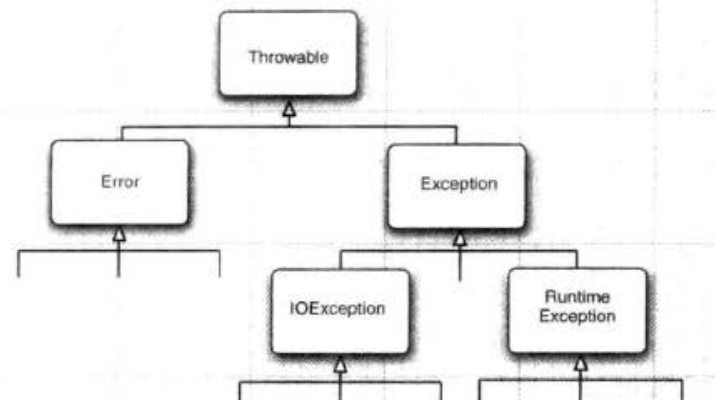

# 异常处理

程序运行时可能会出现错误，需要进行处理。

## Java内置错误

所有异常都是派生于 `Throwable` 类的一个实例。可以分成两类。

### `Error` 类

`Error` 类主要用于**运行时系统的内部错误**或者**资源耗尽错误**。这种错误无法抛出（因为程序没法继续运行了），只能告知用户，使程序安全终止。

### `Exception` 类

`Exception` 异常可以分成两类：**`IOException`** 和 **`RuntimeException`**。

#### `RuntimeException`异常

由程序错误导致的异常属于`RuntimeException`，主要包含以下情况：

- 错误的类型转换；
- 数组访问越界；
- 访问空指针；

