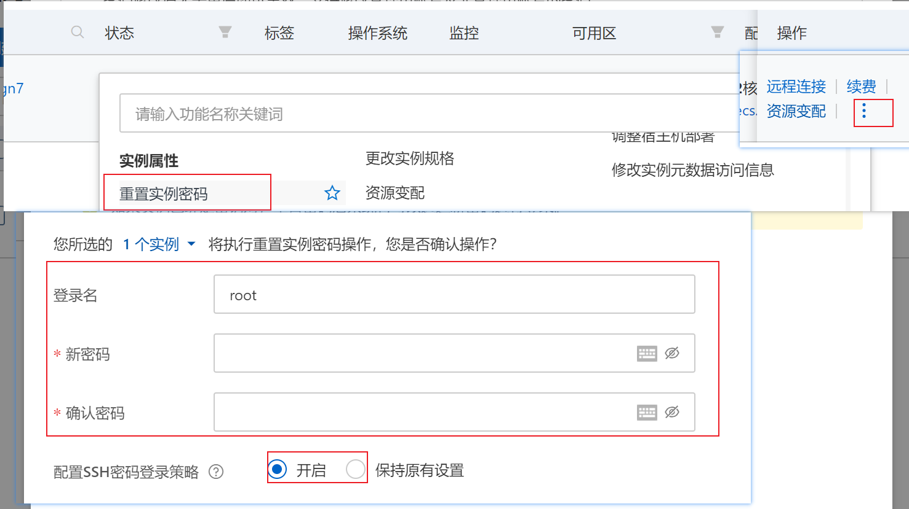
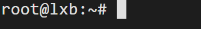
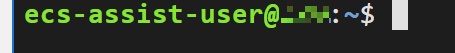

## 系统选择

一般部署web项目使用的centos较多。

## 远程连接

服务器买好了之后，需要先设置远程连接的账户和密码才能通过xshell等第三方工具连接。

以阿里云为例，需要选择实例，然后重置实例密码：



这样就可以通过重置的实例密码进行远程连接。

## 更改连接用户

远程连接后，进去控制台，如果是通过root账户连接的，则会出现：



如果是用其他用户连接：



"@“前面是当前登录的用户名，”@"后面是当前机子的主机名称。

可以通过命令：

```shell
sudo -i
```

进入root用户。

